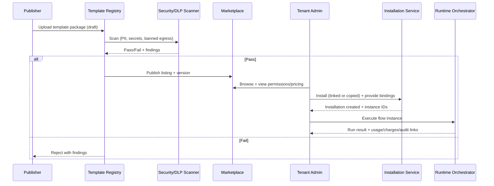
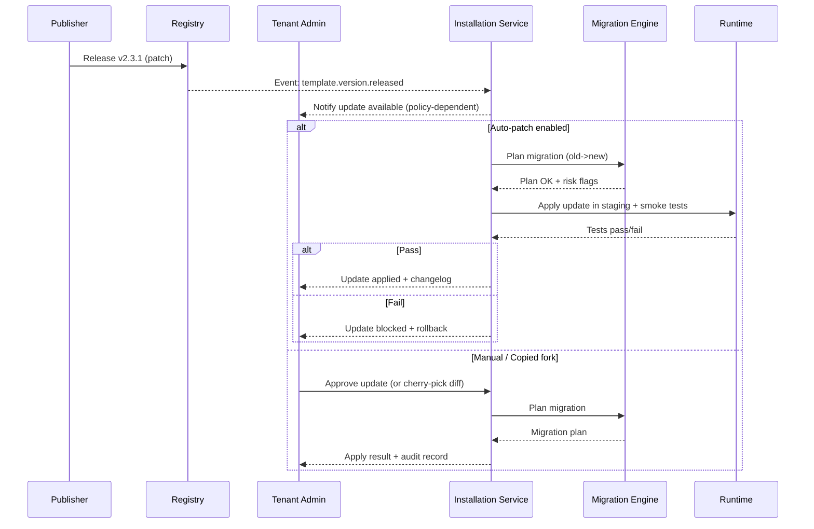

# Designing a Multi‑Tenant Shareable Flows & RAG Template System

## Executive summary

A “shareable flows and RAGs” platform has two competing forces: (a) maximize reuse of business logic (templates) across tenants for growth and monetization, and (b) make it *structurally hard* (not merely “discouraged”) for templates to leak tenant‑sensitive data (client documents, embeddings/vectors, connector credentials, prompts containing proprietary context). The core design objective is therefore **separation-by-design**: templates are immutable, publishable *logic artifacts*, while tenant workspaces hold mutable *data artifacts*; the runtime binds them via parameterization, secrets injection, and policy checks at execution time.

Recommended blueprint:

- **Split control plane vs data plane**: a pooled, global control plane (marketplace, registry, billing, analytics) with strict tenancy context; a tenant-scoped data plane for connector credentials, documents, embeddings, and execution state. This mirrors common SaaS patterns where not every component is shared in multitenancy. citeturn15view0turn9view1  
- **Treat templates as supply-chain artifacts**: versioned, signed, scanned, and immutable once released (echoing the “do not modify released contents” rule in Semantic Versioning’s ecosystem expectations). citeturn14view2turn14view3turn6search1turn6search2  
- **Make tenant data isolation explicit everywhere**: tenant identification early in the request lifecycle; enforce at DB, cache, object store, and vector store layers using a combination of storage partitioning and policy enforcement. citeturn9view2turn2search3turn2search1  
- **Prefer “instance = template + bindings”**: installations create tenant-local instances containing only bindings (parameters, secrets references, dataset references). The template package itself must exclude/forbid tenant data (documents, embeddings, sample exports).  
- **Lifecycle + monetization are first-class**: track installs, runs, attribution, and updates via standardized event envelopes (e.g., CloudEvents) and usage metering primitives aligned to SaaS billing patterns. citeturn18search0turn17view1turn16view3turn13view3  

This report groups the requested dimensions into a cohesive architecture, and provides concrete patterns, trade-offs, data models, APIs/events, lifecycle diagrams, and example schemas.

## System framing and reference architecture

### Conceptual objects and invariants

Define these “first principles” objects:

- **Tenant**: an isolation boundary for data, credentials, and runtime state. Multi‑tenancy implies *some* shared components, not that everything is shared. citeturn15view0  
- **Template**: shareable business logic + configuration *without tenant data*. Published globally.  
- **Template version**: immutable release (semver) with a referenced artifact digest and signature. The SemVer spec’s logic (major/minor/patch meaning) and “released contents MUST NOT be modified” aligns well with marketplace integrity. citeturn14view2  
- **Installation**: tenant-local adoption of a template version (either “linked” or “copied/forked”), with binding metadata.  
- **Instance**: runnable tenant-local object derived from an installation; holds tenant‑specific bindings and runtime state.  
- **Run**: an execution record containing inputs/outputs pointers, usage/metering, audit events, and policy decisions.

Separation invariants:

1. Templates must not contain tenant documents, embeddings/vectors, or credentials.  
2. Every runtime access to tenant data must be evaluated under a validated tenant context (not client-supplied). citeturn9view2  
3. Policy decisions should be decoupled from enforcement and centrally auditable. citeturn15view2  

### Control plane vs data plane

Use a two-plane decomposition:

- **Control plane (pooled multi-tenant)**  
  Template registry, marketplace listing, approvals/scanning, billing/payouts, global analytics rollups, and update notifications.

- **Data plane (tenant-scoped)**  
  Connector secrets, data source tokens, ingested documents, embeddings/vectors, vector indexes/namespaces, and execution state.

This is compatible with SaaS architectural patterns where some services are pooled and some are siloed/bridged for isolation and regulatory constraints. citeturn9view1turn0search4  

A useful mental model from SaaS guidance is the **silo/pool/bridge** spectrum: fully dedicated “silo” resources for strict isolation, pooled resources for economies of scale, and “bridge” mixtures where some components are isolated and others shared. citeturn9view1turn0search4  

## Separation-by-design architecture patterns

This section focuses on *logical/data separation*, including databases, vector stores, encryption/tokenization, labeling, and policy enforcement.

### Tenant isolation strategies across storage layers

At minimum, enforce tenant boundaries in four places:

1. **Identity/session layer**: establish tenant context early; bind it to authenticated principal; never trust raw tenant IDs from the client. citeturn9view2  
2. **Relational/transactional store**: choose a tenancy model per dataset.  
3. **Object/blob store**: prefix partitioning + per-tenant encryption keys.  
4. **Vector store / retrieval index**: namespace/shard/partition strategy; enforce that all queries are scoped to tenant. citeturn10view2turn9view3turn10view0turn10view1  

#### Relational tenancy patterns (data store for runs, instances, billing, etc.)

A practical way to reason about relational tenancy options is to evaluate scalability, tenant isolation, per‑tenant cost, development complexity, operational complexity, and customizability—explicit criteria described in multitenant database tenancy guidance. citeturn9view0  

**Comparison table: core separation approaches**

| Approach | Isolation strength | Operational complexity | Dev complexity | Cost profile | Fit for template marketplace + RAG |
|---|---:|---:|---:|---:|---|
| **DB per tenant** | Highest (strong blast-radius reduction) | High (provisioning, migrations, backups per tenant) | Low–Med | High at scale (idle tenants cost) | Best for high‑regulation premium tiers; easiest “hard delete” offboarding |
| **Schema per tenant** | High (namespacing) | Med–High (schema migrations per tenant) | Med | Med–High | Good if tenants need schema customization; heavier migrations |
| **Shared schema + tenant_id** (optionally RLS) | Medium (logical isolation relies on correctness) | Low–Med | Med–High (every query must be tenant-safe) | Lowest | Best default for marketplace control plane and analytics; pair with strong guardrails |

Design choice: default to **shared schema + tenant_id** for control-plane style datasets (marketplace catalogs, template metadata, global analytics), but allow “bridge” tiering: move regulated tenants to schema-per-tenant or DB-per-tenant for *tenant data plane* subsets. This maps onto silo/pool/bridge thinking. citeturn9view1turn9view0  

### Vector store multi-tenancy strategies for RAG

RAG combines parametric memory (the model) with a non-parametric retrieval index; the canonical formulation explicitly uses a dense vector index as retrievable memory. citeturn0search2turn0search5  

In a multi-tenant RAG SaaS, vector isolation is often the highest-risk leak vector because embeddings can encode sensitive content.

Common vendor-documented strategies illustrate the design space:

- Namespace-per-tenant: using namespaces to isolate tenant data and targeting reads/writes to one namespace. citeturn10view2  
- Shard-per-tenant: multi-tenancy where each tenant is stored on a separate shard and “data stored in one tenant is not visible to another tenant.” citeturn9view3  
- Payload-based partitioning (single collection) plus filters: recommended in many cases, but requires careful configuration; also a caution against creating hundreds/thousands of collections due to overhead and stability concerns. citeturn10view0  
- Multi-tenancy at multiple levels (database/collection/partition/partition-key) with explicit trade-offs among scalability, isolation, and schema flexibility. citeturn10view1  

**Practical recommendation**:

- Default to **“physical-ish” isolation features** when the vector store natively supports them (namespace-per-tenant or shard-per-tenant), because they reduce the chance that an application bug queries the wrong tenant. citeturn10view2turn9view3  
- Support **payload-filter multitenancy** only with strong “query guardrails”: server-side enforced tenant filters that cannot be overridden by user prompts or template code, plus test harnesses that attempt cross-tenant retrieval as a standard security regression. The overhead warning on too many collections is a useful constraint signal: avoid per-tenant collections unless tenant count is known to be low or isolation requirements justify it. citeturn10view0  

### Encryption, key partitioning, and tokenization

#### Envelope encryption and per‑tenant keys

Envelope encryption is a common pattern: encrypt plaintext with a data key, then encrypt the data key with a KMS key. citeturn13view0turn13view1  

Implementation pattern:

- Assign each tenant a **root key reference** (KMS CMK, HSM key, or external key provider).  
- Derive per-dataset **Data Encryption Keys (DEKs)** and store encrypted DEKs alongside data.  
- Rotate the tenant’s KEK (key-encryption key) without rewriting all ciphertext; rotate DEKs per retention/security policy.

Use encryption at rest and (if needed) application-level encryption for especially sensitive fields, aligning with multi-tenant “cryptographic isolation” goals noted in practical multi-tenant security guidance. citeturn2search7turn2search3  

#### Tokenization for specific regulated identifiers

Tokenization substitutes a benign placeholder token for sensitive data; tokens should be meaningless outside a context and not contain user-specific information or be directly decryptable. citeturn16view2  

While tokenization is frequently discussed in payment contexts, the general patterns (secure token generation, access control over detokenization, key management) are captured in payment-industry tokenization security guidelines. citeturn13view2turn4search6  

Recommended stance:

- Use **tokenization** for identifiers you must reference frequently (e.g., account numbers) but do not need in raw form in most flows.  
- Use **encryption** for content you must recover (documents, prompts containing PII) and for secrets-at-rest.

### Data labeling + ABAC + policy decision services

Data labeling is the backbone of “separation by design” because it enables consistent policy. Model every data object with at least:

- `tenant_id` (authoritative, server-assigned)
- `data_classification` (e.g., public/internal/confidential/restricted)
- `purpose` (why it is processed; ties to privacy principles)
- `retention_policy_id`

Then implement **Attribute-Based Access Control (ABAC)**: authorization decisions are determined by evaluating attributes of the subject, object, requested operation, and sometimes environment conditions against policy. citeturn2search4turn14view1  

For policy enforcement, externalize decisions to a policy engine such as entity["organization","Open Policy Agent","policy engine project"], which provides “policy as code” and APIs for decoupling policy decision-making from application enforcement. citeturn15view2turn2search5  

### Required enforcement points (a concrete pattern)

A robust pattern is a **Tenant Guard + Policy Check** chain for every request:

```mermaid
flowchart LR
  A[API Gateway] --> B[Tenant Guard Middleware]
  B --> C[AuthN / Session]
  C --> D[Policy Decision (ABAC/OPA)]
  D -->|allow| E[Service Handler]
  D -->|deny| F[Audit + Deny Response]
  E --> G[(Relational Store)]
  E --> H[(Object Store)]
  E --> I[(Vector Store)]
  E --> J[Metering Emit]
```

Key implementation details:

- The “Tenant Guard” must bind tenant context to authenticated principal and propagate it internally. This is explicitly called out as a best practice in multi-tenant security guidance. citeturn9view2  
- The policy decision service should log decisions (allow/deny + reason), enabling auditability and post-incident forensics. NIST log management guidance emphasizes robust log management practices and enterprise log management processes. citeturn12view0turn2search2  

## Template model and marketplace UX

This section specifies what *constitutes* a template (flows/prompts/connectors/index configs), what must be redacted/parameterized, and how sharing/copying/import/export should work.

### What is a “template” in a shareable flows + RAG system?

A template should be a *pure logic artifact* with a stable manifest:

- **Flow graph**: nodes, edges, branching, retries, failure handlers, timeouts.
- **Prompt and message templates**: system/developer/user prompt scaffolds, tool schemas, and output validators.
- **Connector definitions (not credentials)**: OAuth scopes, required permissions, API base URL patterns, rate-limit hints, webhook schemas.
- **RAG configuration**: chunking parameters, embedding model identifiers, vector similarity metric, retrieval `top_k`, reranking toggles.
- **Vector index “recipe”**: index type and multi-tenancy strategy (namespace/shard/payload filter), plus required metadata fields like `tenant_id`. Vendor docs illustrate that writes and queries are often designed to always target a namespace or tenant shard. citeturn10view2turn9view3turn10view0  
- **Policy bundle**: ABAC/OPA policies as code to enforce allowed connector scopes, allowed data classes, and egress constraints. citeturn15view2turn2search4  

### What must be redacted or parameterized?

Treat the following as *tenant-sensitive* and therefore forbidden in template artifacts:

- Connector credentials, refresh tokens, API keys, or any static secrets (store only secret *references*). Centralization, rotation, auditing, and lifecycle management of secrets are core best practices. citeturn11view3turn4search0  
- Tenant/source documents, exports, raw logs.
- Embeddings and vectors derived from tenant data (these are essentially transformed sensitive data in the RAG index).  
- Any prompt examples containing real customer data or PII; use synthetic examples and scan prior to publishing. NIST guidance emphasizes identifying and protecting PII and tailoring safeguards. citeturn12view2turn0search6  

Parameterization pattern: templates declare typed placeholders:

- `string`, `enum`, `number`, `duration`
- `connection_ref` (points to a tenant-managed connector credential set)
- `secret_ref` (points to tenant secret store / vault reference)
- `dataset_ref` (points to tenant-local corpus or object storage prefix)
- `policy_ref` (optional overrides allowed by tenant admin)

### Packaging, integrity, and supply-chain controls for templates

A template marketplace becomes a supply-chain: users install runnable logic from third parties. Apply software supply chain controls:

- **SLSA** defines a supply-chain security framework with levels and attestations (including provenance) to improve integrity guarantees. citeturn14view3turn6search24  
- **Sigstore/Cosign** provides mechanisms for signing and verifying artifacts. citeturn6search1turn6search9  
- **SPDX** is an SBOM format standard for communicating component and license/provenance information. citeturn6search2turn6search10  
- **in-toto** provides a framework/metadata standard to secure software supply chain integrity end-to-end. citeturn6search7turn6search3  

Recommended: “Template Package v1” (conceptual):

- `manifest.yaml` (template metadata, permissions, declared parameters)
- `flow.json` (graph)
- `prompts/` (prompt templates)
- `policies/` (OPA/Rego or equivalent)
- `sbom.spdx.json` (optional)
- `signatures/` (cosign bundle)

### Marketplace UX and distribution modes

Provide two install modes because they create different lifecycle expectations:

- **Linked installation**: tenant installs template as a dependency; updates can propagate under constraints (e.g., auto-patch).  
- **Copied installation**: tenant forks/snapshots and can modify; updates become “suggested patches” requiring merge.

UX primitives:

- Listing detail page: permissions requested (connectors, scopes), data classification allowed, compatibility matrix (embedding model versions), pricing model.  
- “Try in sandbox” execution: runs against synthetic data or tenant’s sandbox workspace; blocks production connectors unless explicitly allowed.
- Import/export: allow offline export for regulated tenants; preserve signing and provenance metadata.

image_group{"layout":"carousel","aspect_ratio":"16:9","query":["workflow template marketplace UI","AI prompt template library interface","SaaS automation flow builder UI"],"num_per_query":1}

### Sharing/copying lifecycle diagram



### Example APIs and events required

A strong event backbone makes lifecycle, billing, and analytics consistent. CloudEvents aims to standardize event metadata for interoperability across platforms. citeturn18search0turn18search4  

Minimum API surface (illustrative):

- `POST /v1/templates` (create draft)
- `POST /v1/templates/{id}/versions` (publish version; immutable)
- `POST /v1/templates/{id}/versions/{v}/submit` (submit for review)
- `POST /v1/tenants/{tenant_id}/installations` (install)
- `POST /v1/installations/{id}/instances` (create runnable instance)
- `POST /v1/instances/{id}/runs` (execute)

Minimum events (CloudEvents envelope recommended):

- `template.version.released`
- `template.version.rejected`
- `installation.created`
- `run.started`, `run.completed`
- `policy.decision`
- `metering.usage_recorded`

## Versioning, update propagation, and lifecycle management

### Versioning rules and compatibility contracts

Use Semantic Versioning (X.Y.Z) on templates:

- Patch: bug fixes not affecting the public API  
- Minor: backwards-compatible additions  
- Major: backwards-incompatible changes citeturn14view2  

For templates, define “public API” explicitly in the manifest:

- Parameter schema (names, types, required/optional)
- Flow entrypoints and expected outputs
- Declared permissions/connectors and required scopes
- Data contract for RAG (vector metadata keys, schema requirements)

### Copy vs link semantics and update strategies

Define three update policies per installation:

- **Manual**: tenant must explicitly select target version and approve migration.
- **Auto‑patch**: automatically apply patch versions within a major/minor line.
- **Auto‑minor** (rare): apply minor updates automatically but block majors.

Trade-off: auto-update improves security posture and patch adoption, but increases risk that behavior changes impact tenant workflows. This mirrors classic dependency management tension; SemVer helps communicate risk but does not eliminate it. citeturn14view2  

### Update propagation diagram



### Migrations for RAG and connector evolution

RAG templates evolve in ways that can break tenants:

- Embedding model dimension change → requires re-embedding and re-indexing.
- Vector metadata schema change → requires backfill.
- Connector scope change → triggers re-consent, since OAuth scopes encode permissions. OAuth 2.0 is explicitly designed around limited access and scoped tokens with lifetimes. citeturn12view3turn3search1  

Recommended migration primitives:

- **Preflight analyzer**: computes whether update is safe given tenant’s bindings (e.g., does tenant have the required connector scope?).
- **Staged rollout**: apply to sandbox first; then production.
- **Backfill jobs**: asynchronous tasks for embedding re-generation; record progress in tenant workspace.
- **Rollback**: keep previous runnable configuration and index pointers until success threshold reached.

### Lifecycle cost controls: hot/cold tenant state for indexes

Vector indexes can dominate costs. Support lifecycle states similar to “active/inactive/offloaded” tiering: move tenant index storage between hot/warm/cold tiers to optimize cost vs readiness (noting order-of-magnitude cost differences between RAM and cloud storage). citeturn11view0  

This becomes critical for customers who install templates but rarely run them.

## Monetization, billing, analytics, and fraud controls

### Monetization models aligned to marketplace behaviors

Your marketplace can monetize templates via:

- **Paid download / purchase** (one-time)
- **Paid install** (per workspace)
- **Usage-based** (per run, per token, per retrieval, per document embedded)
- **Subscription** (monthly access to template family + updates)
- **Revenue share / affiliate** (publisher earns a percent; platform retains commission)

Real marketplaces publish specific revenue share schedules; for example, entity["company","Atlassian","software company"] documents Marketplace revenue share changes effective January 1, 2026 with additional increases July 1, 2026, and includes explicit anti-evasion language (e.g., reserving the right to deny incentives if entities are created to evade caps). citeturn11view2turn5search10  

Design implication: build revenue share and anti-fraud *into* contracts and telemetry from day one.

### Metering design (what to measure)

Usage-based billing is a common SaaS pricing model to charge based on consumption. citeturn17view1turn5search0  

Two “reference implementations” illustrate metering mechanics:

- entity["company","Stripe","payments company"] supports usage-based billing via meters and meter events; meter events include an event name, customer ID, numeric value, and timestamp, and are processed asynchronously (so dashboards may lag). citeturn16view3turn5search4  
- entity["company","Amazon Web Services","cloud provider"] Marketplace SaaS subscriptions bill customers based on metering records; it requires usage to be measured and reported hourly, with monthly billing rollups. citeturn17view0turn13view3  

Recommended internal metering dimensions for flows + RAG:

- `flow_run_count`
- `flow_run_seconds` (or step-seconds)
- `llm_input_tokens`, `llm_output_tokens`
- `retrieval_queries`
- `documents_embedded`
- `vector_storage_gb_days`
- `connector_calls` per connector type (rate-limit aligned)

### Analytics and observability foundation

Adopt entity["organization","OpenTelemetry","observability project"] for end-to-end tracing/metrics/logs correlation; its collector explicitly supports aggregation, sampling, export, and enrichment/transform (including scrubbing personal information). citeturn14view0turn3search11  

This matters because:

- You need tenant-scoped SLOs (latency, error rates).
- You need marketplace-level insights (conversion, churn).
- You must prove policy enforcement/auditability.

### Core metrics to track (recommended)

Organize dashboards into four lenses:

1. **Marketplace funnel**: impressions → detail views → installs → first run → retained active installs.  
2. **Template quality**: run success rate, median latency, rollback rate, support tickets per 100 installs.  
3. **RAG health**: retrieval latency, hit rate, rerank latency, embedding throughput, index growth rate.  
4. **Trust & safety**: policy denials, secret misuse attempts, cross-tenant retrieval test failures, suspicious install spikes.

### Fraud detection and attribution hardening

Fraud patterns to anticipate:

- **Attribution gaming**: self-referrals, bot clicks, cookie stuffing analogs.
- **Install inflation**: scripted installs/runs to farm payouts.
- **Revenue share evasion**: splitting entities to exploit thresholds (explicitly flagged as a concern in real marketplaces). citeturn11view2  

Controls:

- Signed referral codes bound to publisher identity and campaign.
- Rate limits + anomaly detection on installs/runs by IP/device/user agent.
- Require “verified workspace” status for payout eligibility (KYC/KYB depending on jurisdiction).
- “Shadow pricing” audits: compare expected vs actual usage patterns.

### Sample dashboard mockups (diagrams)

**Marketplace / revenue dashboard wireframe (example)**

```text
+----------------------------------------------------------------------------------+
| Marketplace Overview (Last 30 days)                                              |
+---------------------------+---------------------------+--------------------------+
| GMV: $___   Platform Take | Installs: ____            | Active Installs: ____    |
| Refunds: ___%             | Conversion: ___%          | Churn: ___%              |
+---------------------------+---------------------------+--------------------------+
| Top Templates by Revenue                 | Fraud/Anomaly Alerts                |
| - template A  $___  installs ___         | - Install spike: template X         |
| - template B  $___  installs ___         | - Self-referral suspected: pub Y    |
+------------------------------------------+-------------------------------------+
| Usage Metering Lag + Pipeline Health (OTel/Events)                               |
| - meter ingestion: ok   - event backlog: ___   - invoice draft status: ok       |
+----------------------------------------------------------------------------------+
```

image_group{"layout":"carousel","aspect_ratio":"16:9","query":["SaaS analytics dashboard revenue retention cohorts","marketplace admin dashboard payouts fraud alerts"],"num_per_query":1}

## Security, compliance, onboarding, and operator/developer tooling

### PII handling, purpose limitation, retention, and deletion

Because regulatory region is unspecified, implement a **configurable privacy baseline** that can satisfy multiple regimes.

Key GDPR principles include purpose limitation, data minimization, storage limitation, integrity/confidentiality, and accountability. citeturn11view1turn8search0  
NIST provides practical guidance on identifying and protecting PII and tailoring safeguards to instances of PII. citeturn12view2  

For U.S. state privacy, the California AG summarizes that consumers have a right to request deletion subject to exceptions. citeturn7search1turn8search1  

Design implications for a template + RAG platform:

- Default to **data minimization** in telemetry: log references and hashes, not raw prompts or retrieved passages, unless explicitly enabled for debugging with consent and strict retention limits. citeturn11view1turn12view0  
- Make **deletion and offboarding** a first-class workflow: tenant deletion must cascade into indexes/namespaces; some vector stores explicitly treat tenant deletion as tenant data deletion (shared-nothing shard deletion) and support temperature/state tiering for cost. citeturn1search13turn11view0  
- Implement **retention policies** per data class and per object type (runs, logs, embeddings).  

### Secrets management and connector authorization

Connectors are a primary leak vector. Require OAuth-based consent flows for third-party connectors:

- OAuth 2.0 is designed for obtaining limited access via tokens, without sharing passwords, and includes scope and lifetime attributes. citeturn12view3  
- JWTs are a compact, URL-safe means of representing claims, with signed/encrypted structures (relevant if you issue internal scoped tokens carrying tenant context). citeturn15view1  

Secrets storage posture:

- Follow centralized secrets management guidance (provisioning, auditing, rotation, avoiding hardcoding). citeturn11view3turn4search0  
- Prefer dynamic, short-lived credentials where feasible: dynamic secrets “do not exist until read” and reduce theft window; they are revocable and auditable. citeturn16view0turn16view1  

Reference implementation: integrate a tenant secrets broker backed by entity["company","HashiCorp","devops tools company"] Vault-style dynamic secrets for databases and connector credentials where possible (or cloud-native equivalents). citeturn16view0turn16view1  

### Audit logs and evidence

Audit should cover:

- Template publishing/review decisions
- Installation and updates (who approved what)
- Policy allow/deny decisions
- Connector consent grants/revocations
- Data access events (retrieval queries, document ingestion)
- Billing actions (meter events, invoice generation, refunds)

NIST log management guidance emphasizes enterprise log management processes and practical program design. citeturn12view0turn2search2  

### Developer/operator tooling for templates

Treat templates as code:

- **Template CI**: lint flow graphs, validate parameter schemas, run policy unit tests (OPA), run “no secrets / no PII” scanners, and execute sandbox runs. citeturn15view2turn12view2  
- **Sandboxing**: execute templates in restricted environments with network egress allowlists and connector stubs; require explicit approvals for production connector use. (This directly mitigates cross-tenant and exfiltration risk highlighted in multi-tenant security guidance.) citeturn9view2turn2search7  
- **Artifact signing**: sign template releases; verify on install; store provenance/attestations (SLSA) and SBOM (SPDX). citeturn14view3turn6search1turn6search2  

### Onboarding and data migration

Tenant onboarding should be a guided binding process:

- Step 1: install template (no data yet)
- Step 2: bind connectors (OAuth consent), store connection refs
- Step 3: bind datasets (object prefixes, RAG corpora)
- Step 4: ingest + embed (tenant-scoped namespaces/shards)
- Step 5: run validation suite and security regression tests

For vector lifecycle cost management, support “inactive/offloaded” index states and tenant-level archival for dormant installations. citeturn11view0  

### Business/legal template for affiliate agreements (operational template)

This is not legal advice, but an operator-friendly starting structure. Include disclosures and anti-deception rules aligned to entity["organization","Federal Trade Commission","us consumer protection agency"] guidance:

- FTC materials emphasize that disclosure needs are context-dependent and reference the Endorsement Guides revised in 2023, including “clearly and conspicuously” disclosure concepts. citeturn15view3turn5search11  

**Affiliate agreement clause checklist (sample)**

- Parties and definitions (Publisher/Affiliate, Platform, Template, Qualified Install, Qualified Usage)
- Commission structure and payout schedule (fixed %, tiered %, time window)
- Attribution rules (last-touch vs first-touch; deduping)
- Prohibited conduct (self-referrals, automated traffic, misrepresentation, incentivized installs without disclosure)
- Disclosure obligations (FTC-style “material connection” disclosures; placement and clarity requirements) citeturn15view3turn5search7  
- Audit rights and data sharing limits (platform may audit traffic and conversions)
- Fraud remedies (withhold payouts, clawbacks, termination)
- IP and brand guidelines (trademarks, marketing collateral)
- Data protection and confidentiality (no scraping, no sharing tenant data)
- Termination and survival clauses
- Dispute resolution and governing law (configurable)

## Appendix: sample schemas and API sketches

### Example PostgreSQL-style schema (illustrative)

```sql
-- Templates (global, non-tenant-sensitive)
create table templates (
  template_id uuid primary key,
  publisher_tenant_id uuid not null,
  slug text not null unique,
  title text not null,
  description text,
  visibility text not null check (visibility in ('public','unlisted','private')),
  created_at timestamptz not null default now(),
  updated_at timestamptz not null default now()
);

create table template_versions (
  template_version_id uuid primary key,
  template_id uuid not null references templates(template_id),
  semver text not null,
  release_notes text,
  artifact_sha256 text not null,
  signature_ref text not null,
  sbom_ref text,
  created_at timestamptz not null default now(),
  unique (template_id, semver)
);

create table template_parameters (
  template_parameter_id uuid primary key,
  template_version_id uuid not null references template_versions(template_version_id),
  name text not null,
  type text not null check (type in ('string','enum','number','duration','secret_ref','connection_ref','dataset_ref')),
  required boolean not null default true,
  default_value jsonb,
  validation jsonb,
  unique (template_version_id, name)
);

-- Tenant installations (tenant-local bindings, no global sharing of secrets)
create table installations (
  installation_id uuid primary key,
  tenant_id uuid not null,
  template_id uuid not null references templates(template_id),
  installed_template_version_id uuid not null references template_versions(template_version_id),
  install_mode text not null check (install_mode in ('linked','copied')),
  update_policy text not null check (update_policy in ('manual','auto_patch','auto_minor')),
  created_at timestamptz not null default now(),
  updated_at timestamptz not null default now()
);

create table instances (
  instance_id uuid primary key,
  tenant_id uuid not null,
  installation_id uuid not null references installations(installation_id),
  name text not null,
  bindings jsonb not null, -- maps parameter names -> concrete values or refs
  status text not null check (status in ('active','paused','deleted')),
  created_at timestamptz not null default now(),
  updated_at timestamptz not null default now()
);

create table runs (
  run_id uuid primary key,
  tenant_id uuid not null,
  instance_id uuid not null references instances(instance_id),
  started_at timestamptz not null default now(),
  ended_at timestamptz,
  status text not null check (status in ('running','succeeded','failed','canceled')),
  error_code text,
  usage jsonb not null default '{}'::jsonb
);

-- Metering + payouts
create table usage_events (
  usage_event_id uuid primary key,
  occurred_at timestamptz not null,
  tenant_id uuid not null,
  template_id uuid,
  template_version text,
  run_id uuid,
  event_name text not null,
  value numeric not null,
  dims jsonb not null default '{}'::jsonb
);

create table payouts (
  payout_id uuid primary key,
  publisher_tenant_id uuid not null,
  period_start date not null,
  period_end date not null,
  currency text not null,
  gross_amount numeric not null,
  platform_fee numeric not null,
  net_amount numeric not null,
  status text not null check (status in ('pending','paid','failed')),
  created_at timestamptz not null default now()
);

-- Audit log (tenant-scoped)
create table audit_log (
  audit_id uuid primary key,
  occurred_at timestamptz not null,
  tenant_id uuid not null,
  actor_id uuid,
  action text not null,
  resource_type text not null,
  resource_id text,
  decision text,
  reason text,
  trace_id text
);
```

### Example REST endpoints (illustrative)

```text
POST   /v1/templates
POST   /v1/templates/{template_id}/versions
POST   /v1/templates/{template_id}/versions/{semver}/submit-review
POST   /v1/tenants/{tenant_id}/installations
POST   /v1/installations/{installation_id}/instances
POST   /v1/instances/{instance_id}/runs
POST   /v1/installations/{installation_id}/upgrade

POST   /v1/metering/events
GET    /v1/billing/invoices?tenant_id=...
GET    /v1/publishers/{publisher_tenant_id}/payouts

GET    /v1/analytics/tenants/{tenant_id}/usage
GET    /v1/analytics/templates/{template_id}/funnel
GET    /v1/analytics/templates/{template_id}/quality
```

### Example CloudEvents-style event envelope (illustrative)

```json
{
  "specversion": "1.0",
  "type": "installation.created",
  "source": "/v1/tenants/tenant-123/installations",
  "id": "evt-uuid",
  "time": "2026-02-27T10:00:00Z",
  "subject": "installation/inst-uuid",
  "datacontenttype": "application/json",
  "data": {
    "tenant_id": "tenant-123",
    "template_id": "tpl-abc",
    "template_version": "2.3.1",
    "install_mode": "linked",
    "update_policy": "auto_patch"
  }
}
```

CloudEvents defines a common way to describe event data, simplifying interoperable event delivery. citeturn18search0turn18search4