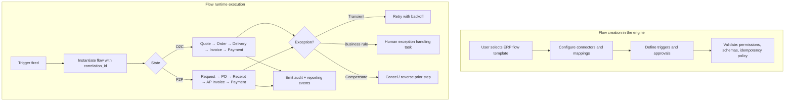
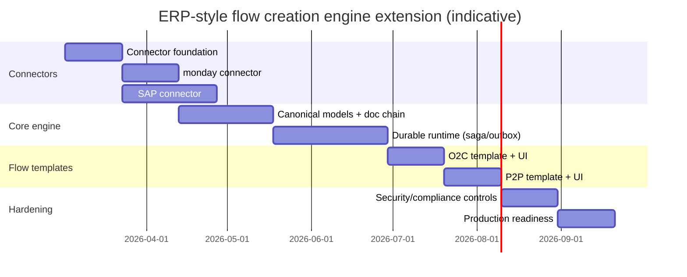

# Extending the Engine to Support ERP-Style Flow Creation

## Executive summary

The available “12-*” materials describe ERP support primarily as (a) shared master data, (b) transactional “document chains,” and (c) a unified financial backbone that standard end-to-end value streams post into (for example Record-to-Report, Order-to-Cash, Procure-to-Pay). fileciteturn0file0 fileciteturn0file1 The same materials emphasize a practical integration boundary: keep the ERP as the system of record for financially consequential posting and inventory valuation, while using a work platform for human workflow (intake, approvals, coordination), synchronizing master data and writing back approved outcomes. fileciteturn0file0

A robust engine extension to support **flow creation** for these ERP-style processes typically requires four concrete capabilities:

- A **canonical process layer**: flow templates and a flow runtime that can model document-chain state transitions, approvals, and exception handling (including compensations) rather than only stateless automations. fileciteturn0file0 citeturn2search2turn9search0  
- A **connector plane**: first-class connectors for an ERP API (notably OData-based service layers) and for a work-platform API (GraphQL + webhooks), with rate-limit aware execution, signature verification, and idempotent writes. citeturn10search0turn10search48turn0search0turn0search2turn1search2turn0search1  
- A **reliability layer for “no double posting”**: sagas for multi-step business transactions, a transactional outbox to avoid dual-write inconsistency, and explicit idempotency keys for safe retries. citeturn2search2turn2search6turn8search8turn4search2  
- A **security/audit layer**: RBAC that aligns to “draft vs posted” boundaries, webhook authenticity checks, TLS everywhere, and data-minimization/retention controls appropriate for financial/PII handling. citeturn5search2turn1search2turn5search0turn7search0turn6search6turn6search2  

Key platform targets implied by the documents and common in this architecture are entity["company","SAP","enterprise software company"] (via SAP Business One Service Layer’s OData APIs) and entity["company","monday.com","work management platform company"] (via its GraphQL API + webhooks). citeturn10search0turn0search1turn0search2turn1search0

Unknowns that materially affect implementation (and were not available in the accessible sources) include: your engine’s current flow definition schema and runtime semantics, supported ERP products/versions, whether you must create *posted* financial documents or only *drafts*, performance/SLO targets, tenancy model, and deployment constraints (cloud/on‑prem, outbound egress policy). fileciteturn0file0

## Source-derived requirements and gaps

### What the available “12-*” sources say the flow must express

Across the two accessible documents, ERP support is characterized by:

- **Shared master data** (customers/vendors/items/warehouses), reused across modules and across flows. fileciteturn0file1  
- **Transactional document chains** that preserve lineage (for example quote → order → delivery → invoice → payment; requisition → PO → goods receipt → vendor invoice → payment). fileciteturn0file1  
- **Standard value streams** (Record-to-Report, Order-to-Cash, Procure-to-Pay, plus manufacturing/service/project variants). fileciteturn0file0 fileciteturn0file1  
- A boundary between “system of record” and “system of engagement,” recommending that financially authoritative posting remains in the ERP while human workflow and approvals live in the work platform, with integration via master-data sync and writing approved outcomes back. fileciteturn0file0  

These statements imply that the flow engine must support **stateful orchestration**, a **document-chain graph**, and **approval/user-interaction steps**, not just trigger→action automations. fileciteturn0file0

### External constraints that must be modeled as flow-runtime concerns

The same target integrations carry operational constraints that directly shape engine design:

- The monday platform API is GraphQL-based. citeturn0search1  
- monday enforces rateE limits including complexity budgets per minute, request/minute limits by subscription tier, concurrency limits, and returns guidance like `retry_in_seconds` for rate-limit errors. citeturn0search0turn0search4  
- monday “Webhook integration” verifies the callback URL via a **JSON challenge**; the endpoint must echo the `challenge` field back. citeturn0search2  
- monday also signs outbound integration requests with JWTs that must be verified using secrets that vary by webhook type. citeturn1search2  
- SAP Business One Service Layer exposes an API reference explicitly noting OData v3/v4, and that **as of SAP Business One FP 2405, OData v3 is deprecated and OData v4 is the primary protocol**. citeturn10search0  
- SAP Service Layer sessions use a cookie (`B1SESSION`) for subsequent requests; `ROUTEID` can be used for sticky routing. citeturn10search48turn10search49  
- SAP training material describes cancellation of marketing documents via creation of a cancellation document rather than destructive deletion, preserving audit/reporting and reversing related transactions. citeturn11search44  

These translate into core flow-engine requirements: durable retries, dedupe/idempotency, authenticity verification, and “reversal/cancellation” semantics in state transitions. citeturn4search2turn8search8turn11search44

image_group{"layout":"carousel","aspect_ratio":"16:9","query":["order to cash process diagram","procure to pay process diagram","SAP Business One Service Layer architecture diagram","saga pattern microservices diagram"],"num_per_query":1}

### Gaps and missing details

Only two “12-*” documents were accessible in this session; the “project basic prompt” and the rest of the 12-* set were not retrievable through the available project sources/tools, so the mapping below is necessarily partial and grounded in the two available documents plus public primary references. fileciteturn0file0 fileciteturn0file1

As requested, runtime/platform versions, performance targets, and deployment constraints remain **unknown** and are treated as design parameters rather than assumed facts.

## Flow model and state machines needed for ERP-style creation

### Required flow elements and their engine-level representation

A flow-creation experience that can express document chains and ERP handoffs generally needs the following primitives (shown as “engine concept → why it matters”):

- **Trigger** → starts a flow instance:
  - Webhook triggers (for example “status changed to Approved”) must support verification challenges and authenticity checks. citeturn0search2turn1search2  
  - Schedule triggers (for example a nightly sync / reconciliation) should support standard retry and backoff on transient errors, similar to well-established workflow runtimes. citeturn9search3turn9search0  
- **Inputs/Context Variables** → master data references, document identifiers, tenant connection info, and a correlation ID that stays stable across retries/replays. (Correlation stability is essential for sagas and idempotency.) citeturn2search2turn8search8turn4search2  
- **State machine** → explicit states for “Draft,” “Awaiting Approval,” “Posted in ERP,” “Failed/Exception,” “Reversed/Cancelled,” etc. Cancellation/reversal should be a first-class path, consistent with “cancellation document” or “contra entry” patterns. citeturn11search44turn11search2  
- **Step types**:
  - User tasks (approve/reject/clarify)  
  - Connector actions (create draft PO, post invoice, update work-platform item)  
  - Decisions (branching by approval result, credit limit checks, match failures)  
  - Timers (wait for goods receipt arrival; SLA-based escalation)  
- **Outputs** → document-chain links, ERP IDs, work-platform IDs, and audit events.

### Canonical state transitions for the two core document chains

The accessible documents emphasize Order-to-Cash and Procure-to-Pay. fileciteturn0file1 A workable state model for flow creation is:

- **Order-to-Cash**: Lead/Opportunity → Quote → Sales Order → Delivery/Fulfillment → A/R Invoice → Payment → Close/Report. fileciteturn0file1  
- **Procure-to-Pay**: Purchase Request → PO → Goods Receipt → A/P Invoice → Payment → Close/Report. fileciteturn0file1  

For reversal/correction, SAP guidance commonly models cancellation via inverse documents (credit memo when canceling invoice, contra entries on journal reversal), rather than deletion. citeturn11search1turn11search2turn11search44



The retry and exception-handling behavior above mirrors common workflow runtime capabilities: retry policies with exponential backoff, explicit catch/compensation paths, and durable checkpoints. citeturn9search3turn9search0turn2search2

### Error handling semantics needed for “ERP-grade” flows

ERP-connected flows inevitably encounter ambiguities such as: “Did the external call succeed but the response was lost?” This is precisely why idempotency and retryable semantics matter:

- HTTP defines “idempotent methods” as those where multiple identical requests have the same intended effect; PUT/DELETE (and safe methods) are idempotent and can be retried more safely after transport failure. citeturn4search2  
- For non-idempotent operations (often POST), “idempotency keys” are a practical server-side pattern to ensure retries don’t duplicate business effects; Stripe’s guidance describes caching/continuation behavior across retries and requiring the same key for identical calls. citeturn8search8turn8search0  

For SAP Service Layer, session timeouts and sticky routing (`B1SESSION`, optional `ROUTEID`) mean your connector steps must handle re-login and re-routing while preserving the same business correlation/idempotency identity. citeturn10search48turn10search49

## Engine extension architecture

### Extension points in the existing engine

Because the “project basic prompt” and most of the 12-* set were unavailable, this section describes extension points as **capability layers** that can map onto your existing modules (for example a flow orchestrator, flow-definition service, and connectors service referenced in the accessible document). fileciteturn0file1

**Flow definition layer (authoring time)**  
Add ERP-aware template and validation support:

- **New node types**: “ERP_CREATE_DRAFT_DOCUMENT,” “ERP_POST_DOCUMENT,” “ERP_CANCEL_DOCUMENT,” “WORKPLATFORM_UPDATE_ITEM,” “APPROVAL_TASK,” “RECONCILIATION_TASK,” “MATCH_3WAY_TASK.”  
- **Static validation**: ensure required master data mappings exist; ensure posting steps require privileged roles; ensure each posting step declares an idempotency policy. (This directly mitigates duplication risk.) citeturn8search8turn5search0  

**Flow runtime layer (execution time)**  
Implement durable orchestration semantics:

- A saga runtime is a direct fit for business transactions that span services/systems, defined as sequences of local transactions with compensating actions on failure. citeturn2search2  
- Durable orchestrations commonly rely on checkpointing and/or event sourcing to survive restarts and enable long-running business processes. citeturn9search0  

**Connector framework**  
Add first-class connector capabilities for the two integration styles:

- **SAP Service Layer connector**: OData v4-first, session cookie management, and optional batching support. citeturn10search0turn10search48turn10search50  
- **monday connector**: GraphQL query/mutation execution with complexity budgeting, webhook challenge verification, and JWT verification for inbound event authenticity. citeturn0search1turn0search0turn0search2turn1search2  

**Observability and audit**  
Emit consistent traces/logs/metrics and preserve business audit trails:

- OTLP specifies encoding/transport mechanisms for telemetry and is stable for traces/metrics/logs. citeturn2search0turn2search3  

### Data models needed for document chains and integrations

At minimum, the engine needs internal representations for:

- Tenancy and connections (including scopes and credential references)  
- Master data mirrors (business partners, items, warehouses)  
- Transactional documents + lines  
- Document-chain edges (graph)  
- Workflow instances + step attempts + errors  
- Idempotency keys  
- Transactional outbox for event publishing  

The transactional outbox pattern is explicitly intended to resolve “dual write” inconsistencies when one operation must update a DB and publish a message/event; AWS describes the failure cases the pattern prevents. citeturn2search6

```mermaid
erDiagram
  TENANT ||--o{ CONNECTION : has
  CONNECTION ||--o{ INTEGRATION_MAPPING : maps
  TENANT ||--o{ MASTER_PARTNER : owns
  TENANT ||--o{ MASTER_ITEM : owns
  TENANT ||--o{ ERP_DOCUMENT : owns
  ERP_DOCUMENT ||--o{ ERP_DOCUMENT_LINE : contains
  ERP_DOCUMENT ||--o{ DOC_CHAIN_LINK : from
  ERP_DOCUMENT ||--o{ DOC_CHAIN_LINK : to
  TENANT ||--o{ FLOW_INSTANCE : runs
  FLOW_INSTANCE ||--o{ FLOW_STEP : includes
  TENANT ||--o{ IDEMPOTENCY_KEY : uses
  TENANT ||--o{ OUTBOX_EVENT : publishes
  TENANT ||--o{ AUDIT_LOG : records

  TENANT {
    string tenant_id PK
    string name
  }
  CONNECTION {
    string connection_id PK
    string tenant_id FK
    string system_type
    string base_url
    string scope_set
    string secret_ref
  }
  MASTER_PARTNER {
    string partner_id PK
    string tenant_id FK
    string external_id
    string type
    string name
  }
  MASTER_ITEM {
    string item_id PK
    string tenant_id FK
    string sku
  }
  ERP_DOCUMENT {
    string doc_id PK
    string tenant_id FK
    string doc_type
    string status
    string external_id
  }
  ERP_DOCUMENT_LINE {
    string line_id PK
    string doc_id FK
    string item_id FK
    number qty
    number unit_price
  }
  DOC_CHAIN_LINK {
    string from_doc_id FK
    string to_doc_id FK
    string link_type
  }
  FLOW_INSTANCE {
    string flow_instance_id PK
    string tenant_id FK
    string template_id
    string state
    string correlation_id
  }
  FLOW_STEP {
    string step_id PK
    string flow_instance_id FK
    string step_type
    string status
    int attempt
  }
  IDEMPOTENCY_KEY {
    string tenant_id FK
    string key PK
    string request_hash
    string result_ref
  }
  OUTBOX_EVENT {
    string outbox_id PK
    string tenant_id FK
    string event_type
    string payload_json
    string published_at
  }
  AUDIT_LOG {
    string audit_id PK
    string tenant_id FK
    string actor
    string action
    string object_ref
    string ts
  }
```

### Required APIs, connector contracts, and runtime changes

**SAP Service Layer integration specifics**  
Designing the connector requires acknowledging SAP’s stated behaviors:

- Service Layer is an application server providing web access to SAP Business One services/objects and includes a load-balancer architecture. citeturn10search1  
- The API follows OData and (as of FP 2405) is v4-first with v3 deprecated. citeturn10search0  
- Session cookies (`B1SESSION`, optional `ROUTEID`) are required for subsequent calls; sticky sessions support performance and HA. citeturn10search48turn10search49  

**monday integration specifics**  
The monday connector must incorporate:

- OAuth scopes and token behavior (tokens do not expire until app uninstall; no refresh tokens). citeturn1search0  
- Rate-limiting behaviors (complexity budgets, minute limits, concurrency; retry guidance). citeturn0search0turn0search4  
- Webhook URL challenge verification via a `challenge` field echo protocol. citeturn0search2  
- Inbound request authenticity via JWT signature verification and distinct secrets for different webhook sources. citeturn1search2  

**Standards and conventions for events and telemetry**  
If your engine publishes events, using CloudEvents-style envelopes provides clear dedupe semantics and required attributes (`id`, `source`, `specversion`, `type`). citeturn2search1turn2search5  
Telemetry export via OTLP gives a standard mechanism across traces/metrics/logs. citeturn2search0turn2search4  

**Security baseline**  
Transport security should meet modern TLS expectations; TLS 1.3 is explicitly designed to prevent eavesdropping, tampering, and message forgery. citeturn5search2  
OAuth 2.0 is the standard authorization framework for delegated access, as defined by the entity["organization","Internet Engineering Task Force","standards body"]. citeturn3search0  
For authorization-code flows in public clients, PKCE mitigates authorization code interception. citeturn4search1turn4search0  
API threat modeling should explicitly cover the OWASP API Top 10, with particular relevance to Broken Object Level Authorization and Unrestricted Access to Sensitive Business Flows in an ERP-posting context. citeturn5search0

For privacy and retention, GDPR principles highlight storage limitation and integrity/confidentiality, and supervisory guidance emphasizes retention policies and deletion/anonymization once data is no longer necessary. citeturn7search0turn7search5turn6search6turn6search2 (These principles originate in the entity["organization","European Union","political union"] legal framework and are summarized by bodies such as the entity["organization","European Data Protection Board","eu data protection body"] and entity["organization","European Commission","eu executive body"]. citeturn7search5turn7search7)

## Implementation plan, options, and backward compatibility

### Key design options and trade-offs

The largest architectural choice is “how durable is the flow runtime?” and “where is the financial truth?”

A saga-based approach is a standard answer to distributed transactions: a saga is a sequence of local transactions; failures include compensating transactions. citeturn2search2 The transactional outbox is a standard mitigation for DB+event dual-writes. citeturn2search6 Durable orchestrators (e.g., Durable Functions) explicitly advertise durable checkpoints and long-running execution with audit/history benefits. citeturn9search0

| Decision area | Option | Benefits | Costs / risks | Backward-compatibility impact |
|---|---|---|---|---|
| Flow runtime durability | “Best effort” job runner (short-lived tasks only) | Minimal changes | Poor fit for long-lived ERP processes; weak retry/recovery story | Low initial impact, high operational failures later |
| Flow runtime durability | Saga orchestration + durable state (recommended) | Correctness under failure; compensations; supports long-running flows citeturn2search2turn9search0 | Requires persistence model, step semantics, replay tooling | Moderate: new flow state tables/events; existing flows can be left unchanged if versioned |
| Event publishing consistency | Direct publish after DB write | Simpler | Dual-write inconsistency under failures | Hidden behavioral risk for existing consumers |
| Event publishing consistency | Transactional outbox (recommended) | Explicitly addresses dual-write consistency citeturn2search6 | Needs an outbox publisher and monitoring | Moderate: introduces outbox table + publishing process |
| Financial source of truth | ERP remains system of record (recommended per docs) | Avoid re-implementing valuation/posting logic; reduces reconciliation complexity fileciteturn0file0 | Requires robust connector/reconciliation tooling | Low to moderate: engine stores mirrors/links rather than authoritative ledger |
| Financial source of truth | Engine builds authoritative ledger | Unified analytics | Very high compliance/audit burden; risk of mismatches | High and potentially breaking for existing semantics |

### Prioritized milestones and tasks

Effort estimates are **Low/Med/High** and assume “unknown platform constraints”; the plan is dependency-driven rather than calendar-guaranteed.

| Milestone | Core tasks | Effort | Dependencies | Primary risks and mitigations |
|---|---|---:|---|---|
| Connector foundation | Connection registry; secret references; OAuth install flow; webhook listener with challenge-response | Med | AuthN/AuthZ subsystem | Webhook spoofing → JWT verification + challenge handling citeturn0search2turn1search2 |
| monday connector | GraphQL client; complexity-aware throttling; retry honoring `retry_in_seconds`; board/item mapping primitives | Med | Connector foundation | Rate-limit backlog → adaptive throttles, batching citeturn0search0turn0search1 |
| SAP connector | OData v4 client; session cookie mgmt; re-login; optional batch support | High | Connector foundation | Session stickiness/HA behavior → handle `B1SESSION`/`ROUTEID`, resilient re-auth citeturn10search48turn10search49turn10search0 |
| Canonical models | Master data mirror; ERP document + line + chain graph; mapping tables | High | Both connectors (for sync) | Schema drift → versioning + reconciliation views |
| Durable runtime | Saga model; step retry/backoff; compensation hooks; idempotency-key system; transactional outbox publisher | High | Canonical models | Duplicate posting → idempotency keys + outbox + immutability citeturn8search8turn2search6turn2search2 |
| Flow templates | O2C and P2P templates; approval tasks; exception queues; reversal/cancellation paths | Med | Durable runtime | Complex business variance → templating + override points fileciteturn0file1 citeturn11search44 |
| Security & compliance hardening | RBAC for posting; audit trails; PII controls; retention config; SIEM-friendly logs | Med | Runtime + connectors | BOLA / sensitive business flows → defense-in-depth checks citeturn5search0turn7search0turn6search6 |
| Production readiness | Observability; runbooks; replay tooling; reconciliation dashboards; load tests | Med | All previous | Debuggability → OTLP tracing + correlation IDs citeturn2search0turn2search3 |

#### Gantt-style timeline

This is an indicative dependency order (not a commitment to a specific team velocity), shown in “weeks” only to satisfy the requested visualization.



### Backward compatibility strategy

To minimize disruption:

- **Version flow definitions**: keep existing flow schema stable; introduce “ERP flow vNext” node types behind a version gate.  
- **Tenant-scoped feature flags**: enable ERP connectors per-tenant and per-connection.  
- **Read-only first**: start with master-data sync and “draft creation” before enabling “posting” steps, aligning with the system-of-record boundary recommended in the source docs. fileciteturn0file0  
- **Event schema versioning**: if you adopt CloudEvents envelopes, required fields and dedupe semantics are well-defined; consumers can adopt incrementally. citeturn2search1turn2search5  

## Validation tests, acceptance criteria, and required artifacts

### Acceptance criteria

The following criteria are framed as “observable outcomes” rather than implementation details:

- A user can create an O2C/P2P flow from a template, configure connectors, and validate the flow definition without runtime execution. (Template requirement stems from the document-chain/value-stream framing.)fileciteturn0file1  
- Webhook-triggered flows verify the monday challenge and reject unauthenticated webhook deliveries (JWT invalid). citeturn0search2turn1search2  
- Connector calls respect monday rate limits and retry guidance (no “hot loop” retry storms). citeturn0search0turn0search4  
- SAP calls survive session expiration by re-authenticating and continuing without duplicating business effects, using stable correlation and idempotency policies. citeturn10search48turn8search8  
- No duplicate ERP postings occur under at-least-once message delivery, webhook duplicates, or transient network failures—validated via idempotency keys and saga step semantics. citeturn2search2turn4search2turn8search8turn8search0  
- “Cancel / reverse” operations produce explicit reversal artifacts (cancellation documents / contra entries) rather than destructive deletes, preserving auditability. citeturn11search44turn11search2  
- Audit logs include “who/what/when” across flow authoring and posting operations, mapped to “processing integrity” expectations consistent with SOC 2 trust-services categories. citeturn6search49turn6search3  

### Example test cases

**Duplicate webhook delivery does not duplicate ERP posting**  
- Given: a monday webhook event is delivered twice (same event ID / payload). citeturn0search2  
- When: both deliveries trigger the same flow instance creation attempt.  
- Then: only one ERP document is created/posted; the second attempt is deduped via correlation + idempotency key; audit log records the duplicate detection. citeturn8search8turn2search1turn2search6  

**Rate limit recovery honors retry hints**  
- Given: a GraphQL call exceeds complexity budget and returns a rate-limit exception with retry guidance. citeturn0search0turn0search4  
- When: the connector retries.  
- Then: it waits at least the recommended time, applies exponential backoff, and the flow remains in “Retrying” with an operator-visible step status. citeturn9search3turn0search0  

**SAP session timeout recovery**  
- Given: a flow step uses Service Layer after login and the session expires. citeturn10search48  
- When: the next step call returns “Invalid session.”  
- Then: the connector re-authenticates, replays the step idempotently, and proceeds; the business document chain remains consistent. citeturn10search48turn2search2turn8search8  

**Cancellation produces a cancellation/reversal artifact**  
- Given: an invoice is posted and later cancelled.  
- When: the flow executes a “cancel document” step.  
- Then: a new cancellation/reversal document is created, and both documents remain reportable/auditable. citeturn11search44turn11search1  

### Required artifacts, code interfaces, and sample payloads

The minimum artifact set to implement and operate this extension:

- **Flow definition schema (versioned)** and template library for O2C/P2P.  
- **Connector SDK contracts** for:
  - Auth (OAuth install + token storage references; JWT verification) citeturn1search0turn1search2turn3search0  
  - Rate limiting/throttling (monday complexity budgets) citeturn0search0  
  - Session management (SAP `B1SESSION` cookie) citeturn10search48  
- **Persistence migrations**: document chain tables, workflow state tables, idempotency keys, outbox. citeturn2search6  
- **Operational runbooks**: replay strategy, stuck outbox handling, reconciliation playbooks.  
- **Observability dashboards** using OTLP-exported telemetry with correlation IDs. citeturn2search0turn2search3  

Sample payloads below are illustrative and should be aligned to your existing API conventions.

```json
{
  "flowTemplate": {
    "id": "tmpl_o2c_v1",
    "name": "Order-to-Cash",
    "version": "1.0",
    "triggers": [
      {
        "type": "WEBHOOK",
        "source": "monday.board.item.updated",
        "filter": { "status": "Approved" }
      }
    ],
    "steps": [
      {
        "id": "step_create_so",
        "type": "ERP_CREATE_DRAFT_DOCUMENT",
        "connectorRef": "conn_sap_b1_prod",
        "docType": "SALES_ORDER",
        "idempotencyKeyTemplate": "o2c:{correlationId}:so",
        "inputMapping": {
          "partnerExternalId": "{vars.customerId}",
          "lines": "{vars.lines}"
        },
        "onError": {
          "remedy": "RETRY",
          "retryPolicy": { "maxAttempts": 5, "backoff": "EXPONENTIAL" }
        }
      },
      {
        "id": "step_approve_post",
        "type": "APPROVAL_TASK",
        "assigneeRole": "finance_approver",
        "approvalOutcomeVar": "vars.financeApproved"
      },
      {
        "id": "step_post_invoice",
        "type": "ERP_POST_DOCUMENT",
        "when": "{vars.financeApproved} == true",
        "docRef": "{vars.invoiceDraftRef}",
        "idempotencyKeyTemplate": "o2c:{correlationId}:invoice:post",
        "onError": {
          "remedy": "COMPENSATE",
          "compensationStepIds": ["step_cancel_so"]
        }
      }
    ]
  }
}
```

```json
{
  "cloudEvent": {
    "specversion": "1.0",
    "id": "01JCK2X9P2F6B0J7Z9W2Y5Q8QK",
    "source": "urn:engine:tenant:acme",
    "type": "erp.document.posted",
    "time": "2026-02-25T10:00:00Z",
    "datacontenttype": "application/json",
    "data": {
      "docType": "AR_INVOICE",
      "externalId": "12345",
      "correlationId": "corr_9a8b7c"
    }
  }
}
```

(CloudEvents required attribute semantics and duplicate-detection guidance come directly from the CloudEvents specification. citeturn2search1)

```json
{
  "mondayWebhookChallengeResponse": {
    "challenge": "3eZbrw1aBm2rZgRNFdxV2595E9CY3gmdALWMmHkvFXO7tYXAYM8P"
  }
}
```

(The `challenge` echo requirement is defined in monday’s webhook integration documentation. citeturn0search2)

In sum: the engine extension described here is anchored in the accessible project documents’ emphasis on document chains and the system-of-record boundary, and supplemented by primary platform specifications for SAP Service Layer, monday API/webhooks, and widely adopted reliability/security standards. fileciteturn0file0 fileciteturn0file1