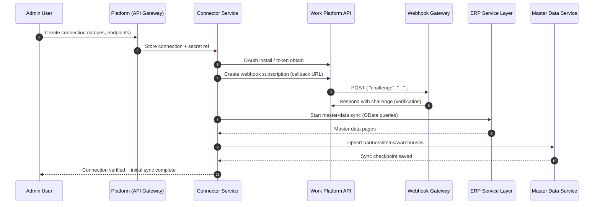
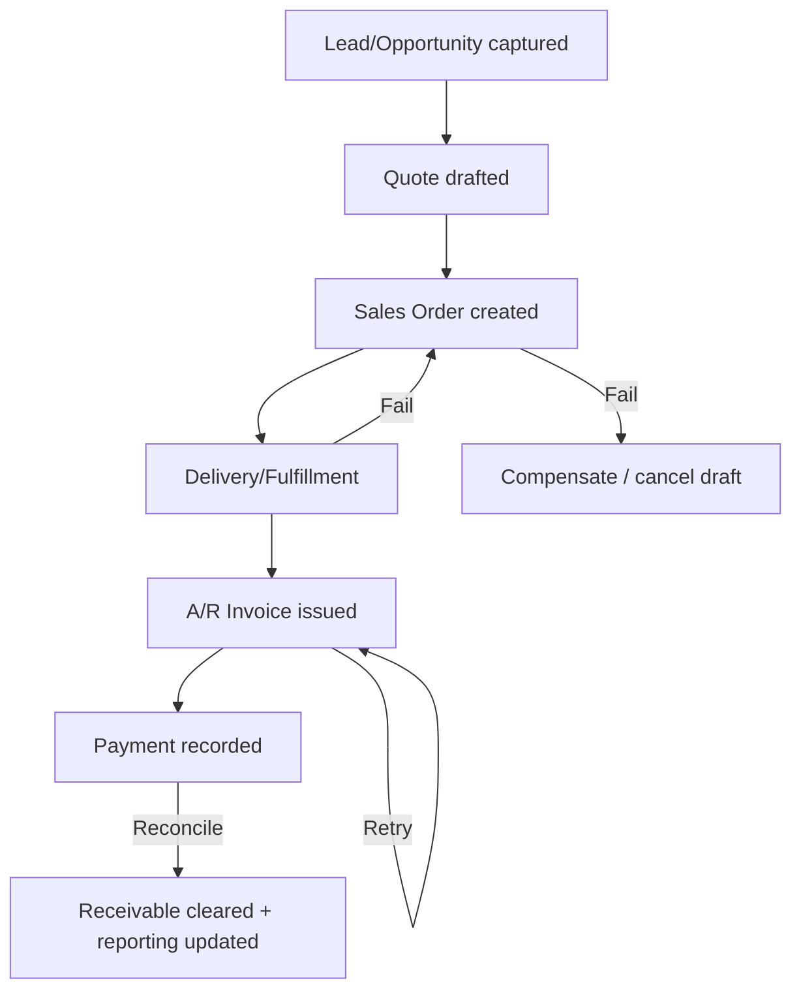

# Extending the Platform to Support ERP-Style Processes and Integrations

## Executive summary

The attached process description frames an ERP extension as a set of tightly linked modules built on shared master data, transactional “document chains,” and a unified financial backbone, with standard end-to-end flows (Record-to-Report, Order-to-Cash, Procure-to-Pay, Plan-to-Produce, Service-to-Cash, Project-to-Profit). fileciteturn0file0 The same source also recommends a “system of record vs. system of engagement” split—keeping financial posting and inventory valuation in the ERP, while using a work platform for human workflow—and integrating the two via master-data sync and outcome-driven writes back into the ERP. fileciteturn0file0

Given that your current architecture is unspecified, this report assumes a microservices platform with an API gateway, domain services, an event bus, and a workflow/orchestration layer (or equivalent). Under those assumptions, the most robust approach is to implement an ERP-domain extension as: (a) canonical data models for ERP concepts (partners, items, document chain, journal entries, payments), (b) connectors to external ERP/work systems (notably SAP Business One Service Layer via OData/HTTP and a work platform via GraphQL/webhooks), (c) a durable workflow engine (orchestrated sagas) for cross-service and cross-system transactions, and (d) a reliability layer (transactional outbox + idempotency) for safe retries and “no double-posting.” citeturn7view0turn2search12turn2search1turn4search0turn4search1

The key engineering risks are not CRUD complexity but correctness under failure: exactly-once *business effects* across retries; reconciling partial success across external systems; role-based controls separating “draft” vs “posted” actions; and auditability/immutability expectations typical for financial records. citeturn2search12turn2search1turn6search1turn3search1

A realistic delivery plan is phased: start with connection/authentication + master data ingestion; then implement Order-to-Cash and Procure-to-Pay document chains; then add ledger/audit structures and reconciliation tooling; and only then add optional “universal journal”-style analytics and closing routines. fileciteturn0file0

## Source process and assumptions

The attached markdown describes ERP capabilities as interdependent modules operating on shared master data (customers/vendors/items/warehouses, etc.), transactional documents (orders, receipts, invoices, payments), and a ledger where operational actions “post” to accounting. fileciteturn0file0 It explicitly lists standard “value streams” (R2R, O2C, P2P, Plan-to-Produce, Service-to-Cash, Project-to-Profit). fileciteturn0file0

It also positions a work platform as configurable workflow/automation (boards, automations, integrations) and recommends an integration split: ERP as the “system of record” for customers/vendors/items, inventory valuation, invoices/payments and GL posting, and the workflow tool as “system of engagement” for approvals, coordination, and intake; with integration patterns such as read-mostly master data sync into the workflow tool and pushing approved outcomes back into the ERP while avoiding financial posting outside the ERP. fileciteturn0file0

**Assumptions used in this report (explicit):**

- **Platform architecture**: microservices with independent persistence per service, an API gateway, a shared identity service, and an event bus (Kafka/PubSub-like). (Unspecified by the source; assumed per request.)
- **Multi-tenancy**: assumed (common for platforms integrating with third-party systems); if single-tenant, several schema and RBAC layers simplify materially.
- **External systems referenced by the process**: an ERP exemplified by SAP Business One (not mandatory, but treated as a primary target because an official OData-based Service Layer API is available), and a work platform exemplified by monday.com (GraphQL API, OAuth scopes, webhooks, and published rate limits). citeturn7view0turn7view3turn1search11turn1search2turn10search2turn10search3
- **Unspecified details** that materially affect design (called out rather than invented): legal retention period requirements by jurisdiction; whether you are expected to *post* journals/payments or only create *drafts*; whether inventory valuation is in-scope; whether manufacturing/MRP is in-scope; whether you must support multiple ERPs concurrently; and whether existing platform services (e.g., workflow engine, audit log service) already exist. fileciteturn0file0

## Target architecture extension

### Architectural intent

The extension should treat “ERP processes” as **stateful, auditable workflows** over canonical domain objects, and treat external systems as **connectors** with strict boundaries:

- **Canonical domain**: your internal representation of partners, items, warehouses, document chains, and ledger entries (even if the ERP remains the system-of-record) so workflows can validate, reconcile, and report consistently across customers/ERP instances. fileciteturn0file0
- **Connector boundary**: each external system gets a dedicated adapter that normalizes auth, rate limits, retries, and error semantics.
- **Workflow orchestration**: cross-service cross-system sequences must be implemented as a saga/orchestrated workflow to manage compensation and retries rather than relying on distributed transactions. citeturn2search12turn2search0
- **Reliability layer**: any “write + publish event” must be protected against dual-write inconsistency using a transactional outbox pattern. citeturn2search1turn2search4turn2search17

### Reference external ERP API characteristics driving design

The SAP Business One Service Layer is documented as a “new generation of extension API” using HTTP and OData, exposing business objects on a scalable/high-availability web server and supporting OData v3/v4. citeturn7view0turn7view3turn6search2 Its architecture is described as 3-tier (client ↔ web server via HTTP/OData, web server ↔ database) and designed for multi-instance deployments with a load balancer to improve availability and parallelize execution. citeturn7view0turn8view0turn8view1

These characteristics imply the connector must handle:

- OData query shapes and metadata versioning (v3/v4). citeturn7view0turn6search2
- Session stickiness / load balancing considerations if you deploy against clustered Service Layer instances. citeturn7view0turn8view1
- A “business object” model where actions like tax calculation/posting occur inside the ERP, which affects where you validate vs. where you defer to ERP rules. citeturn7view0

## APIs and integration points

This section provides the required *mapping table* and enumerates internal and external integration points.

### Mapping table of process steps to platform components and APIs

| Process step from source flow model | Platform component(s) (proposed) | Internal API / event | External integration point(s) | Notes on correctness & failure modes |
|---|---|---|---|---|
| Establish tenant connection to work platform | Integration Admin UI; Connector Service; Secrets store | `POST /connections/work-platform` → `ConnectionCreated` | OAuth scopes for apps; token exchange | OAuth scopes are required per endpoint, so minimize scope grants and store refresh/access tokens securely. citeturn1search2turn0search0turn3search1 |
| Validate inbound webhook endpoint | Webhook Gateway; Verification handler | `POST /webhooks/work-platform` (challenge response) | Webhook URL challenge verification | Work platform sends a JSON challenge when creating the webhook to verify endpoint control. citeturn10search3 |
| Receive workflow events (status changes, approvals) | Webhook Gateway → Event Ingestor | `WebhookReceived` → `WorkEventNormalized` | Webhooks API (events) | Apply dedupe keys and replay defense; design for at-least-once delivery. (Retry policy specifics are not fully specified in accessible official docs for this endpoint list page.) citeturn10search3turn2search1 |
| Sync master data ERP → platform | ERP Connector; Master Data Service | `SyncJobStarted` / `PartnerUpserted` / `ItemUpserted` | ERP Service Layer OData entities | Service Layer exposes APIs over OData (v3/v4). Use incremental sync (watermarks) where available. citeturn7view0turn7view3 |
| Lead/opportunity intake (O2C) | Workflow Orchestrator; CRM Domain Service | `O2CStarted` | Work platform GraphQL API / board item creation | Work platform API is GraphQL and supports “get everything in one call,” which is useful for reducing round-trips and rate-limit pressure. citeturn1search11turn6search3 |
| Quote creation | Sales Domain Service; Document Chain Service | `POST /sales/quotes` → `QuoteCreated` | ERP (optional draft quote) | If ERP remains system-of-record, keep “official quote” there; otherwise store internal draft and commit later. Source does not specify. fileciteturn0file0 |
| Sales order creation | Sales Domain Service; ERP Connector | `POST /sales/orders` → `SalesOrderCreated` | ERP Service Layer (Sales Orders) | Use saga steps: create draft → confirm posted; compensate by void/cancel if downstream fails (ERP-specific). citeturn2search12turn6search1 |
| Delivery/fulfillment | Fulfillment Service; Inventory Service | `DeliveryCreated` / `InventoryCommitted` | ERP delivery documents / inventory movements | Inventory valuation is ERP-sensitive; if ERP owns valuation, you should not compute value outside ERP except for analytics. fileciteturn0file0 |
| A/R invoice | Billing Service; Ledger Posting Service | `InvoiceIssued` / `LedgerPostingRequested` | ERP invoice posting APIs | Financial “posting” should be guarded by strong RBAC and idempotency keys to avoid double billing. citeturn4search0turn4search1 |
| Payment captured/recorded | Payments Service; Reconciliation Service | `PaymentRecorded` / `ReceivableCleared` | ERP incoming payments | Payment flows must be idempotent; consider “idempotency key” pattern for POST-like operations. citeturn4search0turn4search1 |
| Purchase request intake (P2P) | Procurement Service; Approval Workflow | `P2PStarted` | Work platform intake item | Approvals typically live in work platform; outcome drives EPC creation in ERP. fileciteturn0file0 |
| Purchase order | Procurement Service; ERP Connector | `PurchaseOrderCreated` | ERP purchase order APIs | If ERP enforces three-way match and posting logic, your platform should primarily orchestrate and validate preconditions, not re-implement posting. fileciteturn0file0 |
| Goods receipt | Inventory Service; Procurement Service | `GoodsReceiptRecorded` | ERP goods receipt APIs | Design for asynchronous completion (warehouse scanning, etc.). Use retries with backoff for transient failures. citeturn2search12turn4search4 |
| Vendor invoice & payment | AP Service; Ledger Posting Service | `APInvoiceBooked` / `PaymentRunTriggered` | ERP A/P invoice, outgoing payment | If generating payments is in scope, treat as high-risk operation: separation of duties + approval gates. Source does not specify. fileciteturn0file0 |
| Record-to-Report close activities | Finance Close Service; Reporting | `PeriodCloseStarted` / `CloseCompleted` | ERP close operations (varies) | “Period end closing routine” is mentioned as an automation concept but not specified as an API-level process. fileciteturn0file0 |
| Reporting & analytics | Analytics/Reporting Service; Search/Index | `FactUpdated` events → materialized views | ERP reporting exports / internal dashboards | If you implement a “universal journal”-style store for analytics, treat it as derived data and reconcile to ERP postings. citeturn6search21turn2search1 |

### External APIs and constraints

- **ERP connector (SAP B1 model)**: Service Layer APIs are exposed over OData and support v3/v4 with separate metadata endpoints; it is designed for scalable deployment with load balancing and multi-processing inside the server. citeturn7view0turn8view0turn8view1
- **Work platform connector (monday model)**: the platform API is GraphQL. citeturn1search11turn6search3 OAuth scopes govern what an app can do and are endpoint-dependent. citeturn1search2turn0search0 Official rate limits are described in “complexity points per minute” budgets (reads/writes scoped by token type), which must be integrated into retry/backoff and batching logic. citeturn10search2
- **Webhook ingress**: at minimum, handle URL verification challenge and treat inbound webhook delivery as at-least-once. citeturn10search3turn2search1 For apps framework board webhooks, official guidance indicates they can be signed using an app signing secret and validated as JWT. citeturn10search14

## Data models, storage, and retention

This section provides the required *proposed data model schemas table* and outlines persistence/retention.

### Data model design principles

- **Document principle & auditability**: financial/operational documents should be immutable once “posted,” corrected via reversal/adjustment rather than destructive updates (where supported). This aligns with ERP behavior and audit expectations; SAP documentation for journal reversal illustrates the “reversal document” approach in accounting systems. citeturn6search1
- **Derived analytics vs. authoritative posting**: if an ERP remains the system-of-record, your internal ledger/journal store should be either (a) a strict mirror of ERP postings, or (b) a derived “universal journal”-style index used for reporting, but not the authoritative accounting book. citeturn6search21turn2search1
- **Schema evolution**: version event payloads (CloudEvents-style envelope is recommended for interoperability), and version API contracts. citeturn0search3turn0search7

### Proposed schemas table

| Object (table or JSON) | Purpose | Key fields (illustrative) | Schema/constraint highlights | Retention & storage notes |
|---|---|---|---|---|
| `tenant` (table) | Multi-tenant boundary | `tenant_id`, `name`, `status` | Unique `tenant_id`; soft-delete with legal hold support | Retain as long as account exists; deletion subject to contract/legal holds. citeturn3search0turn3search20 |
| `connection` (table) | External system connection registry | `connection_id`, `tenant_id`, `system_type`, `base_url`, `scopes`, `status` | Unique `(tenant_id, system_type, base_url)` to prevent duplicates | Keep while integration active + audit retention window. citeturn3search1 |
| `connection_secret` (table or vault ref) | Token/secret indirection | `connection_id`, `secret_ref`, `rotated_at` | Never store raw secrets in DB if a vault exists; encrypt at rest if unavoidable | GDPR security expectations include encryption/pseudonymization measures. citeturn3search1 |
| `erp_partner` (table) | Canonical business partner (customer/vendor) | `partner_id`, `tenant_id`, `external_ids[]`, `name`, `type`, `tax_id`, `addresses[]` | Maintain mapping to external ERP IDs; `type` enum | Prefer minimal PII and apply “storage limitation” review timers. citeturn3search0turn3search20 |
| `erp_item` (table) | Canonical item/product/service | `item_id`, `sku`, `uom`, `attributes` | Unique `(tenant_id, sku)` | Retain while referenced by documents; avoid deleting. fileciteturn0file0 |
| `erp_warehouse` (table) | Warehouse/master data | `warehouse_id`, `code`, `name` | Unique `(tenant_id, code)` | Long-lived master data. fileciteturn0file0 |
| `erp_document` (table) | Header for transactional docs | `doc_id`, `doc_type`, `status`, `partner_id`, `currency`, `total_amount`, `external_ref` | `doc_type` includes `QUOTE`, `SO`, `DELIVERY`, `AR_INVOICE`, `PO`, `GR`, `AP_INVOICE`, `PAYMENT` | Posted docs should be immutable; “cancel/reverse” modeled as new doc referencing original. citeturn6search1 |
| `erp_document_line` (table) | Line items for docs | `line_id`, `doc_id`, `item_id`, `qty`, `unit_price`, `tax_code` | FK to `erp_document`; line ordering stable | Retain with header; index `(doc_id)` and `(item_id)`. |
| `document_chain_link` (table) | Explicit doc-chain relationships | `from_doc_id`, `to_doc_id`, `link_type` | Enforce acyclicity per chain type; allow many-to-many for splits | Central to O2C/P2P traceability. fileciteturn0file0 |
| `journal_entry` (table) | Canonical journal header (internal) | `je_id`, `period`, `posting_date`, `source_doc_id`, `status` | If authoritative: strict immutability; if derived: mark as `mirrored_from_erp` | If you mirror, record ERP IDs for reconciliation. citeturn6search21 |
| `journal_entry_line` (table) | Journal lines | `jel_id`, `je_id`, `account`, `debit`, `credit`, `dims` | `(debit,credit)` mutually exclusive; sum(debit)=sum(credit) constraint (or validated in code) | Financial integrity constraints and audit logs. |
| `process_instance` (table) | Workflow/saga instance | `process_id`, `process_type` (`O2C`,`P2P`…), `state`, `correlation_id` | `correlation_id` is stable across retries | Enables reliable workflows across microservices. citeturn2search12turn4search6 |
| `process_step` (table) | Step-level execution | `step_id`, `process_id`, `name`, `attempt`, `next_retry_at`, `status`, `error` | Idempotent step semantics; exponential backoff fields | Persisted retries reflect durable execution concepts used by workflow engines. citeturn4search6turn4search10 |
| `idempotency_key` (table) | Prevent duplicate mutations | `tenant_id`, `key`, `request_hash`, `result_ref`, `expires_at` | Unique `(tenant_id, key)`; ensure request hash consistency | Idempotency is essential for retrying POST-like operations safely. citeturn4search0turn4search1 |
| `outbox` (table) | Transactional outbox | `outbox_id`, `aggregate_id`, `event_type`, `payload`, `created_at`, `published_at` | Written in same DB transaction as aggregate update | Transactional outbox addresses dual-write; publish asynchronously. citeturn2search1turn2search4 |
| `integration_mapping` (table) | Stable mapping internal ↔ external IDs | `internal_id`, `system_type`, `external_id`, `last_synced_at` | Unique `(system_type, external_id)` and `(internal_id, system_type)` | Required for reconciliation and safe replays. |
| `audit_log` (table/index) | Security and business audit | `who`, `what`, `when`, `tenant_id`, `object_ref`, `diff` | WORM-like storage option for high assurance | SOC 2 emphasizes controls relevant to security/processing integrity. citeturn3search2 |
| `CloudEvent` envelope (JSON) | Standard event envelope | `specversion`, `id`, `source`, `type`, `time`, `datacontenttype`, `data` | Validate required attributes | CloudEvents standardizes event metadata across systems. citeturn0search3turn0search7 |

### Storage and retention requirements

- **Operational DB**: store canonical domain objects, workflow state, idempotency keys, and outbox. Outbox must share the same transactional store as the mutated aggregate to guarantee atomicity. citeturn2search1turn2search4
- **Analytics/search index**: optional, for “universal journal”-style reporting and cross-document search; treat as derived from authoritative data. SAP’s “universal journal” concept is explicitly described as the “book of original entry” in SAP S/4HANA, which underscores the risk of treating analytics stores as authoritative unless you truly implement an accounting-grade ledger. citeturn6search21
- **Retention policy**: GDPR’s storage limitation principle requires keeping personal data no longer than necessary for its purposes, and security measures appropriate to risk. citeturn3search0turn3search1turn3search20 For finance/ERP records, retention is often longer due to statutory/audit needs, but the specific period is jurisdiction- and contract-dependent and is **unspecified** in the source process. fileciteturn0file0

## Event flows, reliability, and scalability

### Event flows and sequencing

The process model in the source implies “document chains” as the backbone of sequencing (quote → order → delivery → invoice → payment; requisition → PO → receipt → invoice → payment). fileciteturn0file0 The platform should therefore represent these chains explicitly (links + state machine) and drive them through a workflow orchestrator (saga).

#### Key flow: Connection setup + master data sync (sequence)

The work platform requires webhook endpoint verification via a JSON challenge when creating a webhook, which should be implemented as an explicit verification step in the integration setup flow. citeturn10search3

### Reliability patterns: retries, idempotency, and outbox

- **Sagas for distributed consistency**: the saga pattern is specifically intended for business transactions spanning multiple services, using a sequence of local transactions with compensating actions when necessary. citeturn2search12turn2search0 This is a natural fit for O2C/P2P chains, where each step can succeed or fail independently (ERP call, work-platform update, internal state update).
- **Transactional outbox for dual-write**: the transactional outbox pattern stores outgoing messages/events in the database as part of the same transaction that updates business state, then publishes later—reducing the risk of “state updated but event not published” (or vice versa). citeturn2search1turn2search4turn2search20
- **Idempotency for safe replays**: HTTP semantics define idempotent methods (e.g., PUT/DELETE) as having the same intended effect when repeated. citeturn4search1 For non-idempotent operations (often POST), adopt explicit idempotency keys; Stripe’s official documentation provides a concrete idempotency-key approach and operational expectations (key reuse behavior, pruning, parameter consistency checks). citeturn4search0turn4search8

#### Key flow: Order-to-Cash document chain (flowchart)

### Performance and scalability implications

- **API rate limiting and batching**: the work platform’s public API rate limits are expressed as “complexity points per minute” and differ based on token type (app tokens vs personal tokens vs playground). citeturn10search2 This implies you should (a) batch GraphQL queries by composing fields, (b) cache stable master data, and (c) implement adaptive throttling per tenant/connection.
- **ERP connector concurrency**: SAP Business One Service Layer is designed for scaling via multiple instances behind a load balancer and supports parallel request execution. citeturn7view0turn8view1 Your connector should still treat the ERP as a constrained dependency: use bounded concurrency, circuit breakers, and queue-based backpressure to prevent cascading failures.
- **Workflow engine scaling**: durable workflow runtimes explicitly support long-lived executions and standardized retry policies, which is useful for ERP integrations where business processes can span hours/days. citeturn4search6turn4search10turn4search2

## Security, compliance, and access control

### Authentication and authorization impacts

- **OAuth**: OAuth 2.0 enables third-party applications to obtain limited access to an HTTP service, either on behalf of a resource owner or on the client’s behalf. citeturn0search0turn0search8 If your connector uses browser-based authorization, PKCE mitigates authorization code interception for public clients. citeturn0search1turn0search17
- **Scopes and least privilege**: the work platform defines explicit OAuth permission scopes and states that endpoints require specific scopes. citeturn1search2 Implement a scope-to-feature mapping and deny enabling “posting” features unless required scopes are present.
- **RBAC / separation of duties**: because ERP processes involve high-risk actions (issuing invoices, recording payments, triggering payment runs), enforce RBAC roles such as `finance_admin`, `ap_clerk`, `ar_clerk`, `sales_ops`, `approver`, and separate “draft creation” from “posting/commit.” (Specific role model is unspecified in the source; proposed as a standard ERP control approach.) fileciteturn0file0

### Securing webhook ingress and event authenticity

- **Endpoint control validation**: webhook creation involves a challenge-response verification to prove you control the endpoint. citeturn10search3 Treat failure to validate as a blocking error in the integration setup workflow.
- **Signed webhook verification (apps framework)**: official guidance for board webhooks indicates they can be signed using an app signing secret and verified by validating the JWT. citeturn10search14 If you also accept “basic” webhook integrations without signatures, mitigate by IP allowlisting (if available), replay protection (timestamp + nonce), and strict schema validation.

### Transport security and API security posture

- **TLS**: TLS 1.3 is specified in RFC 8446 as a protocol designed to prevent eavesdropping, tampering, and message forgery. citeturn5search0turn5search8 Enforce TLS for all inbound/outbound connections, including internal service-to-service where feasible.
- **API security threats**: OWASP’s API Security Top 10 includes risks like broken object level authorization and resource consumption issues (DoS/cost blowups), directly relevant to webhook ingestion and rate-limited external APIs. citeturn5search2turn5search14
- **Compliance framing**: SOC 2 reports focus on controls relevant to security, availability, processing integrity, confidentiality, and privacy; your ERP extension increases the “processing integrity” and auditability stakes because business outcomes and financial records are involved. citeturn3search2 GDPR principles (storage limitation, security of processing) inform retention minimization, encryption, access controls, and incident readiness. citeturn3search0turn3search1turn3search20

## Delivery plan, testing, migration, costs, and risks

### Phased implementation plan with milestones, deliverables, and time estimates

Time estimates assume a small squad (3–5 engineers) plus part-time security/QA and an engaged product owner. They are **rough** and depend heavily on whether you must support posting/payments vs. drafts-only, and whether inventory valuation/manufacturing is in scope (both unspecified). fileciteturn0file0

| Phase | Milestones & deliverables | Rough time |
|---|---|---|
| Foundation | Integration framework: connection registry, secret handling, OAuth flows, webhook gateway with challenge verification, basic observability scaffolding (trace IDs, structured logs) | 3–5 weeks |
| Master data + canonical models | Master data schemas + sync jobs (partners/items/warehouses), mapping tables, incremental sync checkpoints, replay-safe upserts | 3–5 weeks |
| Document chains: O2C | Quote→Order→Delivery→Invoice→Payment orchestration, document chain links, idempotency keys, ERP connector endpoints & retries, basic UI/API endpoints | 5–8 weeks |
| Document chains: P2P | Requisition→PO→Goods Receipt→Vendor Invoice→Payment orchestration, approvals integration, three-way match validations (where possible), exception queues | 5–8 weeks |
| Finance & audit hardening | Ledger mirror/derived journal indexing, reversal/cancellation handling, audit log coverage, reconciliation dashboards, permissions review | 4–6 weeks |
| Production readiness | Load tests, chaos/failure injection, SLOs, runbooks, canary/rollback flows, compliance evidence collection | 3–5 weeks |

### Testing strategy

A reliable ERP-style extension requires layered tests because orchestrations fail in ways unit tests won’t catch.

- **Unit tests**: domain invariants (document chain rules, state transitions), schema validation, idempotency key handling (request hash matching) informed by idempotency practices. citeturn4search0turn4search1
- **Integration tests**: connector tests against sandbox instances of the ERP Service Layer (OData v3/v4 variations) and work platform GraphQL APIs; include rate-limit and timeout simulations. citeturn7view0turn10search2
- **Contract tests**: snapshot external API payloads and webhook schemas; validate CloudEvents envelope conformance if used. citeturn0search3turn0search7
- **End-to-end tests**: run full O2C and P2P scenarios with induced failures (ERP returns 5xx, webhook duplicates, network partitions) to verify saga compensation, retries, and eventual consistency. citeturn2search12turn2search1

### Deployment and CI/CD changes

- Add migration execution to the pipeline (schema changes: document tables, outbox, idempotency keys, mappings).
- Add secret-scanning and policy-as-code gates (especially because OAuth tokens and ERP credentials become first-class assets).
- Add progressive delivery (canary + automated rollback) for connectors, since external API rate limits and behaviors can vary by tenant and cause noisy failures.

### Monitoring and observability

- Adopt distributed tracing and correlated logs/metrics across orchestration steps; OpenTelemetry defines specifications for traces/logs/metrics and OTLP transport, enabling consistent correlation keys across signals. citeturn0search6turn0search14turn0search22
- Track business SLOs in addition to infra: “invoice posted successfully,” “PO created within X minutes,” “reconciliation backlog,” “webhook lag,” “retry/compensation counts.”
- Emit structured events in a CloudEvents-style envelope to improve interoperability and reduce ad-hoc event parsing. citeturn0search3turn0search7

### Migration and backward compatibility

- **Feature flags per tenant**: enable per integration connection and per flow (O2C vs P2P).
- **Read-only first**: start by ingesting/syncing master data and reflecting external docs; only later enable “write back” (draft creation), then “post/commit” operations.
- **API versioning**: version new endpoints and event schemas; avoid breaking existing event consumers.
- **Data backfill**: if you introduce document-chain links after the fact, backfill from ERP document references where available; otherwise mark historical chains as “partial/unknown.” (The source does not specify availability of historical chain metadata.) fileciteturn0file0

### Cost estimates

Because vendor pricing and your actual deployment stack are unspecified, this section uses a **parametric** model plus indicative ranges.

**Engineering cost (one-time)**  
- Phase totals (above) suggest ~23–37 engineering-weeks of core development before production hardening, which typically translates to ~3–5 engineers over ~4–6 months including QA, security review, and operationalization. (Estimate; not source-derived.)

**Infrastructure cost (ongoing) – main drivers**
- **Workflow/orchestration runtime** (if added): compute + persistence for workflow history (often non-trivial in long-running processes). Durable workflow characteristics are a known fit for crash-proof, long-running processes. citeturn4search6turn4search2
- **Event bus throughput + retention**: driven by webhook volume and document events; retention ties to audit and replay needs.
- **Data stores**: primary relational DB (OLTP), plus optional search/index store for reporting; storage grows with document lines and audit logs.
- **Observability**: traces/logs retention and high-cardinality labels can be a major cost vector; OpenTelemetry/OTLP make it portable, but backend pricing varies. citeturn0search14turn0search6

### Risk register table

| Risk | Likelihood | Impact | Mitigation | Residual risk notes |
|---|---:|---:|---|---|
| Duplicate invoices/payments due to retries | Medium | High | Idempotency keys + request hashing; saga step idempotency; strict “posted” immutability; reconcile against ERP | Still requires careful handling of external timeouts and ambiguous responses. citeturn4search0turn2search12 |
| Dual-write inconsistency (state updated but event not emitted) | Medium | High | Transactional outbox + background publisher; monitoring for stuck outbox rows | Operational burden: outbox sweeper health + re-drive tooling. citeturn2search1turn2search4 |
| External API rate limits cause backlog and timeouts | High | Medium | Adaptive throttling, batching (GraphQL), queue-based ingestion, backpressure | Work platform rate limits are explicit and must be engineered around. citeturn10search2turn1search11 |
| Webhook spoofing/replay | Medium | High | Challenge verification; JWT signature validation where supported; replay protection; IP allowlists where possible | Not all webhook types may be signed; treat as partially trusted input. citeturn10search3turn10search14 |
| Incorrect financial logic due to re-implementing ERP posting rules | Medium | High | Keep posting/valuation in ERP where possible; platform validates preconditions + orchestrates; mirror ERP results | Aligns with “ERP as system of record” guidance in the source. fileciteturn0file0 |
| Audit/compliance gaps (insufficient logs, unclear retention) | Medium | High | Central audit log; retention configuration; legal hold; SOC 2-aligned control mapping | Jurisdictional retention requirements remain unspecified and must be clarified. citeturn3search2turn3search0turn3search20 |
| Hard-to-debug distributed failures (partial success) | High | Medium | End-to-end tracing; correlation IDs; workflow step history UI; replay tools | Requires disciplined observability implementation. citeturn0search6turn0search14turn2search12 |
| Connector brittleness across ERP versions/configurations | Medium | Medium | Connector abstraction; contract tests; configuration profiles per ERP instance | SAP Service Layer supports OData v3/v4 and varied deployments. citeturn7view0turn8view1 |
| Security misconfiguration of OAuth scopes/secrets | Medium | High | Least privilege; secret rotation; vault; security review; automated scanning | OAuth scope model is endpoint-dependent; errors can be over-permissive. citeturn1search2turn0search0turn3search1 |

