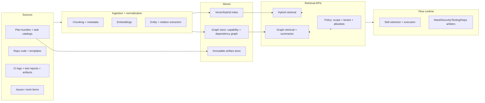

# Bootstrapping a Plan-Consuming, Self-Building, Self-Testing Platform for .NET + React or React Native

## Executive summary

A practical way to “start development” after you already have **generated plans** (and will generate more) is to implement a **small, stable kernel** that can (a) ingest plan artifacts, (b) compile them into an executable task graph, and (c) run those tasks with strong gates (security, testing, business dependencies). Once that kernel runs, you can iteratively expand by adding “factory families” via **skills** (versioned playbooks + codegen + tests), rather than hand-writing each family. This approach aligns with agent/tool patterns where an LLM requests function/tool calls, but your runtime owns execution, validation, and audit trails. citeturn2search2turn1search7turn1search10

To support self-building and self-testing at scale, you need a retrieval layer that can answer questions like “what is the canonical way to implement this factory?” and “what tests did we run last time we touched this interface?” A robust design uses **hybrid vector + keyword retrieval** for precise snippets and **GraphRAG** for global structure and dependency reasoning. citeturn1search0turn0search4turn0search0turn0search14

Finally, to satisfy your “retest everything we already used” requirement, carry a first-class **capability dependency graph** that links: *interface → methods → implementations → flows/tasks that use them → tests that validate them*. You can implement this yourself (graph store + manifests) and/or leverage existing mapping approaches such as Azure Pipelines Test Impact Analysis (TIA) which explicitly stores test-to-code mappings and supports incremental validation, with periodic full runs recommended to refresh mappings. citeturn0search1turn0search5turn0search9

Assumptions (explicit): examples assume GitHub-hosted repos and GitHub Actions for CI, but integrate equally with Azure DevOps Pipelines; examples assume local deployment uses Docker and/or ephemeral test containers; team size is 4–10 engineers; cloud provider is unspecified (design stays provider-agnostic). citeturn6search7turn6search2turn7search7turn7search3

## Kernel primitives you must implement by hand

The kernel is the minimum runtime that makes your first bootstrap flow executable and resumable. You can implement it on .NET regardless of whether you later run it “locally” or within a workflow/orchestration platform.

### Plan and registry substrate

At day zero the kernel needs a few durable registries (these can be Elasticsearch documents, a relational DB, or both—your format is less important than **versioning + immutability** of published artifacts):

- **Plan Bundle Registry**: immutable plan packages (task type catalog, factory families, flow templates, skills index pointers).
- **Skill Registry**: versioned skill manifests and template packages (codegen scaffolds, test baselines, prompts).
- **Capability Registry**: (interface, method surface, version) and mappings to implementations + usages.
- **Flow Definition Registry**: flow DAG definitions, active version pointers, schema, and migration history.

The system should compile plan input into a deterministic task DAG before executing anything (schema validation + policy checks up front), matching tool-calling patterns where models can propose actions but the system executes only vetted operations. citeturn2search2turn1search7turn7search1

### Durable orchestration and resumability

Because your bootstrap and family-implementation flows include waits, loops, approvals, and retries, you want durable orchestration capabilities (state persistence, replay, idempotency tokens, and timers).

Two common, production-grade approaches:

- A workflow engine like Temporal (durable workflows/activities with workers and task queues). citeturn2search1turn2search7turn2search9  
- Azure Durable Functions orchestrations (stateful orchestrator functions with patterns like “monitor”). citeturn2search0turn2search4turn2search14  

Either choice supports your “stepwise execution + event-driven waits + resumable runs” requirement; your “execution fabric” can be implemented as activities/steps. citeturn2search4turn2search7

### Execution fabric connections (repo + CI + task management)

Your kernel needs provider adapters for *at least one* concrete environment initially, and a portable interface so you can later switch providers without rewriting flows.

Minimum viable connections:

- **Repo connection** (create branches, commit, open PRs, comment with results): the GitHub REST API supports creating and managing pull requests and issues programmatically. citeturn2search3turn2search6turn2search10  
- **Task management** (optional day zero, but valuable for traceability): Azure DevOps Work Item Tracking has REST endpoints for creating/updating work items (with explicit scopes); Jira Cloud exposes REST APIs for issues. citeturn6search0turn6search4turn6search1turn6search18  
- **CI artifacts and reports**: GitHub Actions artifacts support persisting outputs across jobs and after workflows complete (build logs, test results, traces). citeturn6search7turn6search3turn6search20  

For security posture, do not bootstrap by embedding long-lived cloud keys; GitHub documents OpenID Connect for short-lived, federated identity access from workflows. citeturn6search2turn6search12turn6search6

## Skills as the unit of “factory family” implementation

Your “skills for each factory family” requirement becomes much easier if you define “skill” as a first-class artifact with:

- **A contract** (what it produces, what it needs, what it verifies),
- **A tool interface** (functions the kernel can call),
- **A retrieval profile** (RAG tags and sources needed),
- **A test pack** (contract tests + integration baseline),
- **A governance policy** (which arbiters and approvals must pass).

This corresponds closely to plugin/function-based agent design: Semantic Kernel describes plugins as functions that can be invoked via function calling loops (model requests -> system executes -> model continues). citeturn1search7turn1search10

### Skill manifest schema (recommended)

A practical minimum manifest (YAML/JSON) keeps plans stable and execution deterministic:

```yaml
skillId: SKILL.DB.FABRIC.POSTGRES
version: 1.0.0
family: DatabaseFabric
implements:
  interface: IDatabaseService
  methods:
    - QueryAsync
    - ExecuteAsync
    - HealthCheckAsync
requires:
  ragTags: ["#DNA", "#Fabric", "#Database", "#IDatabaseService"]
  tools:
    - repo.patch
    - dotnet.scaffold
    - dotnet.test
    - security.deps_audit
    - contract.verify
outputs:
  codePaths:
    - src/Fabrics/Database/Postgres/**
  testPaths:
    - test/Fabrics/Database.Postgres.Tests/**
gates:
  arbiters: ["need", "security", "testing", "business_deps"]
  approvals:
    - "codeowners:platform"
```

This manifest is what your planning engine compiles into concrete tasks.

### Code generation choices per stack

For the “factories side by side” plan, you typically want one codegen mechanism per ecosystem:

Backend (.NET):

- **dotnet new custom templates**: official .NET guidance documents creating templates by adding `.template.config/template.json` and packaging them for `dotnet new`. citeturn0search2turn0search10turn0search6  
- **OpenAPI generation**: ASP.NET Core has built-in OpenAPI generation via `Microsoft.AspNetCore.OpenApi`, and docs show enabling `AddOpenApi()` and `MapOpenApi()`. citeturn5search3turn5search7turn5search19  

Client (React / React Native):

- React’s official guidance now deprecates Create React App for new apps and recommends frameworks or build tools like Vite. citeturn0search3turn0search7  
- Vite documents dev server + production build flows (fast dev server, `vite build`). citeturn4search0turn4search8  
- For repo-scoped generators:
  - Nx local generators (workspace-native scaffolding). citeturn4search1turn4search12  
  - Plop as a “micro-generator” framework for consistent file generation. citeturn4search2  

Contract / client generation:

- OpenAPI Generator documents the `typescript-fetch` generator and its configuration options. citeturn4search3  
- NSwag’s project describes generating OpenAPI specs from ASP.NET and generating client code from those specs. citeturn5search2turn5search12  

### A concrete “skills by family” starter matrix

This table reflects what you said you need earliest (factories, RAG, task management, repo, local deploy, test).

| Family | Early skills you likely need first | “Done” outputs (minimum) | Validation pack |
|---|---|---|---|
| Execution/Repo | Branch creation, patch application, PR open/comment | PR with code changes + linked run | Repo policy gate + CI status checks citeturn2search3turn2search10turn1search2 |
| CI/Artifacts | Run build/test, publish artifacts, parse results | Machine-readable run record + artifacts | Artifact upload + retained logs citeturn6search7turn6search3 |
| Backend Fabrics | Implement interfaces (+ DI wiring), expose OpenAPI contracts | `src/Fabrics/**` + schema docs | Contract tests + integration tests citeturn5search3turn5search8turn7search3 |
| Client UI shell | Render flows/runs from config docs (React or RN) | UI pages + config-driven renderer | Unit tests + basic smoke tests citeturn0search7turn3search0 |
| RAG / GraphRAG | Index build, retrieval API, citation discipline | Retrieval endpoints + schema | Retrieval unit tests + eval set citeturn7search0turn0search4 |
| Security arbiter | Dependency vulnerability checks + code scanning | Reports attached to run | Fails if severity ≥ threshold citeturn9search0turn9search2turn9search3 |

## RAG and GraphRAG layer for skills, plans, and code

You described two needs that are often conflated:

- “RAG to fetch the right snippets fast for implementation”
- “GraphRAG to understand structure, dependency, and coverage across many artifacts”

A robust design uses both.

### Vector/hybrid retrieval for precise guidance

Hybrid retrieval is especially useful for engineering artifacts where keyword matches (“interface name”, “task type ID”) matter, but semantic similarity also matters (“how do we implement retry policy”). Azure AI Search documents hybrid search as a single query combining full-text and vector search and merging results (using Reciprocal Rank Fusion). citeturn1search0turn1search15

If you already standardize on Elasticsearch for registries, Elasticsearch documents kNN vector search for nearest-neighbor similarity retrieval; it also has hybrid-search approaches, though exact scoring methods depend on configuration. citeturn5search0turn5search4turn5search17

For agent-style retrieval, Azure AI Search also documents “agentic retrieval” as a multi-query pipeline where an LLM decomposes a complex question into smaller subqueries for better coverage—useful for “implement this factory family” prompts that need multiple sources. citeturn7search0turn7search10

### GraphRAG for dependency and coverage reasoning

Microsoft’s GraphRAG project is positioned as a structured approach to RAG, extracting a knowledge graph from unstructured text, building a community hierarchy, generating summaries, and using those structures during retrieval. citeturn0search4turn0search0turn0search14

Operationally, Microsoft’s GraphRAG docs describe it as a pipeline/transformation suite to extract structured data using LLMs, with a quickstart and explicit runtime requirements (Python 3.10–3.12). citeturn0search0turn0search17

If you want a graph-db-backed RAG package with first-party support, Neo4j provides “GraphRAG for Python” docs and also documents vector indexes for similarity search in the graph. citeturn8search1turn8search0turn8search5

### Recommended knowledge architecture



This architecture gives you a reliable answer to: “what is the canonical skill and code pattern for this family?” and “what do we have to retest if I change interface X?” citeturn0search4turn7search0turn1search0

### A basic RAG prompt contract you can standardize on

Below is a *recommended* “prompt contract.” It is aligned with official guidance that LLM behavior is prompt-driven and that function/tool calls should be described via schemas. citeturn7search1turn2search2

```text
SYSTEM:
You are an engineering copilot for a self-building platform.
You must only use the retrieved context provided in <CONTEXT>.
If the context is insufficient, respond with: "INSUFFICIENT_CONTEXT" and list exactly what is missing.

OUTPUT FORMAT (JSON):
{
  "answer": "...",
  "citations": [{"sourceId":"...", "why":"..."}],
  "actions": [{"tool":"...", "args": {...}}],
  "risks": [{"type":"...", "detail":"..."}]
}

DEVELOPER:
Goal: Implement the requested factory family using the skill manifest and templates.
Constraints:
- Do not introduce provider-specific coupling outside the fabric interface.
- Produce or update contract tests and integration tests.
- Include migration notes if the interface surface changes.

<CONTEXT>
...retrieved snippets with sourceIds...
</CONTEXT>
```

Key point: your runtime—not the model—enforces that “only cited context is used,” because your flow engine decides what context is attached and which tools the model may call. citeturn2search2turn1search7

## The basic flow you should seed and the family-implementation loop

You proposed seeding one bootstrap flow (`platform-bootstrap-v1`) and then letting everything become “data + flows.” That is a strong starting point if you add one additional ingredient: a standardized **family implementation loop** with arbiters that must pass before code merges.

### Seed flow: platform bootstrap

Your bootstrap flow needs to (a) ingest the plan bundle, (b) evaluate coverage gaps, (c) compile/publish core flows, (d) run smoke tests, and (e) set a sentinel. A durable orchestration system is a natural host because it supports “monitor/wait” patterns and resumability. citeturn2search0turn2search4turn2search1

### Family implementation flow: loop until arbiters pass

This flow is where “factories side by side” becomes real: you can run multiple family implementations in parallel (backend, client, infra), each with the same core gating contract.

```mermaid
flowchart TD
  A[Trigger: ImplementFactoryFamilyRequested] --> B[RAG retrieve: skill + patterns + prior changes]
  B --> C[Plan compile: tasks + file targets + tests to run]
  C --> D[Generate patch via executor model]
  D --> E[Build + unit tests]
  E --> F[Integration tests with ephemeral deps]
  F --> G[Arbiter: need coverage]
  G -->|fail| D
  G --> H[Arbiter: security]
  H -->|fail| D
  H --> I[Arbiter: testing quality]
  I -->|fail| D
  I --> J[Arbiter: business dependency checks]
  J -->|fail| D
  J --> K[Open PR + attach artifacts + trace]
  K --> L[Human approval gate (CODEOWNERS if required)]
  L --> M[Merge + publish updated capability graph]
```

This is consistent with function-calling agent design: the executor proposes and calls tools; arbiters run deterministic checks and decide pass/fail. citeturn2search2turn1search7turn1search4

### What each arbiter should actually do (concrete, automatable)

Need coverage arbiter (functional completeness):
- Verify the planned interface/methods are implemented and registered (capability registry updated).
- Verify contract tests exist for each public behavior and that OpenAPI/contracts are updated when applicable. citeturn5search3turn5search8

Security arbiter (fail closed):
- Code scanning: GitHub documents CodeQL-based code scanning producing code scanning alerts. citeturn9search0turn9search4  
- Secret scanning: GitHub documents secret scanning scanning git history for known secret types. citeturn9search1  
- Dependency vulnerability checks:
  - `npm audit` reports known vulnerabilities for Node deps. citeturn9search2turn9search5  
  - .NET supports listing known vulnerable packages via `dotnet package list` options and NuGet auditing concepts. citeturn9search3turn9search6  

Testing arbiter (fail if flaky signals are high):
- Require baseline unit tests + contract tests + integration tests.
- For web E2E, Playwright supports retries and trace capture on first retry (`on-first-retry`) to diagnose failures without tracing every passing run. citeturn3search2turn3search6turn3search10  
- For React Native, the official docs discuss testing approaches and note the default template ships with Jest; Detox provides E2E for RN apps. citeturn3search0turn3search1  
- For integration dependencies, Testcontainers supports throwaway containerized services for consistent integration tests across dev machines and CI. citeturn7search3turn7search7turn7search5  

Business dependency arbiter (ordering and coupling):
- Enforce that new/changed factories do not violate dependency direction (e.g., no direct provider coupling in core modules).
- Ensure flow templates that claim to use new capabilities are updated to match (flow registry + contract registry updates).

### The minimum set of prompts your flow needs

These prompts are templates; your system should parameterize them with “skill manifest,” “diff summary,” and retrieved context.

Executor prompt (per family):

```text
SYSTEM:
You implement a factory family strictly using the provided skill manifest and retrieved context.
You must propose tool calls, not direct execution. Prefer small patches.

DEVELOPER:
Implement: {familyName} for interface {interfaceName}.
Required methods: {methodList}.
Update: capability registry, tests, and docs.
Return JSON with tool calls.

CONTEXT:
{retrieved_skill_docs}
{retrieved_examples}
{repo_structure_map}
```

Need coverage arbiter prompt:

```text
SYSTEM:
You are a strict completeness judge. You only pass if every required method is implemented,
registered, and validated by tests.

INPUTS:
- skill manifest
- diff summary
- test results
- capability registry changes

OUTPUT:
PASS or FAIL + exact missing items.
```

Security arbiter prompt:

```text
SYSTEM:
You are a strict security gate.
Fail if any high/critical CodeQL alert, secret finding, or vulnerable dependency violates policy.

INPUTS:
- CodeQL summary
- secret scanning summary
- npm audit summary
- dotnet vulnerability summary

OUTPUT:
PASS or FAIL + remediation instructions.
```

Testing arbiter prompt:

```text
SYSTEM:
You are a test quality judge.
Fail if key suites are missing, coverage drops below threshold, or flaky pattern detected.
Prefer retry only when failure is likely transient and evidence exists (trace/logs).

INPUTS:
- unit/contract/integration/e2e results + artifacts

OUTPUT:
PASS or FAIL + recommended rerun set.
```

These can be implemented as “arbiter skills” so they are invoked consistently via tool/function calling. citeturn2search2turn1search7

## Retesting strategy when interfaces evolve

Your point about adding a Mongo connector after Elasticsearch (and then adding methods) is essentially “interface drift management.” There are two complementary mechanisms you should implement:

### Capability graph as the source of truth

Maintain a graph (in a graph DB or as graph-shaped documents) that models:

- **Interface node**: `IDatabaseService@vX`
- **Method nodes**: `QueryAsync@sigHash`, `ExecuteAsync@sigHash`
- **Implementation nodes**: `ElasticDatabaseService@vY`, `MongoDatabaseService@vZ`
- **Usage nodes**: flows/tasks/templates that require certain methods
- **Test nodes**: suites that validate each method and each implementation

Then define a deterministic “impact computation”:

- If method signature changes: all implementations are impacted
- If behavior contract changes: consumer contract tests and provider verification suites are impacted
- If only one implementation changes: retest its suite and any flows that depend on it

This “graph of record” is what your planning engine queries to decide the rerun set.

### Use or mirror Test Impact Analysis behavior

Azure Pipelines Test Impact Analysis explicitly performs incremental validation by selecting only tests relevant to a commit and stores mappings between test cases and source code; the VSTest task docs note that this mapping should be regenerated by running all tests regularly. citeturn0search1turn0search5turn0search9

Even if you are not using Azure Pipelines, this is an important principle: deterministic “impact selection” requires periodic full runs to refresh the mapping, or you will miss edges and regressions. citeturn0search5turn0search18

### Contract tests as the stability shield

Pact describes CDC as consumer tests that also generate a contract, which providers verify to ensure compatibility with consumer expectations; their docs emphasize starting from good unit tests for the client and producing a contract as a side-effect. citeturn5search1turn5search8turn5search5

For your platform, contract tests should exist at two levels:

- **Fabric interface contract tests**: “Any implementation of IDatabaseService must satisfy X behaviors.”
- **Service/API contracts**: OpenAPI-based compatibility and/or CDC for critical consumers.

## Concrete tasks list to make the flow real

Below is a “clear full task list” structured as execution epics. Each epic can be represented as tasks in your task catalog and executed by flows.

| Epic | Tasks the system must support | Output artifacts | Effort range (person-weeks) |
|---|---|---|---|
| Kernel runtime | Flow engine execution (DAG), step state, idempotency keys, event waits, audit log | Flow run records + step logs | 6–14 |
| Plan ingestion | Import plan bundles, schema validation, versioning, registry writes | Immutable plan bundle IDs | 2–6 |
| Skill packaging | Skill manifest, template artifact store, skill versioning | `skills/**` packages | 4–10 |
| RAG baseline | Chunking + metadata, vector/hybrid index, retrieval API, citation discipline | Retrieval endpoint + eval seeds | 6–16 |
| GraphRAG baseline | KG extraction pipeline, community summaries, graph store + query API | Graph store + graph retrieval API | 6–18 citeturn0search4turn0search17 |
| Repo integration | Branch/commit/PR, PR comments, artifact links, merge gating | PRs with evidence | 3–8 citeturn2search3turn2search17 |
| CI integration | Build/test triggers, artifact publish, result parsing | CI reports + artifacts | 3–8 citeturn6search7turn6search3 |
| Local deploy + ephemeral test env | Compose or Testcontainers-based environment spin up and teardown | Reproducible env scripts | 4–12 citeturn7search3turn7search7 |
| Arbiters | Need/security/testing/dependency arbiters with deterministic rules | Pass/fail decisions + remediation | 6–14 citeturn9search0turn9search2turn3search6 |
| Capability graph | Interface/impl/method registry + usage/test edges, impact computation | “what to retest” plan | 6–16 citeturn0search5turn0search1 |
| Governance | Branch protection, CODEOWNERS review requirements, environment approvals | Enforced gates | 2–6 citeturn1search2turn1search4turn1search9 |

Security note: governance tasks are non-optional when the system can execute code and open PRs; GitHub documents branch protection rules and CODEOWNERS-reviewed merges. citeturn1search2turn1search4turn1search6

## Recommended directory structure and where artifacts live

This structure supports (a) a stable kernel, (b) generated code, (c) versioned skills and templates, and (d) deterministic testing.

```text
repo-root/
  docs/
    plans/                      # exported plan bundles (immutable)
    architecture/               # design docs, decision records
  registry/
    capabilities/               # interface+method surface, impls, usages
    skills/                     # skill manifests + versions
    flows/                      # flow DSL documents (seed + generated)
  src/
    Kernel/                     # handwritten: flow runtime, registries, policy, audit
    Fabrics/                    # handwritten interfaces + thin adapters
      Database/
      Queue/
      Ai/
      Rag/
      Repo/
      Ci/
    Factories/                  # generated or semi-generated factory implementations
      Database/
      Queue/
      ...
    Platform/                   # composition root: DI wiring, hosting
  test/
    Kernel.Tests/
    Fabrics.ContractTests/      # interface contract tests (must pass for every impl)
    Fabrics.Implementations.*   # per-impl integration tests (Testcontainers)
  clients/
    web/                        # React (Vite) app + plop/nx generators
    mobile/                     # React Native app (Expo or bare) + Detox
  tools/
    generators/
      dotnet-templates/         # dotnet new templates (.template.config)
      plop/                     # plopfile + templates
      nx/                       # Nx generators (if using Nx)
    scripts/
      ci/
      local-dev/
  infra/
    docker-compose.yml
    k8s/                        # optional
```

Rationale:

- `.NET templates` live in `tools/generators/dotnet-templates` and are versioned as official dotnet template guidance expects. citeturn0search2turn0search10  
- React scaffolding uses Vite “golden path” (consistent dev/build), and generators can be Nx local generators or Plop depending on repo choice. citeturn4search0turn4search1turn4search2  
- Contract tests (Pact/OpenAPI or fabric-level contracts) stay in `test/` and are always runnable in CI and locally. citeturn5search8turn5search3turn7search3  

## How to “bring the skill” into each flow and each decision

To make skills usable by flows, you need a consistent execution protocol:

1. **Flow step requests a capability**, not a provider (“implement IDatabaseService”).  
2. The runtime **selects a skill version** (by family, interface, and policy constraints).  
3. The runtime retrieves the **skill’s RAG context pack** (docs, prior diffs, test baselines).  
4. The executor proposes tool calls; the kernel executes them via function calling style loops. citeturn2search2turn1search7turn1search10  
5. Arbiters run deterministic gates (security/testing/etc) and either approve or feed remediation back into the loop. citeturn9search0turn9search2turn3search6  
6. On success, update:
   - registry/capability graph,
   - flow templates that consume the capability,
   - “used-by” edges to enforce retesting on future drift.

This end-to-end loop is what converts “we have plans and skills” into “the system can implement the plans and validate itself continuously.”

Key integration points you explicitly asked for:

- **AI connections**: function/tool calling as the control plane for actions. citeturn2search2turn2search12  
- **GraphRAG + RAG**: GraphRAG for structure + summaries; hybrid retrieval for exact snippets. citeturn0search4turn1search0turn5search0  
- **Task management**: create/update work items and link runs/PRs (Azure DevOps or Jira). citeturn6search0turn6search1  
- **Repo connection**: PR creation + comments for evidence and approvals. citeturn2search3turn2search17  
- **Local deploy + test**: Testcontainers-based dependencies + E2E traces for failures. citeturn7search3turn3search6  

If you implement only one thing next, implement the **capability registry + family implementation loop** first; it’s the piece that makes “factories side by side” safe, testable, and repeatable, and it directly enforces your “retest what we already used” rule via explicit dependencies and/or TIA-style mapping. citeturn0search5turn0search1