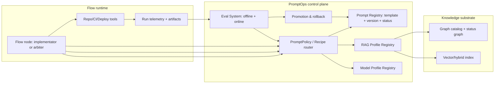

# PromptOps and Recipe Routing for a Self-Building, Self-Testing .NET + React Platform

## Executive summary

An operable “self-building, self-testing” system needs PromptOps that behaves like **DevOps**: prompts are **versioned artifacts**, selected by **policy** (per flow type, node type, task type, model provider, and model version), evaluated continuously with **regression tests**, and rolled out via **canary/rollback**. This is necessary because LLM behavior is probabilistic and can regress even when your surrounding code does not change; the most reliable countermeasure is an eval-driven lifecycle. citeturn1search0turn1search12

Two primary-source anchors strongly support this approach:

- entity["company","OpenAI","ai company"]’s guidance describes prompts as a **versioned behavioral profile** that you can swap for A/B tests by switching prompt IDs, enabling controlled rollouts without programmatically recreating assistants. citeturn1search1  
- entity["company","Microsoft","software company"]’s “prompt flow” tooling treats prompt variants and evaluation flows as first-class and is explicitly positioned for prototyping → experimenting → iterating → deploying and monitoring AI flows, with dedicated evaluation flows and metrics. citeturn0search7turn0search3turn0search20  

The architecture that fits your platform constraints (“kernel + registries + graphs + implementator + arbiters”) is an **ExecutionRecipe control plane**: each flow node resolves an ExecutionRecipe that pins (a) the prompt version, (b) retrieval profile (Graph/Vector/Hybrid/GraphRAG search modes), (c) model profile + model version, and (d) judge rubric. Then every run writes back judgments and telemetry so the system can propose improved prompt versions—without silent mutation—followed by eval gating and canary promotion.

## Requirements and boundary conditions for prompt lifecycle management

A prompt system that routes by “model + version” must handle provider-specific instruction mechanics and keep output parseability stable.

One important recent behavior change: OpenAI’s reasoning models support **developer messages** as the primary application instruction channel (framed as “developer messages are the new system messages”), and recommend keeping prompts simple/direct, avoiding chain-of-thought elicitation, and using delimiters for structure. This means prompt templates cannot be “one-size-fits-all”; your prompt compiler must adapt message roles and formatting per model family/version. citeturn3search11turn3search23

Your implementator/arbiter loop also benefits from **schema-locked outputs**. OpenAI’s Structured Outputs feature is designed to ensure responses conform to a supplied JSON Schema, reducing failure modes where models omit keys or produce invalid enums—crucial for patches, verdicts, and run manifests. citeturn1search2turn1search10

Finally, prompt improvement must include security guardrails. OpenAI’s security guidance explicitly calls out prompt injection risks for write actions and recommends mitigations like server-side validation, careful tool descriptions, and requiring human confirmation for irreversible operations. That has direct implications for which prompt versions are permitted to call repo-write tools or deployment tools. citeturn3search4turn3search0

Assumptions for this report: you control a central registry for prompt artifacts and policies; you can run offline evals in CI; and you can gate promotions using your existing governance controls (PR reviews, deployment approvals). citeturn1search1turn3search12turn3search30

## PromptOps control plane architecture

### Core idea: ExecutionRecipe as the single resolved “runtime contract”

You want a single object that a flow node can resolve deterministically:

- **Prompt version** (or prompt ID, if using a provider’s native prompt objects)
- **Retrieval profile** (Graph-first then Vector, GraphRAG Global vs Local, token budgets, filters)
- **Model profile** (provider, model name, model version, temperature/top_p, tool permission set)
- **Judge rubric** (which arbiters, scoring rubric versions, thresholds)
- **Telemetry contract** (what must be logged so evals can be rerun)

This aligns with OpenAI documentation that encourages separating *prompt content* (as a managed asset) from *runtime API calls*, and supports swapping prompt IDs for A/B tests during rollout. citeturn1search1turn3search26

It also mirrors how GraphRAG initializes prompt sets and then offers prompt tuning workflows—treating prompts as **workspace-managed assets** rather than hardcoded strings. citeturn0search2turn0search6turn0search10

### Control-plane components

A minimal, production-ready PromptOps plane typically contains:

- **Prompt Registry**: stores PromptTemplates and PromptVersions, status (candidate/canary/active/deprecated), and metadata (compatible model families/versions, required tool permissions). The OpenAI platform also supports converting assistants into “prompt objects” and treating prompts as versioned profiles, which can be stored by ID and referenced stably in code. citeturn1search1turn0search5  
- **Routing Policy (PromptPolicy)**: selects which execution recipe is allowed for a given `(flowType, nodeType, taskType, tenant/budget tier, modelVersion)` tuple.
- **Evaluation System**: offline evals + production monitoring. OpenAI provides eval design guidance and an Evals API; Azure prompt flow provides evaluation flows and metrics. citeturn1search0turn1search12turn0search3turn0search22  
- **Promotion/rollback gates**: canary, cohort rollout, explicit rollback. GitHub and Azure DevOps both provide approval/check mechanisms that can be used as promotion gates for prompt changes, just like deployments. citeturn3search12turn3search6turn3search3turn3search7  

### Reference architecture diagram

This design enforces two invariants: (1) routing is deterministic and auditable, and (2) prompt “improvements” happen only via controlled version creation + evaluation + promotion, consistent with eval-driven best practices. citeturn1search0turn1search12turn0search21

## Routing prompts by flow type, node type, model family, and model version

### Why routing must be explicit, not implicit

Models differ in instruction-following behavior and message role conventions. OpenAI explicitly notes a behavior shift in newer model families (e.g., instruction adherence changes across generations) and provides model-specific prompting guides; this implies you should anticipate prompt migration work when changing models and keep routing metadata tied to model versions. citeturn0search12turn0search19turn3search11

### A deterministic hierarchical resolution strategy

A practical resolution strategy is a hierarchical key lookup:

1. Tenant override for `(flowType, nodeType, taskType, budgetTier, modelVersion)`
2. Tenant override fallback for `(nodeType, taskType, budgetTier, modelFamily)`
3. System baseline for `(flowType, nodeType, taskType, budgetTier)`
4. System baseline for `(nodeType, taskType)`
5. Safe default recipe (lowest privilege tools, strict JSON schema output)

This approach is compatible with OpenAI’s chain-of-command framing (higher-authority instructions override lower), because it cleanly separates who can override what: system baseline vs tenant override vs per-run parameters. citeturn3search23turn3search26

### Output stability: schema-lock everything that touches automation

Whenever a model output will drive automation (file patches, test selection, deployment decisions), require strict structured outputs:

- PatchPlan schema for implementators
- Judgment schema for arbiters
- Recipe resolution schema for routing audits

Structured Outputs is designed specifically to enforce JSON Schema adherence and reduce “invalid output shape” failures. citeturn1search2turn1search17

### Cost and latency controls: prompt caching and stable prefixes

For a system with long “DNA + policy + context pack” headers, prompt-level cost can dominate. OpenAI documents prompt caching as a way to reduce latency and cost for long prompts; architecturally, this rewards designs where the stable, high-token prefix (guardrails, contracts, schemas) changes rarely, and only the variable suffix (context pack + task payload) changes frequently. citeturn0search17

## Evaluation-driven prompt improvement and model/version compatibility

### Make evals the “unit test suite” for prompts and recipes

OpenAI’s evaluation best practices guide motivates evals as a way to test AI systems despite output variability and frames eval design as core to production readiness. citeturn1search0turn1search12

Two cookbook examples show practical patterns you can adapt directly:

- Detecting prompt regressions (a direct match to your “prompt version changed, did behavior regress?” requirement). citeturn1search4  
- Evaluating structured outputs (fit for PatchPlan/Judgment JSON enforcement). citeturn1search13turn1search2  

On the Microsoft side, prompt flow documents evaluation flows and metrics as a first-class artifact and provides an end-to-end DevOps pattern where experimentation flows and evaluation flows run in CI and are registered as ML artifacts. citeturn0search3turn0search22

### Treat prompt iteration as a governed pipeline

A robust improvement loop looks like:

1. **Collect evidence**: store run telemetry and artifacts. OpenAI’s Responses API migration guidance indicates responses can be stored by default and storage can be controlled, which supports building datasets from production traces. citeturn0search1turn1search12  
2. **Generate candidate prompt patch**: OpenAI documents prompt generation via meta-prompts and schemas; GraphRAG provides auto prompt tuning; prompt flow supports variants and auto-generated variants. citeturn0search21turn0search6turn0search20turn0search15  
3. **Offline eval gate**: run eval suites per recipe, per model version, per budget tier. citeturn1search0turn1search12  
4. **Canary**: route a small cohort or selected internal flows to the candidate recipe; compare metrics and rollback automatically if regressions exceed thresholds. OpenAI’s “swap prompt IDs for A/B tests” guidance supports precisely this operational model. citeturn1search1  
5. **Promote**: mark prompt version active for defined scopes; deprecate older versions; retain provenance (why promoted). citeturn1search1turn1search0  

### Canary and governance mechanisms you can reuse from DevOps

You can reuse the same gates you already need for code and deployments:

- GitHub environments provide deployment protection rules (manual approvals, branch restrictions, custom protection rules) and expose deployment history and review flows—these can be repurposed as “prompt promotion environments” (e.g., `prompt-canary`, `prompt-prod`). citeturn3search12turn3search18turn3search2  
- Azure DevOps environments support approvals and checks, with REST APIs to query/update approvals—useful for automation pipelines that require human sign-off for high-risk prompt versions (e.g., enabling write tools). citeturn3search3turn3search22  

### Tooling options comparison for PromptOps

| Tooling approach | Strengths for per-model/per-version prompt governance | Weaknesses / cautions | Strong primary sources |
|---|---|---|---|
| OpenAI prompt objects + Evals API | Prompts as versioned profiles; swap prompt IDs for A/B; structured outputs; guidance on eval design and regression use cases | Multi-provider routing still requires your own abstraction; must still build your own policy store and graphs | citeturn1search1turn1search12turn1search4turn1search2 |
| Azure prompt flow (Foundry/AML) | Variants allow different prompt content or connection settings (model differences); evaluation flows + metrics; documented GenAIOps CI patterns | Tighter coupling to Azure ecosystem; may not align with your “runtime flow engine in ES” unless you treat it as an external eval runner | citeturn0search20turn0search3turn0search22turn0search11 |
| LangChain LangSmith (vendor tool) | Offline evaluation with datasets; evaluation concepts and types (incl. pairwise comparisons); UI-based evaluation runs | Not a “primary” platform vendor for your runtime; integration costs and data governance considerations | citeturn2search0turn2search4turn2search8 |
| Promptfoo (OSS) | CI-friendly evals/red teaming; regression strategies; broad model/provider support | Needs careful governance to avoid “eval sprawl”; still requires your policy graph and statuses | citeturn2search13turn2search5turn2search21 |
| TruLens (OSS) | Feedback functions for evaluation on app runs; tracing/evals framing | Requires integration work; evaluation quality depends on well-designed feedback functions | citeturn2search2turn2search14turn2search6 |

This table is intentionally not “pick one”; the common high-signal pattern is: keep your **authoritative prompt registry + policy graph** in your platform, then optionally plug one or more external systems as eval runners or dashboards.

## Graph integration for prompts, models, and implementation status

You already designed a Catalog Graph + Status/References overlays for code and tests. PromptOps should become part of the same graph so implementators and arbiters can resolve prompts deterministically and update “what passed/failed” without ambiguity.

### Graph additions: PromptTemplate, PromptVersion, ExecutionRecipe, EvalSuite

GraphRAG treats prompts as workspace assets and supports prompt tuning workflows after initialization. That’s a strong cue to store prompts as structured artifacts with explicit versions and metadata, rather than embedding them inside code. citeturn0search2turn0search6turn0search10

A minimal graph schema overlay:

- `PromptTemplate` node: stable identity (what the prompt is for), with placeholders (e.g., `{ContextPack}`, `{TargetFactory}`).
- `PromptVersion` node: content + status (candidate/canary/active/deprecated) + compatibility fields (model family/version constraints).
- `ModelProfileVersion` node: model name, version, tool permissions, token/latency budgets.
- `RagProfileVersion` node: retrieval mode (Graph/Vector/Hybrid/GraphRAG), filters, token budget.
- `ExecutionRecipe` node: a resolved combination: `(PromptVersion, ModelProfileVersion, RagProfileVersion, JudgeRubricVersion)`.
- `EvalSuite` node: dataset + metrics + thresholds for a recipe scope.

This enables queries you explicitly need:

- “ResolveRecipe(flowType, nodeType, taskType, budgetTier, modelVersion, tenantId)”
- “Show me all active prompt versions for this node type and their eval scores by model version”
- “What prompt versions are compatible with this model upgrade?”

### Run telemetry is what makes prompts improvable

The model spec’s chain-of-command framing and OpenAI’s eval guidance both imply that testability and steerability require **explicit logging**: which instructions were applied, which model was used, and what the outcome was. citeturn3search23turn1search0

Minimum telemetry fields per node run:

- `executionRecipeId`
- `promptVersionId`
- `modelProfileVersionId`
- `ragProfileVersionId`
- `graphContextRefs` (node IDs used for retrieval filters)
- `toolCalls` (repo writes, CI runs, deploy actions)
- `judgments` (arbiter verdicts + reasons)
- `artifacts` (diff, logs, test reports, traces)

This telemetry becomes the raw material for building eval datasets and detecting regressions like those shown in OpenAI’s regression cookbook example. citeturn1search4turn1search12

### Security: prompt injection defenses must be part of the recipe

Because write tools are your highest-risk capability, align tool permissions to recipes:

- Candidate prompts get read-only tooling unless explicitly approved.
- Canary prompts get a constrained write surface (limited paths, no deploy).
- Production prompts for write tools require higher governance gates.

This maps directly to OpenAI’s prompt-injection guidance for write actions and the recommendation to require confirmation for irreversible operations. citeturn3search4turn3search0

## Phased implementation roadmap with effort ranges and key risks

### Roadmap

Phase one should focus on making prompt changes safe and measurable before making them autonomous.

| Phase | Milestones | Effort range (person-weeks) |
|---|---|---|
| Baseline prompt registry | Define PromptTemplate/PromptVersion/ExecutionRecipe schemas; store prompt assets; log recipe IDs in run telemetry | 3–8 |
| Deterministic routing | Implement PromptPolicy resolver (hierarchical lookup); model-version compatibility rules; safe defaults | 4–10 |
| Eval suites and CI gating | Build offline eval datasets; integrate OpenAI Evals API and/or prompt flow evaluation flows; block promotion on regressions | 6–14 citeturn1search12turn0search3turn1search4 |
| Canary + rollback | Add cohort routing; implement should-auto-rollback thresholds; integrate governance gates (approvals) | 4–12 citeturn1search1turn3search12turn3search3 |
| Auto-suggest prompt patches | Add “prompt patch generator” step using meta-prompts/variants; keep human approval for promotion | 6–16 citeturn0search21turn0search20turn0search6 |
| Continuous hardening | Prompt caching design; injection red-team suites; long-term drift monitoring | ongoing (2–6 per quarter) citeturn0search17turn3search4turn1search0 |

### Risks and mitigations

Prompt regressions due to model upgrades are likely; OpenAI explicitly discusses that newer models may require prompt migration and that instruction following behavior can change, which is why model-version-specific compatibility metadata and eval gating are essential. citeturn0search12turn1search0

Prompt injection is a structural risk whenever you enable write actions; mitigations must include server-side validation and gating irreversible actions behind human confirmation and policy controls. citeturn3search4turn3search0

Operational cost creep is common when prompt headers grow; prompt caching guidance can help reduce cost/latency, but it works best when you keep stable prompt prefixes stable and avoid unnecessary churn in long system/developer blocks. citeturn0search17turn3search11

Governance friction can stall iteration if approvals are too heavyweight; the practical approach is to use lightweight canaries for low-risk prompt changes and reserve manual approvals for recipes that enable write tools or production-impacting actions, leveraging existing deployment/environments gates. citeturn3search12turn3search18turn3search3