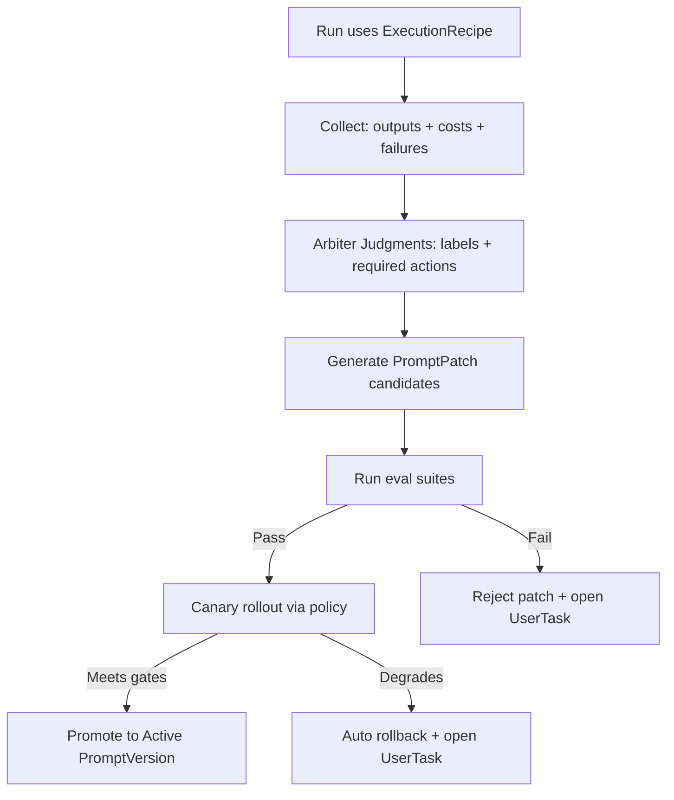

# A Self-Documenting, Visual, Iterative “Installer → Self-Build → Self-Test” Start for a .NET + React or React Native Platform

## Executive summary

A self-building, self-testing system that can **consume generated plans** and implement factories “side-by-side” needs one additional ingredient beyond the kernel/flow ideas you already have: **every step must be operationally legible** (documented, reproducible, and visually reportable), and **user iteration must be a first-class gate**.

The most reliable pattern is to start with a small hand-written **kernel** and a single “installer” flow, but require that:

- Every flow node produces **immutable evidence** (logs, diffs, test reports) and a short human-readable explanation of what happened.
- Every flow node updates a **status graph** (implemented/untested/broken/etc.) AND includes **references** to the exact code/tests/prompts paths to edit next.
- User iteration is implemented as **explicit approval tasks** that are visible both in CI and in the product UI.
- Local deployment/testing is **one-command** using a known stack (Docker Compose) and deterministic integration tests (Testcontainers).

This can be achieved with a dual reporting surface:
- CI-native reporting (job summaries + artifacts + environment approvals) using entity["company","GitHub","code hosting platform"] features like **job summaries**, **workflow artifacts**, and **deployment environments**. GitHub job summaries are custom Markdown rendered on run summaries and support GitHub-flavored Markdown; they’re designed to show critical run results without digging into logs. citeturn8view0turn0search4 Workflow artifacts persist build/test outputs across jobs and after the run. citeturn0search5turn0search9 Deployment environments can enforce protection rules (manual approvals, branch restrictions, custom gates) before jobs proceed. citeturn9view2turn9view1  
- Product-native reporting (a Run Monitor view) backed by your own RunSnapshot/NodeSnapshot records (a materialized DAG view).

The remainder of this report lays out the strict operational contracts (docs/evidence/status), the “installer → implement-family” flows, the GraphRAG bootstrap for connected families/interfaces, PromptOps with per-model/per-version routing, and a phased roadmap with effort ranges and risks.

## Assumptions and target outcomes

Assumptions (since hosting/cloud/team constraints are unspecified):

- Primary CI: GitHub Actions (chosen because it natively supports environment-gated approvals, job summaries, and artifacts). citeturn9view2turn8view0turn0search5  
- Local dev: containerized stack via entity["company","Docker","container platform company"] Compose to keep onboarding trivial and reproducible. Compose defines multi-service apps and supports services/networks/volumes; volumes are the neutral mechanism for persistent data. citeturn1search6turn1search2turn1search10turn1search17  
- Backend language/runtime: .NET (already given). For fast local iteration, `dotnet watch` is used; it detects file changes and reruns or hot-reloads. citeturn2search0turn2search4  
- Web client: React (already given). React team docs recommend starting new apps with a build tool like Vite/Parcel/Rsbuild and have sunset Create React App for new apps. citeturn2search1turn2search2  
- Mobile client option: React Native (already given). Official RN docs note the default template ships with Jest and includes a preset. citeturn3search0 For RN bootstrapping, RN docs describe Expo as “production-grade” and Expo docs show `npx expo start` as the dev server entrypoint. citeturn3search1turn3search2  

Non-negotiable outcomes:

- “Plan → implementation” must be deterministic: machine-readable registries + dependency graph, not just LLM semantic recall.
- Each step is **well documented**, produces **visual progress**, can pause for **user iteration**, and is **easy to deploy and test** (local and CI).
- Prompt and model changes are treated like code changes: versioned, evaluated, canaried, and roll-backable.

## Operational contracts for documentation, evidence, and visual progress

### Step documentation as a first-class artifact

To guarantee “each step is well documented,” define a **StepDoc** record that is required for every executable node type (Installer nodes, Implementor nodes, Arbiter nodes). This is not “nice-to-have documentation”; it is the system’s stable contract for human trust and AI safety.

Minimum StepDoc fields (recommended):

- Purpose and acceptance criteria (what “done” means).
- Inputs/outputs schemas (including example payloads).
- Dependencies: factories used, RAG profile, execution recipe, test suites.
- Reproduction commands (local + CI).
- Security constraints (forbidden operations; required approvals).

Why schema matters: if you want the “system to run itself,” you need machine-checkable outputs. entity["company","OpenAI","ai research company"] Structured Outputs supports constraining model responses to a JSON Schema (`response_format` with `type: json_schema` and `strict: true`) and encourages treating the returned JSON as guaranteed-to-match the schema for type-safe parsing, which is exactly what automation needs. citeturn13view0turn13view1  

### EvidenceBundle as immutable run output

To satisfy “progress is reported visually” and “easy to debug,” every node writes an EvidenceBundle that includes:

- machine outputs (PatchPlan, Judgments, GraphUpdates, RegistryUpdates)
- human outputs (Markdown explanation)
- raw artifacts (logs, diffs, test reports, container logs)

You can implement EvidenceBundle with two persistence surfaces:

- CI artifacts: GitHub workflow artifacts persist data after a job completes and share between jobs. citeturn0search5turn0search9  
- CI artifact immutability: the official `actions/upload-artifact` action documents that artifacts are uploaded into an immutable archive; they can’t be altered by subsequent jobs unless deleted and recreated. citeturn11view1turn11view0  

That immutability is a strong property for “self-building systems”: it prevents silent corruption of run evidence.

### Visual progress surfaces

A practical reporting stack uses multiple complementary surfaces:

| Surface | What it shows | Why it matters | How to implement |
|---|---|---|---|
| Job summary (CI) | A DAG progress table + links + failures | Immediate visibility without needing the product UI | GitHub job summaries use `GITHUB_STEP_SUMMARY` and render GitHub-flavored Markdown on workflow summary pages. citeturn8view0turn0search4 |
| Artifacts (CI) | EvidenceBundle downloads (logs, reports, diffs) | Auditable, reproducible debugging | Workflow artifacts + immutable upload semantics. citeturn0search5turn11view1 |
| Environment gating (CI) | “Waiting for approval” checkpoints | Enables user iteration safely | GitHub environment protection rules can require manual approval, delays, branch restrictions, or custom third-party gates. citeturn9view2turn9view1 |
| Run Monitor (Product UI) | Node statuses, blocked-by, evidence links | Product-native operational control | Backed by your RunSnapshot/NodeSnapshot model (recommended design) |
| Check Runs (optional) | PR annotations, rich check UI | Higher-quality PR feedback | GitHub check runs can be created via API, but creation requires a GitHub App. citeturn1search1turn1search5 |

Two important operational details for job summaries that impact design:

- Job summaries are grouped per job at the end, support GitHub-flavored Markdown, and are meant to surface failures without reading logs. citeturn8view0  
- After a step completes, the summary content is uploaded and subsequent steps cannot modify previously uploaded Markdown; summaries also automatically mask secrets and have a 1MiB per-step limit. citeturn8view0  

Practically, this means: write a “node progress snippet” per step; don’t try to rewrite history.

## Installer-first: translating plans into registries, a connectivity graph, and runnable flows

The system cannot “implement the plan” until the plan is translated into **machine-readable runtime artifacts**. This is your installer.

### Installer flow goal

The installer must establish, in order:

- registries: factories, tasks, flow templates, skills, prompts, implementation status
- connectivity graph: connected families ↔ factories ↔ methods ↔ tasks ↔ skills ↔ templates
- RAG substrate: vector index + GraphRAG summarization
- workspaces: repo skeleton + local sandbox stack
- reporting: run monitor + evidence publishing

### GraphRAG bootstrap pattern for connected interfaces and families

To ensure deterministic retrieval (“connected interfaces and families”), use entity["company","Microsoft","technology company"] GraphRAG’s Bring Your Own Graph (BYOG) approach:

- BYOG expects at least `entities.parquet` and `relationships.parquet` (and optionally `text_units.parquet` depending on query method). citeturn6view0  
- For entities, GraphRAG indicates you minimally need `id`, `title`, `description`, and `text_unit_ids` for summarization. citeturn6view0  
- For relationships, GraphRAG highlights needing `id`, `source`, `target`, `description`, `weight`, and `text_unit_ids`, and explicitly notes that the `weight` field matters for computing Leiden communities. citeturn6view0  
- You can configure GraphRAG to run only required workflows; for basic summarization and global search, GraphRAG recommends the workflows list `[create_communities, create_community_reports]`. citeturn6view1  
- If you need local or DRIFT search, you add text embeddings generation workflows and include text units. citeturn6view1turn6view0  

GraphRAG setup primitives also matter for your “prompt improvement” workflows:

- `graphrag init` creates `.env`, `settings.yaml`, and a `prompts/` directory containing default prompts; it specifically notes you can modify prompts or run auto prompt tuning to generate prompts adapted to your data. citeturn6view4  
- Auto tuning requires the workspace to have been initialized with `graphrag init`. citeturn5search3turn6view4  
- GraphRAG documents output table schemas and notes outputs are written as Parquet by default; its schema includes community report fields and even retains a “full JSON output” column intended to enable prompt tuning to add fields. citeturn5search1turn6view2  
- GraphRAG local search combines structured graph data with unstructured input documents for entity-based reasoning. citeturn5search2turn6view3  

This maps cleanly onto your platform’s needs: BYOG secures deterministic plan connectivity; GraphRAG summarization + local search adds “semantic recall” and text evidence.

### Mermaid diagram: installer execution with evidence and user gates

```mermaid
flowchart TD
  A[PlanBundle Submitted] --> B[Parse & Validate: plan → registries]
  B --> C[BYOG Export: entities.parquet + relationships.parquet (+optional text_units)]
  C --> D[GraphRAG Index: create_communities + create_community_reports]
  D --> E[Seed Prompt Library + Recipes]
  E --> F[Repo Discovery Scan: locate existing code/tests/prompts]
  F --> G[Provision Local Sandbox: docker compose up]
  G --> H[Smoke Build/Test: backend + client + minimal e2e]
  H --> I{Approve to enable self-build?}
  I -->|No| J[Stop + report + open user tasks]
  I -->|Yes| K[Publish Bootstrapped Sentinel + enable Implement-Family flows]
```

The GraphRAG steps are grounded in BYOG and workflow configuration docs. citeturn6view0turn6view1turn6view4 The deploy/test steps are grounded in Docker Compose service/volume modeling. citeturn1search2turn1search10 The “approve gate” is directly supportable using GitHub environment protection rules for manual approval or custom gating. citeturn9view2  

## Status + references: ensuring implemented code and tests are reachable and easy to modify

You explicitly require: “if some already implemented, we need their code and tests to be effectively reachable.”

This is solved by treating reachability as data:

- an Implementation Registry is the source of truth for status + references
- the graph mirrors it for traversal and impact analysis

### What “reachability” must store

At a minimum:

- repository identity (which repo)
- branch/commit (what revision)
- paths to code files implementing a method
- paths to tests covering it
- links to run evidence (CI artifact URLs; run IDs)

You can make CI evidence linkable because `actions/upload-artifact` emits outputs like artifact URLs and IDs, and artifacts exist on the workflow summary page. citeturn11view2turn11view0  

### Discovery scan: baseline reality map

During install, run a discovery scan:

- find implementations and tests via known directory conventions
- map them to factories/methods using signature hashing or explicit registration
- set status: PLANNED / SCAFFOLDED / IMPLEMENTED / TESTED / INTEGRATED / BROKEN
- emit evidence: what was found, what failed on compile/test, where the files are

This is the step that makes the system “edit existing code with ease,” because the implementor never guesses locations; it reads the graph registry refs first.

## PromptOps with per-model, per-version routing, plus user-visible improvement loops

You asked for an “effective way to improve prompts and connect them per model, type, flow type, AI model and version,” and that improvements must be documented, visual, and easy to deploy/test.

### Routing prompts safely: per-node ExecutionRecipe

Define an ExecutionRecipe that resolves:

- PromptVersion (prompt_id + version)
- Model profile (provider/model/version)
- Retrieval profile (Graph/Vector/Hybrid; budgets; filtering)
- Output schemas (PatchPlan, Judgment schemas)
- Tool permissions and safety gates

Two key entity["company","OpenAI","ai research company"] principles support this design:

- Function calling / tool calling: connect models to actions your app provides, defined by JSON Schema. citeturn4search0turn10view3  
- Reasoning model prompting: OpenAI recommends keeping prompts simple/direct, avoiding chain-of-thought prompting, and using delimiters; it also notes that for reasoning models, developer messages are the new system messages starting with certain model versions. citeturn15view0  

This implies a practical executor split:

- reasoning-capable models do planning/arbiter judging (high reliability)
- cheaper/faster models do execution (code edits, scaffolding) where it’s appropriate

### Prompt improvement must be eval-gated and canaried

OpenAI’s eval guidance states evals are structured tests for measuring model performance and help ensure accuracy/reliability despite nondeterminism. citeturn13view2turn0search10 This directly supports your requirement that prompt changes must be validated before promotion.

A strong improvement loop:

1. Observe: collect failures with labels + evidence
2. Propose: generate prompt patch candidates
3. Evaluate: run eval suites (offline / CI)
4. Canary: route a cohort to candidate prompt versions
5. Promote or rollback based on gates

GitHub can enforce this via environment protection rules and reviewers: required reviewers, wait timers, branch restrictions, and custom protection rules are all supported in GitHub deployment environments. citeturn9view2turn9view1  

### Mermaid diagram: prompt improvement lifecycle



### Performance and cost: prompt caching as a first-class consideration

Prompt systems for self-building platforms tend to have large stable prefixes (guardrails, schemas, DNA rules). OpenAI’s prompt caching guide explains cache hits require exact prefix matches; to improve cache hits you should put static/repeated content at the beginning and variable content at the end. citeturn14view0turn14view2 It also documents large potential reductions in latency and input token costs and that caching works automatically for prompts above a token threshold. citeturn14view1  

This argues for prompt structure like:

- stable “policy + schema + file contract” prefix
- appended context pack + file diffs + run-specific content

That structure supports both caching and auditability.

## Deployment, testing, and iteration: making it easy to run locally and safe to iterate

### Local dev is one command: Compose + hot reload + deterministic integration tests

To make the system “easy to deploy and test,” you want a single developer command that brings up:

- infra stack (db/queue/search/graph) with Compose
- backend with `dotnet watch`
- client with Vite dev server (web) or Expo dev server (mobile)

Why Compose is a good default:

- Compose file reference is intended to configure services/networks/volumes; `services` can include build sections. citeturn1search6turn1search2  
- Volumes are the reusable mechanism for persistent data across services. citeturn1search10turn1search17  

Why `dotnet watch` matters:

- It detects changes and reruns commands; when paired with `dotnet run`, it can hot reload or restart. citeturn2search0turn2search4  

Web client setup:

- React docs explicitly recommend installing a build tool like Vite/Parcel/Rsbuild, and the React team sunset Create React App for new apps while pointing developers at these tools. citeturn2search1turn2search2  
- Vite docs support `vite` dev server and `vite build` for production bundles. citeturn2search3turn2search6  

React Native path:

- RN docs describe Expo as production-grade and Expo docs show `npx expo start` for a dev server. citeturn3search1turn3search2  
- For RN testing, the official RN testing overview notes the default template ships with Jest and a tailored preset. citeturn3search0  
- For E2E on RN, Detox is explicitly an end-to-end framework for RN apps and is designed to test on device/simulator; its docs provide setup steps. citeturn3search7turn3search3  

### Integration testing for backend: Testcontainers as a strong baseline

Self-building systems must frequently validate real integrations. Testcontainers is an established approach to run real services in Docker for tests:

- The Testcontainers .NET getting started guide explicitly states teammates can clone the project and run tests without installing Postgres; tests are similar to unit tests run from IDE. citeturn1search3  
- Testcontainers for .NET describes itself as a library supporting tests with throwaway Docker container instances. citeturn1search7  

This integrates well with your regression requirement (“if we add a new connector/method, retest impacted providers”), because the impacted test sets can run deterministically against real ephemeral dependencies.

### User iteration gates: CI approvals + in-product tasks

For “may require user iteration,” you want two mechanisms that reinforce each other:

- CI-side approvals: GitHub deployment environments can require “required reviewers” and enforce that jobs can’t proceed until approval. citeturn9view2turn9view1  
- Product-side approvals: your UserTask concept (recommended design) that blocks specific nodes and is visible in the Run Monitor DAG.

A key benefit of CI approvals: environment protection rules can also integrate third-party control systems via custom deployment protection rules powered by GitHub Apps. citeturn9view2turn1search8 This can be used to gate “self-building merges” on external signals like security scanners or observability SLO queries.

## Phased implementation roadmap and risks

### Roadmap with milestones and effort ranges

Effort ranges are intentionally broad (unknown constraints). A “person-week” assumes one engineer working full time.

| Phase | Milestone | What users can see (visual progress) | Effort range |
|---|---|---|---|
| Kernel + Installer MVP | PlanBundle → registries; Graph seed; local stack | CI job summary + artifact evidence | 4–10 person-weeks |
| Status + References | Discovery scan → code/test refs; status overlay | “Implemented vs planned” dashboard | 4–12 person-weeks |
| Implement-Family MVP | Multi-model implementor loop + basic arbiters + smoke | DAG view + per-node evidence | 8–20 person-weeks |
| PromptOps MVP | ExecutionRecipe routing + eval suites + canary | Prompt dashboard + before/after eval diffs | 8–18 person-weeks |
| Mobile pipeline (if RN) | Detox/e2e harness + device CI lane | Mobile e2e report links | 6–16 person-weeks |
| Continuous improvement | Expand arbiters; enrich graph; regression automation | Trend charts + auto rollback + user tasks | ongoing |

### Key risks and mitigations

- Prompt injection / unsafe write actions: OpenAI explicitly recommends mitigating prompt injection and write-action risk by server-side validation and requiring human confirmation for irreversible operations. citeturn4search3  
- Silent regressions from prompt changes: OpenAI states evals are one of the primary tools to ensure reliability in nondeterministic AI systems. citeturn13view2  
- Loss of trust due to opaque runs: GitHub job summaries are designed to show critical outcomes like failures without scanning logs. citeturn8view0 Artifact immutability reduces risk of evidence tampering and accidental corruption. citeturn11view1turn11view0  
- Graph drift / incomplete connectivity: GraphRAG BYOG requires explicit entities/relationships and stresses the importance of relationship weight for community detection. citeturn6view0 This motivates making plan translation deterministic and schema-validated before calling any model.

