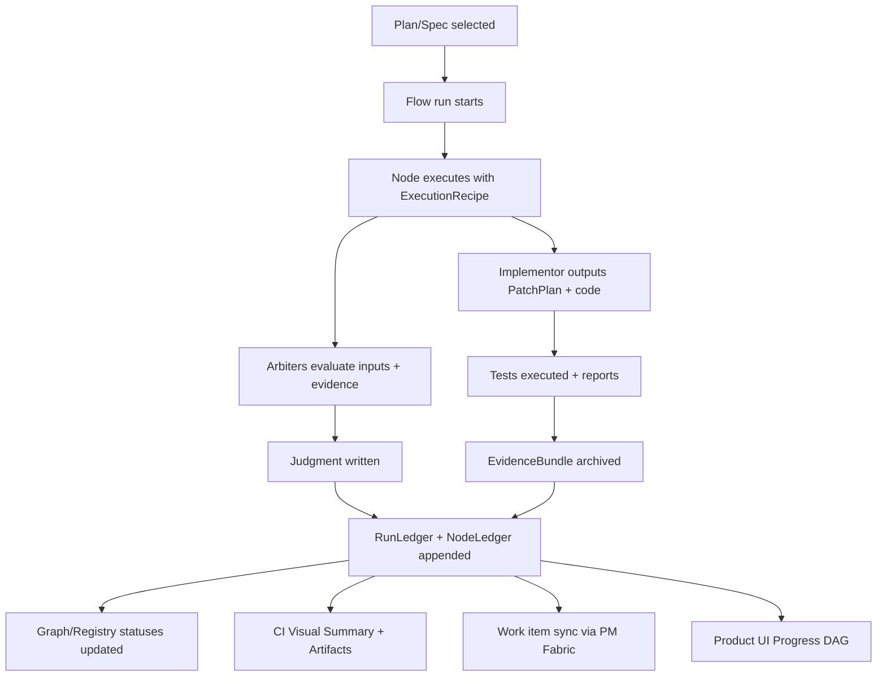

# Progress “Ledger” for a Self‑Building, Self‑Testing .NET + React or React Native Platform

## Executive summary

To “save progress” reliably in a self-building platform, you need a **canonical, append‑only Progress Ledger** that becomes the source of truth for:

- **What should be done** (specifications + acceptance criteria).
- **How it was solved** (pattern/skill IDs + decision records).
- **What was implemented** (diffs, commits, file references).
- **Which AI recipe executed it** (prompt version + model + retrieval profile).
- **How it was judged** (arbiter inputs + verdicts + required fixes).
- **How it was verified** (unit/integration/e2e reports + environments).
- **How it can be reproduced** (commands, containers, run IDs, trace IDs).
- **How it is linked to your work-management tool** (Jira/Trello/Azure DevOps) via a Fabric-first adapter.

This ledger then fans out into three user-facing views:

- A **live progress DAG** (RunSnapshot/NodeSnapshot) inside your product.
- A **CI-side visual report** using job summaries and artifacts (high signal, clickable links). GitHub job summaries are built by appending Markdown into `GITHUB_STEP_SUMMARY`, isolated per step, then shown on the workflow run summary page after job completion; summaries automatically mask secrets and each step is size-limited (1MiB). citeturn2view0turn2view1
- A **work-item view** inside Jira/Trello/Azure DevOps containing the same progress, but adapted to each system’s API and content model (attachments, comments, custom fields). Jira “Create issue” supports `fields` and `update`, with field availability discoverable via “create issue metadata”; Jira attachments are uploaded via multipart/form-data. citeturn9view3turn9view0turn5view0 Trello supports creating cards (`POST /1/cards`) and treats “Actions” as an audit record (including comments), plus supports webhooks for change-driven syncing. citeturn7view1turn4view4 Azure DevOps work items can be created/updated with JSON Patch (`application/json-patch+json`) and have examples for adding links/attachments. citeturn1view3turn0search6

The resulting system is Fabric-first: switching from Jira to Trello or Azure DevOps is a provider swap with no change to the canonical ledger format.

## Canonical Progress Ledger requirements

Your list (“specs, patterns, logic, prompts/models, arbiter inputs, tests, commits, code refs, GraphRAG methodology, logger/trace, skills created, no‑code explanation”) is best handled by a **two-layer model**:

- A **static layer** (specs + patterns + prompts + skills) that is versioned like code.
- A **runtime layer** (runs + evidence + judgments + artifacts) that is **append-only and immutable per run**, with references back to the static layer.

### Why append-only and immutable evidence matters

Your platform will repeatedly re-run steps after changes (new connector, new interface method, prompt tweak). If evidence can be overwritten, you lose the ability to:

- prove what changed and why,
- diagnose regressions,
- compare model/prompt versions over time.

GitHub workflow artifacts are explicitly designed to persist outputs produced during a run to view later and share across jobs. citeturn1view2turn0search8 The official artifact upload action describes artifact uploads as an immutable archive (and GitHub’s artifacts API supports download/retrieve/delete semantics). citeturn0search1turn0search14 This “immutable evidence” concept maps well to your EvidenceBundle design.

### Minimum canonical documents to store

A practical minimum set (recommended names):

- **SpecDoc**: what must be done (scope, acceptance, dependencies).
- **PatternRecord**: what pattern solved it (skill IDs, factory family IDs, decision logic).
- **ExecutionRecipe**: the exact implementor recipe (prompt/model/RAG profile).
- **ArbiterPacket**: arbiter inputs, evidence refs, and verdict rubric version.
- **TestPacket**: unit/integration/e2e outputs and environment details.
- **CommitSet**: commits/PRs + file references (paths, hashes).
- **TelemetryPacket**: trace/log correlation IDs and key logger metadata.
- **GraphRagPacket**: graph build methodology and index outputs.
- **NoCodeNarrative**: a human-readable “what happened + what resources were used”.

Structured outputs are a strong fit for the AI-produced portions of these packets because **Structured Outputs** can enforce responses that adhere to a supplied JSON Schema, reducing “invalid format” failures during automation. citeturn7view2turn6search2

## Ledger schema and the “No‑Code Narrative” contract

### Canonical schema concept

At a high level, each flow run produces:

- one **RunLedger** (top-level)
- multiple **NodeLedgers** (one per node)
- one **EvidenceBundle** archive per node
- optional **WorkItemSync events** emitted to your PM Fabric provider

The key is that *every* node writes the same core fields:

- specs it was fulfilling,
- pattern(s) invoked,
- prompt + model version used,
- arbiter verdicts,
- tests triggered,
- commits/files produced,
- trace/log correlation,
- references to GraphRAG queries and outputs,
- a no-code narrative summary.

### Recommended “No‑Code Narrative” fields

The NoCodeNarrative should be generated deterministically from the ledger rather than freehand text. Its purpose is executive visibility and audit.

Recommended template:

- **Objective**: which SpecDoc(s) and why.
- **Approach/Pattern**: which Skill(s)/PatternRecord(s) were used.
- **Changes Made**: commits + file paths + registry updates.
- **Verification**: which test suites ran and the outcomes.
- **AI Details**: ExecutionRecipe (model, prompt version, retrieval mode).
- **Arbiter Findings**: pass/fail, required actions, links to evidence.
- **Observability**: trace ID(s), span IDs, log correlation notes.
- **RAG/Graph**: which graph query templates and which index version were used.
- **Artifacts**: where the evidence artifacts live (CI artifacts, internal store).
- **Human Decisions**: if any approvals/gates were required (and who approved).

This narrative becomes what you attach to Jira/Trello/Azure DevOps as description/comment/attachment, depending on system constraints.

### Visual progress contract

You want progress “reported visually” and preserved. Use two complementary channels:

- **CI summaries**: A concise progress table appended into `GITHUB_STEP_SUMMARY`. Job summaries are unique per step, aggregated into a job summary at job completion, displayed on the workflow run summary page, and cannot be edited after upload. Summaries also automatically mask secrets and have a per-step size limit. citeturn2view0turn2view1  
- **Product UI snapshots**: A RunSnapshot/NodeSnapshot view. This is your always-on “progress DAG inspector”, independent of CI availability.

If you use environment gates for human approvals, GitHub deployments and environments support deployment protection rules that can require manual approval, add delays, restrict branches, and even enforce custom third-party gates via GitHub Apps. citeturn4view0turn4view2

### Mermaid diagram: end-to-end progress capture

This pattern yields durable, queryable progress even if the PM tool changes, because the canonical truth is the ledger, not the adapter.

## GraphRAG methodology retention and “connected families/interfaces” bootstrapping

You asked to store “GraphRAG methodology” as part of saved progress. Treat GraphRAG as a **versioned build product** with its own run IDs and outputs captured into the ledger.

### What to store for GraphRAG BYOG builds

Microsoft GraphRAG’s Bring Your Own Graph (BYOG) approach expects you to supply at least:

- `entities.parquet` (nodes)
- `relationships.parquet` (edges)
- optional `text_units.parquet` (source chunks, depending on query method). citeturn1view1

GraphRAG also describes a minimal workflow configuration to support “basic” query capabilities (e.g., building communities and reports), where you can select workflows like `create_communities` and `create_community_reports`. citeturn1view1

Your ledger should therefore capture:

- BYOG input table hashes + locations
- the GraphRAG config version
- which workflows ran
- output dataset (tables) hashes + locations

GraphRAG documents that the pipeline produces output tables aligned with its conceptual knowledge model and that by default these are written as Parquet files. citeturn11search0

### Why GraphRAG config and prompts must be versioned and saved

GraphRAG’s `init` command creates `.env`, `settings.yaml`, and a `prompts/` directory containing default LLM prompts; it explicitly states you can modify these prompts or run auto prompt tuning to generate new prompts adapted to your data. citeturn11search1 Auto-tuning prerequisites explicitly require that the workspace has been initialized via `graphrag init`. citeturn11search7

This means “GraphRAG methodology” isn’t just conceptual—it includes:

- which `settings.yaml` was used,
- which prompts were used or tuned,
- which index version was built.

These must be recorded in the ledger and linked in the graph.

### Local vs global GraphRAG usage in your platform

GraphRAG local search explicitly combines structured knowledge-graph data with unstructured input documents to augment LLM context at query time, enabling entity-based reasoning. citeturn11search2 GraphRAG global search uses a map-reduce style approach where intermediate responses are rated and then reduced into a final response, with tradeoffs depending on hierarchy depth and report volume. citeturn11search3turn11search6

In a self-building system, this suggests a stable split to record in methodology:

- Use **local search** for “what’s the exact connected context for this factory/method?” decisions.
- Use **global search** for “summarize overall progress/risk across the plan bundle” narratives.

Both should be logged as “GraphQueryEvents” with query templates, result IDs, and output hashes.

## Observability and trace correlation to save and replay progress

You explicitly listed “Logger details + trace”. The right “save progress” design is that every ledger record is **trace-correlatable** across backend, client, CI, and PM tools.

### Cross-system trace standard

The entity["organization","W3C","web standards body"] Trace Context specification defines `traceparent` and `tracestate` headers used to propagate trace context across HTTP boundaries; it provides a common format for `traceparent` understood by vendors and a vendor-specific `tracestate`. citeturn10search0turn10search4

Your TelemetryPacket should store:

- `traceparent` (or extracted trace ID + span ID)
- environment (local/sandbox/prod)
- service name/version
- correlation ID / run ID mapping

### Why OpenTelemetry is the right “Fabric-first” foundation

entity["organization","OpenTelemetry","open-source observability"] provides a vendor-neutral framework for generating, collecting, and exporting traces, metrics, and logs. citeturn3search15turn10search22 Its context propagation concept is explicitly about correlating signals (traces, metrics, logs) regardless of where generated, enabling causal views across distributed systems. citeturn10search2turn10search6

For .NET specifically, OpenTelemetry’s .NET documentation describes using OpenTelemetry to generate and collect telemetry data such as metrics, logs, and traces. citeturn3search3 There is also explicit guidance on manual vs automatic instrumentation for adding traces/metrics/logs, and on available instrumentations and configuration. citeturn3search7turn3search11

### .NET logging details to record

entity["company","Microsoft","software company"] documentation states (.NET and ASP.NET Core) support high-performance, structured logging via `ILogger`. citeturn10search5turn10search1 The “high-performance logging” guidance includes defining log scopes (including with source-generated logging + `ILogger.BeginScope`). citeturn10search9

For the ledger, the practical implications are:

- Every node execution should open a log scope containing `{runId, nodeId, tenantId, factoryId, providerId}`.
- Every scope should include trace correlation fields so logs can be joined to traces (OpenTelemetry also documents log-to-trace correlation). citeturn10search23

## Fabric-first integration with Jira, Trello, and Azure DevOps

A Fabric-first approach means your system stores progress canonically, then pushes/reads it through a provider interface for your chosen work-management system.

### A pragmatic provider interface

A minimal WorkTracking Fabric must support:

- Create / update work item
- Add comment
- Add attachment (EvidenceBundle archive and/or NoCodeNarrative)
- Set custom fields or labels (status, run ID, trace ID, recipe ID)
- Attach hyperlinks (to CI runs, artifacts, commits)

This aligns with the capabilities in all three systems, but each is implemented differently.

### Capability comparison table

| Capability | Jira (Cloud) | Trello | Azure DevOps |
|---|---|---|
| Create work item | “Create issue” exists; issue content defined via `fields` and `update`, fields discoverable via “create issue metadata”. citeturn9view3turn9view0 | Cards created via `POST /1/cards`. citeturn7view1 | Work items created via REST “Create” endpoint; work item operations use JSON Patch. citeturn0search6turn1view3 |
| Add attachments | “Add attachment” endpoint; attachments posted as multipart/form-data. citeturn5view0turn5view3 | “Create Attachment On Card” (`POST/cards/{id}/attachments`) with parameters including name/file/mimeType/url. citeturn4view4 | Work item update uses JSON Patch media type `application/json-patch+json` and includes examples like “Add an attachment”. citeturn1view3turn0search3 |
| Comments / activity log | Issues support comments (API group present; content typically ADF for rich text in some contexts). citeturn7view0turn9view0 | Comments live as “Actions”; Trello docs describe Actions as audit log records including comments; action queries have limits and paging patterns. citeturn7view1 | Work items support updating history fields; update endpoint includes examples “Update a field”, “Add a link”, etc. citeturn1view3 |
| Webhooks / event sync | (Available in Jira platform; not detailed here.) | Trello explicitly documents webhooks and why to use them to avoid expensive full loads. citeturn7view1 | Azure DevOps scopes mention notifications via service hooks; work item APIs support integration in that ecosystem. citeturn1view3turn0search6 |
| Best fit for “progress ledger mirror” | Strong if you want rich issue workflows + attachments and structured fields | Great for lightweight progress tracking; best with attachments + comments + webhooks | Strong if you want deep integration with engineering workflows and work items; patch model suits machine updates |

### How the adapter stores your progress safely

The key strategy: store the *full* ledger internally; push a **summary + links + attachments** outward.

- **In Jira**: store the NoCodeNarrative as description or comment; attach EvidenceBundle as file; store key IDs (runId, traceId, recipeId) as custom fields/labels. Jira create issue emphasizes that content is expressed via `fields` and `update` and that some fields accept Atlassian Document Format (ADF) for multi-line text. citeturn9view0turn9view3 Attachments are posted as multipart/form-data. citeturn5view0
- **In Trello**: store the NoCodeNarrative as a comment action; attach EvidenceBundle via `POST/cards/{id}/attachments`; rely on actions as your durable audit trail and webhooks for sync. citeturn7view1turn4view4
- **In Azure DevOps**: store the NoCodeNarrative in the work item’s history/fields via JSON Patch; attach EvidenceBundle using the “Add attachment” pattern exposed in work item update examples; add hyperlinks to CI runs and artifacts. The update endpoint’s JSON Patch model and media type are documented. citeturn1view3

## Implementation roadmap focused on durable progress capture

### Phase goals

- **Phase A (must-have):** Canonical ledger schemas + append-only storage + CI summary publishing.
- **Phase B (must-have):** WorkTracking Fabric providers (choose one initially), plus discovery of existing code/tests and graph references.
- **Phase C (scaling):** Full “implement-family” loop with arbiters and prompt/model routing, with every node writing ledger entries and evidence.

### Effort ranges

These are ranges because hosting/team constraints are unspecified:

- Canonical ledger (schemas + storage + APIs) + CI summaries/artifacts: **3–8 person-weeks**
- WorkTracking Fabric providers (Jira + one more): **3–10 person-weeks**
- Discovery scan + references/status graph updates: **4–12 person-weeks**
- Full node-level evidence + arbiter packets + trace/log correlation end-to-end: **6–14 person-weeks**
- GraphRAG methodology capture (BYOG + init + outputs + query event logging): **4–10 person-weeks**

### Major risks and mitigations

- **AI automation “format drift”**: Use strict schema output wherever possible. OpenAI Structured Outputs is designed specifically to ensure responses adhere to your JSON schema, making automation safer. citeturn7view2turn6search2  
- **Prompt/model regressions**: OpenAI evaluation guidance frames evals as structured tests to ensure accuracy/reliability despite nondeterminism and explicitly calls out automated regression testing value. citeturn7view3turn6search3 Your ledger should store eval suite IDs, outputs, and comparisons per prompt/model version.
- **Secrets leakage in progress reports**: GitHub job summaries automatically mask secrets, and GitHub provides explicit masking commands like `::add-mask::` to redact values in logs. citeturn2view0turn2view3
- **Distributed trace correlation failures**: Standardize on W3C `traceparent` / `tracestate` propagation and record the values in your TelemetryPacket. citeturn10search0turn10search4 Use OpenTelemetry context propagation to correlate traces/metrics/logs across boundaries. citeturn10search2turn10search22

### A concrete “Definition of Saved Progress”

A run is not “done” until these are recorded:

- SpecDoc IDs satisfied + acceptance checks
- Skill/PatternRecord IDs used
- ExecutionRecipe (prompt+model+retrieval profile) captured
- ArbiterPacket saved (inputs, evidence links, verdict)
- TestPacket saved (unit/integration/e2e outputs)
- CommitSet saved (commit SHAs, paths)  
- TelemetryPacket saved (traceparent + key scopes)
- GraphRagPacket saved (BYOG inputs, config/prompt versions, outputs)
- NoCodeNarrative saved (human readable)

This definition makes progress “portable” across Jira/Trello/Azure DevOps because the external tool becomes a mirror, not the source of truth.

## Recommended next artifact to formalize

The most leverage-rich next step is to formalize (as versioned schemas) the following five canonical documents:

- `SpecDoc`
- `NodeLedger` / `RunLedger`
- `EvidenceBundleIndex` (references to artifacts)
- `ExecutionRecipe` (prompt/model/rag routing)
- `WorkItemSyncRecord` (mapping to Jira/Trello/Azure DevOps IDs)

Once those schemas exist, your installer flow can seed defaults and your providers can implement mapping rules without requiring any change to your core “self-build” engine.