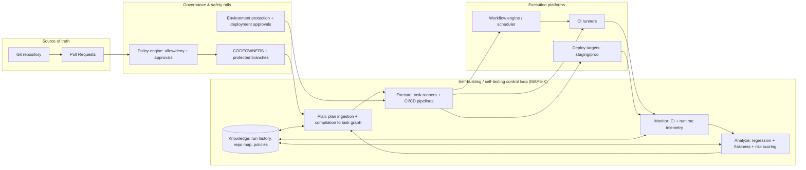
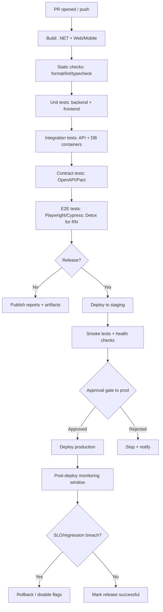

# Initializing a Self-Building, Self-Testing Development System for .NET + React or React Native

## Executive summary

A “self-building, self-testing” development system is best engineered as a **closed-loop control system** rather than a fully autonomous “AI writes code freely” setup. The practical, low-risk frame is a **Monitor → Analyze → Plan → Execute** loop with a shared knowledge base (MAPE / MAPE‑K), where each step is observable, auditable, bounded by policy, and reversible if it misbehaves. citeturn25view0turn25view1

The foundational architecture that scales is:

- **Planning (bounded)**: accept a plan (human-authored or AI-generated), validate it against policy, and compile it into a deterministic task graph (DAG) with explicit preconditions, outputs, and rollback hooks.
- **Execution (reproducible)**: run tasks in hermetic environments (containers/ephemeral runners), using lockfiles and pinned toolchains to reduce drift (NuGet lock mode; `npm ci` for clean installs). citeturn9search2turn10search0
- **Monitoring (actionable)**: publish test/build results, logs, traces, and metrics; detect regressions and flaky tests; trigger policy-driven retries or escalation (not silent “self-fix”).
- **Governance + safety**: require CODEOWNER reviews and protected branches for code changes, and environment protection/approvals for deployments; keep CI tokens least-privilege and favor OIDC federation to cloud resources. citeturn10search3turn10search7turn16search0turn16search2

A phased approach reduces risk: start by making builds/tests deterministic and observable in CI, then add plan compilation + factory modules, then add bounded “self-healing” retries, and only later allow automated code changes behind approvals and rollout controls. citeturn6search11turn3search3turn11search12

## Assumptions and scope

Because hosting/cloud/team constraints are unspecified, the report assumes the following, with alternatives noted where they affect design:

- **Repo/CI**: source control on entity["company","GitHub","source control platform"] with GitHub Actions as the reference CI, plus an Azure DevOps YAML example since many .NET orgs use it. citeturn6search11turn6search1  
- **Cloud target**: default examples reference entity["company","Microsoft","software company"] Azure patterns (App Service deployment slots, Azure Monitor / Application Insights), but concepts map to AWS/GCP equivalents. citeturn11search12turn8search7  
- **Team**: 4–10 engineers; at least one maintainer owns “platform/devex” automation. Effort ranges are in **person-weeks** and **calendar weeks** (depending on parallelism).
- **System boundaries**: focuses on enabling a self-building/self-testing loop for an existing .NET backend and React/React Native frontend—not replacing product architecture.
- **Autonomy boundaries**: automated code changes are treated as **high-risk actions** requiring governance gates, traceability, and safe deployment/rollback.

## Architecture patterns for self-driving systems

### Control-loop architecture: MAPE‑K as the backbone

The MAPE control loop describes a manager that **monitors** a managed resource, **analyzes** signals, **plans** actions, and **executes** them, guided by a shared knowledge base. citeturn25view0turn25view1 This maps cleanly onto software delivery automation:

- **Managed Resource**: repo + build graph + test suites + deployment targets.
- **Sensors**: CI logs, test reports, coverage, vulnerability scans, runtime telemetry.
- **Effectors**: running builds/tests, generating code scaffolds, opening PRs, deploying.

A key design detail from the autonomic manager model is that the loop does **not** require a strict linear control flow—components can collaborate asynchronously via a “messaging bus” style interaction. That is directly applicable to event-driven CI/CD pipelines and workflow engines. citeturn25view1turn6search2

### Workflow-first vs agentic execution

Modern “self-driving” patterns separate:

- **Workflows**: predetermined code paths (repeatable, auditable).
- **Agents**: dynamic tool use and decision-making. citeturn15search3

For initialization, **workflow-first** is typically the correct default. Agentic components can be introduced narrowly (e.g., “suggest fix”, “triage flaky test”) after the workflow layer is robust.

### Reference architecture diagram



This structure is intentionally “boring”: it makes autonomy an **implementation detail**, not a trust assumption.

## Planning engine and task execution design

### Plan ingestion: from “generated plan” to executable DAG

A planning subsystem should treat “generated plans” (from an LLM or human) as **untrusted input**. The core pipeline is:

1. **Parse**: accept plan text/JSON and normalize to a well-defined schema.
2. **Validate**: schema validation + policy checks (allowed task types, repo paths, environments).
3. **Compile**: map steps into **idempotent tasks** with dependencies (DAG).
4. **Simulate / dry-run**: compute what would change (files, packages, infra) before execution.
5. **Execute**: run tasks in controlled environments; emit artifacts and telemetry.
6. **Summarize**: produce a human-readable report + machine-readable run record.

If you use model tool/function calling, treat tool calls as a multi-step handshake: model requests a tool call → your system executes it → the model receives outputs. This keeps the actual execution under application control. citeturn15search2

If you use a .NET-native agent/planner stack, Microsoft Semantic Kernel explicitly discusses planners and the shift toward function calling as a cross-model capability. citeturn15search0turn15search4 A newer option is Microsoft Agent Framework (successor to Semantic Kernel/AutoGen patterns) for orchestrating agent workflows—with an explicit warning to review third-party data flows. citeturn15search1turn15search9

### A concrete plan schema (minimal)

At minimum, your plan object should include:

- **Goal + scope**: repo areas, services, environments.
- **Constraints**: “no DB migrations”, “no dependency upgrades”, “no production deploy”.
- **Steps**: typed actions with inputs/outputs.
- **Risk level**: drives required approvals.
- **Acceptance checks**: which tests/builds must pass.

Example (illustrative):

```json
{
  "goal": "Add endpoint + UI to list invoices",
  "constraints": { "noProdDeploy": true, "noDbBreakingChanges": true },
  "steps": [
    { "type": "dotnet.scaffold", "template": "feature-slice", "name": "Invoices" },
    { "type": "dotnet.test", "scope": "unit+integration" },
    { "type": "react.scaffold", "generator": "component", "name": "InvoiceList" },
    { "type": "web.e2e", "runner": "playwright", "suite": "smoke" }
  ],
  "acceptance": [
    "dotnet_tests_pass",
    "web_unit_tests_pass",
    "e2e_smoke_pass"
  ],
  "risk": "medium"
}
```

### Orchestration options for executing task graphs

You need an engine that can run tasks reliably with retries, timeouts, and resumability. Common .NET-friendly choices:

- **Workflow engines (recommended for long-running, stateful flows)**  
  - Temporal has a .NET SDK and explicit concepts of workflows, activities, and worker processes. citeturn14search0turn14search4  
  - Azure Durable Functions provides orchestrations and patterns (including monitoring patterns) suitable for durable workflows. citeturn14search12turn14search1
- **Background job schedulers (good for simpler task queues)**  
  - Hangfire: persistent background jobs with a dashboard and IoC integration. citeturn14search2turn14search8  
  - Quartz.NET: scheduling with triggers/listeners for monitoring job behavior. citeturn14search6turn14search3

Rule of thumb: if you need **resume after process restarts**, human approvals mid-flow, or multi-hour pipelines, prefer a workflow engine.

### Task design principles

Every executable task should be:

- **Idempotent**: safe to retry (critical for self-healing and transient failures).
- **Hermetic** where feasible: declare inputs; avoid hidden dependencies.
- **Observable**: structured logs + timing + artifact pointers.
- **Policy-aware**: task declares risk; policy engine can require approvals.

For transient failures, .NET’s resilience guidance and Polly-based strategies (retry, timeout, circuit breaker, hedging) are well-established, and Microsoft documents resilient app development explicitly in the .NET ecosystem. citeturn18search1turn18search2turn18search3

## Factory modules for .NET and React or React Native

Factory modules are the “self-building” layer: they generate consistent code, wiring, and tests so the planning system can create changes that compile and conform with conventions.

### .NET factories: scaffolding + DI + OpenAPI-first contracts

**Scaffolding via `dotnet new` templates**  
The .NET CLI supports custom templates (`.template.config/template.json`) enabling consistent project/file generation. citeturn0search1turn0search4turn0search7  
This is a strong foundation for backend factories because templates are versioned, reviewable, and deterministic.

**Dependency injection patterns**  
ASP.NET Core and .NET emphasize `IServiceCollection` registration and a built-in DI container (`IServiceProvider`). citeturn1search2turn1search0  
Factory outputs should standardize on:
- one `Add{Feature}` extension per feature area,
- explicit lifetimes (Scoped/Singleton/Transient),
- minimal service locator usage.

**OpenAPI as a contract boundary**  
ASP.NET Core provides built-in OpenAPI document generation via `Microsoft.AspNetCore.OpenApi`, and supports build-time generation in newer versions. citeturn13search3turn13search9  
Swashbuckle and NSwag are common toolchains for UI/Swagger and client generation. citeturn1search7turn13search4turn13search0

**Code generation options (clients/server stubs)**  
- NSwag (C#/TypeScript client generation). citeturn13search0turn13search4  
- OpenAPI Generator (many generators including TypeScript fetch). citeturn13search14turn13search1

**Database evolution**  
If using EF Core, migrations are the standard incremental schema mechanism; production application guidance emphasizes caution and the use of SQL scripts when appropriate. citeturn13search2turn13search8

#### Example: backend “feature slice” scaffold (illustrative)

```csharp
// Features/Invoices/InvoicesModule.cs
using Microsoft.Extensions.DependencyInjection;

namespace MyApp.Features.Invoices;

public static class InvoicesModule
{
    public static IServiceCollection AddInvoices(this IServiceCollection services)
    {
        services.AddScoped<IInvoiceRepository, InvoiceRepository>();
        services.AddScoped<IInvoiceService, InvoiceService>();
        return services;
    }
}
```

```csharp
// Program.cs (composition root)
builder.Services
    .AddInvoices()
    .AddOpenApi(); // depending on your template / version
```

(Your template should also generate: controller/minimal endpoint group, DTOs, validators, tests, and OpenAPI metadata defaults.)

### React factories: component/page scaffolds + typed API clients

**Project/toolchain initialization**  
React’s official guidance supports building from scratch using build tools like Vite/Parcel/RSBuild, and React explicitly deprecated Create React App for new apps. citeturn2search0turn2search9  
Vite’s docs show the standard dev server and project creation flow. citeturn17search14turn17search1

**Scaffolding/generators**  
Two common styles:

- **Micro-generators inside the repo** (simple, flexible): Plop (Handlebars templating). citeturn23search0turn23search4  
- **Workspace generators** (best for monorepos): Nx local generators. citeturn23search2turn23search13

#### Example: React component generator with Plop (illustrative)

```js
// plopfile.js
export default function (plop) {
  plop.setGenerator('component', {
    prompts: [{ type: 'input', name: 'name', message: 'Component name?' }],
    actions: [
      {
        type: 'add',
        path: 'src/components/{{pascalCase name}}/{{pascalCase name}}.tsx',
        templateFile: 'plop-templates/component.hbs'
      }
    ]
  });
}
```

### React Native factories: Expo-first vs “no framework”

React Native’s current docs recommend starting with Expo for many teams (“production-grade React Native framework”) and provide environment setup and testing guidance. citeturn2search2turn2search5  
Expo’s docs show starting the dev server with `npx expo start`. citeturn17search2turn17search6  
React Native also documents how to get started without a framework if you have constraints that Expo doesn’t serve. citeturn2search7

For E2E testing on React Native, Detox is a widely used framework with Jest integration. citeturn2search8turn2search3

### Recommended factory boundaries

A robust self-building system keeps generators **small** and composes them:

- **Contract factory**: OpenAPI generation + client regeneration (NSwag/OpenAPI Generator).
- **Backend feature factory**: endpoint + DI wiring + tests + docs.
- **Web UI factory**: page + component + state/query layer + test baseline.
- **Mobile UI factory**: screen + navigation + state + smoke tests.

This separation makes it easier to enforce policy (e.g., “contract must update if endpoint changes”).

## CI/CD and automated pipeline design

### CI provider comparison table

| CI/CD option | Strengths for self-building/self-testing | Governance & approvals | Auth & secret posture | When it’s a good fit |
|---|---|---|---|---|
| GitHub Actions | Native to GitHub repos; workflow YAML; artifacts; environment protection rules | Environments + deployment protection rules; custom deployment protection rules via GitHub Apps citeturn0search14turn7search20 | Least-privilege `GITHUB_TOKEN`; OIDC for cloud auth citeturn16search0turn0search5 | Teams already on GitHub; want code+CI close |
| Azure DevOps Pipelines | Strong enterprise pipeline controls; multistage YAML; environments with approvals/checks citeturn6search1turn7search2 | Environments approvals/checks; classic “gates” also exist citeturn7search15turn1search8 | Service connections with explicit permissions; can align with Entra policies citeturn16search1turn16search9 | .NET-heavy orgs; existing Azure DevOps usage |
| GitLab CI/CD | YAML pipelines in `.gitlab-ci.yml`; strong integrated CI model citeturn6search2turn6search6 | GitLab has its own approval/protection mechanisms (outside scope here) | GitLab has OIDC/identity patterns (not detailed here) | GitLab-first shops; integrated DevSecOps workflows |
| CircleCI | Config-driven workflows; strong execution options; OIDC tokens supported citeturn7search0turn7search1 | Supports approval jobs/steps in workflows citeturn7search4 | OIDC tokens reduce long-lived secrets citeturn7search1 | Performance-oriented CI; mixed ecosystems |
| Jenkins | Highly flexible; declarative pipeline syntax; self-hosted control citeturn6search3turn6search10 | Approvals via plugins/process | Credential handling via Jenkins mechanisms citeturn6search7 | When you need maximum customization/on-prem |

### Pipeline design goals (what “good” looks like)

1. **Reproducibility**  
   - Use NuGet lock files and `dotnet restore --locked-mode` to prevent drift. citeturn9search2turn9search6  
   - Use `npm ci` for clean installs in CI. citeturn10search0turn10search17  

2. **Separation of concerns**  
   - Build + unit tests run fast and on every PR.
   - Integration/contract tests run on PR (selective) and always on main.
   - E2E runs at least on main and for release candidates.

3. **Automated reporting**  
   - Upload artifacts and test reports for every run. citeturn20search13turn20search1  
   - Publish test results in the CI UI (Azure DevOps has a dedicated task). citeturn20search2  

4. **Gated deployments**  
   - Require approvals for protected environments. citeturn7search3turn7search15  

### CI flow diagram



### Sample GitHub Actions workflow (monorepo-style)

This illustrative workflow shows: caching, .NET + Node setup, builds/tests, and gating deployments with environments and approvals.

```yaml
name: ci

on:
  pull_request:
  push:
    branches: [ "main" ]

permissions:
  contents: read

jobs:
  build_test:
    runs-on: ubuntu-latest
    steps:
      - uses: actions/checkout@v4

      # .NET
      - uses: actions/setup-dotnet@v4
        with:
          dotnet-version: "10.0.x"
          cache: true

      - name: Restore (locked)
        run: dotnet restore --locked-mode

      - name: Build
        run: dotnet build -c Release --no-restore

      - name: Test
        run: dotnet test -c Release --no-build

      # Web
      - uses: actions/setup-node@v4
        with:
          node-version: "20"
          cache: "npm"
          cache-dependency-path: "web/package-lock.json"

      - name: Install web deps (clean)
        working-directory: web
        run: npm ci

      - name: Web unit tests
        working-directory: web
        run: npm test -- --runInBand

      - name: Build web
        working-directory: web
        run: npm run build

      - name: Upload artifacts
        uses: actions/upload-artifact@v4
        with:
          name: build-and-test-outputs
          path: |
            **/TestResults/**
            **/bin/Release/**
            web/dist/**

  deploy_staging:
    if: github.ref == 'refs/heads/main'
    needs: [ build_test ]
    runs-on: ubuntu-latest
    environment: staging
    permissions:
      contents: read
      id-token: write   # for OIDC
    steps:
      - name: Deploy (placeholder)
        run: echo "deploy to staging"

  deploy_production:
    if: github.ref == 'refs/heads/main'
    needs: [ deploy_staging ]
    runs-on: ubuntu-latest
    environment: production
    permissions:
      contents: read
      id-token: write
    steps:
      - name: Deploy (placeholder)
        run: echo "deploy to production"
```

Key points supported by official docs:
- Workflows are YAML-defined automation for CI/CD. citeturn6search14turn6search0  
- Dependency caching is a first-class concept in GitHub Actions. citeturn1search1turn1search3  
- Environments can enforce deployment protection rules/approvals. citeturn0search14turn7search3  
- OIDC can replace long-lived cloud secrets in GitHub Actions. citeturn0search5turn16search2  

### Sample Azure DevOps multi-stage YAML (with approvals + retries)

Azure DevOps supports multistage YAML pipelines and environment approvals/checks. citeturn6search1turn7search2 It also supports `retryCountOnTaskFailure` for tasks. citeturn19search2turn19search6

```yaml
trigger:
  branches:
    include:
      - main

stages:
- stage: BuildAndTest
  jobs:
  - job: build
    pool:
      vmImage: ubuntu-latest
    steps:
    - script: dotnet restore --locked-mode
      displayName: Restore (locked)
      retryCountOnTaskFailure: 2

    - script: dotnet build -c Release --no-restore
      displayName: Build

    - script: dotnet test -c Release --no-build
      displayName: Test

- stage: Deploy_Staging
  dependsOn: BuildAndTest
  jobs:
  - deployment: deployStaging
    environment: staging
    strategy:
      runOnce:
        deploy:
          steps:
          - script: echo "Deploy to staging"
            displayName: Deploy

- stage: Deploy_Prod
  dependsOn: Deploy_Staging
  jobs:
  - deployment: deployProd
    environment: production  # approvals/checks configured in UI
    strategy:
      runOnce:
        deploy:
          steps:
          - script: echo "Deploy to production"
            displayName: Deploy
```

## Testing and quality strategy

### Test strategy overview by layer

A self-testing system should treat tests as **sensors** and deployments as **effectors**. Your CI should be able to answer: “What failed? Is it flaky? Is it a regression? Can we safely retry? Should we roll back?”

#### Backend (.NET)

- **Unit tests**: xUnit / NUnit / MSTest are all supported; MSTest is Microsoft’s open-source, cross-platform framework with CLI and IDE integration. citeturn3search2turn3search7turn3search1  
- **Integration tests**: ASP.NET Core docs recommend separating unit and integration test projects; integration testing uses a test host approach (e.g., Minimal API integration tests). citeturn3search3turn3search16  
- **Test data & dependencies**: Testcontainers provides throwaway Dockerized dependencies, enabling realistic integration tests without requiring dev machines to install DBs. citeturn5search8turn5search5  
- **Mocking**: for in-process unit tests, use a mocking framework (Moq or NSubstitute). citeturn22search0turn22search1  
- **HTTP stubs**: WireMock.Net can simulate external HTTP services during integration testing. citeturn22search2turn22search15

#### Web frontend (React)

- **Unit/component tests**: Jest or Vitest; Testing Library encourages DOM queries resembling user behavior. citeturn4search0turn4search1turn4search9  
- **API mocking**: MSW intercepts outgoing requests in browser/Node tests and responds with mocked handlers. citeturn5search3turn5search16  
- **E2E tests**:  
  - Playwright: cross-browser E2E with a built-in runner and rich tooling. citeturn4search7turn4search3  
  - Cypress: browser-based E2E with strong retry and “retry-ability” concepts. citeturn5search17turn19search1  

#### Mobile (React Native)

- **Testing overview**: React Native docs cover testing approaches from static analysis to E2E. citeturn2search5  
- **E2E**: Detox for device/simulator tests. citeturn2search8turn2search3  

### Contract tests and compatibility checks

Two pragmatic approaches:

1. **OpenAPI-driven compatibility**  
   - Generate OpenAPI from the backend and use it as a build artifact; regenerate typed clients; ensure compilation passes in web/mobile. citeturn13search3turn13search6  
2. **Consumer-driven contract tests (CDC)**  
   - Pact’s model: write consumer tests that also generate a contract; providers verify against it. citeturn5search7turn5search1  

In practice, teams often use OpenAPI for broad schema visibility and Pact for high-risk consumer-provider interactions where breaking changes are expensive.

### Flakiness management: retries + evidence

A self-testing loop must distinguish **transient failure** from **product regression**:

- **Test retries**  
  - Playwright supports retries and recommends trace collection on first retry (`trace: 'on-first-retry'`). citeturn19search0turn19search11  
  - Cypress has explicit docs for test retries and flake reduction. citeturn19search1turn19search4  
- **Infrastructure retries**  
  - Azure Pipelines supports task retries (`retryCountOnTaskFailure`). citeturn19search2  
- **Evidence capture**  
  - Artifacts (screenshots, traces, logs) should be uploaded for failed runs. GitHub Actions supports workflow artifacts for storing and sharing run outputs. citeturn20search13turn20search5  

### Comparison table: testing frameworks and tools

| Category | Option | Strengths | Primary-source notes |
|---|---|---|---|
| .NET unit test | xUnit | Widely used; supports modern .NET versions | xUnit docs describe .NET 8+ / v3 support citeturn3search7turn3search0 |
| .NET unit test | MSTest | Microsoft-supported, OSS, cross-platform | MSTest overview citeturn3search2 |
| .NET integration deps | Testcontainers | Real services in Docker for tests | Testcontainers overview citeturn5search8turn5search5 |
| Web unit/component | Vitest | Fast Vite-native runner; Node version requirements | Vitest guide citeturn4search1 |
| Web unit/component | Jest | Mature test runner ecosystem | Jest getting started citeturn4search0 |
| Web E2E | Playwright | Cross-browser; trace tooling; retries | Playwright intro + retries citeturn4search7turn19search0 |
| Web E2E | Cypress | Strong E2E experience; built-in retries | Cypress docs citeturn5search0turn19search1 |
| RN E2E | Detox | Device/simulator E2E; Jest integration | Detox docs citeturn2search8turn2search3 |
| Contract tests | Pact | CDC model for consumer/provider compatibility | Pact docs citeturn5search7turn5search1 |

## Operations, observability, security, governance, and safe delivery

### Observability as a first-class product requirement

A self-testing loop becomes “self-driving” only when it can *measure* outcomes and *attribute* failures.

**Logging**  
ASP.NET Core and .NET provide structured logging via `ILogger`, with multiple built-in providers and extensibility. citeturn8search2turn8search6

**Traces/metrics/logs via OpenTelemetry**  
OpenTelemetry’s .NET and JavaScript docs provide guidance for emitting traces/metrics/logs and instrumenting apps. citeturn8search4turn8search1  
For Azure-centric deployments, Microsoft documents OpenTelemetry integration with Azure Monitor / Application Insights using an OpenTelemetry “distro” approach. citeturn8search3turn8search7

Operationally, feed CI failures and runtime incidents back into the knowledge store:
- flaky-test detection (failure rates, first-failure timestamps),
- regression correlation (which PR introduced it),
- SLO/SLA correlation (deploy → latency/errors).

### Feedback loops and “self-healing” mechanisms

Self-healing should be **bounded**:

1. **Retry the right things**  
   - Use application resilience patterns (Retry + backoff; Circuit Breaker to prevent retry storms). citeturn18search2turn18search3turn18search14  
2. **Collect evidence on retries**  
   - Trace/record on retry (Playwright traces on first retry). citeturn19search11  
3. **Escalate, don’t loop forever**  
   - After N retries, open an issue/PR comment with logs, run IDs, and suspected causes.

### Security and access controls for automated code execution

This is the highest-risk area because the system executes code and may deploy it. Principles:

**Least privilege in CI**
- GitHub recommends granting the `GITHUB_TOKEN` minimum required permissions and setting default permissions to read-only where possible. citeturn16search0turn16search3  
- Use OIDC to authenticate to cloud providers instead of storing long-lived secrets. citeturn0search5turn16search10  

**Azure DevOps permissions**
- Azure DevOps security/permissions and service connection sharing are explicitly permissioned; treat service connections as privileged resources. citeturn16search1turn16search9  

**Supply-chain integrity**
- SLSA defines supply-chain security controls and maturity levels, useful as a governance checklist for build provenance. citeturn9search0turn9search16  
- Code scanning: GitHub’s CodeQL integration runs via workflows and produces scanning alerts. citeturn9search1turn9search13  
- Dependency vulnerability checks:
  - NuGet: `dotnet package list` includes vulnerability listing options in newer SDKs. citeturn21search0  
  - npm: `npm audit` reports known vulnerabilities. citeturn21search1turn21search4  
  - Dependabot security updates create automated PRs for vulnerable deps. citeturn21search2turn10search2  

**Execution isolation**
- Prefer ephemeral runners/containers for tasks that run untrusted code-gen steps.
- Require code changes to land through PRs with branch protection (approving reviews, required status checks). citeturn10search3turn10search11  
- Use CODEOWNERS to require reviews from owners of sensitive areas. citeturn10search7  

### Governance and approval workflows

A self-building system must not bypass human accountability:

- **Protected branches** enforce passing checks and reviews. citeturn10search3turn10search11  
- **Deployment approvals**  
  - GitHub environments can require approvals and apply deployment protection rules. citeturn0search14turn7search6  
  - Azure Pipelines environments support approvals and checks for stages. citeturn7search2turn7search15  
- **Custom deployment rules**  
  - GitHub supports custom deployment protection rules powered by GitHub Apps to integrate third-party governance. citeturn0search11turn7search9  

### Rollback and safe deployment strategies

Choose a rollback mechanism aligned with hosting:

- **Azure App Service deployment slots**: slots are live apps with separate hostnames; content/config can be swapped for low-downtime rollouts and rollback by swapping back. citeturn11search12  
- **Kubernetes**: roll back to previous revisions via `kubectl rollout undo`. citeturn12search0turn12search1  
- **Pipeline-level rollback stages**: Azure DevOps documentation illustrates rollback stages as optional pipeline stages. citeturn12search2  

**Feature flags as the fastest “rollback”**  
Feature flags allow behavior changes without redeploying; OpenFeature formalizes a vendor-agnostic API for flag evaluation and documents common purposes like canary releases and safe degradation. citeturn12search9turn12search14  
For .NET specifically, Azure App Configuration’s feature management library is built on the .NET configuration system. citeturn11search0turn11search3  
For React, both commercial (LaunchDarkly) and OSS (Unleash) SDKs exist. citeturn11search14turn11search2

### Developer experience: local dev parity and fast feedback

A “self-building” system fails if developers can’t reproduce CI locally.

- **.NET inner loop**: `dotnet watch` supports hot reload behavior and provides CLI options relevant to fast iteration. citeturn17search0turn17search4  
- **Web inner loop**: Vite docs describe the dev server (`vite` / `npm run dev`). citeturn17search1turn17search22  
- **React Native inner loop**: Expo docs show starting dev servers (`npx expo start`). citeturn17search2turn17search12  
- **Environment consistency**: VS Code Dev Containers provide containerized dev environments configured by `devcontainer.json`. citeturn17search3  

## Phased implementation roadmap, effort ranges, and risk mitigation

### Roadmap phases

Effort ranges assume an experienced team and parallel work streams; if a single engineer owns the platform, calendar time increases.

| Phase | Outcomes and milestones | Estimated effort |
|---|---|---|
| Foundations | Standardize repo build commands; add lockfiles; define CI “golden pipeline”; baseline artifacts/reporting | 2–6 person-weeks (1–3 calendar weeks with 2–3 engineers) |
| Test architecture hardening | Separate unit/integration projects; add Testcontainers for key deps; add Playwright/Cypress (web) and Detox (RN) smoke; define flake policy and retries | 4–10 person-weeks (2–6 calendar weeks) |
| Planning engine MVP | Define plan schema + validator; implement task DAG runner; integrate into CI as “plan runner” that can run in dry-run mode and produce reports | 6–14 person-weeks (3–8 calendar weeks) |
| Factory modules v1 | `dotnet new` templates for backend slices; React generators (Plop/Nx); OpenAPI client regen (NSwag/OpenAPI Generator); enforce conventions | 6–16 person-weeks (3–10 calendar weeks) |
| Governance + secure execution | Branch protection + CODEOWNERS; environment approvals; OIDC for deploy auth; supply-chain scanning (CodeQL, vuln scans) | 4–10 person-weeks (2–6 calendar weeks) |
| Self-healing loops (bounded) | Add policy-based retries; automatic flake triage; auto-open issues/PR suggestions (not auto-merge); add rollout health checks and automated rollback hooks | 6–16 person-weeks (3–10 calendar weeks) |
| Scale and optimization | Performance tuning; caching improvements; test sharding; organization-wide templates; SLSA-aligned provenance checks | ongoing (2–6 person-weeks per quarter) |

### Key risks and mitigations

**Risk: “Automation writes unsafe code or changes too much.”**  
Mitigation: treat plans as untrusted; require policy validation; restrict task types; require PR + CODEOWNERS for code changes; protected branches and status checks. citeturn10search7turn10search3

**Risk: Flaky tests create noise and block delivery.**  
Mitigation: explicit retries with evidence (traces/screenshots), quarantine policy, and flake budgets; use Playwright/Cypress retry features appropriately. citeturn19search0turn19search1turn19search11

**Risk: Non-reproducible builds cause “works on my machine/CI” drift.**  
Mitigation: lockfiles (`--locked-mode` / `npm ci`), pin toolchains, containerize execution. citeturn9search2turn10search0turn17search3

**Risk: CI credentials exfiltration / supply-chain attacks.**  
Mitigation: least-privilege tokens, OIDC, restrict third-party actions, dependency scanning (CodeQL, Dependabot, NuGet/npm audits). citeturn16search0turn0search5turn9search1turn21search2turn21search1

**Risk: Deployments break production with slow detection.**  
Mitigation: staged rollouts + approvals; blue/green slots or Kubernetes rollback; feature flags for instant kill-switches. citeturn11search12turn12search0turn12search9

**Risk: Developer resistance (tooling feels imposed).**  
Mitigation: invest early in local parity, fast feedback (`dotnet watch`, Vite), and good “golden path” templates. citeturn17search0turn17search1turn2search0