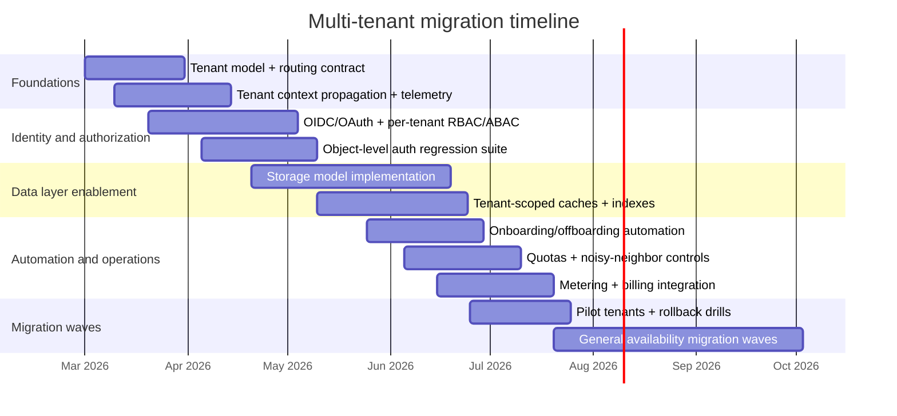

# Adapting a Software System to Multi‑Tenancy

## Executive summary

A multi-tenant architecture is not primarily a database decision; it is an end-to-end “tenant context” and isolation program spanning routing, identity, authorization, storage, caching, queues, observability, backups, and compliance evidence. The practical implication is that you must design **consistent tenant scoping** into *every* boundary (HTTP, async events, background jobs, data stores, caches, search indexes, metrics/logs), or you will eventually see cross-tenant exposure or “noisy neighbor” failures. citeturn7search17turn5search0turn5search29turn12search1

A rigorous decision framework starts by classifying your required isolation level as **soft vs hard multi-tenancy** (soft = tenants are trusted, accidental isolation is the main risk; hard = tenants are untrusted/adversarial, strong security/resource isolation is required). Kubernetes formalizes this distinction and connects it directly to security and resource-sharing threats (e.g., data exfiltration, DoS). citeturn8search1turn12search1

Across cloud providers, the most robust “default” strategy for SaaS at scale is a **hybrid/bridge model** (also described as mixing pooled + isolated resources by tenant tier). The bridge model is explicitly described in the AWS SaaS tenant isolation guidance as combining “pool” and “silo” wherever appropriate, rather than committing every layer to a single isolation extreme. citeturn0search0turn0search4turn0search30turn0search7 A similar view appears in Azure’s SaaS multitenant solution architecture guidance: multitenancy typically means sharing *some* components, not necessarily all components. citeturn0search14turn0search28turn0search1

Recommended architecture patterns by SaaS scale (assuming no specific tech stack) are:

**Small SaaS (few tenants; fast iteration dominates)**: Start pooled (“shared everything”) with **strict tenant context propagation**, **object-level authorization**, and a simple **tenant_id partitioning strategy** in data/caches. Treat this as establishing a correct foundation, not a forever choice. citeturn5search0turn0search7turn1search3

**Medium SaaS (dozens to hundreds; enterprise features emerge)**: Move to a **bridge model**: pooled by default, but with automation to “graduate” select tenants to higher isolation (separate schema or separate database) when they need compliance, heavy performance, or customer-managed keys. This aligns with AWS pool/silo/bridge framing and with Azure’s “tenancy patterns” guidance that compares shared vs database-per-tenant trade-offs. citeturn0search4turn0search1turn10search4turn10search1

**Large SaaS (thousands+; untrusted tenants; high blast-radius risk)**: Operate a **multi-tier isolation portfolio**: pooled for long-tail tenants, dedicated resources (database/cluster/account/project) for top-tier or regulated tenants; strong policy enforcement, quotas, and per-tenant observability and incident response. Kubernetes guidance emphasizes that sharing saves cost but introduces security and noisy-neighbor challenges that must be engineered explicitly. citeturn12search1turn7search3turn7search31turn12search0

The internal design notes you provided reinforce these conclusions: they recommend a hybrid/bridge isolation approach and highlight common multi-tenant failure modes such as cross-tenant access via missing scoping or authorization and noisy-neighbor cost blowups without quotas and rate limits. fileciteturn0file0

## Tenancy model decision framework

A tenancy model must be chosen separately for each layer—compute, data, cache, queueing, and even identity. AWS’s SaaS tenant isolation strategy explicitly frames isolation as a set of choices (pool vs silo) and identifies the bridge approach as the mechanism for combining them where needed. citeturn0search0turn0search4turn0search24turn0search7 Azure similarly advises evaluating tenancy models—including how you define “tenant” and how you plan to scale—rather than assuming one model fits all. citeturn0search28turn0search14turn0search1

A practical decision framework is to score each subsystem along these axes:

**Isolation requirement**: data sensitivity, regulatory scope, contractual requirements, and whether tenants are adversarial (hard multi-tenancy). citeturn8search1turn11search2turn5search2  
**Scalability requirement**: number of tenants, skew (one tenant can be 1000× another), write/read patterns, and peak concurrency. citeturn0search34turn10search4turn12search1  
**Operational complexity ceiling**: how many distinct databases/schemas/queues you can reliably patch, migrate, monitor, back up, and restore. Azure’s patterns doc explicitly calls out operational overhead and management complexity when scaling DB-per-tenant with large counts. citeturn10search4turn10search1turn6search8  
**Recovery model**: whether you need per-tenant restore, per-tenant RPO/RTO, or per-tenant legal hold. GDPR’s security expectations explicitly include the ability to restore availability/access after incidents. citeturn11search2turn6search3turn6search5  
**Customization need**: schema customization, per-tenant compute isolation, custom encryption keys, or customer-specific integrations. Azure’s “database-per-tenant” pattern notes that per-tenant schema customization is straightforward but must be managed carefully at scale. citeturn0search1turn10search4turn3search1

### Tenancy model comparison table

| Tenancy model | Core idea | Strengths | Weaknesses | Best fit |
|---|---|---|---|---|
| Single-tenant (full silo) | Dedicated stack per tenant | Maximum isolation; simplest “per-tenant restore”; easiest to map to strict compliance contracts | Highest cost; highest ops overhead; slowest feature rollout if not automated | Regulated/enterprise tenants, strict data residency/isolation, “hard” multi-tenancy at the infra boundary citeturn0search24turn8search1 |
| Shared database, shared schema with tenant_id | One schema; every row scoped by tenant_id | Lowest per-tenant cost; simplest migrations; easiest analytics across tenants (if allowed) | Highest breach impact if scoping fails; per-tenant restore is hardest; careful index/partition design needed | High-scale SaaS long-tail; early-stage SaaS if accompanied by strong guardrails citeturn0search7turn10search4turn5search0 |
| Shared database, separate schema per tenant | One DB instance; schema-per-tenant | Better logical isolation than shared tables; easier per-tenant export/restore than row-sharing | Schema sprawl; migration orchestration complexity; connection routing complexity | Mid-scale SaaS; tenants needing moderate isolation/customization citeturn0search1turn0search34turn0search4 |
| Database per tenant | Separate database per tenant (may share server/pool) | Strong logical isolation; per-tenant restore; per-tenant performance shaping | Can become unwieldy at very high tenant counts; requires strong provisioning automation | Enterprise tiers; customers needing stricter isolation and restore semantics citeturn0search1turn10search1turn10search4 |
| Hybrid/bridge | Mix pool + silo by layer or tier | Optimizes cost and isolation; supports tenant “graduation” | Requires routing, automation, and a tenant control plane | Most mature SaaS portfolios; recommended baseline for medium/large SaaS citeturn0search0turn0search4turn0search14 |

image_group{"layout":"carousel","aspect_ratio":"16:9","query":["SaaS pool silo bridge tenancy model diagram","shared schema vs schema per tenant vs database per tenant architecture diagram","multi-tenant control plane data plane architecture diagram"],"num_per_query":1}

## Data isolation, encryption, and schema design strategies

### Tenant data isolation boundaries

The most common multi-tenant incident class is **cross-tenant data exposure** caused by missing or inconsistent scoping in queries, caches, indexes, or event consumers. OWASP’s API Security Top 10 lists Broken Object Level Authorization (BOLA) as a top risk and describes exploitation via object identifiers—an exact match for the multi-tenant failure mode “tenant A can access tenant B’s object by guessing/changing the ID.” citeturn5search0turn5search4

A rigorous multi-tenant system therefore treats tenant isolation as a **defense-in-depth stack**:

**Application-layer scoping**: every query/filter includes tenant scope; every cache key includes tenant namespace; every event has tenant context. (This is necessary in all models.) citeturn7search17turn12search1turn2search0  
**Authorization**: object-level authorization is evaluated in the context of tenant and user. citeturn5search0turn1search0turn1search1  
**Data-layer enforcement**: where possible, enforce tenant scoping in the database itself (e.g., row-level security) so that a missed WHERE clause does not become a breach. PostgreSQL documents row security policies (`CREATE POLICY`) and requires enabling row-level security on a table (`ALTER TABLE ... ENABLE ROW LEVEL SECURITY`). citeturn4search0turn4search4  
**Infrastructure-level isolation**: in hard multi-tenancy or for high-value tenants, isolate at the cluster/account/project boundary. Kubernetes explicitly treats “hard” multi-tenancy as strong isolation against untrusted tenants. citeturn8search1turn0search2

### Encryption in transit and at rest

**In transit**: TLS is the baseline for inter-service and client-server traffic. TLS 1.3 is standardized in RFC 8446 and is designed to prevent eavesdropping, tampering, and message forgery. citeturn3search3turn3search11

**At rest**: the standard enterprise pattern is envelope encryption: encrypt data with a data encryption key (DEK), then encrypt the DEK with a key encryption key (KEK) held in a managed KMS/HSM. AWS’s KMS documentation describes envelope encryption and the decrypt-then-decrypt flow (decrypt the encrypted key, then decrypt the message). citeturn3search0turn3search4 Google Cloud documents envelope encryption similarly (DEK encrypted by a KEK, with Cloud KMS managing keys and supporting customer-managed encryption keys). citeturn3search2turn3search6 Azure’s customer-managed key overview explains that a customer-managed key protects the key that encrypts your data and is stored in Azure Key Vault or Managed HSM. citeturn3search1turn3search9

### Per-tenant encryption design

Per-tenant encryption is commonly implemented as:

**Shared storage keying** (provider-managed or shared CMK): lowest ops complexity; sufficient for many SaaS products. citeturn3search9turn3search6  
**Per-tenant CMK / KEK**: stronger tenant boundary (key revocation can “cryptographically offboard” a tenant); higher ops complexity (rotation, access policy, auditing). This is often required by enterprise customers. citeturn3search1turn3search2turn2search3  
**In-use encryption for sensitive fields**: for document databases, MongoDB documents client-side encryption approaches (Queryable Encryption and Client-Side Field Level Encryption), emphasizing that data can be encrypted by the client before transport and only decrypted client-side. citeturn4search3turn4search13turn4search6

NIST’s key management guidance (SP 800-57) is the canonical reference for key lifecycle and management practices, and it is directly applicable to per-tenant key designs (generation, storage, rotation, deactivation, destruction, and auditing). citeturn2search3turn2search15

### Schema strategies and storage strategy comparison

PostgreSQL offers database-enforced row policies (RLS) and declarative partitioning—both are relevant to large-scale “tenant_id” designs. citeturn4search0turn4search1turn4search4 Microsoft’s Citus guidance for designing SaaS with PostgreSQL explicitly compares “shared tables,” “schema-per-tenant,” and “database-per-tenant,” and frames the choice as a trade-off between scale and isolation. citeturn0search34

MySQL’s privilege system is documented across global/database/table/column scopes; it does not provide a built-in row-level policy mechanism comparable to PostgreSQL RLS, which pushes many multi-tenant “row isolation” designs toward application-layer filtering or separate schemas/databases when strict separation is required. citeturn4search2turn4search20

**Storage strategy table**

| Storage strategy | Isolation strength | Operational complexity | Performance scaling levers | Per-tenant restore difficulty |
|---|---:|---:|---|---:|
| Shared tables + tenant_id | Medium (depends on enforcement) | Low | Indexing on tenant_id; partitioning (where supported); sharding | High |
| Shared DB + schema per tenant | Medium-high | Medium-high | Move tenant schemas across instances; selective index tuning | Medium |
| Database per tenant | High | High (automation required) | Pool databases; isolate hot tenants; per-tenant scaling | Low |
| Hybrid (mix) | Variable (tier-based) | High (routing + automation) | Optimize by tenant tier; isolate noisy neighbors | Variable |

## Tenant identity, authentication, authorization, configuration, and customization

### Authentication patterns per tenant

Multi-tenant authentication is most robust when tenant context is **bound to identity**, not inferred ad hoc from request parameters.

Standards baseline:
- OAuth 2.0 (RFC 6749) provides authorization delegation flows. citeturn1search0turn1search12  
- OpenID Connect (OIDC) adds an authentication layer atop OAuth 2.0 and standardizes ID tokens and claims. citeturn1search1turn1search25  
- SCIM (RFC 7644) standardizes identity provisioning for “enterprise-to-cloud” scenarios—directly relevant to tenant onboarding and deprovisioning in B2B SaaS. citeturn1search2turn1search6  

Cloud-provider reference examples:
- Amazon Cognito’s multi-tenant best practices explicitly discuss separating tenants across resources (including accounts/regions for isolation) and providing per-tenant quotas. citeturn7search1turn7search5  
- Google Cloud Identity Platform documents multi-tenancy authentication and positions multi-tenancy as creating “silos of users and configurations within a single instance.” citeturn7search2turn7search10  
- Microsoft Entra guidance includes converting a single-tenant app to multitenant and highlights behavior like using common endpoints and handling multiple issuers. citeturn7search4turn7search12  

In general SaaS terms, the key design is: **resolve tenant → select IdP configuration → enforce policy**. The tenant routing layer is itself a security boundary; AWS explicitly frames tenant routing as a key challenge in multi-tenant SaaS and discusses routing strategies to identify and route requests to appropriate resources. citeturn7search17

### Authorization per tenant

Authorization in multi-tenant systems requires two simultaneous checks:

1) **Tenant boundary**: is the request in the correct tenant scope?  
2) **Object-level authorization**: does the principal have access to *this object* in this tenant?

OWASP’s BOLA guidance emphasizes that object-level authorization must be considered in any function that accesses data by an ID from the user, which is exactly the multi-tenant “tenant escape” vector. citeturn5search0turn5search4

A rigorous implementation typically combines:
- **RBAC** (roles per tenant) for coarse-grained permissions,
- **ABAC** (attributes like tenant_id, org_id, department, plan tier) for policy-composable enforcement,
- **Policy decision points** centralized for consistency (especially across microservices and async consumers). citeturn1search1turn1search0turn7search33

### Per-tenant configuration and customization

In multi-tenant SaaS, configuration is best treated as a first-class product surface with explicit semantics:

**Configuration hierarchy**: global defaults → plan defaults → tenant overrides → environment overrides. (This supports safe rollout and consistent behavior.) citeturn0search14turn0search28  
**Entitlements**: lie at the intersection of pricing and security (feature flags, quotas, data retention policies). AWS Marketplace metering guidance explicitly distinguishes usage metering vs entitlements (meter beyond contract entitlements). citeturn10search2turn10search21  
**Customization boundaries**: distinguish configuration (safe) from custom code (high risk). If tenants can run code or define powerful automations, treat this as a “hard multi-tenancy” surface and invest in isolation and quotas. Kubernetes multi-tenancy guidance emphasizes dealing with noisy neighbors and fairness in shared clusters. citeturn12search1turn7search31

### Tenant onboarding and offboarding

Onboarding is not merely “create a tenant row.” It is a multi-step provisioning pipeline:

- **Tenant registry entry** (tenant_id, plan tier, isolation tier, region/residency, IdP bindings).  
- **Identity bootstrap** (initial admin, groups/roles, SCIM integration if enterprise). citeturn1search2turn7search2  
- **Resource provisioning** (schema/database/namespace/bucket prefixes/queues as needed), which should be automated to avoid “ops per tenant” scaling. Azure and AWS tenancy resources highlight the management challenges as tenant counts grow. citeturn10search4turn0search4turn7search1  
- **Policy wiring** (quotas, rate limits, network policies, encryption keys, audit log routing). citeturn5search29turn7search31turn12search0  

Offboarding must satisfy:
- **Data retention policy and deletion** (GDPR Article 17 right to erasure in applicable cases). citeturn5search5  
- **Audit retention / legal hold** (often required even after deletion requests, depending on lawful basis and regulatory requirements; implement policy-as-data with explicit justification). citeturn11search1turn11search2  
- **Credential revocation** (disable IdP trust, revoke API keys, rotate tenant secrets/keys). Key lifecycle guidance is directly addressed by NIST SP 800-57. citeturn2search3turn2search15  
- **Cryptographic offboarding** if using per-tenant keys (disable or destroy keys to render at-rest data unrecoverable, where policy allows). citeturn3search1turn3search2

## Resource isolation, scaling strategies, and tenant-level observability

### Noisy neighbor mitigation

In shared environments, noisy-neighbor risk is not hypothetical: Kubernetes explicitly states that sharing clusters saves cost and simplifies administration but presents challenges including “managing noisy neighbors.” citeturn12search1turn7search3 OWASP’s API Security Top 10 also calls out “Unrestricted Resource Consumption,” which translates directly into tenant-level quotas and rate limits. citeturn5search29

A layered mitigation strategy is:

**Request-level controls**: per-tenant rate limiting, concurrency caps, payload size limits, pagination defaults, and hard timeouts. citeturn5search29turn1search3  
**Job/workflow controls**: per-tenant concurrency budgets for background workers (indexing, exports, rebuilds), and idempotent retries to prevent amplification. RFC 9110 explains why idempotence matters for safe retries at the protocol level (repeating requests safely after failures). citeturn1search3turn1search7  
**Cluster controls** (if on Kubernetes):  
- Namespaces as a primary isolation unit,  
- ResourceQuota to enforce fairness (Kubernetes states quota violations are rejected by the control plane),  
- RBAC for scoped resource access,  
- NetworkPolicies for traffic isolation (L3/L4 rules),  
- Pod Security Standards/Admission for workload hardening. citeturn7search31turn12search0turn12search5turn12search2turn12search6  

### Scaling strategies by model

Scaling levers depend on your tenancy model:

**Shared tables + tenant_id**:
- Horizontal scaling often pushes toward **sharding by tenant_id** (or tenant hash), or partitioning for performance and lifecycle. PostgreSQL supports declarative partitioning, making tenant_id partition strategies feasible where operationally justified. citeturn4search1turn0search34  
- “Hot tenant” risks are highest; you need per-tenant throttles and sometimes “tenant evacuation” to dedicated resources (a bridge strategy). citeturn0search0turn0search4turn12search1  

**Schema-per-tenant / database-per-tenant**:
- Scaling is primarily operational: distributing tenants across instances/pools, and moving tenants between pools (“rebalancing”) as load changes. Azure’s elastic pools are explicitly designed for managing many databases with varying usage demands and are framed as a cost-effective mechanism for SaaS developers. citeturn10search1turn10search24  

**Hybrid/bridge**:
- You combine the above: pooled for most tenants, and per-tenant scaling (dedicated DB/queue/worker pool) for top-tier tenants.

### Monitoring and observability per tenant

To operate multi-tenancy, observability must be **tenant-aware**:

- **Traces**: propagate trace context across services using W3C Trace Context (`traceparent`, `tracestate`). citeturn2search2turn2search6  
- **Metrics/logs**: adopt consistent semantic conventions and resource attributes; OpenTelemetry defines signals (traces, metrics, logs, baggage) and standardization components (APIs, SDKs, OTLP, Collector). citeturn2search5turn2search1turn2search34  
- **Eventing**: standardize event envelopes; CloudEvents specifies required attributes (including `id`, `source`, `specversion`, `type`) and is widely adopted across platforms; Google Cloud and Azure explicitly document CloudEvents support and required context attributes. citeturn2search0turn2search4turn2search8  

Tenant-aware observability design rules:
- Every telemetry signal carries `tenant_id` as a low-sensitivity label (avoid PII).  
- Use per-tenant dashboards and SLOs (error rate, latency, saturation, queue lag, workflow failure rate).  
- Avoid unbounded high-cardinality labels (e.g., “user_id” labels on metrics), but tenant_id is typically bounded and operationally valuable. OpenTelemetry’s semantic conventions provide guidance for standard naming and attributes. citeturn2search1turn2search13

## Backup, disaster recovery, billing, compliance, and audit trails

### Backup, restore, and disaster recovery per tenant

A multi-tenant architecture must map to **tenant-level recovery expectations**.

Database primitives:
- PostgreSQL documents continuous archiving and point-in-time recovery (PITR) based on WAL archiving and base backups. citeturn6search3turn6search24  
- Amazon RDS documents automated backups and recovering to any point in time within the retention period. citeturn6search8turn6search0  
- Azure SQL documents point-in-time restore and restore-from-backups workflows. citeturn6search5turn6search9  
- Google Cloud SQL documents PITR workflows and the operational pattern of restoring via cloning to an earlier point in time. citeturn6search2turn6search13  

Per-tenant restore implications by model (analytical summary, grounded in the above primitives):
- **Shared tables**: per-tenant restore is hardest because backups are not tenant-scoped; you often need logical backups, selective restore tooling, or compensating replays. citeturn6search3turn6search24  
- **Schema-per-tenant**: per-tenant restore is more tractable (restore schema objects + data), but still operationally complex with schema evolution. citeturn0search1turn0search34  
- **Database-per-tenant**: per-tenant restore is simplest conceptually; platform tools (elastic pools, automated backups) help manage it. citeturn10search1turn6search5turn6search0  

GDPR’s Article 32 explicitly calls out not only encryption and CIA properties but also the ability to restore availability/access to personal data in a timely manner after incidents and to regularly test/evaluate controls. This connects DR drills directly to compliance expectations. citeturn11search2

### Billing and usage metering

Multi-tenant billing has two layers:
1) **External billing** (customer invoices, contracts, tiers), and  
2) **Internal metering** (tenant consumption tracking to enforce quotas, detect abuse, and allocate costs).

AWS Marketplace metering documentation states that for SaaS subscriptions you meter usage and AWS bills customers based on metering records you provide; for SaaS contracts, you meter beyond contract entitlements. citeturn10search2turn10search21

For cost attribution, Google Cloud recommends consistent resource labeling and explicitly connects labeling strategy to how you want to report costs; this is directly applicable to tagging resources with tenant identifiers for chargeback/showback. citeturn10search3turn10search10

A practical multi-tenant metering architecture usually looks like:
- Emit **billing/meter events** (tenant_id + metric + quantity + time window) from each service,
- Ingest into a metering pipeline (idempotent, replayable),
- Aggregate by tenant and plan tier,
- Enforce entitlements in near-real time (reject/soft-throttle) and invoice asynchronously. citeturn10search13turn10search2turn1search3

### Compliance and audit trails

Your multi-tenant design must make compliance evidence *easy to produce*:

**GDPR**:
- Article 30 requires records of processing activities (RoPA). citeturn11search1turn11search25  
- Article 32 requires risk-appropriate security including encryption, CIA/resilience, restoration ability, and regular testing/evaluation. citeturn11search2  
- Article 33 requires breach notification and breach documentation. citeturn5search1turn5search17  

**HIPAA** (when applicable):
- The Security Rule technical safeguards include audit controls (“record and examine activity”), and encryption/decryption is an addressable implementation specification. citeturn11search0turn5search6  

**SOC 2**:
- AICPA’s Trust Services Criteria are the basis for SOC 2 examinations and span Security, Availability, Processing Integrity, Confidentiality, and Privacy. citeturn5search3turn5search7  

Audit trail design requirements (cross-framework):
- Tenant-scoped audit logs (immutable/append-only where feasible) with event type, actor (user/service), time, affected object(s), outcome, and correlation IDs for tracing across services. HIPAA explicitly requires audit controls, and GDPR requires accountability evidence of security and processing. citeturn11search0turn11search2turn5search1  
- Separation of “security audit logs” (auth events, privilege changes, key usage) from “business audit logs” (domain events), but correlate via shared trace/correlation IDs. W3C Trace Context supports standardized correlation across service boundaries. citeturn2search2turn2search6  

## Migration roadmap, testing strategies, and operational runbook items

### Migration strategy from single-tenant to multi-tenant

The safest migrations preserve **backward compatibility** and minimize “big bang” risk. Bridge/hybrid architectures enable tenant-by-tenant migration, reducing blast radius compared to a single pooled cutover. AWS’s bridge framing is particularly compatible with progressive migration. citeturn0search0turn0search4

If your system has complex asynchronous workflows, multi-tenancy adds a specific hard problem: **tenant context must propagate through events, retries, deduplication, timers, and DLQs** or you risk cross-tenant processing. Your internal workflow/engine note highlights event-driven execution, durable timers, retries/DLQ, and idempotency as critical requirements for complex flows—these requirements become stricter under multi-tenancy because any correlation bug can cross tenant boundaries. fileciteturn0file1

### Migration phases, estimated effort, and milestones

| Phase | Goal | Key work items | Effort | Milestones |
|---|---|---|---|---|
| Foundation | Define tenant model and control plane | Tenant registry; tenant routing contract; tenant context propagation rules; baseline security controls | Medium | Tenant_id defined + immutable; request routing resolves tenant; baseline telemetry includes tenant_id citeturn7search17turn2search5 |
| Identity and authorization | Make every access tenant-safe | OIDC/OAuth login flows; per-tenant RBAC/ABAC; object-level authorization everywhere | High | BOLA regression suite passes; tenant boundary tests on all endpoints citeturn5search0turn1search0turn1search1 |
| Data layer enablement | Introduce tenant-scoped storage | Choose model(s): shared tables vs schema vs DB-per-tenant; RLS where applicable; tenant-aware caches/search | High | Data access layer enforces tenant scope; database-enforced policies deployed where supported (e.g., PostgreSQL RLS) citeturn4search0turn4search4 |
| Tenant onboarding automation | Make tenants cheap to operate | Provision schemas/DBs/namespaces/keys/logs; quotas/rate limits; “tenant graduation” path | Medium | Onboarding run <N minutes; offboarding removes access and schedules deletion per policy citeturn7search31turn3search1turn2search3 |
| Migrate existing tenants | Cut over safely | Dual-write/dual-read (where needed); tenant-by-tenant backfill; reconciliation; progressive rollout | High | First tenant migrated; bulk migration complete; rollback procedures tested citeturn0search0turn6search3 |
| Operate and optimize | Run multi-tenant at scale | Per-tenant SLOs; noisy-neighbor controls; per-tenant backup/restore drills; metering + billing | Medium | Quarterly restore drills per tier; cost allocation per tenant; quota alarms and throttling in place citeturn6search5turn10search3turn12search1turn10search2 |

### Mermaid migration timeline

### Testing strategies

Multi-tenant testing must prove *absence of cross-tenant effects* under concurrency and failure.

**Integration testing**
- “Tenant boundary” tests: verify every endpoint rejects cross-tenant object access (directly aligned to OWASP BOLA). citeturn5search0  
- “Context propagation” tests: verify tenant_id survives async boundaries (message queues, pub/sub, cron jobs). Using standardized event formats (CloudEvents) helps enforce required metadata and reduce accidental schema drift. citeturn2search0turn2search8  

**Performance testing**
- Noisy-neighbor simulations: one tenant floods requests or triggers expensive jobs; verify quotas, ResourceQuota behavior (if on Kubernetes), and service rate limits protect other tenants. Kubernetes documents ResourceQuota enforcement behavior at the control plane. citeturn7search31turn12search1  

**Security testing**
- Authorization fuzzing: mutate tenant identifiers and object identifiers; attempt IDOR/BOLA-style accesses; validate access-control decisions. citeturn5search0turn5search4  
- Crypto and key management tests: key rotation, revocation, and access control around KMS/HSM (guided by NIST key management practices). citeturn2search3turn3search1turn3search2  
- Transport security: enforce TLS 1.2+ and prefer TLS 1.3 where feasible (TLS 1.3 standardized in RFC 8446). citeturn3search3  

### Operational runbook items

A production multi-tenant runbook should include at least these tenant-scoped playbooks:

**Cross-tenant exposure incident**
- Immediate containment: disable affected endpoints/queries; revoke or rotate tenant credentials; invalidate caches; preserve audit logs. (HIPAA audit control requirements and GDPR breach documentation/notification expectations make log integrity and retention a compliance requirement, not just a debugging tool.) citeturn11search0turn5search1turn5search17  

**Noisy neighbor incident**
- Identify tenant causing saturation (tenant-labeled metrics/traces), apply throttles or quotas, isolate tenant to separate worker pool/DB if in a bridge architecture. Kubernetes multi-tenancy guidance explicitly frames fairness and noisy neighbors as core challenges. citeturn12search1turn7search31turn0search0  

**Backup/restore drill per tenant**
- Execute PITR or snapshot restore to validate RPO/RTO; document results. This is aligned with GDPR Article 32’s requirement to restore availability/access and to test/evaluate controls. citeturn11search2turn6search3turn6search5turn6search2  

**Tenant onboarding/offboarding**
- Provision: identity bindings, quotas, encryption keys, audit log routing, initial admin bootstrap. citeturn1search2turn7search17turn3search1  
- Offboard: disable access, rotate secrets, export data if required, schedule deletion per retention policy, maintain RoPA and security measures evidence (GDPR Articles 30 and 32). citeturn11search1turn11search2turn5search5  

### Platform-specific implementation notes

| Platform | Strengths for multi-tenancy | Typical implementation notes |
|---|---|---|
| AWS | Strong published SaaS isolation guidance (pool/silo/bridge); tenant routing guidance; KMS envelope encryption; SaaS metering integrations | Use bridge by default; implement tenant routing at edge; use KMS envelope encryption; if integrating with AWS Marketplace, produce metering records and avoid double metering pathways citeturn0search4turn7search17turn3search0turn10search2 |
| Azure | Detailed SaaS tenancy patterns; strong DB tenancy primitives; elastic pools for DB-per-tenant economics; broad customer-managed key support | Choose shared db vs per-tenant db based on customization/restore; use elastic pools to manage many varying-usage DBs; implement CMKs with Key Vault where required citeturn0search1turn10search1turn3search1turn6search5 |
| GCP | Enterprise multi-tenancy best practices for GKE; built-in multi-tenant Identity Platform patterns; BigQuery multi-tenant workload guidance; Cloud KMS envelope encryption docs | Use folder/project hierarchy and IAM strategy; use Identity Platform multi-tenancy for tenant user silos; design cost attribution with labels tied to billing reporting strategy citeturn0search2turn7search2turn0search11turn3search2turn10search3 |
| Kubernetes | Clear multi-tenancy guidance; quotas, RBAC, NetworkPolicy, Pod Security for isolation | Use namespaces per tenant (or per tenant group) with ResourceQuota + RBAC; apply NetworkPolicies; enforce Pod Security Standards via admission; explicitly choose soft vs hard multi-tenancy posture citeturn12search1turn7search31turn12search5turn12search0turn12search6turn8search1 |
| PostgreSQL | Database-enforced row-level security; declarative partitioning; mature PITR docs | Consider RLS for defense in depth; consider partitioning/sharding for large tenant counts; use PITR/WAL archiving for DR and test restores citeturn4search0turn4search4turn4search1turn6search3 |
| MySQL | Mature privilege system; common in SaaS; broad ecosystem | MySQL privileges are scoped at global/database/table/column levels; row isolation typically handled in application layer or via schema/db separation for stronger isolation citeturn4search2turn4search20 |
| MongoDB | Strong client-side field-level and queryable encryption options; suitable for tenant-segregated data models | For highly sensitive fields, use client-side encryption approaches (Queryable Encryption/CSFLE) where server-side secrecy is required; ensure tenant scoping in queries and indexes citeturn4search3turn4search13turn4search6 |

Finally, your internal multi-tenant adaptation note emphasizes the importance of tenant-scoped quotas/rate-limits, tenant-aware observability, and strong authorization to prevent cross-tenant access—consistent with OWASP’s API risk framing and Kubernetes multi-tenancy guidance. fileciteturn0file0