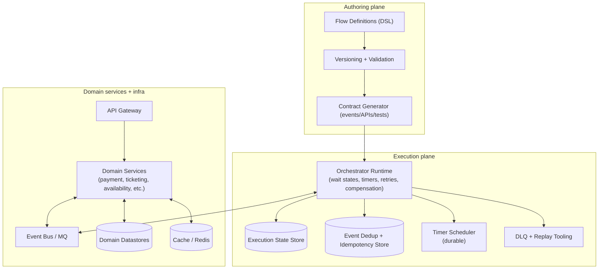
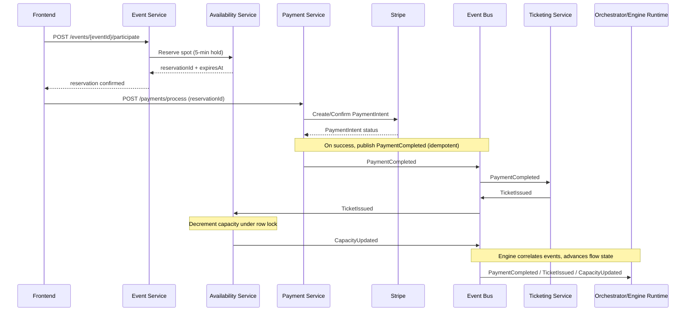

# Extending the Flow Engine to Support FLOW-08-Class Flow Creation

## Executive summary

The entity["book","FLOW-08 Event Participation & Social Integration","internal spec v2.0"] document describes a high‑complexity, multi‑service flow (14+ services, ~145 interactions) that combines (a) an ACID‑sensitive transactional path (reservation hold → payment → ticket issuance → capacity decrement) with (b) time‑based scheduling (calendar sync + progressive reminders + weight multipliers/decay) and (c) social/feed orchestration (participant identification, O(n²) matching, feed insertion rules, and real‑time updates). fileciteturn0file1

To support “flow creation” at this complexity level, the engine must reliably model and execute these characteristics in a way that is compatible with existing (“pre‑FLOW‑08”) flows:

- A **durable, event‑driven execution model** that can wait on and react to external events (e.g., `PaymentCompleted`, `TicketIssued`) and can survive restarts without losing in‑flight state. fileciteturn0file1  
- **First‑class time** in the runtime: timers, deadlines, scheduled triggers, and catch‑up behavior (needed for reminders, multipliers at T‑7/T‑1/T‑0, and post‑event decay). fileciteturn0file1  
- **Idempotency and deduplication** across API calls and event ingestion (explicitly called out by FLOW‑08 for duplicate webhooks and multi‑attempt payments). fileciteturn0file1  
- A “correct by construction” approach for the critical section: capacity control via **row‑level locks** (or equivalent) and consistency around publish/consume ordering. FLOW‑08 explicitly requires Postgres row‑level locks for “last ticket” races. fileciteturn0file1 citeturn0search2turn0search6  
- A standardized integration plane for external systems (payments, calendars, push/SMS/email, websockets), with security primitives (signature verification, encryption) and clear boundaries of responsibility. fileciteturn0file1 citeturn0search5turn2search3turn2search0turn2search1  

Because your current engine capabilities and the “basic prompt” are not available in the provided sources, the “current vs required” mapping below uses **explicit, minimal assumptions** and highlights where verification is needed. fileciteturn0file0 fileciteturn0file1

## Requirements extracted from the FLOW-08 documents

FLOW‑08 is defined as a complete “participate in event” journey that starts with the user hitting `POST /events/{eventId}/participate`, reserves a spot for 5 minutes, optionally runs payment, issues a ticket with an encrypted QR payload, atomically decrements capacity, then performs calendar + reminder scheduling, participant discovery, connection scoring, feed integration, and time‑based weight evolution (pre/during/post event). fileciteturn0file1

The engine‑relevant requirements implied by FLOW‑08 fall into the following categories:

**Execution shape and coordination style**  
FLOW‑08 is fundamentally **event‑driven** after the initial entrypoint: domain services publish and consume events such as `PaymentCompleted`, `TicketIssued`, `CapacityUpdated`, and `EventAddedToCalendar`. fileciteturn0file1 This corresponds to a saga‑like pattern where distributed steps are coordinated via events rather than a single monolithic transaction. citeturn1search2turn1search8

**Timer and schedule semantics**  
The flow requires: reminders at T‑7 days / T‑1 day / T‑1h / T‑15m, multiplier changes at T‑7 / T‑1 / event day, and exponential decay post‑event with a T+7 normalization and a permanent bonus. fileciteturn0file1 This implies the engine must support durable timers and safe catch‑up execution (FLOW‑08 explicitly calls for a 15‑minute catch‑up job when reminders are missed). fileciteturn0file1

**Correctness and concurrency**  
FLOW‑08 explicitly calls out a capacity race (“two users buy the last ticket”) and resolves it via Postgres row‑level locks on event capacity counters. fileciteturn0file1 In entity["organization","PostgreSQL","relational database system"], `SELECT ... FOR UPDATE` and related clauses lock selected rows against concurrent updates. citeturn0search2turn0search6

**Idempotency, retries, DLQ**  
FLOW‑08 includes explicit handling for duplicate payment webhooks (“webhook delivered twice”), retry policies (3 attempts with 1s/5s/30s), and a dead‑letter queue requirement for failed events. fileciteturn0file1 For payments, FLOW‑08 centers on entity["company","Stripe","payments company"] PaymentIntents, which are designed for complex payment lifecycles with statuses that change over time. citeturn0search4turn0search0turn0search8 Stripe also documents verifying webhook signatures using the request payload, the `Stripe-Signature` header, and the endpoint secret. citeturn0search5turn0search9turn0search1

**Data-store expectations**  
FLOW‑08 assumes a polyglot persistence layout: transactional records in Postgres (payments, tickets, capacity counters, participation records), profile/content data in entity["organization","MongoDB","document database"], caches and scheduling structures in entity["company","Redis","in-memory data store"] (including sorted sets for reminders), and an optional entity["company","Neo4j","graph database"] for connection graphs. fileciteturn0file1 Redis sorted sets are explicitly defined as ordered by a numeric score, which fits “schedule by timestamp score” patterns. citeturn0search3turn0search11turn0search7

**Performance and scale constraints**  
FLOW‑08 includes explicit targets and scaling notes: ~1000 bookings/second (queue overflow 10,000), feed batch updates (100 users / 30 seconds), and O(n²) matching for large events with batching/heuristics. fileciteturn0file1 These requirements mean the engine must support backpressure, bounded fan‑out, and partial degradation (FLOW‑08 even notes feed-service degraded mode is acceptable). fileciteturn0file1

**Security primitives**  
FLOW‑08 specifies encrypted QR payloads (“AES‑256 encrypted payload”) and webhook signature verification for payments, and it requires privacy controls such as “attend anonymously,” rate‑limited participant listing APIs, and restricted visibility. fileciteturn0file1 AES is standardized by NIST in FIPS 197, and HMAC is standardized in FIPS 198‑1. citeturn2search0turn2search1 Real‑time updates use WebSockets; the WebSocket protocol’s browser security model is origin‑based. citeturn2search3

## Mapping required flow features to engine capabilities and identifying gaps

### Assumptions about the current engine

Because the “basic prompt” and existing engine documentation/code were not provided, the “current engine” column is a **baseline assumption** consistent with many “v1” flow engines: a DAG/step runner that can execute short‑lived synchronous steps but has limited native support for durable waiting on external events, long timers, and saga compensation. This assumption must be validated by reviewing your engine repo and runtime telemetry. fileciteturn0file0

### Current vs required feature comparison

| Capability area | Required by FLOW-08-class flows | Assumed current engine baseline (to validate) | Gap / missing component | Why it matters for FLOW-08 |
|---|---|---|---|---|
| Event-driven waits | Steps that wait for events like `PaymentCompleted`, `TicketIssued`, `EventAddedToCalendar`, etc. fileciteturn0file1 | Likely “call service A then service B” without durable wait | Event subscription + correlation + durable “wait state” | Most of FLOW‑08 is async, triggered by published events. fileciteturn0file1 |
| Durable timers | T‑7/T‑1/T‑0 triggers, reminder schedule, post‑event decay, catch‑up logic. fileciteturn0file1 | Cron‑only or best‑effort timers | Timer service with persistence, leases, catch‑up semantics | Reminder correctness and weight evolution depend on time. fileciteturn0file1 |
| Idempotency & dedup | Duplicate webhook handling, retry safety, “already processed” behavior. fileciteturn0file1 | Possibly per-API idempotency only or none | Step idempotency, event dedup store, idempotent side‑effect APIs | Prevent duplicate tickets, refunds, notifications. fileciteturn0file1 |
| Retry + DLQ | Explicit retry policy + DLQ tooling. fileciteturn0file1 | Retries at worker layer only | Engine-level retry policies, DLQ, replay tooling | Failures are inevitable across 14 services. fileciteturn0file1 |
| Compensation / saga | Reservation release, ticket invalidation, refund flows, capacity restoration, reminder cancellation, “unwind feed integration.” fileciteturn0file1 | Limited or ad-hoc rollback via custom code | Compensation steps, rollback graph, policy-based cancellation | FLOW‑08 contains explicit cancellation scenarios. fileciteturn0file1 citeturn1search2turn1search8 |
| Concurrency control hooks | Capacity race prevention via row locks in service; orchestration must avoid “double decrement” and coordinate conversion of reservation→ticket. fileciteturn0file1 | No first-class “transaction boundary” modelling | Engine contract for “ACID-owned steps” + invariant checks + reconciliation hooks | The “Payment → Ticket → Capacity” path is correctness-critical. fileciteturn0file1 citeturn0search2turn0search6 |
| Versioning & backward compatibility | Ability to evolve flows without breaking in-flight executions | Partial versioning (flow definitions), unclear runtime compatibility | Flow versioning model, migration strategy, “run old version for old executions” | Long-running executions may outlive deployments. fileciteturn0file1 (implied by timers and post-event behavior) |
| Observability | Correlation IDs across services, traceability of 145-step interactions, metrics for booking latency and drift. fileciteturn0file1 | Service-local logs only | Standard tracing + metrics contracts | Debugging choreography without tracing becomes prohibitive. citeturn1search3turn1search6turn1search12 |
| Security & auditability | Webhook signature verification; QR token crypto; participant privacy; rate limits; audit trails. fileciteturn0file1 | Per-service security, not enforced by engine | Engine-level policy hooks, secret management integration, audit tables/events | FLOW‑08 has explicit privacy modes and security requirements. fileciteturn0file1 citeturn0search5turn2search0turn2search1 |
| Developer ergonomics | Authoring and validating “Flow definitions” with schemas, templates, test harness | Basic JSON config | Flow DSL + linter + simulator + contract tests | 08-class flows require repeatable correctness checks. fileciteturn0file1 |

### Missing data models, APIs, and integration points surfaced by FLOW-08

From FLOW‑08’s event definitions and operational constraints, the engine (and platform) needs the following **minimum** new structures and integration points to make “flow creation” real rather than purely descriptive:

- A canonical event contract registry for events like `PaymentCompleted`, `TicketIssued`, `ParticipantsIdentified`, etc., including schemas and versioning. fileciteturn0file1  
- A durable scheduling substrate for reminders and timeline triggers, aligned with FLOW‑08’s “sorted set scheduling” approach in Redis and its explicit catch‑up behavior requirement. fileciteturn0file1 citeturn0search3turn0search7turn0search11  
- Payment integration guardrails: signature verification and lifecycle handling for Stripe PaymentIntents. fileciteturn0file1 citeturn0search4turn0search5turn0search1  
- A reliable message publication approach to avoid the “dual write” problem between DB state and emitted events; the transactional outbox pattern is a standard way to do this. citeturn1search1turn1search14  

## Proposed architecture changes for flow creation and execution

### Architectural approach

FLOW‑08 already implies (and partially specifies) a microservice/event bus architecture where services own domain state and communicate via events. fileciteturn0file1 The engine extension should therefore focus on **standardizing and productizing**:

1) flow definition authoring (what is a “flow,” what steps/events/timers exist, how they’re validated and versioned), and  
2) flow execution coordination (durable waits/timers/idempotency/compensation) without taking domain ownership away from the domain services.

A practical design is a two-plane architecture:

- **Authoring plane (Flow creation)**: Flow DSL + schema validation + versioning + contract generation (events, APIs, test cases).  
- **Execution plane (Flow runtime)**: Durable orchestration primitives for “wait for event,” timers, retries/DLQ, and compensation—implemented either natively or by integrating a proven durable workflow runtime.

### Build vs integrate decision point

There are two credible paths:

- **Extend your engine natively** with durable execution primitives (state store, event correlation, timers).  
- **Compile the Flow DSL to a durable workflow runtime** such as entity["company","Temporal","workflow orchestration platform"], which explicitly provides durable workflow execution and supports versioning patterns to update code without breaking determinism for in-flight executions. citeturn1search4turn1search0turn1search7turn1search17  

Given the breadth of FLOW‑08 (timers + retries + long-lived state + compensation), integrating with a durable runtime is typically lower risk than re-inventing those primitives, but compatibility constraints of your existing engine might make a native extension preferable. The remainder of this report is written so it can be implemented in either mode (native or compiled-to-durable-runtime).

### Reference architecture



This matches FLOW‑08’s “services publish/consume events” posture and adds a cohesive **engine layer** for: correlation, timers, idempotency, DLQ, and operational visibility. fileciteturn0file1

### Key sequence: Payment → Ticket → Capacity, with idempotency and durability



This sequence aligns with FLOW‑08’s explicit phases and event list. fileciteturn0file1 It also matches Stripe’s lifecycle approach (PaymentIntent status changes) and their documented webhook signature verification requirement (the webhook receiver must validate the `Stripe-Signature` header using the payload and endpoint secret). citeturn0search4turn0search5turn0search1 Postgres row locks for `SELECT ... FOR UPDATE` are explicitly documented as locking selected rows against concurrent updates. citeturn0search2turn0search6

## Data schemas, APIs, and state management changes

### Flow definition schema requirements (engine-level)

FLOW‑08 contains enough structure to derive a consistent “Flow Definition” schema. At minimum, your engine’s DSL should support:

- `entry_points`: HTTP entrypoints like `POST /events/{eventId}/participate` and fallback entrypoints like `/payments/process`. fileciteturn0file1  
- `events`: published/consumed events with schemas (FLOW‑08 defines `PaymentCompleted`, `TicketIssued`, `CapacityUpdated`, etc.). fileciteturn0file1  
- `phases` with:
  - conditional branches (paid vs free events, waitlist),
  - parallel fan-out (matching service sub-queries happen “in parallel” across questionnaire/group/audience components),
  - “wait for event” edges,
  - timer triggers for time evolution and reminders. fileciteturn0file1  
- `retry_policy` and `dlq` configuration (FLOW‑08 specifies retries and DLQ). fileciteturn0file1  
- `compensations` (explicit unwind actions on organizer cancellation and user cancellation). fileciteturn0file1  

### Execution persistence (engine-level)

To make flow executions durable, store execution state independently of domain services. A practical minimal relational schema:

- `flow_definitions(flow_id, latest_version, status, created_at)`
- `flow_versions(flow_id, version, definition_json, schema_hash, published_at)`
- `flow_executions(execution_id, flow_id, version, status, correlation_key, started_at, updated_at)`
- `flow_execution_steps(execution_id, step_id, status, attempt, last_error, updated_at)`
- `flow_execution_events(execution_id, event_key, event_type, dedup_hash, received_at)`
- `flow_execution_timers(execution_id, timer_id, fire_at, status, lease_owner, leased_until)`

This structure directly enables: wait states (step status = WAITING), dedup (event_key + dedup_hash uniqueness), replay, and timer leasing for HA timer dispatch.

A transactional outbox can be used within the engine (and/or within domain services) to ensure “DB state update + event publish” is reliable despite failures. citeturn1search1turn1search14

### Domain data models implied by FLOW-08 (platform-level)

FLOW‑08 explicitly states that Postgres holds payments/tickets/capacity/participation records, Redis holds reservation holds and caches, and reminders are scheduled in Redis sorted sets. fileciteturn0file1 Redis sorted sets are an ordered collection of unique members by score, making them suitable for timestamp scheduling (score = epoch seconds). citeturn0search3turn0search11turn0search7

For the FLOW‑08‑class “participation” domain, ensure your platform has canonical tables/collections equivalent to:

- `event_reservations` (hold token, expiry, status)  
- `payments` (provider ids, status, idempotency key, reservation link)  
- `tickets` (ticket id, status, QR material, issuance time)  
- `event_participations` (attendance status, anonymity flag, cancellation times)  
- `participant_connections` (event_id + user_id + participant_id key, base_score + breakdown + computed_at)  

These are consistent with FLOW‑08’s explicit phase requirements, event payload fields, and cancellation/refund scenarios. fileciteturn0file1

### API contracts for flow creation and execution

A minimal set of engine APIs to support “flow creation” (authoring + execution introspection):

```http
POST /flow-definitions
Content-Type: application/json

{
  "flowId": "FLOW-08",
  "version": "2.0.0",
  "definition": { "...DSL JSON..." },
  "publish": false
}
```

```http
POST /flow-definitions/FLOW-08/versions/2.0.0/publish
```

```http
POST /flow-executions
Content-Type: application/json

{
  "flowId": "FLOW-08",
  "version": "2.0.0",
  "correlationKey": {
    "eventId": "evt_123",
    "userId": "usr_456"
  },
  "input": {
    "entryPoint": "POST /events/{eventId}/participate",
    "payload": { "attendAnonymously": false }
  }
}
```

```http
POST /flow-executions/{executionId}/external-events
Content-Type: application/json

{
  "eventType": "PaymentCompleted",
  "eventId": "stripe_evt_...",
  "payload": { "...per schema..." }
}
```

FLOW‑08’s own event schemas (e.g., `PaymentCompleted`, `TicketIssued`) should be registered in the engine’s schema registry and validated at ingestion time to prevent downstream breakage. fileciteturn0file1

### Security and compliance hooks the engine must enforce

- **Webhook verification**: Stripe documents verifying signatures using the payload, `Stripe-Signature` header, and endpoint secret. The engine should provide a standard library or policy gate (fail closed) for webhook endpoints used in flows. citeturn0search5turn0search1turn0search9  
- **Cryptography boundaries**: FLOW‑08 requires encrypted QR payloads; AES is standardized in NIST FIPS 197 and HMAC in FIPS 198‑1. The engine should not embed key material in flow definitions and should integrate with a secret manager / KMS abstraction. fileciteturn0file1 citeturn2search0turn2search1  
- **WebSocket hardening**: RFC 6455 notes the origin-based browser security model; the engine should standardize origin checks/auth token validation for any “real-time” flow step definitions. fileciteturn0file1 citeturn2search3  
- **Audit trail**: FLOW‑08 requires audit logging for payments, scans, capacity changes, refunds. The engine should include (or mandate) correlation IDs and structured audit events per execution. fileciteturn0file1  

## Implementation tasks, estimates, tests, and rollout

### Prioritized task list with estimates

Estimates assume a small senior team and parallel development; they are intentionally expressed as **person‑weeks** and should be recalibrated after you confirm current engine internals.

| Priority | Task | Scope | Estimate | Dependencies | FLOW-08 tie-in |
|---|---|---|---|---|---|
| P0 | Define Flow DSL v2 and schema registry | Authoring plane: events, timers, waits, compensation, retry/DLQ config | 2–3 pw | None | FLOW‑08 has explicit phases + event schemas. fileciteturn0file1 |
| P0 | Durable execution state store | Execution tables: executions, step status, timers, event ingestion, dedup | 3–5 pw | DSL schema | Needed for multi-day timers and post-event decay. fileciteturn0file1 |
| P0 | Event correlation + dedup | Correlation keys, idempotency store, “already processed” semantics | 2–3 pw | State store | Handles duplicate webhooks and retries. fileciteturn0file1 |
| P0 | Timer service with leases + catch-up | Durable timers; “fire when due”; catch-up semantics | 2–4 pw | State store | Supports reminder schedule + multipliers + decay. fileciteturn0file1 |
| P0 | Retry policies + DLQ + replay tool | Engine-controlled retries, DLQ surfacing, replay from event log | 2–4 pw | Event ingestion | FLOW‑08 mandates retries/DLQ. fileciteturn0file1 |
| P0 | Outbox support (engine + recommended for services) | Transactional outbox + dispatcher pattern | 2–3 pw | State store | Prevents “DB write succeeds but event publish fails.” citeturn1search1turn1search14 |
| P1 | Compensation graph support | Define compensations per step, cancellation propagation | 2–4 pw | DSL v2 | Needed for organizer cancellation unwind and user cancellation. fileciteturn0file1 |
| P1 | Observability standards (trace/metrics/logs) | Correlation ID propagation; OTel span conventions; dashboards | 1–2 pw | Runtime primitives | Makes 145 interactions debuggable. fileciteturn0file1 citeturn1search3turn1search12 |
| P1 | Engine security policy layer | Webhook verification adapters; secrets/KMS integration; audit tables | 2–3 pw | DSL + runtime | Enforces flow security invariants. fileciteturn0file1 citeturn0search5turn2search0turn2search1 |
| P2 | Developer tooling | CLI/linter, local runner, contract-test generator, fixtures | 2–4 pw | DSL v2 | Improves ergonomics, reduces regressions. fileciteturn0file1 |
| P2 | FLOW‑08 “golden flow” template | Canonical definition + integration tests for this flow | 1–2 pw | Core runtime done | Turns FLOW‑08 into regression suite. fileciteturn0file1 |
| P2 | Optional: compile-to-durable-runtime adapter | Compile DSL to Temporal (or similar) for durability/timers/versioning | 3–6 pw | DSL v2 | Accelerates durable exec; versioning is documented. citeturn1search4turn1search0turn1search7 |

### Test cases and validation criteria

FLOW‑08 provides concrete edge cases, scaling constraints, and required behaviors; these should become your engine’s acceptance suite. fileciteturn0file1

**Core engine correctness tests (deterministic/unit + integration)**  
- **Event dedup**: ingest the same `PaymentCompleted` twice; verify exactly one advancement of the execution state and one downstream “ticket issuance trigger.” fileciteturn0file1  
- **Timer catch-up**: schedule reminders, simulate engine downtime past T‑1h, then resume; verify catch-up behavior (send immediately with adjusted semantics) as required by FLOW-08. fileciteturn0file1  
- **Retry policy enforcement**: inject transient failures into a step and validate 1s/5s/30s delays and DLQ placement after the final attempt. fileciteturn0file1  
- **Correlation correctness**: verify correlation keys `(userId,eventId)` map inbound events to the right execution even when multiple executions exist for the same user across events. fileciteturn0file1  

**Platform end-to-end tests derived from FLOW‑08**  
- **Capacity race**: simulate two near-simultaneous purchase completions for the last spot; validate capacity never goes below zero and the loser path offers waitlist (or equivalent). FLOW‑08 requires row-level locks for this. fileciteturn0file1 citeturn0search2turn0search6  
- **Paid vs free branch**: free events skip payment but still emit/consume `TicketIssued` and schedule calendar/reminders/social integration identically. fileciteturn0file1  
- **Large-event matching guardrails**: for 1000+ participants, validate bounded fan-out (top‑K or context-filtered) and “default base weight” handling for zero-context pairs, per FLOW‑08’s scaling notes. fileciteturn0file1  
- **Feed diversity rules**: enforce “max 40% participant content” and “min 3 posts between same participant,” with multiplier timeline effects on ranking. fileciteturn0file1  

**Validation criteria aligned to stated targets**  
- Booking throughput supports the documented target (1000/sec) at acceptable tail latency, with queue overflow handling. fileciteturn0file1  
- No “capacity drift” invariant violations (FLOW‑08 treats drift as a P0 alert condition). fileciteturn0file1  
- Reminder delivery meets the required SLA (miss detection + catch-up) even during partial outages. fileciteturn0file1  
- Security: Stripe webhooks are rejected if signature verification fails, per Stripe documentation. citeturn0search5turn0search1  

### Rollout plan

A safe rollout strategy for engine extensions that must preserve backward compatibility:

- **Additive deployment**: introduce DSL v2 and runtime primitives behind feature flags while preserving existing flow execution semantics for older flows/versions.  
- **Shadow executions**: for selected low-risk flows, run the new runtime in “observer mode” (ingest the same events, compute state transitions, but do not execute side effects) to validate determinism and correlation.  
- **Canary by flow ID/version**: enable FLOW‑08 for a small subset of events (by `eventId`) and scale gradually, aligning with FLOW‑08’s explicit degraded-mode stance for feed updates. fileciteturn0file1  
- **Operational readiness gates**: block rollout until DLQ tooling, replay, dashboards, and audit logs are in place, because FLOW‑08 is explicitly high complexity and crosscuts payments and security. fileciteturn0file1  

### Risk and mitigation table

| Risk | Impact | Likelihood | Mitigation | Source alignment |
|---|---|---|---|---|
| Duplicate event ingestion (webhooks, retries) causes double ticket issuance or double refunds | High (financial + trust) | High | Engine-level event dedup + idempotent step contracts; enforce signature verification for payment webhooks | FLOW‑08 calls out “double webhook” explicitly. fileciteturn0file1 Stripe documents signature verification inputs. citeturn0search5turn0search1 |
| Capacity oversell under concurrency | High (operational + safety) | Medium–High | Keep capacity ownership in availability domain service with row-level locks; add reconciliation + invariant alerts | FLOW‑08 mandates row locks for “last ticket” race. fileciteturn0file1 Postgres row locks are documented. citeturn0search2turn0search6 |
| Timer drift / missed reminders due to engine downtime | Medium–High (engagement + trust) | Medium | Durable timers with leases; catch-up semantics; store schedules in durable store and/or Redis sorted sets | FLOW‑08 specifies catch-up every 15 min and Redis sorted set scheduling. fileciteturn0file1 Redis sorted sets are score-ordered collections. citeturn0search3turn0search7turn0search11 |
| Explosive matching workload for large events (O(n²)) | Medium–High (cost + latency) | High | Top‑K computation, context-based prefilters, batch limits with timeouts, degrade to default weights | FLOW‑08 documents O(n²) and batching/heuristics. fileciteturn0file1 |
| Dual-write inconsistency (DB updated, event not published or vice versa) | High (state corruption) | Medium | Transactional outbox for services/engine; replayable event publication | Transactional outbox pattern addresses DB+event consistency. citeturn1search1turn1search14 |
| Backward compatibility break for older flows when adding new runtime primitives | High (platform stability) | Medium | Flow versioning guarantees; route executions to runtime by flow version; migration tests | Durable runtimes emphasize versioning for in-flight executions (example: Temporal versioning). citeturn1search0turn1search7turn1search17 |
| Security regressions in real-time channels | Medium (account compromise/data leak) | Medium | Engine-enforced websocket origin checks + auth; standardized security policy hooks | WebSocket security model is origin-based (RFC 6455). citeturn2search3 |
| Cryptographic misuse for QR tokens (mode/key/rotation errors) | High (ticket fraud) | Medium | Central crypto library; KMS-backed key management; design review; align primitives with standards | FLOW‑08 requires encrypted QR payload; AES and HMAC standards exist. fileciteturn0file1 citeturn2search0turn2search1 |

