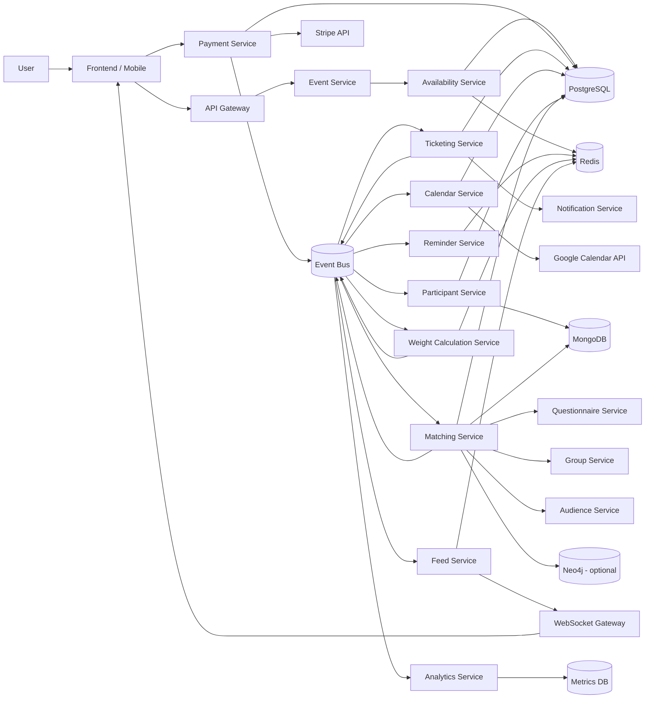
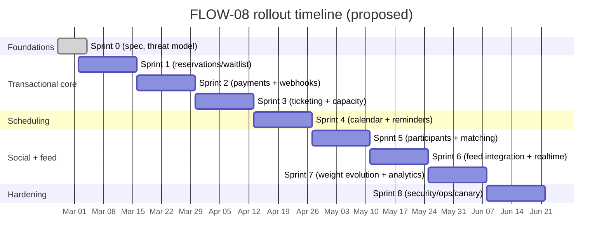

# Extending the platform with FLOW-08 Event Participation and Social Integration

## Executive summary

The attached FLOW-08 specification describes an end-to-end “participate in event” capability that goes beyond registration and ticketing: it couples a transactional booking pipeline (capacity checks, reservation holds, payment, ticket issuance, refunds/cancellations) with calendar + reminder automation and a time-evolving social layer that injects co-attendees’ content into each participant’s feed with dynamic ranking multipliers and decay. fileciteturn0file0

From an engineering perspective, this extension is best treated as a **saga-style, event-driven workflow** with clear ACID boundaries around the “Payment → Ticket → Capacity” critical path. The spec explicitly calls out PostgreSQL row-level locking for capacity counters and Redis for short-lived reservations, caches, reminder schedules (sorted sets), and feed positioning. fileciteturn0file0 The practical implication is that correctness relies on (a) **idempotency across APIs and event consumers**, (b) **durable event publication** (e.g., outbox or equivalent), (c) **bounded fan-out** for O(n²) matching in large events, and (d) **strong observability** to debug cross-service latency and race conditions.

Key implementation choices to lock early:

- **Payments**: Use the entity["company","Stripe","payments company"] PaymentIntents lifecycle; Stripe recommends idempotency keys for POST requests and provides a dedicated idempotency mechanism. citeturn0search0turn0search8turn4search4turn4search13 Webhook signature verification should be mandatory for payment confirmation. citeturn0search4turn3search7 Stripe retries undelivered webhooks for up to three days; the system must support reconciliation/catch-up. citeturn3search3  
- **Capacity correctness**: Enforce row-level locks for the “last ticket” race; `SELECT … FOR UPDATE` (or tighter variants) locks selected rows against concurrent updates. citeturn0search1turn0search5  
- **Reminders**: Redis sorted sets are a natural fit for “dispatch when score ≤ now” scheduling, matching the spec’s design. citeturn0search2turn0search6turn0search10  
- **Time zones**: The spec mandates UTC storage and user-local scheduling; use RFC 3339 timestamps for API interchange and store an IANA time zone identifier for correct wall-time reconstruction. citeturn2search2turn1search5turn1search8  
- **Calendar integration**: For entity["company","Google","technology company"] Calendar, creating events requires appropriate OAuth scopes; official docs also cover reminders/notifications semantics. citeturn1search6turn1search15turn1search3 For entity["company","Apple","technology company"], EventKit is the primary on-device calendar integration path (permissioned). citeturn2search0turn2search13  
- **Security primitives**: If QR payloads are encrypted and webhook signatures use HMAC, implementations should align with widely accepted standards (AES per NIST FIPS 197; HMAC per NIST FIPS 198-1). citeturn3search0turn3search1

## Process extraction and ambiguities

### Concise extraction of the FLOW-08 process

FLOW-08 is defined as a “complete event participation journey” spanning payments, ticket issuance, capacity management, calendar integration, progressive reminders, participant identification, connection scoring, feed integration, and time-based ranking evolution (pre/during/post event). It explicitly states this flow touches 14+ services and references 145 discrete interactions (draw.io), while providing a higher-level step breakdown across ~10 phases. fileciteturn0file0

At a high level:

- **Availability + reservation hold**: check capacity; if available, reserve a spot with a 5‑minute hold (Redis + DB), else return “Event full” and optionally offer waitlist. fileciteturn0file0  
- **Payment (paid events only)**: create and confirm a Stripe PaymentIntent; on decline/timeout release the reservation; on success persist transaction and emit `PaymentCompleted`. fileciteturn0file0  
- **Ticket issuance**: ticketing generates a ticket and QR code and emits `TicketIssued`. fileciteturn0file0  
- **Capacity decrement (ACID)**: availability consumes `TicketIssued` and atomically decrements capacity using PostgreSQL row locks; publish `CapacityUpdated`. fileciteturn0file0  
- **Calendar + reminders**: calendar consumes `TicketIssued`, adds event, emits `EventAddedToCalendar`; reminder service schedules T‑7d/T‑1d/T‑1h/T‑15m reminders in Redis sorted sets and emits `RemindersScheduled`. fileciteturn0file0  
- **Social graph & feed**: participant identification publishes `ParticipantsIdentified`; matching computes per-pair weights using four equally weighted components (history, questionnaire similarity, group overlap, audience match), stores results, and emits `ParticipantConnectionsCalculated`; feed integrates co-attendee posts with diversity caps and spacing rules. fileciteturn0file0  
- **Time evolution**: scheduled triggers amplify weights as the event approaches (1.5× at T‑7, 2× at T‑1, 3× on event day) and apply post-event exponential decay back to base by T+7 plus a permanent +0.05 bonus. fileciteturn0file0  

### Ambiguities, underspecified areas, and missing details

The spec is intentionally high-level in several areas; these gaps must be resolved to implement rigorously:

- **Payment methods scope**: The flow lists payment methods including PayPal and Apple Pay (and “crypto”), but does not specify which are truly supported by the chosen PSP(s) in your business region(s), nor does it define method-selection logic or fallback PSP strategy. Stripe provides a structured view of supported payment method families and warns that method availability depends on country/currency/product/API support. citeturn4search0turn4search3turn4search11  
- **Stripe confirmation source of truth**: The doc mentions both synchronous confirmation and webhook handling (including duplicate webhook delivery). It doesn’t state whether ticket issuance is allowed from synchronous “client-confirmed” flows, or exclusively from server-side webhook success. Given webhook retries and the need for idempotent processing, the authoritative event source must be defined. citeturn0search4turn3search3turn3search7  
- **Reservation semantics**: “5-minute lock (Redis + DB)” is specified, but not the exact algorithm (token design, re-entrancy, idempotent retries, what happens if Redis is down, whether holds can be extended, etc.). fileciteturn0file0  
- **Capacity counters model**: The spec references `events.available_places` and counters for reserved/waitlist/sold, but does not define the canonical schema, invariants (e.g., total = available + sold + reserved?), or how drift is detected and repaired. fileciteturn0file0  
- **QR encryption details**: “AES‑256 encrypted payload” is stated, but not the **mode** (e.g., GCM vs CBC), key management (KMS, rotation, per-event vs global keys), nonce/IV strategy, replay protections, and how 15‑minute rotation interplays with offline scanning. fileciteturn0file0 In general, AES is standardized by NIST, but higher-level construction choices remain open. citeturn3search0  
- **Calendar integration for Apple**: The doc implies an “OAuth token” model for Apple Calendar; in practice, a common approach is client-side EventKit access (permissioned) rather than server-side writes. The exact integration target (device calendar vs iCloud CalDAV vs an ICS download) must be clarified. citeturn2search0turn2search13  
- **Matching formulas are partial**: Several sub-factors are named but undefined (e.g., `industry_similarity_score`, `role_match_score`, vector encodings for “cosine similarity”, normalization specifics). fileciteturn0file0  
- **Feed ranking integration contract**: The doc defines diversity caps and display formats, but does not specify how the feed system consumes computed weights (pull vs push), how re-ranking is stored, and what happens under partial failure (feed-service degraded mode is allowed). fileciteturn0file0  

## Architecture and step-to-component mapping

### Reference architecture aligned to FLOW-08

The FLOW-08 doc implies a microservice + event bus architecture with durable stores per domain and Redis as the low-latency coordination layer (holds, caches, sorted sets, feed positions). fileciteturn0file0 The payment path should implement strict idempotency and race protection; for row locks, PostgreSQL’s `SELECT … FOR UPDATE` (or similar) is the typical mechanism to block concurrent updates to the same row. citeturn0search1turn0search5



Notes that relate to primary sources:

- Stripe webhooks must be verified using the request payload, `Stripe-Signature` header, and the endpoint secret. citeturn0search4  
- Stripe advises idempotency keys for safely retrying POST operations. citeturn0search8turn0search12  
- Redis sorted sets are members ordered by score and commonly used for scheduling/time-ordered queues; `ZADD` and `ZRANGEBYSCORE` are core primitives for “add schedule” and “fetch due work.” citeturn0search2turn0search6turn0search10  
- WebSockets provide two-way communication with an origin-based browser security model and are appropriate for “event day real-time feed updates.” citeturn3search2  

### Step-to-component mapping with inputs/outputs, state, integrations

The table below maps the FLOW-08 numbered phase steps (as provided) into implementable platform contracts. It is intentionally compact (grouping contiguous steps) while preserving every numbered step reference. fileciteturn0file0

| Steps | Phase | Owning component(s) | Interface (sync/async) | Required inputs | Outputs & side effects | Storage & models | Integration points |
|---|---|---|---|---|---|---|---|
| 1 | Availability check | Frontend, API Gateway | Sync HTTP | `eventId`, user auth | Calls participate endpoint | — | AuthN/AuthZ |
| 2–3 | Availability check | Event Service → Availability | Sync internal RPC/HTTP | `eventId`, `userId` | Capacity check (cache + DB) | `events` capacity fields; cache keys | Redis cache TTL; PG read |
| 4 | Availability check | Availability Service | Sync HTTP response | `eventId` | “Event full” + waitlist offer | `waitlist_entries` (optional) | Notification copy, UI |
| 5 | Availability check | Availability Service | Sync (atomic hold) | `eventId`,`userId` | Creates 5-min reservation hold | `event_reservations` + Redis lock key | Redis TTL; PG write |
| 6 | Availability check | Event Service | Sync HTTP response | reservation token | Reservation confirmation | reservation token returned | Client holds token |
| 7–8 | Payment | Frontend | UX | reservation token | Collects payment details | — | Payment UI |
| 9 | Payment | Frontend → Payment Service | Sync HTTP | reservation token, amount, method | Initiates payment | `payments` (pending) | PSP client secrets |
| 10 | Payment | Payment Service → Stripe | Sync API call | amount, currency, metadata, idempotency | PaymentIntent created/confirmed | Stripe PaymentIntent object | Stripe PaymentIntents lifecycle citeturn4search4turn4search13 |
| 11 | Payment failure | Payment, Availability | Sync + async cleanup | decline/timeout | Release reservation; show retry | `event_reservations` status update | Stripe cancellation (if applicable) |
| 12 | Payment success | Payment Service | Async event publish | success confirmation | Persist txn; emit `PaymentCompleted` | `payments` completed; outbox | Webhook verification + retries citeturn0search4turn3search3 |
| 13 | Payment | Payment Service | Sync HTTP response | paymentId | “Payment confirmed” state | — | Client transitions |
| 14–18 | Ticketing | Ticketing Service | Async consume & publish | `PaymentCompleted` (or free registration) | Generate ticket + QR; deliver; emit `TicketIssued` | `tickets` + delivery logs | Email, in-app, Wallet |
| 19–21 | Capacity + calendar | Availability Service | Async consume & publish | `TicketIssued` | Atomic decrement; cache refresh; emit `CapacityUpdated` | `events` counters; audit | PG row locks citeturn0search1turn0search5 |
| 22–23 | Calendar | Calendar Service | Async consume & publish | `TicketIssued` | Create calendar entry; emit `EventAddedToCalendar` | `calendar_event_links` | Google Calendar create event citeturn1search6turn1search12 |
| 24–28 | Reminders | Reminder Service | Async consume & schedule | `EventAddedToCalendar`, user TZ prefs | Compute times; schedule in sorted sets; emit `RemindersScheduled` | Redis ZSET + durable `reminders` | Redis sorted sets citeturn0search2turn0search6 |
| 29–31 | Participants | Participant Service | Async compute & publish | `TicketIssued`, privacy flags | Lists attendees (excl. current user); emit `ParticipantsIdentified` | `event_participations`, profile cache | Rate limiting; organizer visibility |
| 32–37 | Matching | Matching Service (+ subservices) | Async fan-out + store + publish | participants list | Sub-scores + composite; store; emit `ParticipantConnectionsCalculated` | `participant_connections` + optional graph | Questionnaire/Group/Audience APIs |
| 38–45 | Feed integration | Feed Service | Async integrate + realtime | connections + public posts | Insert posts with diversity rules; emit `ParticipantPostsIntegrated`; WebSocket update | Feed positions in Redis; analytics logs | WebSockets citeturn3search2 |
| 46–52 | Time evolution | Reminder + Weight Calc + Feed | Scheduled triggers | event start time; phase triggers | Adjust multipliers; reorder/pin; emit `FeedWeightsAdjusted`/`EventFeedPrioritized` | weight cache; feed positions | Cron/scheduler correctness |
| 53–59 | Post-event | Weight Calc + Analytics | Async + scheduled | `EventCompleted` + time | Exponential decay; apply +0.05 bonus; metrics; emit `EventParticipationAnalyzed` | participation history | Analytics retention policies |

## Data model and API design

### Data storage mapping by domain

The flow’s storage intentions are explicit: ACID-required domains (payments/tickets/capacity/participation) in PostgreSQL, higher-churn profile/content and connection details in MongoDB, low-latency coordination in Redis, and optional Neo4j for graph queries. fileciteturn0file0 For the scheduler, Redis sorted sets’ “score-ordered members” model is well-suited to reminder dispatch. citeturn0search2turn0search6

### New or modified relational schemas

The following tables are a **minimal, implementable core** that satisfies FLOW-08’s invariants, supports idempotency and reconciliation, and cleanly separates “holds” from “confirmed participation.”

#### events (modified)

Assuming an existing `events` table exists (from FLOW-03), FLOW-08 requires explicit counters and clear invariants.

| Column | Type | Constraints | Purpose |
|---|---|---|---|
| `event_id` | uuid | PK | Event identity |
| `starts_at_utc` | timestamptz | not null | Canonical event time in UTC (store/compute) citeturn2search2turn1search8 |
| `ends_at_utc` | timestamptz | not null | End time |
| `event_timezone` | text | not null | IANA TZ id used for display/scheduling citeturn1search5turn1search8 |
| `capacity_total` | int | not null | Total capacity |
| `capacity_available` | int | not null | Remaining confirmed spots |
| `capacity_reserved` | int | not null | Active holds (in payment flow) |
| `capacity_waitlist` | int | not null | Active waitlist size |
| `tickets_sold` | int | not null | Confirmed tickets issued |
| `updated_at` | timestamptz | not null | Drift detection, cache invalidation |

**Invariant suggestion** (enforce via transaction + periodic reconciliation):  
`capacity_total = capacity_available + tickets_sold + capacity_reserved` (waitlist kept separate).

Row-level locking: the decrement path should lock the `events` row before updating these counters to prevent “two users buy last ticket” races. citeturn0search1turn0search5

#### event_reservations (new)

| Column | Type | Constraints | Purpose |
|---|---|---|---|
| `reservation_id` | uuid | PK | Hold identity |
| `event_id` | uuid | FK(events) | Event |
| `user_id` | uuid | not null | Reserving user |
| `status` | text | not null | `held`, `expired`, `released`, `converted` |
| `expires_at` | timestamptz | not null | 5-minute hold deadline |
| `idempotency_key` | text | unique | Supports repeat participate calls |
| `created_at` | timestamptz | not null | Audit |
| `updated_at` | timestamptz | not null | Audit |

Redis lock key pattern (example): `reservation:{eventId}:{userId}` with TTL=300s.

#### payments (new or extended)

Stripe recommends idempotency keys for safely retrying POST requests and documents a first-class idempotency mechanism. citeturn0search8turn0search12

| Column | Type | Constraints | Purpose |
|---|---|---|---|
| `payment_id` | uuid | PK | Internal payment identity |
| `event_id` | uuid | not null | Event |
| `user_id` | uuid | not null | Payer |
| `reservation_id` | uuid | FK(event_reservations) | Links payment to hold |
| `provider` | text | not null | `stripe` |
| `provider_payment_intent_id` | text | unique | Stripe PaymentIntent id |
| `status` | text | not null | mirrored lifecycle / normalized states |
| `amount_value` | bigint | not null | smallest currency unit citeturn4search9 |
| `currency` | text | not null | ISO 4217 |
| `breakdown_ticket_price` | bigint | not null | pricing transparency |
| `breakdown_service_fee` | bigint | not null | pricing transparency |
| `breakdown_tax` | bigint | not null | pricing transparency |
| `payment_method_type` | text | null | card, bank_transfer, apple_pay, etc. |
| `idempotency_key` | text | unique | per “attempt” or per cart/order |
| `created_at` | timestamptz | not null | Audit |
| `completed_at` | timestamptz | null | success time |

#### tickets (new)

| Column | Type | Constraints | Purpose |
|---|---|---|---|
| `ticket_id` | uuid | PK | Ticket identity |
| `event_id` | uuid | not null | Event |
| `user_id` | uuid | not null | Holder |
| `payment_id` | uuid | FK(payments) null | Null for free tickets |
| `ticket_number` | text | unique | Human-readable |
| `ticket_type` | text | not null | standard/vip/early_bird/group |
| `seat` | text | null | Optional reserved seating |
| `section` | text | null | Optional reserved seating |
| `status` | text | not null | `issued`, `cancelled`, `used` |
| `qr_secret_ref` | text | not null | Reference to KMS secret/material |
| `qr_rotated_at` | timestamptz | not null | Rotation tracking |
| `issued_at` | timestamptz | not null | Ticket issuance timestamp |

Encryption note: AES is standardized (FIPS 197); your exact token format should use an authenticated mode and robust key management. citeturn3search0

#### ticket_scans (new)

| Column | Type | Constraints | Purpose |
|---|---|---|---|
| `scan_id` | uuid | PK | Scan record |
| `ticket_id` | uuid | FK(tickets) | Ticket |
| `event_id` | uuid | not null | Event |
| `scanner_id` | uuid | null | staff user/device owner |
| `scanned_at` | timestamptz | not null | When |
| `result` | text | not null | `accepted`, `rejected` |
| `reason` | text | null | e.g., already used |

Single-scan enforcement is best implemented as an atomic `UPDATE … WHERE status='issued' RETURNING …` on `tickets`.

#### event_participations (new)

| Column | Type | Constraints | Purpose |
|---|---|---|---|
| `participation_id` | uuid | PK | Participation record |
| `event_id` | uuid | not null | Event |
| `user_id` | uuid | not null | Participant |
| `ticket_id` | uuid | FK(tickets) | Ticket |
| `status` | text | not null | `registered`, `cancelled`, `attended`, `no_show` |
| `participation_type` | text | not null | `in_person`, `virtual`, `anonymous` |
| `attend_anonymously` | boolean | not null | Privacy control |
| `registered_at` | timestamptz | not null | When registered |
| `cancelled_at` | timestamptz | null | When cancelled |

This table is the canonical source for “who is attending,” with filtering rules for participant discovery.

#### waitlist_entries (new)

| Column | Type | Constraints | Purpose |
|---|---|---|---|
| `waitlist_entry_id` | uuid | PK | Waitlist identity |
| `event_id` | uuid | not null | Event |
| `user_id` | uuid | not null | User |
| `position` | int | not null | Deterministic ordering |
| `status` | text | not null | `active`, `upgraded`, `cancelled`, `expired` |
| `upgrade_expires_at` | timestamptz | null | “30 minutes to complete” |
| `created_at` | timestamptz | not null | Audit |

#### participant_connections (new; partitioned)

Because the matching computation can be O(n²), the table should be **partitioned by event** and/or store only top-K connections per user for large events.

| Column | Type | Constraints | Purpose |
|---|---|---|---|
| `event_id` | uuid | not null | Event |
| `user_id` | uuid | not null | Owner user (whose feed is affected) |
| `participant_id` | uuid | not null | Other attendee |
| `base_score` | double precision | not null | 0..1 composite score |
| `event_history_score` | double precision | not null | breakdown |
| `questionnaire_score` | double precision | not null | breakdown |
| `group_score` | double precision | not null | breakdown |
| `audience_score` | double precision | not null | breakdown |
| `strength` | text | not null | strong/medium/weak |
| `computed_at` | timestamptz | not null | When computed |
| PK | — | (`event_id`,`user_id`,`participant_id`) | Uniqueness |

### API endpoints (external + key internal)

Stripe’s PaymentIntents model supports status transitions over the PaymentIntent lifecycle; your API layer should expose stable, platform-specific states while mapping provider statuses internally. citeturn4search4

| Method | Path | Owner | Auth | Idempotency | Purpose | Emits (async) |
|---|---|---|---|---|---|---|
| POST | `/events/{eventId}/participate` | Event Service | user | required (`Idempotency-Key`) | Create reservation / start flow | `ReservationHeld` (optional) |
| POST | `/payments/process` | Payment Service | user | required | Create/confirm payment attempt | `PaymentCompleted` |
| POST | `/payments/webhooks/stripe` | Payment Service | none (signed) | provider event id | Stripe webhook receiver | `PaymentCompleted` / `PaymentFailed` |
| GET | `/events/{eventId}/ticket` | Ticketing Service | user | n/a | Retrieve user’s ticket | — |
| POST | `/events/{eventId}/waitlist` | Availability Service | user | required | Join waitlist | `AddedToWaitlist` |
| DELETE | `/events/{eventId}/participation` | Event Service | user | required | Cancel participation + refund policy | `ParticipationCancelled` |
| GET | `/events/{eventId}/participants` | Participant Service | user/organizer | n/a | Paginated participant list (privacy-aware) | — |
| GET | `/events/{eventId}/connections` | Matching Service | user | n/a | Connection scores for current user | — |
| POST | `/events/{eventId}/tickets/scan` | Ticketing Service | staff | required | QR validation + mark used | `TicketScanned` |
| POST | `/events/{eventId}/calendar/link` | Calendar Service | user | required | Link/sync calendar entry | `EventAddedToCalendar` |
| POST | `/events/{eventId}/reminders/reschedule` | Reminder Service | user | required | Reschedule reminders (date changed) | `RemindersScheduled` |

#### Request/response examples

**Initiate participation**

```http
POST /events/3fa85f64-5717-4562-b3fc-2c963f66afa6/participate
Idempotency-Key: 6d4f2b7a-0d37-4f16-9c4e-5c0d0f7c9b31
Authorization: Bearer <token>
Content-Type: application/json

{
  "mode": "standard",
  "attendAnonymously": false
}
```

```json
{
  "reservationId": "0b6f0d4f-0f4c-4c1b-9b1a-1bdbf9a5a0b9",
  "expiresAt": "2026-03-02T10:15:00Z",
  "event": {
    "eventId": "3fa85f64-5717-4562-b3fc-2c963f66afa6",
    "isPaid": true,
    "price": { "value": 2500, "currency": "USD" }
  },
  "next": {
    "action": "PAY",
    "paymentEndpoint": "/payments/process"
  }
}
```

**Process payment (Stripe PaymentIntent-backed)**  
Stripe’s PaymentIntents API is designed to handle complex flows where status changes across the lifecycle. citeturn4search4turn4search13

```http
POST /payments/process
Idempotency-Key: 8db8a7de-2f16-4e22-97b6-8b357b4f3d57
Authorization: Bearer <token>
Content-Type: application/json

{
  "reservationId": "0b6f0d4f-0f4c-4c1b-9b1a-1bdbf9a5a0b9",
  "eventId": "3fa85f64-5717-4562-b3fc-2c963f66afa6",
  "amount": { "value": 2500, "currency": "USD" },
  "paymentMethod": { "type": "card", "token": "<client-side token>" }
}
```

```json
{
  "paymentId": "f2e1e6c2-3b62-4b59-a1a1-48cb4c1f8b0c",
  "provider": "stripe",
  "providerPaymentIntentId": "pi_3Qxxxx",
  "status": "processing",
  "poll": { "endpoint": "/payments/f2e1e6c2-3b62-4b59-a1a1-48cb4c1f8b0c" }
}
```

**Stripe webhook receiver (internal)**  
Webhook signatures should be verified using the payload, `Stripe-Signature` header, and webhook secret. citeturn0search4 Stripe retries undelivered events; implement catch-up reconciliation. citeturn3search3

```http
POST /payments/webhooks/stripe
Stripe-Signature: t=...,v1=...
Content-Type: application/json

{ "...stripe event payload..." }
```

```json
{ "ok": true }
```

**Retrieve ticket**

```http
GET /events/3fa85f64-5717-4562-b3fc-2c963f66afa6/ticket
Authorization: Bearer <token>
```

```json
{
  "ticketId": "7d9f0f8e-7e8b-4f42-baf0-2f6c9d01e6a1",
  "status": "issued",
  "ticketNumber": "EVT-2026-0001842",
  "type": "standard",
  "qr": {
    "payload": "<base64>",
    "rotatesEverySeconds": 900
  },
  "event": {
    "startsAt": "2026-03-10T18:00:00Z",
    "timezone": "Asia/Jerusalem",
    "location": "Venue Address / Virtual Link"
  }
}
```

**Cancel participation**

```http
DELETE /events/3fa85f64-5717-4562-b3fc-2c963f66afa6/participation
Idempotency-Key: 58b1ce4f-7ea9-41f0-b5b4-c3a2ddf1d8a2
Authorization: Bearer <token>
Content-Type: application/json

{ "reason": "schedule_conflict" }
```

```json
{
  "status": "cancelled",
  "refund": {
    "eligible": true,
    "amount": { "value": 2500, "currency": "USD" },
    "policyApplied": "7_plus_days_before_full_refund"
  }
}
```

## Implementation plan and rollout

### Implementation tasks, dependencies, and effort estimates

Effort estimates assume an experienced team, high parallelization across services, and existing FLOW‑01/02/03 foundations. FLOW-08 itself is explicitly “high complexity.” fileciteturn0file0

| Workstream | Key tasks | Dependencies | Effort | Rough hours |
|---|---|---|---|---|
| Workflow orchestration | Define saga states, event contracts, idempotency rules, retries/DLQ | Event bus, logging | High | 80–140 |
| Availability & reservations | Reservation holds (Redis TTL + DB), capacity invariants, waitlist, drift detection | Postgres lock strategy citeturn0search1turn0search5 | High | 120–200 |
| Payments | PaymentIntent integration, idempotency keys, webhook verification, retries/reconciliation, refund policy | Stripe docs citeturn0search4turn0search8turn3search3turn4search13 | High | 140–240 |
| Ticketing | Ticket issuance, ticket numbering, QR tokenization + rotation, scan endpoint atomicity | AES/HMAC standards citeturn3search0turn3search1 | High | 120–220 |
| Calendar | Google Calendar OAuth + create/update/delete events; Apple strategy decision (EventKit vs ICS) | Google docs citeturn1search6turn1search3; Apple docs citeturn2search0turn2search13 | Med | 60–140 |
| Reminders scheduler | Redis ZSET scheduling, catch-up logic, quiet hours/fatigue rules, SMS fallback | Redis sorted sets citeturn0search2turn0search6 | Med | 80–140 |
| Participants & privacy | Participant listing, organizer-only anonymous visibility, rate limiting, caching | GDPR/business rules | Med | 60–120 |
| Matching engine | Implement sub-scores, normalization, top‑K optimization for large events, storage model | Spec formulas fileciteturn0file0 | High | 140–260 |
| Weight evolution service | Multiplier timeline (T‑7/T‑1/T‑0 + decay), cache strategy, triggers | Time model citeturn2search2turn1search5 | Med | 60–120 |
| Feed integration | Diversity caps, ranking integration contract, realtime mode on event day | WebSockets citeturn3search2 | High | 140–260 |
| Observability | Tracing, metrics, structured logs, correlation IDs, SLOs + alerts | OTel semconv citeturn2search3turn2search7turn2search11 | Med | 60–120 |
| Analytics | KPI pipeline, dashboards, attribution for event ROI | Analytics spec fileciteturn0file0 | Med | 60–120 |

### Sprint-by-sprint rollout plan

Assuming 2‑week sprints starting 2026‑03‑02 (next practical Monday after the spec’s last-updated date). fileciteturn0file0

| Sprint | Dates | Primary deliverables | Exit criteria |
|---|---|---|---|
| Sprint 0 | 2026-02-25 → 2026-03-01 | Finalize contracts + invariants; threat model; data schema review; choose calendar strategy | Signed API/event specs; migration plan |
| Sprint 1 | 2026-03-02 → 2026-03-15 | Availability holds + waitlist v1; participate endpoint (reservation-only) | Concurrency tests pass; lock invariants validated |
| Sprint 2 | 2026-03-16 → 2026-03-29 | Payments v1 (PaymentIntent + webhook verification + idempotency) | End-to-end paid booking completes in staging |
| Sprint 3 | 2026-03-30 → 2026-04-12 | Ticketing v1 (issue + retrieve + scan); capacity decrement on `TicketIssued` | No oversell under load; ticket scan atomic |
| Sprint 4 | 2026-04-13 → 2026-04-26 | Calendar + reminders v1; timezone correctness tests | Accurate reminder firing; calendar create/update works |
| Sprint 5 | 2026-04-27 → 2026-05-10 | Participants + matching v1 (top‑K); connections API | Matches computed within SLA for 1k attendees |
| Sprint 6 | 2026-05-11 → 2026-05-24 | Feed integration v1 + realtime mode; diversity enforcement | Feed cap + spacing validated; realtime updates stable |
| Sprint 7 | 2026-05-25 → 2026-06-07 | Weight evolution + post-event decay; analytics dashboards | Multipliers/decay correct; KPIs emitted |
| Sprint 8 | 2026-06-08 → 2026-06-21 | Hardening: failure drills, DLQ tooling, security review, rollout playbooks | P0/P1 runbooks; canary successful |



## Quality, observability, and security

### Testing strategy

A rigorous test plan should reflect FLOW‑08’s complexity and its explicit edge cases (double webhooks, capacity races, reminder downtime, timezone confusion, large attendee sets). fileciteturn0file0

Unit testing should focus on deterministic business logic:

- Capacity invariants and lock sequencing (e.g., “convert reservation → decrement capacity” is atomic).
- Refund policy calculations (7+ days full, 3–7 days 50%, <3 days none, within 5 minutes always full, event cancellation always full). fileciteturn0file0  
- Weight evolution functions: effective weight = base × multiplier + bonus; decay function and “T+7 return to base with +0.05 permanent bonus.” fileciteturn0file0  

Integration testing should cover:

- Stripe PaymentIntent creation/confirmation and **idempotency** behavior (same key ⇒ no duplicate operation). citeturn0search8turn4search13  
- Stripe webhook verification and replay protection; signature verification requires the request payload, signature header, and secret. citeturn0search4  
- Webhook retry + reconciliation: Stripe retries undelivered events (up to three days) and provides guidance for processing undelivered events; tests should simulate delayed delivery and “catch-up.” citeturn3search3turn3search7  
- Redis scheduler correctness using sorted sets (`ZADD` to schedule; `ZRANGEBYSCORE` to fetch due). citeturn0search10turn0search6  

End-to-end (E2E) tests should validate:

- Paid registration happy path (reserve → pay → ticket → decrement → calendar → reminders → social integration).
- Free event flow (skips payment; ticket issuance still triggers downstream). fileciteturn0file0  
- Waitlist upgrade path with “30 minutes to complete payment” timer. fileciteturn0file0  
- Cancellation flows (user cancellation vs organizer cancellation) including ticket invalidation, capacity restoration, reminder cancellations, and feed unwinding. fileciteturn0file0  
- “Anonymous attendance” privacy behavior. fileciteturn0file0  

Load and resilience tests (recommended given stated targets such as “1,000 bookings/second” and matching scalability constraints) should include:

- Lock contention under “last ticket” bursts; verify no oversell and acceptable latency.
- Matching service batch performance: the doc notes O(n²) and suggests batching/optimizing in large events. fileciteturn0file0  
- Reminder downtime simulation: validate catch-up job “runs every 15 minutes” and sends adjusted messaging. fileciteturn0file0  

### Monitoring and observability requirements

The spec provides explicit alerts/KPIs and identifies the “Payment → Ticket → Capacity” critical path. fileciteturn0file0 Instrumentation should be standardized across services:

- **Distributed tracing**: Adopt OpenTelemetry spans/attributes; semantic conventions exist for HTTP spans and general attributes. citeturn2search3turn2search7turn2search11  
- **Metrics**: Publish p50/p95/p99 booking latency, payment success rate, ticket issuance latency, capacity counter drift (P0), reminder delivery failure (P1), webhook backlog, feed update lag. fileciteturn0file0  
- **Logs**: Use structured logs with correlation IDs; explicitly avoid logging sensitive payment details. fileciteturn0file0  
- **Event bus health**: Track consumer lag, DLQ counts, “already processed” idempotency hits, and replay/reprocess tooling.

### Security and privacy considerations

**Payments and PCI scope**  
The spec intends to delegate PCI responsibilities to Stripe such that no card data touches your servers. fileciteturn0file0 Stripe provides PCI compliance guidance; merchants whose cardholder data functions are fully outsourced may qualify for SAQ A under certain conditions defined by the PCI Security Standards Council documentation. citeturn0search3turn0search19

**Webhook security**  
Webhook signature verification is non-optional; Stripe documents verification using the event payload, signature header, and endpoint secret. citeturn0search4 Additionally, Stripe’s retry behavior implies your handler must be fast, idempotent, and able to reconcile missed events. citeturn3search3turn3search7

**Ticket/QR security**  
If QR codes are encrypted tokens, align cryptographic building blocks with established standards:

- AES is standardized in NIST FIPS 197. citeturn3search0  
- HMAC is standardized in NIST FIPS 198-1. citeturn3search1  

Beyond primitives, implementers must decide key management (KMS), token expiry/rotation, replay prevention, and whether scanning must work offline (which complicates “rotate every 15 minutes” guarantees). fileciteturn0file0

**Participant privacy & enumeration risk**  
The spec calls out: attendee enumeration risk, rate limiting for participants APIs, organizer-configurable visibility, and an “attend anonymously” mode where only the organizer sees the user. fileciteturn0file0 These requirements imply:

- Strict authorization checks on `/participants` and optional organizer-only views.
- Pagination + rate limits + abuse detection.
- Data minimization in participant lists.

**Calendar privacy and consent**  
Google Calendar requires explicit OAuth scopes for creating events; users must consent via OAuth. citeturn1search6turn1search3 For Apple EventKit, apps must request access and users are prompted for permission. citeturn2search0turn2search13

**WebSocket security**  
WebSockets are origin-based in browsers; deploy standard origin checks, auth token validation, and rate limiting for realtime feed updates. citeturn3search2

## Migration, backward compatibility, and risks

### Migration and backward-compatibility plan

Because FLOW‑08 spans core transactional and feed systems, a safe migration plan should be **additive-first** and **feature-flagged**:

- **Schema migration**: Introduce new tables (`event_reservations`, `tickets`, `event_participations`, `waitlist_entries`, etc.) without modifying existing read paths. Backfill only where needed (e.g., existing attendees become `event_participations`). fileciteturn0file0  
- **Dual-write/dual-read where required**: If legacy registration exists, implement dual-write into the new participation records, then migrate consumers (participant listing, feed integration) to read from new tables.  
- **API versioning**: Keep existing endpoints stable; add new endpoints and allow older clients to continue “registering” without social integration until upgraded.  
- **Event versioning**: Introduce versioned event schemas (e.g., `PaymentCompleted.v1`) to prevent consumer breakage; maintain backward compatibility at the event bus boundary.  
- **Progressive rollout**:  
  - Phase A: enable reservation + ticketing for a small % of events (feature flag by eventId).  
  - Phase B: enable reminders + calendar integration.  
  - Phase C: enable matching + feed integration for small/medium events only (cap attendees).  
  - Phase D: enable weight evolution and realtime mode.  

### Risks, open questions, and mitigations

**Risk: O(n²) matching blowups for large events**  
The spec acknowledges O(n²) and suggests optimization and batching. fileciteturn0file0  
Mitigations: compute only top‑K candidate pairs per user; pre-filter by shared groups/interests; asynchronous batch jobs with deadlines; degrade to default base weight (e.g., 0.1) for “no-context” pairs as the spec suggests. fileciteturn0file0

**Risk: Capacity drift or oversell under partial failures**  
The spec treats “capacity counter drift” as P0 and relies on PostgreSQL row locks. fileciteturn0file0  
Mitigations: enforce row locks on the canonical `events` row (`SELECT … FOR UPDATE`) during decrement/increment operations. citeturn0search1turn0search5 Implement periodic reconciliation jobs and invariant checks.

**Risk: Payment confirmation ambiguity (sync vs webhook)**  
Stripe webhooks can be delayed and retried; reconciliation is required. citeturn3search3turn3search7  
Mitigations: treat webhook-confirmed success as the only trigger for irreversible actions (ticket issuance/capacity decrement) and ensure idempotency keys are used throughout. citeturn0search8turn0search4

**Risk: Reminder misfires and timezone errors**  
The spec includes a reminder downtime catch-up job and emphasizes UTC storage with user-local scheduling. fileciteturn0file0  
Mitigations: store UTC plus IANA TZ id; interchange with RFC 3339 timestamps. citeturn2search2turn1search5 Use Redis ZSET scheduling with durable mirrors for audit. citeturn0search2turn0search6

**Risk: Calendar integration mismatch for Apple**  
The spec’s token assumptions may not match typical Apple calendar write patterns. fileciteturn0file0  
Mitigations: decide explicitly between (a) client-side EventKit (permissioned) or (b) server-generated ICS calendar invites. EventKit access requires requesting permission. citeturn2search0turn2search13

**Risk: QR rotation vs operational realities**  
Rotating QR codes every 15 minutes improves screenshot resistance but complicates scanning (offline devices, time drift, door queues). fileciteturn0file0  
Mitigations: define scanning mode requirements (online-only vs offline-tolerant), use clock-skew tolerant validation windows, and implement device time attestation if necessary.

**Risk: Feed quality regressions and user fatigue**  
The spec caps participant content to 40% and includes fatigue rules (max notifications/day, quiet hours). fileciteturn0file0  
Mitigations: A/B test caps and multipliers (called out explicitly), ship with conservative defaults, and add per-user preference controls. fileciteturn0file0

### Primary official sources referenced

```text
Stripe Payment Intents (docs): https://docs.stripe.com/payments/payment-intents
Stripe Idempotent requests: https://docs.stripe.com/api/idempotent_requests
Stripe Webhooks + signature verification: https://docs.stripe.com/webhooks
Stripe undelivered webhook processing (retries): https://docs.stripe.com/webhooks/process-undelivered-events

PostgreSQL explicit locking / row locks: https://www.postgresql.org/docs/current/explicit-locking.html
PostgreSQL SELECT ... FOR UPDATE: https://www.postgresql.org/docs/current/sql-select.html

Redis sorted sets overview: https://redis.io/docs/latest/develop/data-types/sorted-sets/
Redis ZADD: https://redis.io/docs/latest/commands/zadd/
Redis ZRANGEBYSCORE: https://redis.io/docs/latest/commands/zrangebyscore/

Google Calendar create events: https://developers.google.com/workspace/calendar/api/guides/create-events
Google Calendar OAuth scopes: https://developers.google.com/workspace/calendar/api/auth
Google Calendar reminders/notifications: https://developers.google.com/workspace/calendar/api/concepts/reminders

Apple EventKit request access: https://developer.apple.com/documentation/eventkit/ekeventstore/requestaccess(to:completion:)
Apple EventKit creating events: https://developer.apple.com/documentation/eventkit/creating-events-and-reminders

NIST FIPS 197 (AES): https://nvlpubs.nist.gov/nistpubs/fips/nist.fips.197.pdf
NIST FIPS 198-1 (HMAC): https://nvlpubs.nist.gov/nistpubs/fips/nist.fips.198-1.pdf

RFC 3339 timestamps: https://datatracker.ietf.org/doc/html/rfc3339
RFC 6455 WebSocket protocol: https://datatracker.ietf.org/doc/html/rfc6455
```