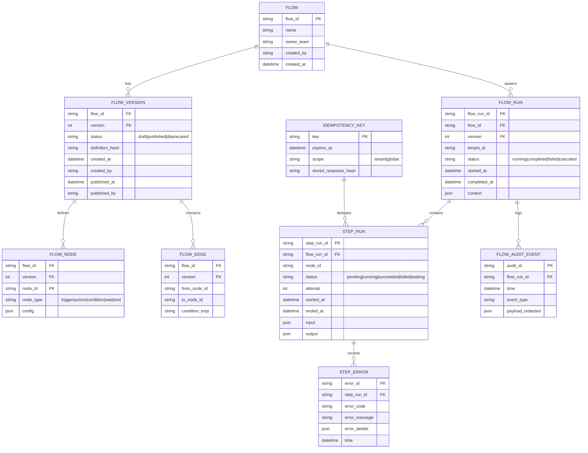
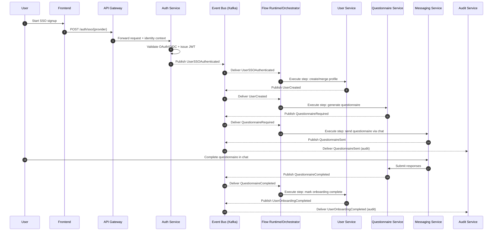
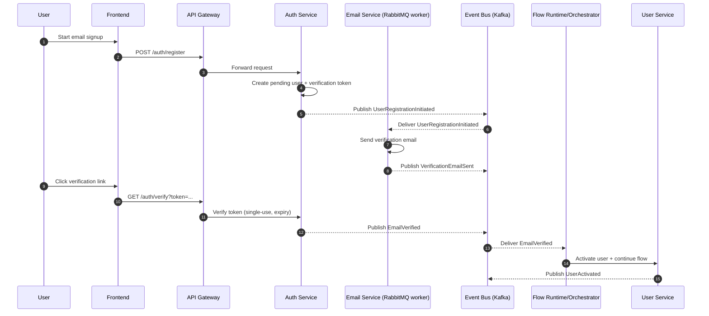

# Extending the Engine to Support Declarative Flow Creation

## Executive summary

The available **01-\*** material describes flows as **multi-service, event-driven business processes** with explicit definitions of entry points, service responsibilities, event chains, data stores, error handling, idempotency expectations, SLAs, and security controls. The provided example flow (**FLOW-01: User Registration & SSO Onboarding**) includes two major variants (SSO vs email registration), asynchronous steps (questionnaire delivery + completion), and operational requirements (retries with exponential backoff, dead-letter handling, auditability, and performance targets). fileciteturn0file0

To extend “the engine” to support **flow creation** as described in these documents, the key missing capability is a **first-class flow definition and governance layer** (control plane) plus a **runtime contract** (data plane) that can reliably execute or coordinate long-running, asynchronous processes using at-least-once messaging with idempotent handlers, durable state, and auditable event trails. This aligns with standard distributed-systems guidance for orchestrating multi-step workflows (sagas), preventing inconsistent “dual writes” (transactional outbox), and propagating observability context across services. citeturn1search1turn1search10turn1search3turn1search5

A practical blueprint is a **three-layer architecture**:

1. **Flow Definition & Governance (Control Plane):** a registry for flow definitions, versioning, validation, approval/publishing, and permissions. Definitions should be machine-validated (e.g., JSON Schema) and supported by developer tooling (CLI, linting, preview/simulation, generated docs). citeturn3search6turn3search3turn4search2  
2. **Flow Runtime (Execution Plane):** an orchestrator (or runtime extension of the existing orchestrator) that manages flow instances, wait states, retries, timeouts, idempotency keys, DLQ routing, and “exactly-once effects” patterns where feasible (idempotent producers / transactions in Kafka; inbox/outbox; deduplication). citeturn1search2turn1search4turn1search0turn6search13  
3. **Integration & Contracts (Edge Plane):** standardized HTTP + event envelopes (e.g., CloudEvents metadata), schema governance (schema registry), and trace context propagation (W3C Trace Context / OpenTelemetry) so every step is debuggable and auditable end-to-end. citeturn7search0turn4search9turn1search5turn1search7  

The highest-priority (P0) tasks are: (a) define the canonical flow DSL + validator, (b) implement flow versioning/publishing with strong authorization, (c) implement runtime state + idempotency + retry/DLQ primitives, and (d) standardize event envelopes and schemas—because these unlock safe execution, backward compatibility, and production operability.

## Source review and assumptions

Only one project document was available in the provided sources: **“User Registration & SSO Onboarding” (Flow ID: FLOW-01)**. This flow document includes: entrypoints (`POST /auth/sso/{provider}`, `POST /auth/register`, `GET /auth/verify?token=`), services involved (auth/user/email/questionnaire/messaging plus analytics/audit/dashboard), a detailed event chain for SSO and email variants, data stores (**PostgreSQL**, **MongoDB**, **Redis**), error handling rules (timeouts + exponential backoff; DLQ), idempotency requirements (dedup key guidance), and extensive security/ops considerations (OAuth2/OIDC, JWT lifetimes and refresh rotation, cookie storage flags, rate limiting, CSRF, GDPR, audit logging, SLOs). fileciteturn0file0

The same FLOW-01 doc also contains explicit integration guidance that implies the existence of a **microservices-based, “engine-first” architecture** (mentioned as XIIGen platform V61) relying on a shared microservice base class and generic data/queue interfaces, deployed on a Kubernetes cluster, and integrated through an API Gateway. It additionally references a “unified flow system” and a task catalog concept (e.g., “Complex Task Type” within `TASK_TYPES_CATALOG`). fileciteturn0file0

Because the “basic prompt” and the rest of the **01-\*** set were not accessible, the analysis below uses FLOW-01 as the **primary reference** and generalizes a **minimum viable flow engine** that can support FLOW-01-class flows. Any additional flow types/variants described in other 01-\* documents may expand requirements (e.g., more complex branching, compensations, or human approvals), so this design explicitly includes extensibility hooks (custom task types, condition evaluators, and pluggable trigger adapters).

Security and compliance recommendations are grounded in widely cited standards and guidance, including the IETF OAuth 2.0 and JWT specifications, OpenID Connect Core, OWASP cheat sheets, and GDPR legal text. citeturn0search0turn2search3turn0search1turn0search3turn2search8

## Flow requirements model from the 01-* documents

FLOW-01 implicitly defines a reusable “flow capability model” that the engine must support to claim it can create and run flows described in 01-\* documents.

### Core primitives implied by FLOW-01

**Flow types and variants.** FLOW-01 is one logical business flow with at least two variants (“SSO registration” vs “email registration”), and additional scenario variants (linking new SSO providers, maintenance mode, mobile, multi-tenant). This implies the engine needs first-class branching and variant selection driven by context (e.g., registration method, tenant policy, provider availability). fileciteturn0file0

**Triggers.** There are multiple trigger styles:
- External HTTP entry points (`POST /auth/sso/{provider}`, `POST /auth/register`) that initiate work. fileciteturn0file0  
- Callback HTTP entry point (`GET /auth/verify?token=`) that resumes a flow instance or triggers downstream work. fileciteturn0file0  
- Event-driven triggers (“UserCreated”, “QuestionnaireCompleted”, etc.) that advance the process asynchronously. fileciteturn0file0  
To generalize, the engine should support **HTTP triggers**, **message/topic triggers**, and **signal/callback triggers**.

**Actions and waits.** FLOW-01 includes synchronous actions (validate OAuth token, issue JWT, create user record) and asynchronous waits (wait for user to click verification email; wait for questionnaire completion). fileciteturn0file0  
This requires the engine to support:
- “Invoke service” actions (HTTP/gRPC/task execution)
- “Publish event” actions
- “Wait for event” states (correlation by userId/flowRunId)
- “Timer” states (token expiry; reminders at 24h/72h; dormancy after 30 days)

**Conditions.** Conditions appear throughout: SSO vs email; provider availability; existing email account merge; token expired; duplicate callbacks. These require a deterministic condition language with access to request/event context and optionally data lookups. fileciteturn0file0

**Error handling and recovery.** FLOW-01 explicitly defines:
- retries with exponential backoff on provider timeout (3 attempts, 1s/2s/4s),
- DLQ routing for failed event handlers,
- idempotent event handlers with dedup keys, and
- graceful handling of concurrency races (unique constraint on email). fileciteturn0file0  
These align with standard resilient retry with backoff guidance and DLQ usage patterns in distributed architectures. citeturn6search0turn6search13turn6search1

**Persistence, versioning, and auditing.** FLOW-01 requires onboarding state tracking, durable storage across multiple data stores, and a complete audit trail of auth events (IP, user-agent, timestamps) with GDPR-oriented data retention expectations. fileciteturn0file0  
This is also consistent with GDPR requirements for consent accountability and data subject rights, including the right to erasure. citeturn2search8turn2search1turn2search0

### Capability checklist distilled from FLOW-01

The table below translates FLOW-01 requirements into engine capabilities that should be explicit in the engine’s feature list.

| Capability area | Requirement evidenced by FLOW-01 | Engine feature implication |
|---|---|---|
| Variants & branching | SSO vs email path; maintenance and multi-tenant scenarios. fileciteturn0file0 | Branch nodes, dynamic routing, policy evaluation by tenant/environment. |
| Triggers | Multiple HTTP entry points and event-driven progression. fileciteturn0file0 | Pluggable trigger adapters (HTTP, Kafka/RabbitMQ, callback/signal). |
| Long-running waits | Email verification and questionnaire completion. fileciteturn0file0 | Wait states with correlation keys and timeout timers. |
| Retries/backoff | Exponential backoff for transient SSO timeouts. fileciteturn0file0 | Standard retry/backoff policy objects; jitter/caps recommended. citeturn6search0turn6search4 |
| DLQ & replay | Failed handlers go to DLQ for manual review. fileciteturn0file0 | DLQ routing per step, replay tooling, poison-message controls. citeturn6search1turn6search13 |
| Idempotency | Event handlers must be idempotent; dedup key suggested. fileciteturn0file0 | Idempotency-key store + standardized dedup semantics. citeturn6search18 |
| Observability | Explicit SLAs and monitoring alerts (success rate, p99, DLQ depth). fileciteturn0file0 | Built-in metrics, tracing propagation, run dashboards; Kubernetes probes fit the runtime model. citeturn1search3turn1search5turn3search1 |
| Security & privacy | OAuth2/OIDC, JWT settings, cookies, CSRF, rate limiting, GDPR, audit trails. fileciteturn0file0 | Flow governance + secure defaults; enforce OWASP-aligned controls. citeturn0search1turn2search3turn0search3turn6search11turn2search8 |

## Architecture mapping and gap analysis

### “Current engine” signals inferred from the project document

The FLOW-01 integration notes imply the engine/platform has these characteristics:

- **Microservices-based deployment** on a Kubernetes cluster. fileciteturn0file0  
- Shared development abstractions such as `MicroserviceBase` and generic interfaces for persistence and queues (`IDatabaseService`, `IQueueService`). fileciteturn0file0  
- An **API Gateway** that injects identity claims (e.g., `UserId` and `Role`) into engine context. fileciteturn0file0  
- A “unified flow system” that can model tasks; at least one service integration is expected to become a “Complex Task Type” in a task catalog. fileciteturn0file0  
- Eventing infrastructure that includes **Kafka** (domain events) and **RabbitMQ** (email queue) and explicit DLQ behavior. fileciteturn0file0  

These are strong foundations for a flow engine, but they do not yet guarantee **flow creation** (authoring, versioning, publishing, governance, and safe runtime composition). The gap analysis below focuses on what must be added or made explicit.

### Required vs. existing components

Because the current engine internals were not provided, the “Existing” column indicates either (a) explicitly referenced components in FLOW-01, or (b) inferred likely capabilities that still require verification.

| Layer | Required for 01-* flows | Existing signal | Gaps to close for “flow creation” |
|---|---|---|---|
| Flow definitions | Declarative DSL that can express triggers/conditions/actions/waits/retries/DLQ/idempotency, plus metadata for variants and environments. fileciteturn0file0 | YAML-like flow description exists in docs; “unified flow system” mentioned. fileciteturn0file0 | Canonical machine-readable schema, validators, and compatibility rules; formal semantics for branching and wait states. citeturn3search6turn3search3 |
| Control plane | CRUD, validation, versioning, approvals/publishing, diffing, rollback to prior versions, and permissions. | Not described in sources. | Needs a Flow Registry service + RBAC/ABAC policies and audit logs. citeturn4search7turn4search3turn5search19 |
| Runtime | Durable flow instances, step state, correlations, concurrency control, retries/backoff, scheduled timers, and DLQ/replay. | Event chains + DLQ and idempotency requirements are specified. fileciteturn0file0 | Standard runtime state store; timer subsystem; “exactly-once effect” patterns via inbox/outbox/dedup. citeturn1search10turn1search0turn6search18 |
| Event contracts | Versioned schemas for events; compatibility enforcement. | Kafka topics/events described; events enumerated. fileciteturn0file0 | Event envelope standardization (CloudEvents), schema registry integration, evolution rules. citeturn7search0turn4search9turn7search1 |
| Observability | End-to-end tracing, metrics, auditability, SLO measurement. | Monitoring targets + audit-service described. fileciteturn0file0 | Standardized trace propagation across HTTP + events; run-level observability APIs. citeturn1search3turn1search5turn1search7 |
| Security & privacy | Authn/authz for flow management; least privilege for connectors; PII-aware logging; GDPR-aligned retention/erasure; anti-enumeration; CSRF; rate limiting. fileciteturn0file0 | Many app-layer controls listed for auth endpoints. fileciteturn0file0 | Engine-level enforcement: who can author/publish flows; secret handling; privacy classification; consistent OWASP controls. citeturn0search3turn6search11turn5search11turn2search8 |

### Integration points and “missing pieces” (what must be designed)

**Idempotency + message delivery reality.** FLOW-01 requires idempotent event handlers and a dedup key strategy. fileciteturn0file0 In practice, event-driven microservices frequently operate at-least-once; achieving “exactly-once processing” depends on careful coordination (idempotent producers, transactions, or externalized state+offset commits) and is commonly approximated with deduplication plus transactional outbox/inbox patterns. citeturn1search2turn1search4turn1search10turn6search18  
**Engine implication:** flow runtime must provide a reusable idempotency mechanism—either per-step (idempotency key) or per-event-consumption (inbox), backed by durable storage, to keep flow instances consistent under retries.

**Dual-write safety.** FLOW steps often require “write state + publish event.” Without protection, failures between those operations cause inconsistencies. Transactional outbox is a standard mitigation: persist changes and the outbound message in one DB transaction, then relay to the broker. citeturn1search10turn1search0  
**Engine implication:** either embed outbox support in the runtime, or standardize a library that services and the runtime use to publish events safely.

**Sagas and compensations.** While FLOW-01 is mostly additive (create account, send questionnaire), broader 01-\* flows commonly require multi-service consistency and compensating actions. Saga is the standard approach for such distributed transactions. citeturn1search1turn1search11  
**Engine implication:** the DSL should include optional compensation hooks even if FLOW-01 does not use them heavily, so future flows don’t force a redesign.

**Security/governance layer for “flow creation.”** Once flows can be created by users/developers (and not just coded), the engine becomes a security-sensitive control point. OWASP emphasizes hardening registration and credential pathways against account enumeration and requiring consistent error handling, throttling, and careful session/cookie/CSRF controls. citeturn5search11turn6search11turn0search3turn0search7  
**Engine implication:** flow authoring must be protected by strong authorization (RBAC/ABAC) and environment-based approvals; flow definitions must be validated so they cannot exfiltrate sensitive data or call disallowed connectors. citeturn4search7turn4search3

## Proposed specifications and diagrams

This section proposes a concrete “v1” spec set for flow creation that is sufficient to express FLOW-01 and scalable to the broader 01-\* space.

### Flow definition model

A minimal, extensible model should support:

- **Flow metadata:** `flowId`, name, description, owners, tags, default SLA/alert rules. fileciteturn0file0  
- **Versioning:** immutable published versions; draft versions; “active version” per environment/tenant; fast rollback pointer.  
- **Graph nodes:** `trigger`, `action`, `condition`, `waitForEvent`, `waitForTime`, `end`, plus optional `compensate`. citeturn1search1turn6search0  
- **Error policies:** retry/backoff, fail-fast, DLQ routing, escalation. fileciteturn0file0  
- **Idempotency policies:** per action node; dedup keys; TTL. fileciteturn0file0  
- **Data mapping:** input/output contracts, redaction policies, and event envelope standardization.

Using **JSON Schema** (Draft 2020-12) for flow definition validation is a pragmatic choice because it is a widely adopted way to machine-validate JSON/YAML documents and evolve schemas over time. citeturn3search6turn3search3

### Canonical event envelope (recommended)

FLOW-01 enumerates many domain events and expects them to be auditable and traceable. fileciteturn0file0 Standardizing on **CloudEvents** for envelope metadata improves interoperability and consistency (event identity, type, time, source, correlation) across services. citeturn7search0turn7search2

A practical envelope profile:

- CloudEvents core: `specversion`, `id`, `type`, `source`, `time`, `subject` (optional) citeturn7search3turn7search5  
- Extensions: `tenantId`, `userId`, `flowId`, `flowRunId`, `stepId`  
- Trace headers: include `traceparent`/`tracestate` for cross-service tracing per W3C Trace Context; OpenTelemetry propagators align with this. citeturn1search5turn1search3turn1search7

### Event schema governance

To keep backward compatibility as flows evolve, event payloads should be versioned and validated via a schema registry, with explicit compatibility rules. Confluent Schema Registry is a common implementation for Kafka ecosystems and supports multiple schema formats and compatibility levels. citeturn4search9turn4search5turn7search1

### Flow engine data model (ER diagram)

This schema supports the explicit requirements in FLOW-01: persistence of onboarding state (via `FLOW_RUN` + `STEP_RUN`), idempotency (via `IDEMPOTENCY_KEY`), and auditable logs (via `FLOW_AUDIT_EVENT`). fileciteturn0file0

### Sequence diagrams for FLOW-01

Below are simplified sequences showing how a flow runtime can coordinate the event chain described in FLOW-01 while preserving service boundaries.

These sequences are consistent with FLOW-01’s described event chain, including the audit-service consumption of key events and the split between Kafka/event-bus and RabbitMQ for email delivery reliability. fileciteturn0file0

### APIs and interfaces

To enable “flow creation,” the engine needs clear APIs in two areas: **management** (control plane) and **runtime** (execution plane). The specs below are intentionally neutral to language/framework.

#### Flow Management API (Control Plane)

- `POST /flows`  
  Creates a new flow container (no executable version yet).

- `POST /flows/{flowId}/versions`  
  Creates a draft version. Body includes the flow definition (JSON/YAML).

- `POST /flows/{flowId}/versions/{version}/validate`  
  Runs schema validation (JSON Schema) and semantic validation (graph connectivity, unreachable nodes, missing idempotency policies, missing correlation keys for wait states). citeturn3search6turn3search3

- `POST /flows/{flowId}/versions/{version}/publish`  
  Publishes the version for a given environment with an approval record:
  - requires RBAC/ABAC permission checks; NIST documents ABAC as an attribute-driven policy approach. citeturn4search3turn4search7

- `POST /flows/{flowId}/versions/{version}/promote?from=staging&to=prod`  
  Promotion with gating and required tests.

- `POST /flows/{flowId}/rollback`  
  Moves an environment pointer to a prior published version (fast rollback).

#### Flow Runtime API (Execution Plane)

- `POST /flow-runs`  
  Starts a flow instance (used for flows that are engine-started rather than service-started).

- `POST /flow-runs/{flowRunId}/signal`  
  Sends a signal/callback to a waiting flow (e.g., email verified, questionnaire completed) where the runtime is the correlation coordinator.

- `POST /flow-runs/{flowRunId}/cancel`  
  Cancels a run and triggers compensation policies if defined (saga-style). citeturn1search1turn1search11

- `GET /flow-runs/{flowRunId}`  
  Returns run status, current step, attempts, and redacted context.

- `GET /flow-runs/{flowRunId}/events`  
  Returns auditable run history with PII redactions per policy.

#### Task/connector interface contracts

Given FLOW-01’s existing “task catalog” concept and event-based integration, defining strict connector interfaces improves developer ergonomics and runtime safety. fileciteturn0file0

- **HTTP Task Connector:** invokes a service endpoint with:
  - request template mapping from context
  - idempotency key injection (server-side dedup recommended)
  - response schema validation

- **Event Publish Connector:** publishes to Kafka with:
  - CloudEvents envelope
  - schema registry validation at publish-time (fail-fast mis-schemas) citeturn7search0turn4search9turn6search1

- **Wait-for-Event Connector:** subscribes with:
  - correlation keys (e.g., `userId`, `flowRunId`)
  - timeout policy + retry policy
  - DLQ routing for poison messages citeturn6search13turn6search0

### Developer ergonomics and SDK strategy

For HTTP APIs, publish OpenAPI specs and generate SDKs using established generator tooling, reducing custom client maintenance. citeturn4search2turn3search5  
For event-driven APIs, publish AsyncAPI specs to standardize and automate documentation and tooling for Kafka/RabbitMQ interfaces. citeturn4search4turn4search0

## Implementation backlog, testing, migration, and rollout

### Prioritized task backlog with estimates

Effort estimates below assume a mid-sized team familiar with the existing platform, and include design + implementation + review. They are intentionally ranges because the current engine codebase constraints were not provided.

| Priority | Epic | Task | Estimate |
|---|---|---|---|
| P0 | Flow DSL | Define Flow Definition DSL v1 (nodes/edges; retries; DLQ; idempotency; wait states) + JSON Schema validator | 2–3 weeks |
| P0 | Control plane | Build Flow Registry service: versions, publish/promote/rollback, immutable published versions, audit records | 3–5 weeks |
| P0 | Runtime state | Implement durable flow-run state store + optimistic concurrency + step attempt tracking | 3–5 weeks |
| P0 | Reliability | Idempotency subsystem (dedup store + TTL + response reuse) aligned with “idempotent handlers” requirement | 2–4 weeks citeturn6search18turn6search14 |
| P0 | Reliability | Retry/backoff policies with caps/jitter; DLQ router + replay tooling | 2–4 weeks citeturn6search0turn6search16turn6search13 |
| P0 | Event contracts | Standardize event envelope (CloudEvents profile) + trace context propagation | 2–4 weeks citeturn7search0turn1search5turn1search3 |
| P0 | Schema governance | Integrate schema registry + CI checks for backward compatibility (events) | 2–4 weeks citeturn4search9turn7search1 |
| P0 | Security | Flow authoring RBAC/ABAC policies; environment-based approvals; secret/connector allowlists | 2–4 weeks citeturn4search7turn4search3turn5search19 |
| P1 | Observability | Run dashboards; metrics for success rate/p99/DLQ depth; OpenTelemetry instrumentation | 2–4 weeks citeturn1search7turn3search0 |
| P1 | Tooling | CLI: validate, diff, simulate; lint rules (missing idempotency keys, missing timeouts) | 2–3 weeks |
| P1 | SDKs | OpenAPI + AsyncAPI publication pipeline and generated clients | 1–3 weeks citeturn4search2turn4search4 |
| P1 | Pilot | Implement FLOW-01 as a “golden path” in the new flow system; measure against FLOW-01 SLAs | 4–7 weeks fileciteturn0file0 |
| P2 | Advanced | Compensation semantics (saga-style), human approvals, and complex conditional policies | 3–6 weeks citeturn1search1turn1search11 |

### Test cases and validation criteria

FLOW-01 already enumerates many edge cases; treating them as acceptance tests improves traceability from requirements to implementation. fileciteturn0file0

#### Functional and resilience test suite (representative)

| Category | Scenario | Validation criteria |
|---|---|---|
| Variant routing | SSO vs email registration | Correct branch selection based on trigger, context, and provider params. fileciteturn0file0 |
| Idempotency | Duplicate SSO callback | Only one user/profile created; subsequent duplicate produces same outcome; no duplicate downstream questionnaire. fileciteturn0file0 |
| Concurrency | Two simultaneous registrations with same email | One succeeds; the other returns a safe error; flow instance state remains consistent. fileciteturn0file0 |
| Retry/backoff | SSO provider timeout | Retries occur with exponential backoff and stop after limit; failure routed to DLQ if configured. fileciteturn0file0 citeturn6search0turn6search16 |
| DLQ | Downstream service unavailable (e.g., Questionnaire Service) | Event/action moved to DLQ with error metadata; replay succeeds after service recovery. fileciteturn0file0 citeturn6search13turn6search1 |
| Security | Account enumeration prevention | Identical outward responses for “email exists” vs “email not found” where applicable; OWASP guidance satisfied. fileciteturn0file0 citeturn5search11turn5search4 |
| CSRF/cookies | Cookie-based auth | Cookies use HttpOnly/Secure/SameSite; CSRF strategy validated. fileciteturn0file0 citeturn0search7turn0search3 |
| Privacy | Audit logging with PII redaction | Audit events exist for all required steps while avoiding leaking secrets/PII; retention policies enforce deletion windows. fileciteturn0file0 citeturn2search8turn2search0 |
| Observability | Trace continuity across HTTP → events | traceparent propagated; single trace links API call, event publish, and step execution. citeturn1search5turn1search3turn1search7 |

#### Operational validation gates

- **Performance/SLO compliance:** FLOW-01 specifies p99 and latency targets for registration and downstream delivery; the pilot flow must meet them under load. fileciteturn0file0  
- **Reliability:** proof that transient failures do not create inconsistent flow state, using outbox/idempotency patterns. citeturn1search10turn6search18  
- **Kubernetes readiness:** liveness/readiness probes should be defined for core services to support safe rollouts and restarts. citeturn3search1turn3search4  

### Migration and backward-compatibility strategy

Because flows like FLOW-01 already exist (at least as documents and likely as implemented services), a safe migration approach is to **adopt the new flow system without breaking existing integrations**:

- **Event contract preservation:** keep event names and payload shapes stable while introducing a CloudEvents envelope and/or versioned schema changes via a registry and compatibility rules. fileciteturn0file0 citeturn7search0turn4search9turn7search1  
- **Dual-run / shadow execution:** initially run the new engine in “observe-only” mode (subscribe, correlate, and display flow progress) without driving side effects. This validates correlation logic and observability without production risk.  
- **Incremental ownership of steps:** move one step category at a time under engine control (e.g., retries/DLQ handling first, then timer/reminders, then complex branching), minimizing blast radius. This aligns with the general principle of introducing resilience controls (retries, DLQs, idempotency keys) as additive, backward-compatible capabilities. citeturn6search14turn6search18  
- **Version pinning per tenant/environment:** support selecting flow version by tenant, enabling gradual rollout and rollback without redeploying all services.

### Rollout plan

A rollout plan consistent with FLOW-01’s operational posture (SLAs, alerts, DLQ thresholds, and strong audit needs) should proceed in controlled phases:

**Phase 1: Foundations (dev/staging).** Implement DSL, registry, basic runtime state, and validation. Add CloudEvents envelope and trace context propagation. Instrument runtime with OpenTelemetry. citeturn7search0turn1search5turn1search7turn3search0  

**Phase 2: Reliability primitives.** Add standardized retry/backoff (with caps/jitter), idempotency store, and DLQ routing + replay tooling; validate with fault injection. citeturn6search0turn6search16turn6search13turn6search18  

**Phase 3: Governance hardening.** Enforce RBAC/ABAC for authoring/publishing; add environment approval workflows; implement privacy/redaction policies for audit data; align with OWASP controls and GDPR expectations for consent accountability and erasure rights. citeturn4search7turn4search3turn5search19turn2search1turn2search0  

**Phase 4: Pilot FLOW-01 in production (canary).** Enable one tenant or a small user cohort; monitor registration success rate, email verification conversion, questionnaire delivery, and DLQ depth as specified by FLOW-01. Roll back by repointing the active flow version or disabling engine-driven side effects. fileciteturn0file0  

**Phase 5: Scale to additional 01-\* flows.** Reuse connectors and policies; add advanced semantics (compensations, human approvals) only when demanded by additional flow documents. citeturn1search1turn1search11