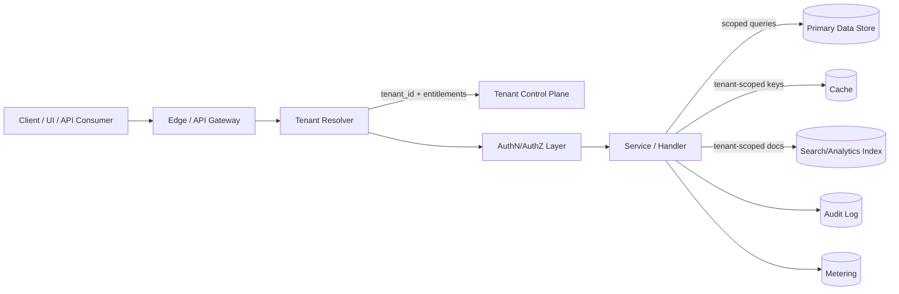
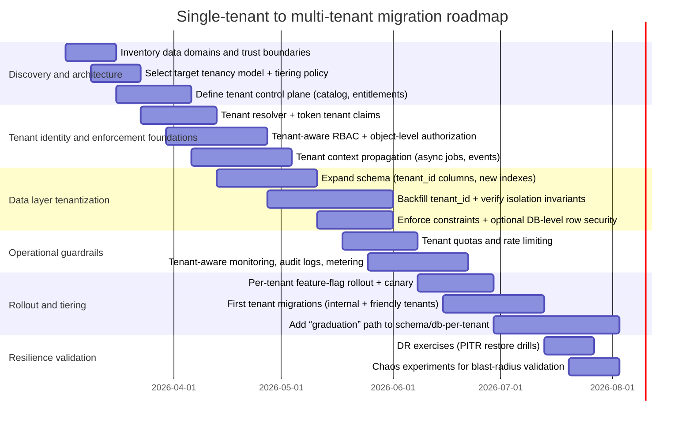

# Adapting a Single-Tenant System to Multi-Tenant Architecture

## Executive summary

Transforming a single-tenant system into a multi-tenant SaaS is primarily a **risk management and isolation engineering** effort: you are introducing controlled resource sharing while preserving strong guarantees that (a) one tenant cannot access another tenant’s data, (b) one tenant cannot materially degrade another tenant’s experience, and (c) you can still operate, migrate, and recover tenants safely at scale. Cloud-provider guidance consistently frames this as a spectrum of **pooled (shared) → siloed (dedicated) → hybrid/bridge** approaches, with explicit trade-offs between isolation, cost, and operational complexity. citeturn10view0turn10view3turn11view0

Given that the existing system details are unspecified, a robust default recommendation is a **bridge (hybrid) target state**:

- Start with a **pooled/shared-schema** model for the majority of tenants to minimize time-to-market and simplify schema management, but implement **defense-in-depth isolation controls** (tenant-aware authZ everywhere, database-enforced scoping where feasible, tenant-scoped cache/index keys, quotas). citeturn11view0turn0search3turn12search0turn10view0  
- Design “graduation paths” to **separate schema** or **separate database/instance** for tenants needing stronger isolation (regulatory/compliance posture, data residency, customer-managed keys, high-traffic/noisy-neighbor risk, bespoke restore/DR requirements). This “tier-based isolation” approach is explicitly discussed in cloud SaaS isolation guidance. citeturn10view0turn11view0turn10view4  
- Execute the migration using an **expand/contract (parallel change)** plan that preserves backward compatibility while you introduce tenant context, backfill, and cut over safely. citeturn7search0turn7search12turn11view0

The most common catastrophic failure modes in multi-tenancy are well-known and should drive your engineering priorities:

- **Cross-tenant data exposure** from missing object-level checks or missing tenant scoping in data stores, caches, or search indexes (a class of issues highlighted by the API security community around broken object-level authorization). citeturn0search3turn0search6turn11view0  
- **Noisy neighbor / cost blowups** when shared compute and shared backends lack per-tenant quotas and rate limits (explicitly called out in Kubernetes and API security guidance). citeturn15view0turn0search12turn11view0  
- **Irreversible migrations** that lack rollback points, tenant-by-tenant restore capability, or safe cutover mechanics (a key concern emphasized in SaaS database pattern guidance). citeturn11view0turn6search2turn6search11

A practical migration program therefore needs: (1) a **tenant control plane** (registry, entitlements, config, routing), (2) **tenant context propagation** throughout the request and job pipelines, (3) a **data partitioning strategy** with explicit trade-offs, (4) **operational guardrails** (quotas, monitoring, metering), and (5) **a staged roadmap with rollback points** and DR exercises. citeturn10view4turn15view0turn14view3turn7search0

## Unspecified assumptions and decision criteria

Because the existing system is unspecified, the report makes the following **explicit assumptions** (they should be validated early, because they materially affect the recommended tenancy model and migration plan):

- **Tenant definition**: a tenant is an organization/account boundary (not an end-user). There may be multiple users per tenant, and users’ access must be scoped to a tenant. This aligns with mainstream SaaS identity framing. citeturn13view0turn10view4  
- **Workload shape**: the system has a transactional “system of record” store plus caching and background jobs; multi-tenant correctness must cover **request/response paths and asynchronous workflows**. citeturn7search0turn10view4turn15view0  
- **Availability goal**: migration should be near-zero downtime, implying backward-compatible schema changes, controlled backfills, and reversible cutovers (expand/contract). citeturn7search0turn7search12turn7search1  
- **Regulatory exposure**: at least some tenant data may be personal data, invoking deletion/export concerns under privacy regimes like GDPR and CCPA/CPRA. citeturn2search5turn2search20turn2search4turn2search1  

A credible tenancy decision should be made using criteria commonly recommended by major cloud providers, including: scalability (tenant count and workload), tenant isolation (data and performance), per-tenant cost, development complexity (schema/query changes), operational complexity (monitoring, restore/DR), and customizability. citeturn11view0turn10view0turn10view4

## Tenancy models and isolation design

### Tenancy model comparison

The three canonical database mapping models you requested—**shared schema**, **separate schema**, **separate database/instance**—are repeatedly presented in cloud SaaS guidance, often alongside explicit hybrid variants and sharding/catalog patterns. citeturn11view0turn10view0turn10view4turn10view3

| Dimension | Shared schema (pooled) | Separate schema (bridge) | Separate database/instance (silo) |
|---|---|---|---|
| Data separation | Logical separation via `tenant_id` columns and query scoping; can be strengthened with row-level security | Logical separation via per-tenant schema/database namespace; still shares DB engine | Strongest boundary: dedicated database/cluster (and optionally dedicated app resources) |
| “Noisy neighbor” risk | Highest; requires quotas, careful indexing, workload shaping | Medium; DB engine still shared | Lowest; can scale and tune per tenant |
| Operational complexity | Lowest at small scale (one schema to migrate), but shared blast radius | Medium; schema management automation required | Highest; provisioning, migrations, and monitoring at scale require strong automation |
| Restore/DR granularity | Harder to restore one tenant without affecting others (often needs specialized tooling) | Easier than shared schema but still coupled at engine level | Best: per-tenant restore/DR is naturally aligned |
| Cost profile | Lowest per tenant (especially for many small/inactive tenants) | Mid | Highest per tenant, but can be optimized with pooling/elasticity depending on platform |
| Best fit | High tenant counts with similar needs; strong guardrails and enforcement available | Mid-sized tenant counts; tenants need extra isolation or customization | Enterprise/high-compliance/high-traffic tenants; strict residency/CMK/restore requirements |

This table reflects core trade-offs called out in SaaS tenancy guidance (including explicit mention of noisy neighbors and the role of row-level security in shared databases), as well as hybrid/tiering approaches that allow mixing patterns by tenant tier. citeturn11view0turn10view0turn10view3turn15view0turn10view4

image_group{"layout":"carousel","aspect_ratio":"16:9","query":["AWS SaaS tenant isolation strategies pool silo bridge diagram","Azure SQL multitenant SaaS database tenancy patterns diagram","multi-tenant database shared schema separate schema separate database illustration","Kubernetes multi-tenancy namespaces quotas network policies diagram"],"num_per_query":1}

### Isolation levels: data, compute, network, configuration

A multi-tenant architecture must explicitly choose isolation strength across **four layers**, not just the database. Cloud and platform guidance treats these as separable “levers,” especially in hybrid (bridge) models. citeturn10view0turn15view0turn10view4

**Data isolation (authoritative):**
- Shared schema requires *systematic tenant scoping* on every table and query, and ideally database-enforced controls (for example, row security policies in PostgreSQL). PostgreSQL documents row security policies as a mechanism that restricts which rows are visible/modifiable once row security is enabled and policies exist. citeturn12search0turn0search11turn11view0  
- If using a platform with built-in row-level security at the engine level, it can add defense-in-depth; however, you still need application-layer enforcement because isolation must also cover caches, indexes, and non-RDBMS stores. citeturn11view0turn13view0turn0search3  

**Compute isolation (performance & reliability):**
- Shared compute requires **quotas and fairness** controls. Kubernetes’ multi-tenancy guidance explicitly frames quotas as a mechanism to avoid noisy neighbor issues for tenants sharing a control plane and cluster resources. citeturn15view0turn14view4  
- In a bridge model, “graduation” to dedicated worker pools or dedicated deployments for certain tenants is standard practice when tenant workloads are highly variable or when blast radius must shrink. citeturn10view0turn10view4turn10view3  

**Network isolation (security boundary):**
- Kubernetes multi-tenancy guidance recommends default-deny posture for cross-tenant pod communications and points to NetworkPolicies as the mechanism, while noting that a supporting network plugin is required for enforcement. citeturn15view0turn15view1  
- Even outside Kubernetes, the same principle holds: treat tenant boundaries as segmentation boundaries, especially around admin/control-plane surfaces (management APIs) vs data-plane surfaces (end-user APIs). citeturn15view0turn0search3turn12search1  

**Configuration isolation (product & safety):**
- Tenant-specific configuration must be stored and retrieved in a way that prevents mixing (a “tenant config namespace”). For example, Azure’s guidance for App Configuration notes that tenant identifiers can be used as **key prefixes** to store and retrieve tenant-specific settings. citeturn14view0  
- Feature flags should support **targeted rollouts** and staged releases; Azure App Configuration describes feature flags as a way to control functionality without redeploying and supports gradual rollouts. citeturn14view1  

### Reference request flow (tenant resolution and enforcement)



This diagram reflects a core design requirement highlighted across SaaS guidance: tenant identity must be resolved for each request and consistently applied to data access, isolation enforcement, auditing, and metering. citeturn10view4turn13view0turn14view3turn0search3

### Sample per-tenant schema examples

Below are **illustrative** DDL patterns for each tenancy model. The goal is not to prescribe a specific RDBMS, but to show the concrete schema implications your code will need to support.

**Shared schema (single set of tables, `tenant_id` as partition key)**

```sql
CREATE TABLE tenants (
  tenant_id      UUID PRIMARY KEY,
  name           TEXT NOT NULL,
  plan_tier      TEXT NOT NULL,
  created_at     TIMESTAMPTZ NOT NULL DEFAULT now()
);

CREATE TABLE users (
  tenant_id      UUID NOT NULL,
  user_id        UUID NOT NULL,
  email          TEXT NOT NULL,
  role           TEXT NOT NULL,
  created_at     TIMESTAMPTZ NOT NULL DEFAULT now(),
  PRIMARY KEY (tenant_id, user_id)
);

CREATE TABLE orders (
  tenant_id      UUID NOT NULL,
  order_id       UUID NOT NULL,
  customer_id    UUID NOT NULL,
  status         TEXT NOT NULL,
  total_cents    BIGINT NOT NULL,
  created_at     TIMESTAMPTZ NOT NULL DEFAULT now(),
  PRIMARY KEY (tenant_id, order_id)
);

CREATE INDEX CONCURRENTLY IF NOT EXISTS idx_orders_tenant_status_created
  ON orders (tenant_id, status, created_at);
```

PostgreSQL explicitly documents `CREATE INDEX ... CONCURRENTLY` as a way to build indexes without locking out writes (at the cost of longer build time and additional work), which is a common building block for zero/near-zero downtime migrations in shared tables. citeturn7search1

**Separate schema (one DB instance, schema-per-tenant)**

```sql
-- tenant A
CREATE SCHEMA t_a;
CREATE TABLE t_a.orders (...);

-- tenant B
CREATE SCHEMA t_b;
CREATE TABLE t_b.orders (...);
```

This model simplifies some data separation concerns but shifts complexity into schema deployment and migration tooling; cloud SaaS guidance commonly positions it as a middle ground between pooled and siloed models. citeturn10view0turn10view3turn11view0

**Separate database/instance (catalog + per-tenant DBs)**

```sql
-- control-plane catalog (shared)
CREATE TABLE tenant_catalog (
  tenant_id        UUID PRIMARY KEY,
  db_uri           TEXT NOT NULL,
  tenancy_mode     TEXT NOT NULL, -- e.g., 'pooled', 'schema', 'db'
  region           TEXT NOT NULL,
  created_at       TIMESTAMPTZ NOT NULL DEFAULT now()
);

-- each tenant DB has normal single-tenant tables
CREATE TABLE orders (...);
CREATE TABLE users (...);
```

Azure’s SaaS patterns explicitly describe the need for a catalog mapping tenants to databases/shards, and they discuss database-per-tenant and sharded models, including moving tenants between shards and the operational implications. citeturn11view0turn6search9turn6search5

## Tenant-aware authentication and authorization

### Identity primitives: tenants, users, and tenant context propagation

Multi-tenancy requires a consistent mechanism to bind *a user principal* to *a tenant* and to carry that information through the stack, including asynchronous jobs and service-to-service calls. The SaaS security guidance from entity["company","Amazon Web Services","cloud provider"] emphasizes that SaaS identity must account for both the user and the tenant, and that requests should carry tenant/user identifiers with authorization decisions made accordingly; it also highlights token-based approaches to avoid centralized authorization bottlenecks and single points of failure. citeturn13view0

At the protocol layer:

- OAuth 2.0 defines the authorization framework used by many SaaS systems. citeturn1search0  
- OpenID Connect (OIDC) defines an identity layer on top of OAuth 2.0 for authentication and standardized identity claims. citeturn1search1  
- SCIM (RFC 7643/7644) provides a standardized schema and protocol for identity provisioning (common for enterprise onboarding/offboarding). citeturn1search2turn1search6  
- Enterprise SSO often uses SAML 2.0 assertions and protocols; the OASIS SAML 2.0 specification defines the syntax/semantics for assertions about authentication/attributes/authorization. citeturn5search1turn5search5  

A practical implementation choice is to include a **tenant identifier claim** in access tokens, and use it as a mandatory input to authorization and data access scoping. This pattern is explicitly illustrated in AWS SaaS security guidance via token claims that can represent tenant group membership. citeturn13view0

### Authorization model: RBAC with tenant-local roles and least privilege

RBAC is a common baseline in SaaS because it is understandable to customers and maps well to tenant-local administration. entity["organization","National Institute of Standards and Technology","us government agency"] documents RBAC and notes its standardization lineage (ANSI INCITS 359). citeturn5search0turn5search4

In multi-tenancy, RBAC must be **tenant-scoped**:

- A role assignment is always at least `(tenant_id, principal_id, role_id)`.  
- Role definitions can be global defaults (e.g., “Admin, Editor, Viewer”) but must support tenant overrides to satisfy enterprise needs without forking code. citeturn11view0turn10view4  
- Permissions must include **resource-level** and (often) **object-level** checks: “can this principal access this exact order/report/document?” This is critical because API endpoints commonly expose object identifiers; OWASP identifies broken object level authorization (BOLA) as a top API risk and stresses that object-level authorization checks should be considered whenever accessing objects by ID. citeturn0search3turn0search6  

### Tenant-aware SSO: tenant discovery and identity routing

Tenant-aware SSO is as much about **tenant discovery** as it is about authentication:

- **Tenant resolution inputs** often include domain/subdomain, email domain, IdP-initiated SSO parameters, or explicit tenant selection. The risk is misbinding a user into the wrong tenant context; design should treat tenant resolution as security-critical. citeturn10view4turn13view0  
- When integrating with third-party IdPs, the SaaS security guidance notes that the SaaS-side identity provider can normalize varied tenant authentication methods (including SAML federation) into a consistent token format your app understands. citeturn13view0turn5search1  

### Guardrails: preventing cross-tenant access beyond the database

Even perfect database scoping is insufficient if other subsystems are not tenant-aware:

- Cache keys must include `tenant_id` (or an unambiguous tenant namespace) to prevent cross-tenant cache bleed. citeturn11view0turn0search3  
- Search and analytics indexes must filter by tenant identity; Microsoft’s guidance on multitenancy across services highlights the need for isolation strategies in shared search systems. citeturn0search31turn10view4  
- Asynchronous workflows must carry tenant context end-to-end; Google’s multi-tenancy implementation guidance explicitly states that tenant identifiers must be available in application logic to construct correct connections/queries, and that lifecycle operations involve updating mapping configuration when moving tenants between patterns. citeturn10view4  

## Data partitioning and migration strategies

### Partitioning mechanics: tenant ID propagation as a first-class design

For a single-tenant-to-multi-tenant conversion, the biggest structural change is the introduction of a **tenant partitioning dimension**:

- **Schema changes**: add `tenant_id` (or equivalent) to every tenant-owned table and to the leading edge of primary keys/indexes where needed. Azure’s patterns explicitly note that a multitenant schema requires tenant identifiers and that the tenant identifier is often a leading element in keys for sharding and split/merge tooling. citeturn11view0turn6search9  
- **Query discipline**: every data access path must supply tenant scoping predicates (and ideally enforce them at the DB layer if supported). citeturn11view0turn12search0  
- **Non-relational subsystems**: replicate the same propagation to caches, object storage prefixes, event payloads, and search index documents. citeturn10view4turn0search31turn0search3  

A key decision is whether to enforce tenant isolation **only in the application** or also **in the database engine** (defense in depth). PostgreSQL row security policies are designed so that, once enabled and policies exist, “all normal access” must be allowed by policy, and a default-deny posture applies when no policy exists. citeturn12search0turn0search11

### Migration strategy comparison

The migration approach depends on availability goals, data volume, and whether you can tolerate dual-write complexity. The table below outlines common strategies for converting a live single-tenant system into multi-tenant storage.

| Strategy | Summary | Downtime risk | Complexity | Typical fit |
|---|---|---:|---:|---|
| Big bang cutover | Stop writes, migrate schema/data, deploy tenant-aware app | High | Low–Medium | Very small systems, tolerant of downtime |
| Expand/contract (parallel change) | Add new structures + dual compatibility, migrate incrementally, then remove legacy | Low | High | Most production SaaS migrations |
| Dual-write + backfill | Write to both old and new tenant-scoped structures; gradually backfill history; then flip reads | Low | Very High | High-availability systems where data correctness is paramount |
| CDC-based replication cutover | Use change data capture to replicate into new tenant-aware store; cut over when lag is near zero | Low–Medium | High | Large datasets and/or cross-database moves |
| Tenant-by-tenant (progressive) | Introduce multi-tenant control plane; migrate a subset of tenants/users at a time | Low | Medium–High | When tenants can be isolated and migrated independently |

The expand/contract pattern is specifically described by entity["people","Martin Fowler","software engineer author"] as a safe way to implement backward-incompatible changes by splitting the change into expand, migrate, and contract phases. citeturn7search0turn7search12  
CDC-based approaches are directly supported in cloud migration tooling; for example, AWS DMS describes “ongoing replication / change data capture (CDC)” as capturing ongoing changes during and after a full-load migration. citeturn7search3

### Recommended zero-downtime migration sequence

A rigorous “expand/contract” plan for tenantization typically looks like:

1. **Expand (backward-compatible schema)**
   - Add `tenant_id` columns (nullable initially where needed), introduce new composite indexes, and add new tables for tenant metadata/catalog as required. citeturn7search0turn11view0turn7search1  
   - If using PostgreSQL, apply online-safe building blocks where possible (e.g., `CREATE INDEX CONCURRENTLY`) to reduce write lock impact. citeturn7search1  

2. **Propagate tenant context through the application**
   - Introduce a tenant resolver and require tenant context in the request pipeline; ensure background jobs and event consumers carry tenant identifiers. citeturn10view4turn13view0turn15view0  
   - Add mandatory object-level authorization checks and tenant scoping. OWASP explicitly frames object-level authorization failures as high-risk and common. citeturn0search3turn0search6  

3. **Backfill**
   - Run controlled backfills to set `tenant_id` for existing records, with throttling and observability (progress metrics, error budgets). citeturn15view0turn14view3  
   - If data volume is large and you are moving between stores, consider CDC replication to keep new and old stores aligned until cutover. citeturn7search3  

4. **Enforce**
   - Make `tenant_id` non-null, enforce uniqueness constraints that include `tenant_id`, and enable database-level row security where appropriate. Postgres documents that row security is enabled per table and policies control row visibility. citeturn12search0turn0search11  

5. **Contract**
   - Remove legacy “single-tenant assumptions”: deprecated columns, old routes/IDs, old access paths and caches. citeturn7search0turn7search12  

### Moving between tenancy models after initial tenantization

A key architectural objective is to avoid locking yourself into one model forever. Both AWS and Azure guidance discuss hybrid/bridge approaches, and Google’s multi-tenancy guidance explicitly discusses moving tenants between data management patterns and updating mapping configuration accordingly. citeturn10view0turn11view0turn10view4

Practically, this implies:

- A **tenant catalog/control plane** that can map tenant → data location (schema/db/cluster, shard, region). citeturn11view0turn10view4  
- A data-access layer that can dynamically select connection/query shape by tenant (connection string vs schema prefix vs row predicate), as described in Google’s guidance. citeturn10view4  

## Security, compliance, and operational concerns

### Encryption and key management

Encryption design must support both broad compliance requirements and tenant-specific needs such as customer-managed keys (CMKs):

- **Cryptographic primitives and lifecycle**: NIST standardizes AES as FIPS 197 and provides key management guidance in SP 800-57 (Part 1). citeturn1search15turn1search3  
- **Envelope encryption and KMS integration**: AWS KMS documentation describes envelope encryption and the use of data keys protected by KMS keys, including client-side patterns via the AWS Encryption SDK. citeturn2search2turn2search6  

In multi-tenancy, key management decisions intersect directly with tenancy models:

- In shared-schema systems, per-tenant encryption at the application layer may require per-tenant data keys (DEKs) wrapped by a KEK hierarchy, with strict policies for rotation and revocation. citeturn1search3turn2search2  
- For regulated/enterprise tenants, **dedicated databases/instances** plus tenant-scoped keys often simplify both isolation and audit narratives. citeturn10view0turn11view0turn2search10  

### Tenant data access controls and audit logging

Two complementary controls are essential:

- **Preventative controls**: tenant-aware authorization (RBAC/ABAC) and object-level checks (BOLA prevention), plus database-enforced scoping where feasible. citeturn0search3turn12search0turn5search0  
- **Detective controls**: robust audit logging and monitoring.

NIST’s log management guidance (SP 800-92) addresses the need for sound log management and notes, for example, that authentication systems typically log authentication attempts (origin, username, success/failure, time). citeturn8search0turn8search8  
For broader control catalogs, NIST SP 800-53 includes audit and accountability controls; the AU family emphasizes capturing event context (what happened, when/where, source, outcome, identities involved). citeturn8search5turn8search15

In practical SaaS terms, you should treat these as minimum audit events:

- Tenant admin changes: user invited/removed, role changes, SSO config changes. citeturn8search0turn5search0turn13view0  
- Data access events for sensitive objects: exports, bulk reads, privilege escalation attempts. citeturn0search3turn8search15  
- Data lifecycle operations: tenant deletion/export, key rotation, restores. citeturn2search5turn6search2turn6search11  

### GDPR and CCPA implications for tenant lifecycle

Even if your “tenant” is a business entity, your platform likely processes personal data about end-users (employees, customers, subscribers), so tenant lifecycle operations must support privacy rights:

- GDPR recognizes rights such as **erasure** (Article 17) and **data portability** (Article 20). citeturn2search4turn2search20  
- California’s CCPA materials describe consumer rights including the **right to delete**, subject to exceptions, and to know/access categories of personal information. citeturn2search5turn2search1  

This has concrete technical implications:

- **Offboarding / deletion**: you need deterministic procedures to delete or irreversibly anonymize tenant-scoped personal data (including in indexes, logs where appropriate, backups per policy, and derived artifacts). citeturn2search4turn2search5turn11view0  
- **Export**: you need tenant-scoped export pipelines (and integrity checks) and must ensure exports are authorized, audited, and protected. citeturn2search20turn8search15turn0search3  
- **Retention boundaries**: logs, backups, and replicas are often the hardest parts; your retention and restore model must match the promises in your privacy and contractual commitments. citeturn6search2turn6search11turn8search8  

### Scaling, quotas, noisy neighbor mitigation, monitoring, and per-tenant metrics

Shared infrastructure demands explicit guardrails:

- Kubernetes multi-tenancy guidance underscores that authorization isolation is foundational, and that quotas help avoid noisy neighbors by limiting resource consumption and object counts per namespace. citeturn15view0turn14view4  
- OWASP explicitly identifies unrestricted resource consumption as an API risk class when limits are missing or misconfigured (CPU, memory, bandwidth, storage, or paid downstream services). citeturn0search12  

In a SaaS application, these translate into enforceable budgets at multiple layers:

- **API rate limits and request budgets** per tenant (and per account/user inside tenant). citeturn0search12turn15view0  
- **Job/workflow concurrency limits** per tenant (prevent 1 tenant from saturating workers or shared queues). citeturn15view0turn10view4  
- **Database workload controls**: shard by tenant for hot spots, use per-tenant query budgets, and plan “tenant graduation” to dedicated resources when needed. citeturn11view0turn10view0turn10view3  

Monitoring and SLOs must be tenant-aware:

- Azure’s SaaS tenancy patterns emphasize the need for tenant-specific performance metrics and discuss both pool-level and database-level metrics in pooled database-per-tenant scenarios. citeturn11view0  
- When building per-tenant metrics, you must also consider metric cardinality (tenant labels can explode time series counts). This is less a reason not to measure by tenant and more a reason to aggregate thoughtfully: use tenant-level metrics for a bounded set of top tenants or sampled telemetry, and combine with on-demand per-tenant diagnostics. citeturn4search10turn11view0turn14view3  

### Billing and metering

A serious multi-tenant system nearly always needs **tenant-level consumption tracking**:

- AWS’s SaaS Lens on tenant activity and consumption describes a pay-as-you-go model where SaaS providers implement metering that measures tenant consumption and sends it to billing aggregation. citeturn14view3  
- This connects directly to the isolation work: quotas and metering should share the same tenant identity binding, otherwise throttling and billing will disagree. citeturn15view0turn10view4turn14view3  

## Deployment, CI/CD, testing, rollback/DR, cost trade-offs, and recommended roadmap

### Deployment and CI/CD: per-tenant feature flags, canary, blue/green, IaC

A multi-tenant migration is safest when new behaviors can be turned on **per tenant** and rolled back quickly:

- **Per-tenant feature flags**: Azure App Configuration supports feature management via feature flags and describes gradual rollouts (including canary/staged rollouts) without redeploying code; Azure’s multitenancy considerations explicitly recommend tenant-key prefixes for tenant-specific settings. citeturn14view1turn14view0  
- **Blue/green and canary deployments**: AWS documentation for CodeDeploy blue/green on ECS describes deployment configuration options (linear/canary) and the ability to route a fraction of traffic before a full shift. citeturn14view2  
- **Infrastructure as code**: AWS CloudFormation documentation describes templates as the declarative unit for creating/updating/deleting resources, enabling repeatable provisioning and drift control. citeturn14view5  

In multi-tenancy, these mechanisms are most valuable when combined:

- Use feature flags to enable tenant-aware behavior for a small set of internal tenants first.  
- Use canary/blue-green to reduce platform-level deployment risk.  
- Use IaC to standardize tenant provisioning artifacts across tenancy tiers (pooled vs dedicated). citeturn14view2turn14view0turn14view5  

### Testing strategy: tenancy-specific tests and chaos engineering

Your test plan must validate both “normal correctness” and “tenant isolation invariants”:

- **Unit tests**: tenant resolver, authorization policy evaluation, scoping helpers, cache key builders. (These are engineering best practices; the critical point is that BOLA-class bugs are often introduced by missing checks in “one path.”) citeturn0search3turn0search6  
- **Integration tests**: cross-service flows with tenant context propagation (including async jobs). Google’s multi-tenancy guidance highlights that tenant identifiers must be available to create proper connections/queries, which is exactly what integration tests must validate. citeturn10view4  
- **Tenancy isolation tests (must-have)**: deliberate attempts to access another tenant’s objects by ID; OWASP’s BOLA risk framing is directly actionable here. citeturn0search6turn0search3  
- **Chaos testing**: chaos engineering is defined as experimenting on a system to build confidence in resilience under turbulent conditions; this is a standard framing in the “Principles of Chaos Engineering” and is supported by the academic/industry paper by Basiri et al. citeturn9search2turn9search5turn9search10  

A multi-tenant-specific chaos focus is *blast radius control*: prove that failures (DB shard degraded, cache cluster unhealthy, worker queue backlogged) do not systematically cascade across tenants beyond defined SLO impact windows. AWS’s tenant isolation guidance explicitly discusses blast radius concerns in pooled environments. citeturn5search3turn10view0turn15view0  

### Rollback and disaster recovery

You need two rollback planes:

**Application rollback**
- Ensure you can revert tenant-aware code paths via feature flags and standard deployment rollback mechanisms. Kubernetes documents rollout undo semantics to revert to a previous known state, which is part of the operational rollback toolset in many environments. citeturn4search1turn4search9turn14view1  

**Data rollback and tenant restore**
- Cloud database platforms emphasize point-in-time restore (PITR) as a recovery mechanism. AWS RDS documentation describes restoring a DB instance to a specified time. citeturn6search2turn6search6  
- Azure SQL recovery guidance describes point-in-time restore and backup-based recovery workflows. citeturn6search11turn6search7  

Your tenancy model strongly affects restore granularity:

- In a **shared schema**, restoring one tenant is operationally complex and may require specialized tooling (export/replay or table-level restore patterns). Azure’s tenancy guidance explicitly notes tenant-focused operations can become complex in a single multitenant database. citeturn11view0  
- In **database-per-tenant**, restoring a tenant is often as simple as restoring a single database, with minimal impact on others; Azure’s guidance frames this as a benefit of single-tenant databases. citeturn11view0  

### Cost analysis and trade-offs

Cost is not just infrastructure spend; it includes ongoing engineering and operational labor:

- AWS guidance explicitly frames a trade-off: silo provides strongest isolation but highest cost/complexity, while pool provides least isolation but lowest cost, and hybrid models can balance the two. citeturn10view3turn10view0  
- Azure’s tenancy patterns similarly discuss per-tenant cost, development/operational complexity, and how multitenant databases tend to have the lowest per-tenant cost, while database-per-tenant provides stronger isolation at higher operational cost but can be made cost-effective with pooling/elastics. citeturn11view0turn6search1  
- Metering and billing capability is itself an architectural requirement: AWS’s SaaS lens describes tenant consumption tracking as a core capability for pay-as-you-go pricing. citeturn14view3  

A pragmatic “cost posture” recommendation that aligns with these sources is:

- Pooled/shared-schema for the long tail of small tenants (lowest infra cost, simplest schema evolution). citeturn11view0turn10view3  
- Dedicated schema or database for high-traffic / high-compliance tenants (reduced noisy-neighbor risk, clearer restore/DR boundary). citeturn10view0turn11view0turn10view4  
- Automation investment (provisioning, migrations, monitoring) is non-negotiable if you expect many dedicated databases. citeturn11view0turn14view5  

### Recommended migration roadmap with milestones, timelines, and rollback points

The roadmap below assumes a typical mid-sized engineering team and a “near-zero downtime” requirement; because your system is unspecified, treat durations as planning placeholders and calibrate after an initial discovery sprint. The roadmap is intentionally staged to front-load **safety and correctness** (tenant identity and scoping) before scaling and tiering. citeturn7search0turn11view0turn0search3turn15view0



This plan explicitly sequences tenant-aware identity and authorization early (because it directly mitigates BOLA-class isolation failures) and introduces quotas/guardrails before broad tenant onboarding, aligning with Kubernetes multi-tenancy guidance and OWASP resource-consumption risk framing. citeturn0search3turn0search12turn15view0turn11view0

**Recommended rollback points (explicit):**
- After “Tenant resolver + token tenant claims”: rollback by disabling tenant-aware routing and continuing in single-tenant mode (feature flag off). citeturn14view1turn13view0  
- During “Expand schema” and “Backfill”: rollback by keeping old read paths and reverting tenant-aware writes (expand/contract discipline). citeturn7search0turn7search12  
- During early tenant migrations: rollback tenant-by-tenant by toggling traffic routing and restoring from PITR if data corruption occurs (where tenancy model permits). citeturn6search2turn6search11turn11view0  
- During platform deployment: rollback via blue/green/canary controls and standard rollback mechanisms; AWS documents CodeDeploy deployment configurations and rollback strategy elements. citeturn14view2turn4search1  

**Tenant onboarding/offboarding lifecycle milestones (what to build by the end of the roadmap):**
- Automated provisioning: tenant record creation, entitlement assignment, config namespace creation, and (if needed) schema/db provisioning via IaC. citeturn11view0turn14view5turn10view4  
- Offboarding: audited export, deletion workflows, and confirmation mechanisms aligned with privacy rights expectations (GDPR erasure/data portability; CCPA deletion). citeturn2search4turn2search20turn2search5  
- Tenant movement between patterns: update tenant-to-storage mapping (catalog) and verify application routing logic, consistent with Google’s discussion of mapping configuration for different data management patterns. citeturn10view4turn11view0