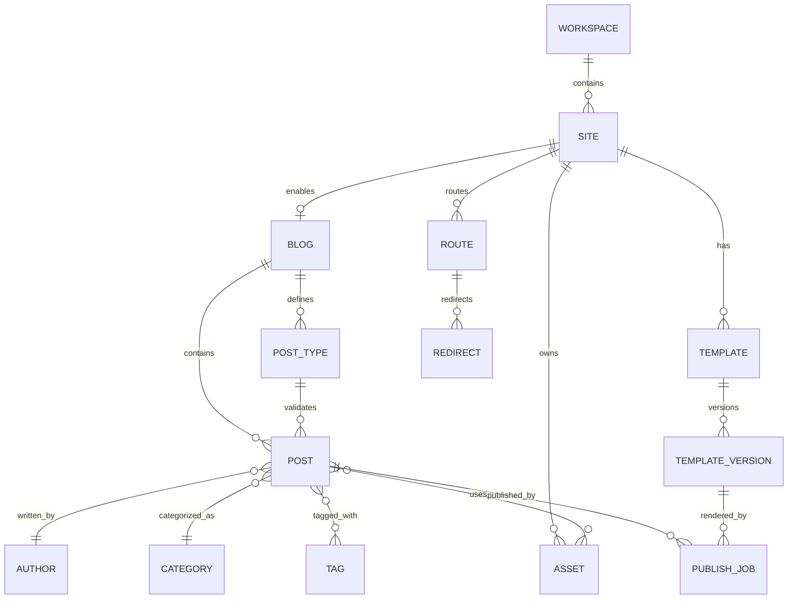
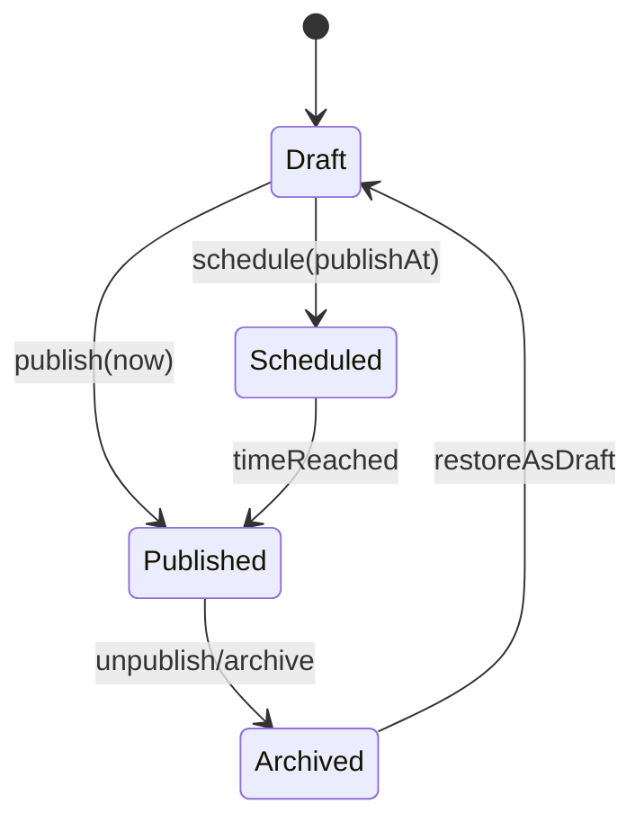
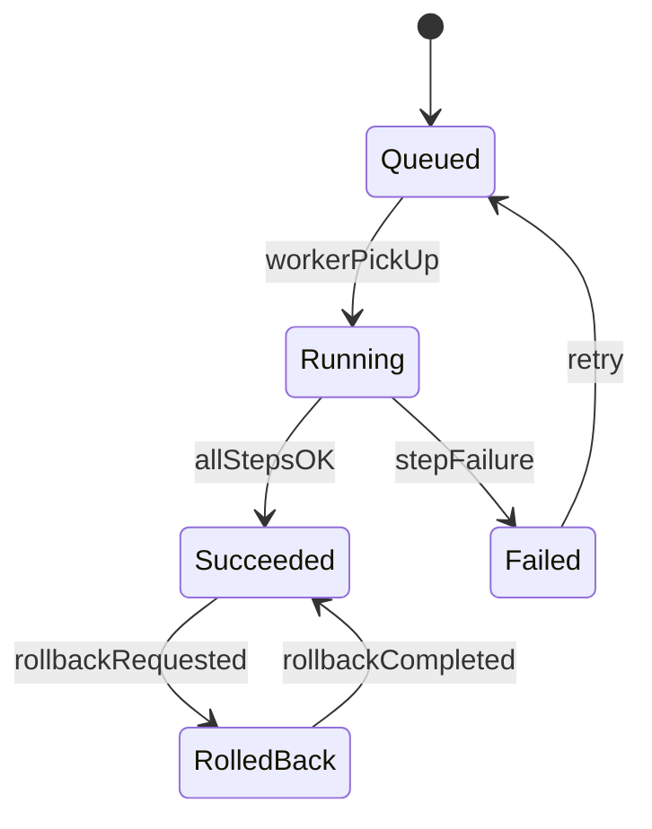
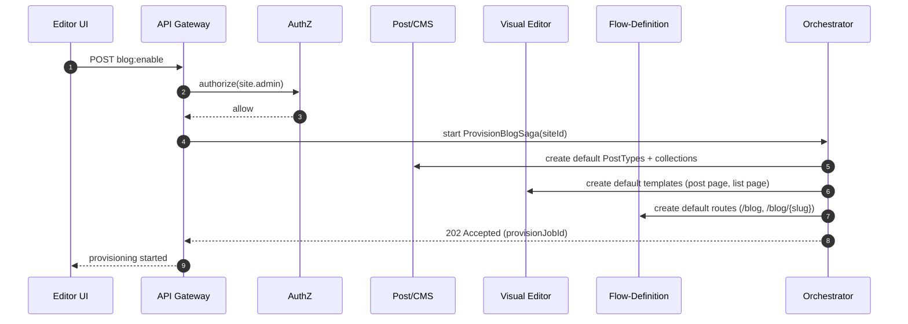
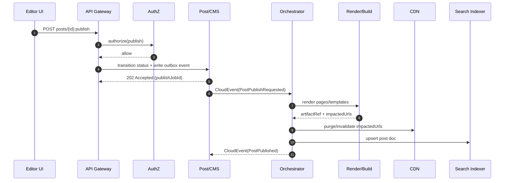
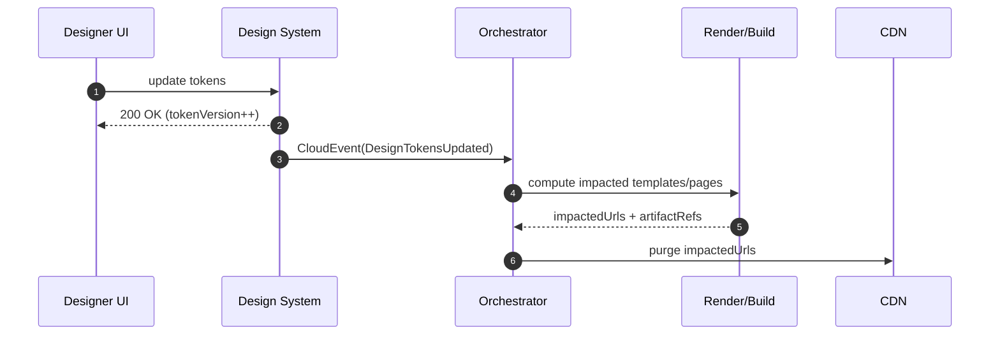
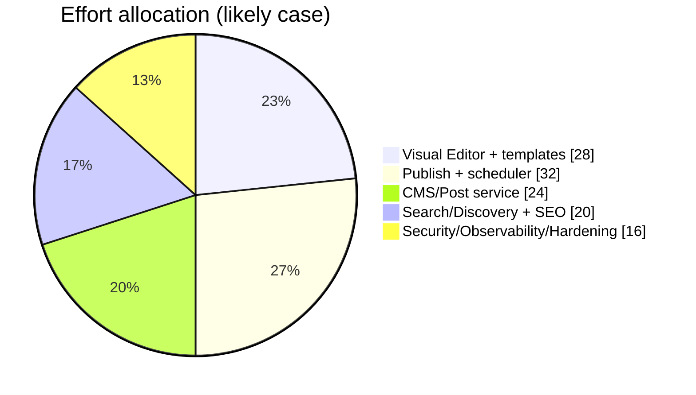
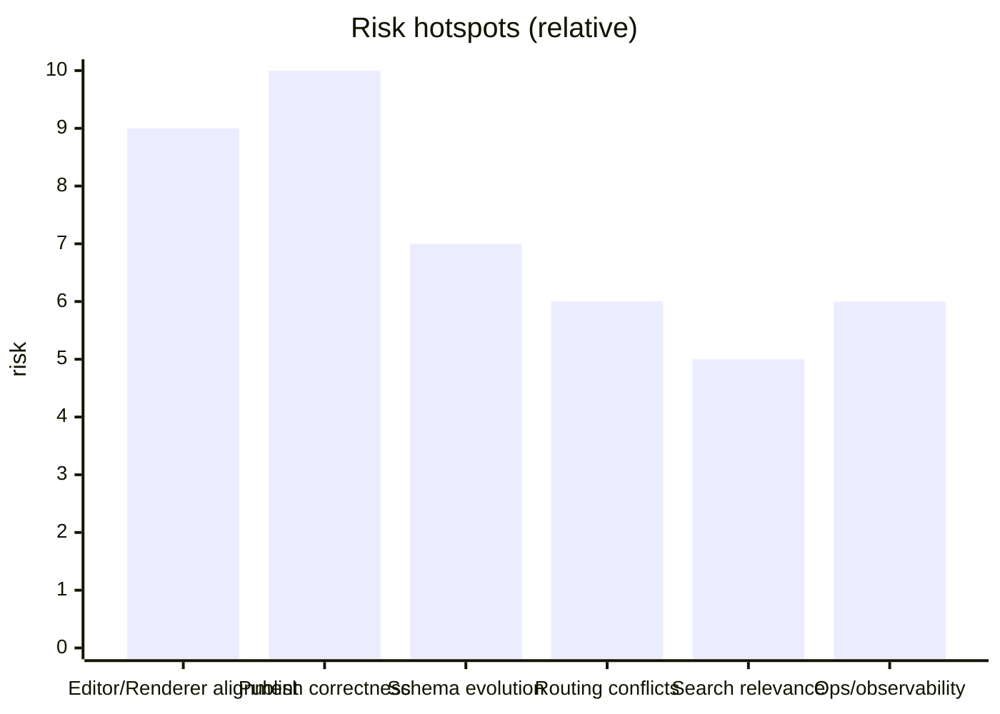

# Extending the Existing Engine to Support Flow Creation in the Visual Editor

## Executive summary

The accessible 22-* sources describe a “blog system inside a site builder” experience (in the mold of entity["company","Wix","website builder company"] / entity["company","Webflow","website builder company"] / entity["company","Squarespace","website builder company"]) implemented via a Visual Editor that stores a component/page tree, binds reusable widgets to CMS data, and supports publishing workflows (draft → publish/schedule) plus cross-cutting changes such as “design tokens updated → re-render all impacted pages.” fileciteturn0file1 fileciteturn0file0

The documents also frame two implementation paths:
- **Builder-first (Visual Editor as source of truth)**: the editor drives templates/widgets and binds them to CMS data for live preview and publish. fileciteturn0file0 fileciteturn0file1  
- **Design-to-code (Figma as source of truth)**: ingest design artifacts (via entity["company","Figma","design software company"] APIs), map variables/tokens, generate code/templates, and deploy. fileciteturn0file0 fileciteturn0file1 citeturn5search3turn5search7

**Primary recommendation:** ship **builder-first** as the first production increment, architected so **design-to-code** can be added later without re-platforming. This matches the sources’ highest-signal user flows (“add blog feed widget,” “create post template page,” “draft → publish/schedule,” “design update triggers re-render”) and minimizes external dependency and determinism risk. fileciteturn0file0 fileciteturn0file1

**What “extending the engine” concretely means** (aligned to the engine-component checklist you requested):  
- **API surface**: formalize resources for templates/page-trees, CMS schemas (“post types”), posts, routes/redirects, publish jobs, and widget data-binding queries. fileciteturn0file1  
- **Persistence**: add versioned storage for (a) content blocks and (b) template IR (intermediate representation), with schema evolution support. fileciteturn0file0  
- **Orchestration + scheduler**: implement publish/schedule flows and “design token update” rebuild flows as explicit, observable workflows. fileciteturn0file0  
- **Security + versioning**: enforce RBAC and state-transition permissions; preserve audit logs and artifact/version histories. fileciteturn0file1  
- **Telemetry + error handling**: standardize structured API errors (Problem Details / RFC 9457) and distributed observability (OpenTelemetry), then add service-level dashboards and alerting. citeturn0search2turn4search0turn4search12  
- **Concurrency + rollback + testing hooks**: add optimistic concurrency (ETag/If-Match), idempotent publish operations, rollback to previous published artifacts, and deterministic workflow test harnesses. citeturn8search1turn8search4turn1search1

**Availability note (important):** although your instruction references “all 22-* documents,” only two 22-* artifacts were accessible in this session. All requirements not directly supported by those sources are explicitly marked **unspecified**, with assumptions listed. fileciteturn0file0 fileciteturn0file1

## Requirements extracted from the available 22-* sources

### Product scope inferred from the sources

The source set describes a modular blog-in-builder system spanning:
- workspace/projects/roles and optional approval workflows, fileciteturn0file1  
- a Visual Editor that stores a page/component tree and uses CMS-wired widgets (post list, post page, featured posts, categories, author box, subscribe form), with responsive variants, fileciteturn0file1  
- a theme/design system with tokens, fileciteturn0file1  
- CMS data modeling (posts/authors/categories/tags), schema validation rules, and schema-driven forms, fileciteturn0file1 fileciteturn0file0  
- rich post authoring (block content, media embeds, autosave/version history), fileciteturn0file1  
- publishing lifecycle with scheduling, cache invalidation, and rollback/version restore, fileciteturn0file1  
- routing/permalinks and redirects, plus SEO primitives (sitemap/RSS, metadata), fileciteturn0file1  
- discovery/search and “related posts,” fileciteturn0file1  
- optional engagement (comments), analytics, integrations/marketplace, and billing/plan gating. fileciteturn0file1

Those capabilities are summarized by four end-to-end flows in the sources:
1) **Create a blog + connect to a site** (enable feature → create collections + templates → add feed widget → configure route → publish), fileciteturn0file1  
2) **Write → review → publish** (draft + assets + SEO + preview → optional approval → publish/schedule + invalidate cache + update RSS/sitemap), fileciteturn0file1  
3) **Visitors discover → engage → convert** (landing from search/social → related posts/navigation → subscribe → comments/moderation), fileciteturn0file1  
4) **Change design without breaking content** (token/template update → global re-render → regression protection + rollback). fileciteturn0file1 fileciteturn0file0

image_group{"layout":"carousel","aspect_ratio":"16:9","query":["Webflow CMS blog editor interface","Wix blog editor dashboard","Squarespace blog editor post editor interface","Figma design editor interface"],"num_per_query":1}

### Flow-creation features and UX requirements

Interpreting “flow creation” in the context of the sources, it spans two related creation surfaces:

1) **Visual flow creation for pages/templates** (what users “build”): construct page trees, place widgets, bind widgets to CMS queries, and define responsive layouts. fileciteturn0file1  
2) **Operational workflow flows** (what the engine “executes”): publish/schedule pipelines and rebuild pipelines triggered by content changes and token updates. fileciteturn0file0 fileciteturn0file1

From the sources, the minimum required UX behaviors include: drag/drop, configurable “blog feed” widget query (latest/category/tag), “post template” creation, live preview using CMS data, and responsive variants. fileciteturn0file1

### Entities, states, transitions, and validation rules

The sources explicitly require (or strongly imply) the following:

**Core content entities:** Post, Author, Category, Tag, and relationships (post→author, post→tags). fileciteturn0file1

**Publishing states (content lifecycle):** Draft / Scheduled / Published / Archived are explicitly named. fileciteturn0file1  
Optional: additional review state(s) if you implement approval workflows (Author → Editor → Publisher). fileciteturn0file1

**Publishing transitions (minimum):**
- Draft → Published (immediate publish) fileciteturn0file1  
- Draft → Scheduled (schedule publish at time) fileciteturn0file1  
- Scheduled → Published (scheduler triggers at time) fileciteturn0file1  
- Published → Archived/Unpublished (unpublish behavior; sources mention “keep redirect / show 404 / show archived page”) fileciteturn0file1

**Validation rules (source-driven intent):**
- **Schema validation:** “Post Types” schema-driven forms and validation rules are called for; the deep-search recommends JSON Schema Draft 2020-12, which is the current released version. fileciteturn0file0 citeturn0search4turn0search0  
- **Timestamp formatting:** scheduling and publishAt fields should use a consistent internet timestamp profile (RFC 3339) so scheduler, UI, and APIs agree on representation. citeturn7search3  
- **Routing correctness:** slug/permalink rules (`/blog/:slug`, `/category/:slug`) and redirect creation when slugs change. fileciteturn0file1

## Engine extension blueprint and integration points

### Existing-module mapping from the sources

The sources map capabilities onto an internal “skills/services” architecture (auth/permissions, editor, design system, post/CMS, feed, object processing, flow-definition, flow-orchestrator, deployment, search). fileciteturn0file0 fileciteturn0file1

A practical extension plan is therefore: **keep business ownership per service**, and extend the engine by introducing a **shared flow-definition contract**, **workflow primitives** (jobs/events/state machines), and **cross-service reliability/observability standards**.

### Proposed reference architecture

```mermaid
flowchart TD
  UI[Editor UI / Visual Editor] --> GW[API Gateway]

  GW --> AUTH[Auth + Permissions]
  GW --> VE[Visual Editor Service<br/>templates/page-tree]
  GW --> DS[Design System Service<br/>tokens]
  GW --> CMS[Post/CMS Service<br/>schemas + posts]
  GW --> ROUTE[Routing / Flow-Definition Service]
  GW --> FEED[Feed / Discovery Service]
  GW --> ASSET[Assets / Object Processing]

  CMS --> DB[(Primary DB)]
  VE --> DB
  DS --> DB
  ROUTE --> DB

  ASSET --> OBJ[(Object Storage + CDN)]
  FEED --> IDX[(Search Index)]

  CMS --> ORCH[Flow Orchestrator<br/>publish + rebuild workflows]
  DS --> ORCH
  ORCH --> BUILD[Render/Build Runtime]
  ORCH --> FEED
  ORCH --> IDX
  ORCH --> NOTIFY[Notifications<br/>(optional)]
```

### Engine components to extend

**API surface**  
Introduce/standardize these first-class resource groups (even if implemented across multiple services): Templates, PostTypes, Posts, Routes/Redirects, PublishJobs, FeedQueries. This is directly implied by the sources’ modules and flows. fileciteturn0file1

**Persistence**  
Store “source of truth” artifacts as versioned documents with concurrency control:
- Template IR (page/component tree + layout constraints) fileciteturn0file1  
- Post content blocks + metadata fileciteturn0file1  
- PostType schemas (schema registry semantics) fileciteturn0file0

**Orchestration + scheduler**  
Model publish/schedule and rebuild flows as explicit workflows (orchestration, not ad-hoc chaining), because the sources explicitly require multi-step sequences (invalidate cache, update RSS/sitemap, update index, notify subscribers) and “design token change triggers re-render.” fileciteturn0file0 fileciteturn0file1  
To standardize event envelopes, use CloudEvents, which is designed to describe event data in common formats for interoperability. citeturn6search3turn0search5

**Security**  
Adopt OAuth 2.0 + bearer tokens for API authorization, optionally with OpenID Connect for authentication and identity claims. citeturn2search0turn2search1turn3search0  
Enforce RBAC and state-transition permissions, as described in the sources’ workspace/roles and approval workflow. fileciteturn0file1

**Versioning + error handling**  
- Use Problem Details (RFC 9457) as the default structured error response across services, so flow creation UIs can display actionable failures consistently. citeturn0search2turn6search2  
- Use explicit API versioning (`/v1/...`) and internal schema versions for PostTypes/Template IR. fileciteturn0file0

**Telemetry**  
Instrument the publish and rebuild workflows end-to-end using OpenTelemetry (traces/metrics/logs). citeturn4search0turn4search12turn4search4  
Export metrics using a time-series system such as Prometheus (metric name + labels identify a series) and visualize in dashboards. citeturn4search1turn4search9turn4search2

**Concurrency + rollback**  
- For concurrent edits to posts/templates: use optimistic concurrency with ETags and `If-Match` preconditions (HTTP conditional request semantics). citeturn8search1turn8search4  
- For rollback: persist published artifact versions and support “roll back to version N” (source requirement: rollback/version restore). fileciteturn0file1

### Alternative design choices and trade-offs

**Builder-first vs design-to-code**

| Option | What it optimizes | Key risks | When to choose |
|---|---|---|---|
| Builder-first | fast product iteration; deterministic templates; direct support for widget binding + live preview | requires strong template IR + rendering pipeline discipline | matches the sources’ primary flows and is lowest integration risk fileciteturn0file0 |
| Design-to-code | pipeline automation from design artifacts; designer-led workflows | correctness/determinism of codegen; dependence on external APIs and token mapping | only after a stable template IR and publish pipeline exists; leverage the Figma REST endpoints for files/nodes/variables citeturn5search3turn5search11 |
| Hybrid | partial automation without blocking MVP | interface/contract design must prevent “two sources of truth” | recommended long-term shape: converge both paths onto one canonical Template IR fileciteturn0file0 |

**Orchestration pattern**  
For publish/rebuild flows, a central orchestrator approach is easier to observe and reason about than pure choreography when workflows span many services and require compensations/rollback. This is consistent with Saga-pattern guidance that distinguishes choreography vs orchestration as two approaches with different trade-offs. citeturn9search5turn9search0

## Data model and persistence changes

### Canonical entity model

The sources imply these entities (minimum viable) and relations:



### Recommended storage approach

Because the sources call for:
- a **page tree** representation and  
- structured post content and schema validation, fileciteturn0file1  

a pragmatic persistence strategy is:
- store Template IR and Post content as JSON documents, with relational “header fields” for indexing and constraints, and support efficient JSON queries via JSONB indexing where relevant. PostgreSQL explicitly documents JSONB indexing with GIN, including trade-offs via different operator classes. citeturn5search4turn5search0  
- store assets in object storage, where services such as Amazon S3 are designed for extremely high durability (11 nines) and high availability, serving as a reference reliability target for this tier. citeturn5search2turn5search6  
- index published content into a search engine with explicit field mappings; Elasticsearch documentation clarifies field data types (e.g., `text` analyzed for full-text search vs `keyword` for filtering/sorting). citeturn5search1turn5search9

### Schema changes and constraints

Because current schemas are **unspecified** in accessible sources, the following are recommended additive tables/collections; names are illustrative:

- `post_types`: `(id, site_id, name, schema_json, schema_version, created_at, updated_at)`  
- `posts`: `(id, site_id, post_type_id, title, slug, status, publish_at, content_json, seo_json, version, created_at, updated_at)`  
- `post_versions`: immutable copies for diff/rollback (optional MVP, but aligned to “version history” and rollback requirements). fileciteturn0file1  
- `templates` and `template_versions`: template IR JSON + version and status (draft/published), aligning to “post template page” creation and rollback/version restore. fileciteturn0file1  
- `routes` and `redirects`: slug/permalink rules and redirects manager. fileciteturn0file1  
- `publish_jobs`: workflow state, attempt counts, outputs (artifact references), and linkage to posts/templates. fileciteturn0file1  
- `outbox_events` (recommended): durable event emission to prevent dual-write inconsistencies; the transactional outbox pattern is documented in AWS prescriptive guidance and other architecture references. citeturn9search4turn9search1

## API and contract design

### Cross-cutting API contract standards

**Authentication/authorization**  
- OAuth 2.0 defines the authorization framework. citeturn2search0  
- Bearer tokens over HTTP require TLS and define standard error handling semantics. citeturn3search0turn3search8  
- For first-party UI login, OpenID Connect Core defines authentication on top of OAuth 2.0 and standard claims. citeturn2search1turn2search9  
- If using JWT access tokens, JWT is standardized in RFC 7519. citeturn2search2turn2search10

**Error responses**  
Standardize on Problem Details (RFC 9457) for all services, replacing ad-hoc error bodies. citeturn0search2turn6search2

**Partial updates**  
- Use JSON Patch (RFC 6902) for precise edits to nested JSON documents like template IR and block content, as it defines patch operations and a standard media type. citeturn0search3turn0search11  
- Use JSON Merge Patch (RFC 7396) for simpler “merge-like” updates when arrays/ordering are not central. citeturn1search0turn1search8

**Caching headers**  
Publishing flows in the sources require cache invalidation; use HTTP cache semantics (RFC 9111) and optionally targeted CDN caching control via `CDN-Cache-Control` (RFC 9213) when you need separate CDN vs browser caching behavior. citeturn1search2turn1search3

### Resource APIs aligned to the source flows

The endpoints below are grouped by product flow and service boundary. They are designed to be “engine extendable”: each maps cleanly to persistence, state transitions, scheduler triggers, and orchestrator workflows.

#### Blog enablement and default provisioning

Enabling the blog feature must (per sources) create CMS collections and default templates, and configure routing. fileciteturn0file1

```http
POST /v1/sites/{siteId}/features/blog:enable
Authorization: Bearer <token>
Content-Type: application/json

{
  "routes": {
    "blogIndex": "/blog",
    "postPermalink": "/blog/{slug}",
    "categoryPermalink": "/blog/category/{slug}"
  },
  "seed": {
    "createDefaultTemplates": true,
    "createDefaultCollections": true
  }
}
```

Recommended response:
- `202 Accepted` + `provisionJobId` (async provisioning), or `200 OK` if provisioning is synchronous.

Provisioning errors should be Problem Details (RFC 9457). citeturn6search2

#### Post types (schema registry) and validation

The sources call for schema-driven models and validation rules. fileciteturn0file1  
Use JSON Schema 2020-12 as a canonical schema language (current published version). citeturn0search4turn0search0

```http
POST /v1/sites/{siteId}/post-types
Authorization: Bearer <token>
Content-Type: application/json

{
  "name": "standard-post",
  "schemaDialect": "json-schema-2020-12",
  "schema": { "...": "..." }
}
```

#### Posts CRUD and lifecycle transitions

Core lifecycle is explicit in the sources (draft/scheduled/published/archived). fileciteturn0file1  
Publish/schedule must produce orchestrated side effects (invalidate cache, update index, update sitemap/RSS, notify). fileciteturn0file1

```http
POST /v1/sites/{siteId}/posts
Authorization: Bearer <token>
Content-Type: application/json

{
  "postTypeId": "uuid",
  "title": "Hello world",
  "slug": "hello-world",
  "content": { "type": "blocks", "blocks": [] },
  "metadata": { "authorId": "uuid", "categoryId": "uuid", "tags": ["tech"] },
  "status": "draft"
}
```

For state transitions:

```http
POST /v1/sites/{siteId}/posts/{postId}:publish
Authorization: Bearer <token>
Content-Type: application/json

{ "mode": "immediate" }
```

```http
POST /v1/sites/{siteId}/posts/{postId}:publish
Authorization: Bearer <token>
Content-Type: application/json

{ "mode": "schedule", "publishAt": "2026-03-13T09:00:00+02:00" }
```

Time format should follow RFC 3339 to avoid timezone ambiguity across clients and schedulers. citeturn7search3

#### Templates, visual editor page trees, and UI binding

The Visual Editor stores a page tree (components + props) and layout constraints, and uses widgets wired to CMS data. fileciteturn0file1  
Templates should therefore expose:
- a canonical Template IR schema
- a patch-based update endpoint (JSON Patch recommended) citeturn0search3  
- a data-binding expression model for “blog feed widget query (latest/category/tag).” fileciteturn0file1

Example (illustrative, abbreviated):

```http
PATCH /v1/sites/{siteId}/templates/{templateId}
Authorization: Bearer <token>
Content-Type: application/json-patch+json
If-Match: "v17"

[
  { "op": "replace", "path": "/nodes/5/props/query", "value": { "type": "feed.latest", "limit": 10 } }
]
```

Optimistic concurrency with `If-Match` aligns with HTTP conditional request semantics (precondition failure when versions mismatch). citeturn8search1turn8search4

#### Feed and discovery endpoints

The sources explicitly mention feed endpoints for latest and category. fileciteturn0file0 fileciteturn0file1

```http
GET /v1/sites/{siteId}/feed/latest?limit=10&cursor=...
GET /v1/sites/{siteId}/feed/category/{categorySlug}?limit=10&cursor=...
POST /v1/sites/{siteId}/feed/related
```

Indexing strategy should match your search engine mapping and field modeling (e.g., `text` vs `keyword`). citeturn5search1

## Orchestration, scheduler, and runtime sequences

### Workflow modeling approach

The sources require multi-step operations with side effects across services. fileciteturn0file0 fileciteturn0file1  
To keep workflows reliable and debuggable, implement them as durable “sagas” with a clear owner (orchestrator) and compensations. This matches established guidance describing orchestration vs choreography as two saga implementation approaches. citeturn9search5turn9search0

For dual-write (DB update + event publish), the transactional outbox pattern is a standard mitigation, including in AWS prescriptive guidance. citeturn9search4turn9search1

### State machines

**Post lifecycle**



This state set comes directly from the sources; “restore as draft” is a recommended extension to satisfy rollback/version restore in practice. fileciteturn0file1

**Publish job lifecycle**



### Event envelope and publish sequencing

Adopt CloudEvents as the standard envelope for internal events because it standardizes event metadata for interoperability. citeturn6search3turn0search5

#### Sequence: enable blog



This sequence expresses the source flow “enable blog → creates collections + templates + configure route.” fileciteturn0file1

#### Sequence: publish (immediate/scheduled)



HTTP retry guidance: clients should not automatically retry non-idempotent methods unless they know the request is idempotent or can detect it was not applied, motivating idempotency keys and/or server-side job IDs for publish. citeturn1search1

#### Sequence: design token update triggers rebuild

The sources explicitly require “theme/token changes propagate” and “design update triggers re-render.” fileciteturn0file1 fileciteturn0file0



### Scheduler behavior

The sources require “schedule post for Friday 09:00 → job runs.” fileciteturn0file1  
Recommended scheduler mechanics:
- store scheduled publish jobs with RFC 3339 timestamps, citeturn7search3  
- ensure job execution is at-least-once, and orchestrator steps are idempotent (e.g., search index upsert, CDN purge),  
- use HTTP caching semantics (RFC 9111) and optionally targeted CDN caching controls (RFC 9213) to reduce load while ensuring correctness after publish. citeturn1search2turn1search3

## Backward compatibility, migration, and rollout strategy

### Backward compatibility concerns implied by the sources

Even if “blog” is a new feature, it interacts with core engine surfaces:
- **Routing:** new permalink rules can conflict with existing site routes; slug changes must create redirects. fileciteturn0file1  
- **Rendering runtime:** template changes and token updates can affect all pages; rebuild triggers must be scoped and safe. fileciteturn0file0  
- **Permissions:** new roles/approval workflow adds state-transition authorization complexity. fileciteturn0file1  
- **Caching:** published pages must invalidate or revalidate caches reliably. fileciteturn0file1 citeturn1search2turn1search3

### Migration strategy

Because existing platform schema and APIs are unspecified, the safest strategy is **additive + feature-gated**:
- introduce blog resources behind a site-level feature toggle (“blog enabled”), default off for existing sites; enabling triggers provisioning. fileciteturn0file1  
- version PostType schemas and Template IR; store schema version on each post/template-version, and migrate via background jobs rather than inline rewrite. fileciteturn0file0 citeturn0search0  
- for redirects: on slug change, create a redirect record and keep old published artifacts discoverable until caches expire. fileciteturn0file1

### Rollout and rollback

If your runtime is deployed on Kubernetes (explicitly referenced in the sources’ skill mapping), operational rollback can leverage Kubernetes deployment revision history and commands like `kubectl rollout undo`. fileciteturn0file1 citeturn4search3turn4search7  
At the application level, you should also support rollback of **published content artifacts** (version restore) as described in the sources. fileciteturn0file1

## Implementation backlog, tests, and phased roadmap

### Implementation tasks mapped to engine components

The table below is intentionally detailed at the “implementation ticket” level, but grouped so it can be converted into epics/initiatives.

| Area | Implementation tasks (engine extensions) | Key acceptance tests |
|---|---|---|
| Flow-definition + routing | Create Route/Redirect resources; enforce route conflict checks; add “slug change → redirect” behavior | 1) Create `/blog/{slug}` without conflicts 2) Update slug creates redirect 3) Old URL resolves 301/302 as configured fileciteturn0file1 |
| Visual Editor | Add blog widgets (feed, post page, category list, author box); implement data-binding expression model; responsive variants; preview rendering with sample data | 1) Add widget and configure latest/category/tag query 2) Preview matches data and responsive variants fileciteturn0file1 |
| CMS/Post service | Add PostType schema registry (JSON Schema 2020-12); validate post payloads; implement post states and transitions | 1) Invalid post fails schema validation 2) Draft/scheduled/published/archived transitions enforced citeturn0search0turn0search4 fileciteturn0file1 |
| Orchestrator | Implement PublishSaga and TokenRebuildSaga; add durable job records; implement retries and compensations | 1) Publish triggers render → CDN purge → index upsert 2) Partial failures retry correctly fileciteturn0file0 |
| Scheduler | Implement timer-based job pickup for scheduled posts; ensure timestamps RFC 3339; enforce idempotent execution | 1) Scheduled post publishes at correct time zone boundary 2) Duplicate triggers do not double-publish citeturn7search3turn1search1 |
| Render/build runtime | Implement template IR renderer; compute “impacted URL set” for rebuilds; output artifact IDs for rollback | 1) Template update impacts expected pages only 2) Rollback restores previous artifact correctly fileciteturn0file1 |
| Search/discovery | Implement feed endpoints; index mapping for post fields; “related posts” rules | 1) `feed/latest` returns only published 2) Category feed filter correct 3) Search fields behave per mapping types citeturn5search1turn5search9 fileciteturn0file1 |
| Assets | Upload pipeline; transforms; canonical asset references in posts/templates | 1) Upload cover image produces variants 2) CDN URLs served 3) Post render uses correct variant fileciteturn0file1 |
| Security + audit | RBAC matrix; workflow transition permissions; audit logging for publish and permission changes; CSP defaults on published pages | 1) Unauthorized publish blocked 2) Audit records created 3) CSP header present on published responses fileciteturn0file1 citeturn3search2turn3search1 |
| Observability + error model | Standardize RFC 9457 errors; add OpenTelemetry tracing; Prometheus metrics; dashboards | 1) Consistent error payloads 2) End-to-end trace across publish 3) Dashboards show job latency/failure rates citeturn6search2turn4search0turn4search9turn4search2 |
| Testing hooks | Deterministic workflow test runner (mock time/CDN/index); contract tests for event schemas (CloudEvents) | 1) Replay workflow with fixed time 2) Contract tests fail on breaking event changes citeturn6search3turn0search5 |

### Test plan coverage

| Test layer | What to test | Examples |
|---|---|---|
| Unit | schema validation; slug normalization; patch application; permission matrix | JSON Schema 2020-12 fixtures; JSON Patch operations per RFC 6902; transition authorization checks citeturn0search0turn0search3 |
| Integration | publish saga across services; scheduler timing; indexing correctness; cache controls | publish job produces artifact → invalidates CDN → index updated; caching headers follow RFC 9111 and targeted CDN directives if used citeturn1search2turn1search3 |
| End-to-end | Flow 1–4 from sources | enable blog → add feed widget → create template → publish post → verify live URL + feed; token update → rebuild → verify layout changes fileciteturn0file1 |

### Phased roadmap with estimates, risks, and dependencies

The 22-* deep-search artifact gives a baseline schedule estimate of **8/12/18 weeks** (optimistic/likely/pessimistic) for a single squad with existing foundations. fileciteturn0file0  
Below is a more “engineering-backlog” view in person-weeks (PW). These numbers are necessarily approximate because your current engine codebase, team size, and existing module maturity are unspecified.

| Phase | Deliverables | Effort (low / likely / high) | Risk | Key dependencies |
|---|---|---:|---|---|
| Foundation | contracts: Template IR, PostType schema registry, RFC 9457 errors, CloudEvents envelope, RBAC matrix | 10 / 16 / 24 PW | Medium | agreement on canonical IR + schema dialect citeturn0search0turn6search3turn6search2 |
| Authoring MVP | posts CRUD + lifecycle; basic authoring blocks; assets upload | 16 / 24 / 36 PW | Medium | asset pipeline readiness; schema validation citeturn0search4turn5search2 |
| Visual Editor + templates | blog widgets; data binding; responsive variants; preview rendering | 18 / 28 / 42 PW | High | stable widget model + renderer alignment fileciteturn0file1 |
| Publish + schedule | orchestrated publish workflow; scheduler; CDN invalidation; rollback artifacts | 20 / 32 / 48 PW | High | reliable workflow engine + idempotency + cache strategy citeturn1search1turn1search2 |
| Discovery + SEO baseline | feed endpoints; indexer; sitemaps/RSS (baseline); redirects manager | 12 / 20 / 30 PW | Medium | search mapping decisions; routing stability citeturn5search1turn5search9 |
| Hardening | observability, load tests, security controls (CSP), runbooks | 10 / 16 / 26 PW | Medium | OpenTelemetry plumbing; dashboard and alerting design citeturn4search0turn3search2 |
| Optional design-to-code | Figma ingestion; token mapping; codegen + deployment automation | 20 / 40 / 70 PW | Very High | external API auth/rate limits; deterministic codegen; governance citeturn5search3turn5search11 |

### Effort and risk charts





Mermaid supports ER diagrams, pie charts, and XY charts using dedicated syntax modules, which makes these artifacts straightforward to keep version-controlled alongside the codebase. citeturn7search0turn7search1turn7search2

### Required documentation and developer guides

To make the engine extension sustainable, the following docs are “must ship” alongside the feature set:
- **Template IR specification** (schema, node types, data binding expressions, versioning rules).  
- **PostType schema guide** (JSON Schema 2020-12 dialect conventions, migrations, compatibility). citeturn0search0turn0search12  
- **Workflow catalog** (PublishSaga, TokenRebuildSaga, retry/compensation semantics, event types as CloudEvents). citeturn6search3turn0search5  
- **API reference** (auth model, Problem Details error taxonomy, pagination, rate limits). citeturn6search2turn3search0  
- **Operational playbooks** (publish failures, rollback procedures, Kubernetes rollout/undo). citeturn4search7turn4search3  
- **Security posture** (RBAC, CSP defaults, OWASP Top Ten mapping, audit logging). citeturn3search1turn3search2

### Unspecified details and explicit assumptions

**Unspecified in accessible sources (must be confirmed in the missing 22-* docs or in existing code):**
- Current engine data stores, tenancy model details, and API gateway patterns  
- Existing “flow-definition” and “flow-orchestrator” implementations (interfaces, persistence, scheduling model)  
- Exact UI wireframes and interaction rules for the Visual Editor and post authoring experience  
- Exact rollout environments (staging/prod) and hosting/runtime (SSR vs SSG vs hybrid) beyond conceptual mentions fileciteturn0file1

**Assumptions made to produce implementable designs:**
- Multi-tenant scoping exists at least at `workspaceId/siteId`, consistent with the sources’ workspace/site framing. fileciteturn0file1  
- The engine can support asynchronous jobs/workflows, consistent with “flow orchestrator” references. fileciteturn0file0  
- JSON Schema 2020-12 is acceptable as the canonical schema dialect, since it is the current published version and the sources call for schema validation and schema-driven UI. fileciteturn0file0 citeturn0search4turn0search0