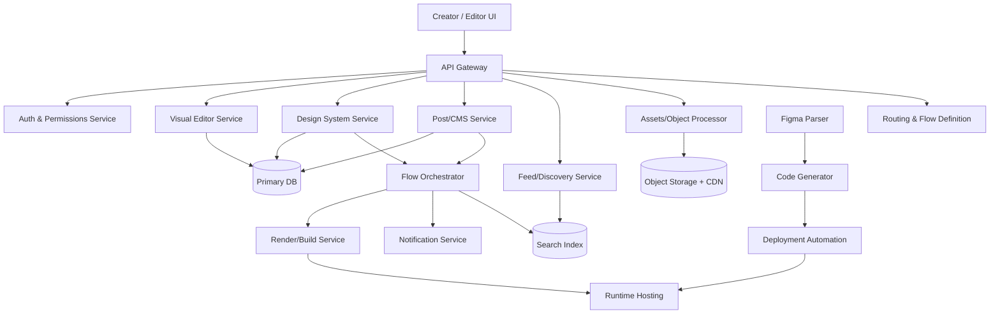
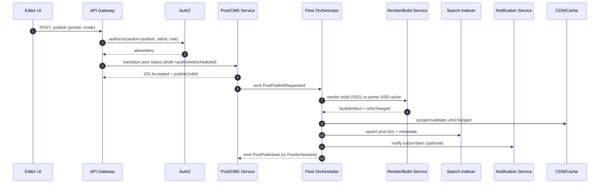
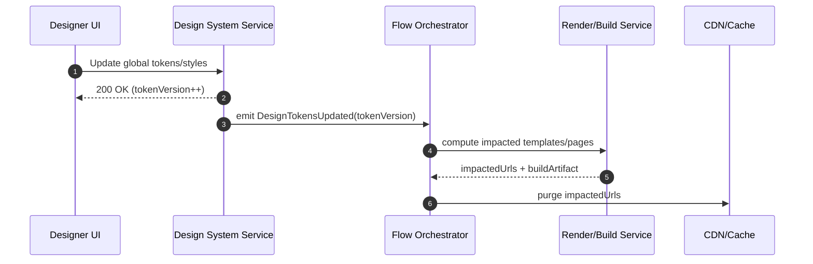

# Extending the Platform to Support a Blog System Inside the Visual Editor

## Executive summary

The attached specification describes a “blog system inside a site builder” (Wix/Webflow/Squarespace-style) and highlights two implementation paths: a builder-first path (visual editor as the source of truth) and a design-to-code path (Figma as the source of truth). fileciteturn0file0 The document also proposes mapping these modules to an existing microservice “skills” architecture (auth/permissions, design tokens, visual editor, post/CMS, feed/discovery, assets processing, routing/flow-definition, flow-orchestrator, deployment, search indexing). fileciteturn0file0

**Recommendation (high confidence given the spec’s intent):**
- Ship **Path A (builder-first)** as the MVP: Visual Editor + CMS schema-driven widgets + publishing pipeline coordinated by the orchestrator. This aligns directly with the described flows (“add blog feed widget”, “post template page”, “draft → publish/schedule”, “design update triggers re-render”). fileciteturn0file0  
- Design the platform so **Path B (Figma → code)** can be added later as an optional ingestion/automation pipeline (it is valuable, but has higher integration and operational complexity because it depends on external design APIs and codegen/verifiable output). fileciteturn0file0 citeturn7search0turn7search4

**Key design choices we recommend where the spec is ambiguous:**
- Use **JSON Schema Draft 2020-12** as the canonical contract for “Post Types” and for validating content payloads, because the spec explicitly calls for schema validation and schema-driven UI generation. fileciteturn0file0 citeturn0search6turn0search2
- Use **event-driven orchestration** internally with an explicit event envelope (recommend **CloudEvents**) for publish/design-update flows; it standardizes event metadata and helps interoperability across services. citeturn1search7turn1search3turn1search11
- Implement standardized API error payloads using **Problem Details for HTTP APIs (RFC 9457)** to keep contracts consistent and debuggable across services. citeturn3search3turn3search7
- Implement observability using **OpenTelemetry** across services (traces/metrics/logs correlation), and export metrics in a **Prometheus**-scrapable format with dashboards (e.g., **Grafana**). citeturn0search3turn0search7turn1search9turn1search1turn1search2
- For deployment, align with **Kubernetes** rolling updates and explicit rollback procedures (e.g., `kubectl rollout undo`) and encode them into CI/CD and incident playbooks. citeturn1search0turn5search0turn5search20

**Scope framing (important):** the attached spec describes a full “blog system” including SEO, routing, publishing, discovery/search, assets, and optional engagement/analytics/integrations. fileciteturn0file0 A realistic first release should focus on core flows: enable blog, create/edit posts, template pages, publish/schedule, render/feed, and indexing; then iterate into comments/analytics/marketplace.

**Timeline estimate (2‑week sprints, one product squad):**
- **Optimistic:** 8 weeks (4 sprints)  
- **Likely:** 12 weeks (6 sprints)  
- **Pessimistic:** 18 weeks (9 sprints)  
(Assuming: 5–7 engineers + 1 QA + 1 PM/EM shared, and that auth + editor foundations already exist as implied by the “skills” mapping.) fileciteturn0file0

A quick “where each requested dimension is addressed” map:

| Dimension requested | Covered primarily in |
|---|---|
| Current platform architecture | Target architecture and alternatives |
| Required new features | Target architecture and alternatives; Data models and APIs |
| Data models and schemas | Data models, schemas, APIs |
| API endpoints and contracts | Data models, schemas, APIs |
| AuthN/AuthZ changes | Identity, security, privacy |
| Storage and scaling | Event flows, reliability, observability, scaling |
| Event flows & sequence diagrams | Event flows, reliability, observability, scaling |
| Error handling & retry policies | Event flows, reliability, observability, scaling |
| Monitoring/observability | Event flows, reliability, observability, scaling |
| Testing strategy | Delivery plan |
| Deployment/CI‑CD changes | Delivery plan |
| Rollback and migration plans | Delivery plan; Target architecture and alternatives |
| Security/privacy considerations | Identity, security, privacy |
| Effort/timeline (O/L/P) | Delivery plan |

## Process interpretation and explicit assumptions

**What the spec is asking the platform to support (interpreted):**
- A “blog inside a builder” capability includes: workspace roles/permissions; a visual editor that stores page/component trees; a design system with tokens; CMS collections for posts/authors/categories/tags; rich authoring; assets/media; routing/permalinks; rendering runtime (SSR/SSG/hybrid); a publishing pipeline with scheduling and rollback; SEO/social metadata; discovery/search; and optional engagement/analytics/integration/billing modules. fileciteturn0file0
- Two distinct but related “processes” are described:
  - **Path A:** Wix-like builder integration where the visual editor is “master” and blog widgets bind to CMS data for live preview. fileciteturn0file0
  - **Path B:** Figma → auto-generated blog pipeline using a parser, design-token mapping, code generation, and deployment automation. fileciteturn0file0 citeturn7search0turn7search4
- The spec maps core modules onto an internally modular “skills” system (auth/permissions, editor, design system, post service, flow orchestrator, assets, routing, deployment, search). fileciteturn0file0

**Assumptions about “current platform architecture” (explicit because unspecified by the user):**
1. The platform is **multi-tenant** with a concept like *workspace → site/project → pages/content*, because the spec references workspaces/sites/projects and role-based collaboration. fileciteturn0file0
2. There is an existing **microservice or modular boundary** system (the spec uses “skills” such as auth service, web flow editor, post service, flow orchestrator, etc.). fileciteturn0file0
3. The platform can run in a container orchestration environment (the spec references a “K8s Deployment” skill). If this is accurate, deployment patterns should follow Kubernetes rolling updates/rollback mechanics. fileciteturn0file0 citeturn1search0turn5search0
4. An existing “flow orchestrator” exists (or can be built) to coordinate multi-step processes like publishing/search indexing/notifications/design re-render. fileciteturn0file0
5. Persistence technologies are not specified; this report recommends proven defaults (relational DB + object storage + search index), but provides alternatives.

**Primary product decision implied by the spec (and required for an implementation plan):**
- Whether the product is primarily **builder/hosting** (Wix-like) or primarily **design** (Figma-like). fileciteturn0file0  
This report recommends treating the MVP as builder/hosting (Path A), while keeping a “design ingestion” seam for Path B.

image_group{"layout":"carousel","aspect_ratio":"16:9","query":["Webflow CMS blog editor interface","Wix blog editor dashboard","Figma design editor interface","Squarespace blog editor interface"],"num_per_query":1}

## Target architecture and alternatives

**Current platform architecture (assumed baseline):**
- **API Gateway / Edge**: terminates TLS, routes requests, enforces authN/Z.
- **Core domain services** (matching the spec’s “skills” mapping):  
  - Auth & permissions (RBAC)  
  - Visual editor (page tree + widgets)  
  - Design system/tokens  
  - CMS/Post service (schemas + content records)  
  - Assets processor + CDN integration  
  - Routing/flow-definition (slug → template/page resolution)  
  - Flow orchestrator (publishing & design-update sequences)  
  - Feed/discovery + Search indexing  
  - Notifications (optional MVP)  
  - Deployment/build pipeline (if SSG/hybrid) fileciteturn0file0

**Architecture diagram (conceptual, aligned to the spec)**



### Alternative designs and cost/complexity tradeoffs

**Alternative table: Builder-first vs Design-to-code vs Combined**

| Option | What it means in practice | Pros | Cons / risks | Cost & complexity |
|---|---|---|---|---|
| **Option A (recommended MVP): Builder-first** | Visual editor stores template/page trees; widgets bind to CMS; orchestrator publishes and triggers re-render/index/notify | Directly matches “add blog widget”, “post template page”, “draft→publish/schedule”, “design update triggers rerender” flows fileciteturn0file0; fewer external dependencies; easier to reason about tenancy and permissions | Requires robust rendering pipeline (preview + published); needs strong schema validation and contract discipline | **Medium** (core infra + product UI/UX) |
| **Option B: Design-to-code first** | Figma file is source of truth; parser extracts nodes; token mapper builds design tokens; codegen produces runtime templates; CI deploys | Great for “design-led” organizations; enables automation from design artifacts; benefits from Figma’s file/node tree model citeturn7search0turn7search18 | High integration surface (external API auth, rate limits); hard to guarantee deterministic codegen correctness; longer security review chain | **High** (integration + codegen + deployment controls) |
| **Option C: Hybrid (phased)** | Ship Option A first; add Option B as optional template ingestion later | Balances time-to-value and long-term differentiation; avoids blocking MVP on codegen correctness | Requires careful “template IR” design so both paths converge on one runtime contract | **Medium-High** (if IR is done well early, long-term cost decreases) |

**Recommendation rationale:** Option A is explicitly described as the primary “Wix-like builder integration” path and is operationally simpler to deliver first. fileciteturn0file0 Option C is the best long-term structure if you anticipate meaningful demand for Figma-driven generation. fileciteturn0file0

**Alternative table: Rendering strategy (published pages)**  
The spec allows SSR/SSG/hybrid. fileciteturn0file0 Many modern frameworks formalize SSG vs SSR semantics; e.g., SSR generates HTML per-request, while SSG pre-renders at build time. citeturn7search6turn7search16

| Strategy | How it works | Pros | Cons | Best fit |
|---|---|---|---|---|
| SSR | Render on each request; cache at edge per HTTP caching rules | Simpler publish pipeline; always fresh; easier preview | Higher runtime load; needs careful caching and invalidation | Early MVP if build pipeline is immature |
| SSG | Build HTML on publish; serve from CDN; invalidate caches on changes | Great performance & cost efficiency; stable content; improved cacheability | Build + deploy orchestration complexity; rebuild latency | Blogs with high read traffic and low write frequency |
| Hybrid (recommended) | Preview and “editor views” via SSR; published content via SSG (or incremental rebuild) | Best of both: fast previews + fast published pages | More moving parts; needs consistent contracts between SSR and SSG renderers | Matches spec’s “live preview” + “rerender on design token change” fileciteturn0file0 |

**Caching notes:** irrespective of SSR/SSG, HTTP caching behavior should follow standard header semantics, and CDNs may honor targeted cache directives like `CDN-Cache-Control`. citeturn2search3turn2search15

## Data models, schemas, and API contracts

This section covers: **required new features (as concrete resources), data models and schemas, API endpoints and contracts**, and also sets up **migration** and **testing** hooks via stable contracts.

### Core resources (minimum viable set)

To support the spec’s flows (“enable blog”, “create post template”, “draft→publish/schedule”, “feed widget queries latest/category/tag”), the MVP should include these first-class resources: fileciteturn0file0

- Workspace / Site (or Project)
- Blog (feature enablement + settings; typically 1 per site)
- PostType (schema for a post kind; schema-driven editor forms)
- Post (draft/scheduled/published/archived lifecycle)
- Author, Category, Tag (and relations)
- Template (page tree for: post page, post list page, category page, etc.)
- Asset (media references)
- PublishJob (for scheduled publishing and rerender triggers)
- Redirect (for slug change → redirect)

### Schema strategy

**Recommendation:** represent “Post Types” and editor forms as JSON Schema Draft 2020-12, and store Post content as “structured blocks” (block editor) validated by schema. This matches the spec’s explicit requirement for schema validation and makes it easier to generate UI forms or validate from multiple clients. fileciteturn0file0 citeturn0search6turn0search2

**Example: Post schema (simplified, illustrative)**

```json
{
  "$schema": "https://json-schema.org/draft/2020-12/schema",
  "$id": "https://example.internal/schemas/post.json",
  "type": "object",
  "required": ["postId", "siteId", "title", "slug", "status", "content"],
  "properties": {
    "postId": { "type": "string", "format": "uuid" },
    "siteId": { "type": "string", "format": "uuid" },
    "title": { "type": "string", "minLength": 1 },
    "slug": { "type": "string", "pattern": "^[a-z0-9-]+$" },
    "excerpt": { "type": "string" },
    "status": { "enum": ["draft", "scheduled", "published", "archived"] },
    "publishAt": { "type": "string", "format": "date-time" },
    "metadata": {
      "type": "object",
      "properties": {
        "authorId": { "type": "string", "format": "uuid" },
        "categoryId": { "type": "string", "format": "uuid" },
        "tags": { "type": "array", "items": { "type": "string" } }
      }
    },
    "content": {
      "type": "object",
      "required": ["type", "blocks"],
      "properties": {
        "type": { "const": "blocks" },
        "blocks": { "type": "array", "items": { "$ref": "#/$defs/block" } }
      }
    },
    "seo": {
      "type": "object",
      "properties": {
        "metaTitle": { "type": "string" },
        "metaDescription": { "type": "string" },
        "canonicalUrl": { "type": "string", "format": "uri" }
      }
    }
  },
  "$defs": {
    "block": {
      "type": "object",
      "required": ["kind"],
      "properties": {
        "kind": { "enum": ["paragraph", "heading", "image", "embed", "code", "callout"] },
        "data": { "type": "object" }
      }
    }
  }
}
```

### Page tree & widget binding model

The spec states the editor stores a **page tree (components + props) + layout constraints**, and uses **reusable blocks wired to CMS data**. fileciteturn0file0

To support that in a platform-neutral way:

- Define a stable **Template IR** (intermediate representation) for pages:
  - Nodes: `{ id, type, props, children[] }`
  - Props include style tokens references and **data bindings** (e.g., “latest posts in category X”).
- Validate Template IR with JSON Schema as well (same Draft 2020-12). citeturn0search6turn0search2
- Recommend change operations via **JSON Patch (RFC 6902)** for collaborative editing / incremental updates over the wire (optional MVP), because it is designed for HTTP PATCH and can express ordered operations precisely. citeturn6search0turn6search4  
  (Alternative: JSON Merge Patch, RFC 7396, for simpler “object merge” semantics.) citeturn6search3turn6search10

### API surface (recommended contracts)

Below is a cohesive REST surface; it covers the spec’s required flows (enable blog, edit templates, CRUD posts, publish/schedule, feed queries). fileciteturn0file0

**Enable the blog feature**

```http
POST /v1/sites/{siteId}/features/blog:enable
Authorization: Bearer <token>
Content-Type: application/json

{
  "defaultRoutes": {
    "blogIndex": "/blog",
    "postPermalink": "/blog/{slug}"
  }
}
```

**Create and manage post types (schemas)**

```http
POST /v1/sites/{siteId}/post-types
Authorization: Bearer <token>
Content-Type: application/json

{
  "name": "standard-post",
  "schema": { "...json schema 2020-12..." },
  "version": 1
}
```

**Posts CRUD**

```http
POST /v1/sites/{siteId}/posts
Authorization: Bearer <token>
Content-Type: application/json

{
  "title": "Hello world",
  "slug": "hello-world",
  "content": { "type": "blocks", "blocks": [{ "kind": "paragraph", "data": { "text": "..." } }] },
  "status": "draft"
}
```

**Publish (immediate) and schedule**

```http
POST /v1/sites/{siteId}/posts/{postId}:publish
Authorization: Bearer <token>
Content-Type: application/json

{ "mode": "immediate" }
```

```http
POST /v1/sites/{siteId}/posts/{postId}:publish
Authorization: Bearer <token>
Content-Type: application/json

{ "mode": "schedule", "publishAt": "2026-03-13T09:00:00+02:00" }
```

**Feed endpoints (explicitly called out in the spec)**  
The spec describes a feed service with “GET latest”, “GET category/{slug}”, “POST related”. fileciteturn0file0

```http
GET /v1/sites/{siteId}/feed/latest?limit=10&cursor=...
GET /v1/sites/{siteId}/feed/category/{categorySlug}?limit=10&cursor=...
POST /v1/sites/{siteId}/feed/related
```

### Error model and API ergonomics

**Recommendation:** standardize error responses using **RFC 9457 Problem Details**, so all services produce consistent machine-readable error payloads. citeturn3search3turn3search7

Example:

```json
{
  "type": "https://example.internal/problems/slug-conflict",
  "title": "Slug already exists",
  "status": 409,
  "detail": "The slug 'hello-world' is already used by another published post.",
  "instance": "/v1/sites/123/posts/456"
}
```

## Identity, security, and privacy considerations

This section covers: **authentication/authorization changes** and **security/privacy considerations**.

### Authentication and session model

Because the platform is multi-tenant and exposes APIs to an editor UI, we recommend an OAuth2/OIDC-based approach:

- OAuth 2.0 defines the authorization framework and standard flows. citeturn0search0turn0search8
- OpenID Connect adds an authentication layer on top of OAuth2 and standardizes identity claims. citeturn0search5turn0search9
- If you use JWTs as access/ID tokens internally, JWT’s structure and claims carriage are standardized in RFC 7519. citeturn4search0turn4search4
- Bearer token usage over HTTP requires TLS and defines standard error semantics (RFC 6750). citeturn4search1turn4search9
- For public clients (SPA/mobile), PKCE mitigates authorization code interception; it is standardized as RFC 7636. citeturn4search2turn4search18

**Authorization (RBAC + content workflow):**
- The spec explicitly requires roles like Owner/Admin/Editor/Author/Viewer, and optionally an approval workflow Author → Editor → Publisher. fileciteturn0file0  
- Implement RBAC at the resource layer (site/blog/post/template), and add **state-transition permissions** (e.g., only Editors/Publishers can move from `draft` to `published`). This is consistent with the spec’s emphasis on “approval workflow” and a publishing pipeline.

### Web application security for published content

Published blog content is a classic source of XSS and injection risk; your system is also a multi-tenant platform with many integrations. The OWASP Top Ten is an industry baseline awareness document for web application security risks and should inform threat modeling and controls (input validation, authZ hardening, secure defaults). citeturn3search0turn3search4

**Content rendering hardening controls (recommended baseline):**
- Server-side sanitization of rich text / embed HTML (allowlist-based).
- Strong **Content Security Policy** for published pages to restrict what scripts/resources can execute; CSP Level 3 is a W3C standard. citeturn3search1turn3search9
- CSRF protection for state-changing browser calls; controlled CORS behavior (the Fetch Standard includes the CORS protocol model). citeturn4search3turn4search11
- Audit logging for permission changes and publish events (the spec explicitly references audit log/activity history in workspace module). fileciteturn0file0

### Privacy and compliance posture

Even a “blog system” can process personal data (author profiles, collaborators, subscriber emails, comment content, IP logs).

- GDPR is the EU’s baseline privacy regulation and is relevant if you have EU users or process EU personal data. citeturn9search0turn9search11
- CCPA provides California consumer privacy rights and may apply depending on your business and user base. citeturn9search1

**Practical privacy controls to plan for:**
- Data retention controls for logs, drafts, and archived posts.
- Data subject workflow support (export/delete for author/subscriber data) if needed.
- Tenant isolation guarantees: enforce `siteId/workspaceId` scoping in every query and index.

## Event flows, reliability, observability, and scaling implications

This section covers: **event flows and sequence diagrams**, **storage/scaling**, **error handling/retry**, and **monitoring/observability**.

### Eventing model

The spec highlights two orchestrated sequences:
- Publishing sequence: notify subscribers + index update + deployment/build or cache invalidation. fileciteturn0file0
- Design update sequence: token change triggers re-render job and updates cached HTML/CDN. fileciteturn0file0

**Recommendation:** Adopt **CloudEvents** as a canonical event envelope so services can publish/consume events consistently (type, source, id, time, data). CloudEvents is a CNCF project/spec precisely intended to standardize event metadata for interoperable routing. citeturn1search7turn1search3turn1search11

Example event types (convention):
- `com.platform.blog.post.published.v1`
- `com.platform.design.tokens.updated.v1`

### Sequence flow: publish (immediate or scheduled)



### Sequence flow: design token update → re-render



### Storage and scaling implications (recommended defaults and alternatives)

**Primary database:**  
- Use a relational DB for transactional integrity of workflow state (posts, statuses, publish jobs, permissions bindings). If adopting PostgreSQL, storing block content and template IR in JSONB is practical; PostgreSQL documents JSONB indexing trade-offs and GIN index patterns for JSONB. citeturn2search2turn2search18  
(Alternative: document DB; trade-off: easier nested documents, weaker relational constraints.)

**Object storage for assets:**  
- Use object storage for images/video and derived transformations. If implemented on AWS-compatible storage, Amazon S3’s published durability/availability expectations illustrate the reliability profile you typically want from this layer. citeturn2search1turn2search9  
(Alternative: self-hosted object storage; trade-off: operational burden.)

**Search index:**  
- The spec references Elasticsearch as the datastore for discovery/search. fileciteturn0file0 Elasticsearch’s mapping model is explicit: mapping defines how documents/fields are stored/indexed; analyzers control text analysis for search quality. citeturn2search0turn2search4  
(Alternative: DB full-text search; PostgreSQL has full text search features, but cross-field relevance and faceting may be more limited versus a dedicated search engine at scale.) citeturn2search6

**Caching and CDN:**  
- Follow HTTP caching semantics (RFC 9111) and use explicit cache headers; for CDNs, consider targeted cache-control conventions like `CDN-Cache-Control` (RFC 9213). citeturn2search3turn2search15  
- The spec expects cache invalidation on publish and on design updates. fileciteturn0file0

### Error handling and retry policies

**API-level contract:**
- Use HTTP status code semantics as standardized; RFC 7231 defines status codes and clarifies client error semantics (e.g., 400) and idempotency guidance. citeturn3search2turn10search0
- Use Problem Details (RFC 9457) to encode structured errors. citeturn3search3

**Idempotency and retries across network boundaries:**
- HTTP semantics differentiate idempotent methods; RFC 9110 highlights that idempotent methods can be retried automatically after certain failures. citeturn10search1turn10search4  
- Publishing is often initiated via POST actions (non-idempotent by default), so treat `:publish` as **logically idempotent** by:
  - requiring a server-generated `publishJobId`, or
  - accepting a client-requested idempotency key (note: there is active IETF draft work on an Idempotency-Key header, but it is not an RFC). citeturn10search10

**Eventing reliability (recommended):**
- Treat the orchestrator/event bus as **at-least-once delivery** and make downstream handlers idempotent:
  - Search indexing upserts by `(siteId, postId, version)`
  - Cache invalidation is safe to repeat
  - Notification sends dedupe on `(eventId, subscriberId)`
- Add a dead-letter queue (DLQ) or failure table for events that exceed retry attempts; provide operator tooling to replay.

### Monitoring and observability

**Recommendation:**
- Instrument all services with **OpenTelemetry** signals so traces/metrics/logs can be correlated and exported via collectors. citeturn0search3turn0search7turn0search15  
- Export service metrics so they can be scraped/queried as time series (Prometheus stores metrics as time series with labels). citeturn1search9turn1search22  
- Use dashboards for operational views (Grafana dashboards aggregate panels into at-a-glance views). citeturn1search2turn1search10

**Minimum SLO/SLA-aligned dashboards (practical set):**
- Publish pipeline: job latency, failure rate, queue depth
- Render/build: build duration, cache hit ratio, percentiles
- Editor: save latency, conflict rate (if collaborative)
- Search index lag: time from publish to searchable
- Asset pipeline: transform latency, CDN hit ratio
- Auth: authorization denials, token validation failures

## Delivery plan: testing, CI/CD, migrations, rollback, and effort estimates

This section covers: **testing strategy**, **deployment/CI‑CD changes**, **rollback and migration plans**, plus **estimated effort/timeline** and **sprint roadmap**.

### Testing strategy

A layered strategy is needed because the system is cross-service and workflow-heavy:

**Unit tests**
- JSON Schema validation tests for Post types/template IR (valid/invalid fixtures). citeturn0search6turn0search2
- Permission matrix tests (role → allowed transitions), since the spec includes roles and approval workflows. fileciteturn0file0
- Pure functions: slug normalization, routing resolution, diff/patch application (if using JSON Patch). citeturn6search0

**Integration tests**
- Post lifecycle: draft → scheduled → published; ensure orchestrator emits events; verify index updated; verify template render success.
- Asset upload pipeline: ingest → transform → publish references.
- Cache invalidation: publish triggers invalidation (simulate CDN adapter).

**Contract tests**
- API Gateway ↔ services: OpenAPI schema checks, Problem Details conformance (RFC 9457). citeturn3search3
- Event contract tests: CloudEvents envelope + versioned `type` names. citeturn1search7turn1search11

**End-to-end tests**
- In a staging environment: enable blog → add blog feed widget → create template → publish post → verify live URL renders and appears in feed.
- Cross-device rendering: desktop/tablet/mobile variants (spec calls out responsive variants). fileciteturn0file0

### Deployment and CI/CD changes

If the platform uses Kubernetes as implied, align deployments with:
- Rolling updates for stateless services; Kubernetes describes rolling updates as incrementally replacing pods while maintaining availability. citeturn1search0turn5search4
- Built-in rollback procedures (`kubectl rollout undo`) and operational runbooks. citeturn5search0turn5search20

**CI/CD additions likely required:**
- Build/test pipelines for new/updated services (Post/CMS, feed, render/build, orchestrator steps).
- Infrastructure-as-code changes for new datastores or indices.
- “Artifact promotion” model if you adopt SSG (build artifacts → deploy to hosting/CDN).

### Rollback and migration plans

**Schema migrations**
- Version every JSON Schema (“post type version”), and support read of older versions for existing posts:
  - Store `(postTypeId, schemaVersion)` on each post.
  - Provide a migration job to transform posts forward when needed (offline/batch), rather than rewriting on every read.
- For relational migrations: use forward-compatible DB changes (add columns/tables, backfill, then enforce constraints later).

**Publishing pipeline rollback**
- For published pages: keep a publish history (build artifact version or rendered snapshot ID) to support “rollback/version restore” as the spec calls out. fileciteturn0file0
- For Kubernetes services: rely on deployment version rollbacks plus feature flags. citeturn5search0

### Estimated effort and timeline

Assuming the platform already has the foundational “skills” noted in the spec (auth, permissions, editor core, design system service, orchestrator pattern), then the main work is **wiring + new domain models + rendering/publishing reliability + UI/UX**. fileciteturn0file0

| Scenario | Duration (calendar) | Scope likely achievable |
|---|---:|---|
| Optimistic | ~8 weeks | MVP Path A: posts + templates + publish (immediate) + basic feed + basic assets + minimal SEO + observability baseline |
| Likely | ~12 weeks | MVP+ Path A: scheduling + cache invalidation + search indexing + redirect handling + stronger RBAC workflows + CI/CD hardening |
| Pessimistic | ~18 weeks | Adds: collaborative editing/patching, partial rebuild optimization, more SEO (sitemap/RSS), stricter compliance controls, broader integrations |

### Sprint-by-sprint implementation roadmap

Assume 2-week sprints; this roadmap focuses on Option A/Hybrid-ready architecture.

| Sprint | Deliverables (concrete tasks) | Definition of done (examples) |
|---|---|---|
| Sprint Alpha | **Architecture + contracts**: finalize resource model; JSON Schema approach; event envelope; Problem Details standard; initial DB tables | Schemas versioned and validated; API “hello world” endpoints live in dev; error format standardized (RFC 9457) citeturn3search3 |
| Sprint Beta | **Post/CMS service MVP**: CRUD posts; post status model; authors/categories/tags; RBAC checks; audit log hooks | Create/edit draft post; permissions enforced; schema validation passes/fails deterministically citeturn0search6 |
| Sprint Gamma | **Templates + Visual Editor integration**: template IR storage; blog widgets (post list, post page); live preview using CMS data binding | Editor can place “blog feed” widget and configure query; preview renders sample data fileciteturn0file0 |
| Sprint Delta | **Publishing pipeline (immediate publish)**: orchestrator flow; render/build integration; CDN/cache adapter; publish events | Publishing a post makes it resolvable at permalink; cache invalidation invoked; repeated publish is safe |
| Sprint Epsilon | **Scheduling + search/discovery**: scheduled publish jobs; feed service endpoints; search indexing upserts; category pages | Scheduled post publishes at correct time; `feed/latest` and category feeds return correct results fileciteturn0file0 |
| Sprint Zeta | **Hardening**: observability (OpenTelemetry), metrics dashboards, integration/e2e tests, load tests on feed/render, runbooks | Traces across publish flow; alerting on job failures; e2e suite green; rollback playbook validated citeturn0search3turn1search9turn5search0 |

**Optional follow-on (Path B enablement):** integrate design ingestion via Figma REST endpoints (files/nodes), token mapping, and code generation; secure OAuth scopes and rate handling per Figma API patterns. citeturn7search0turn7search4