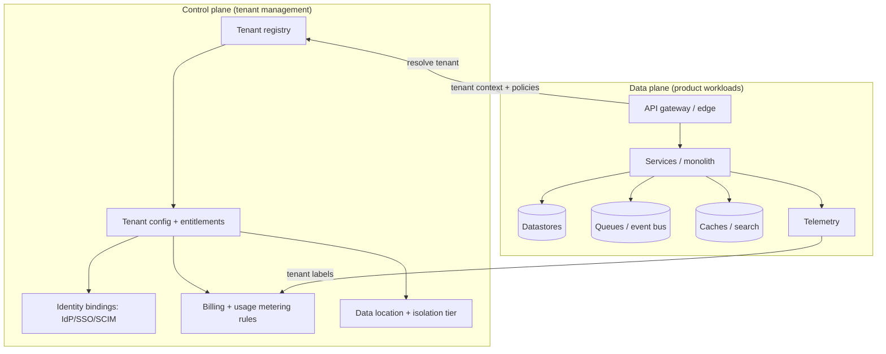
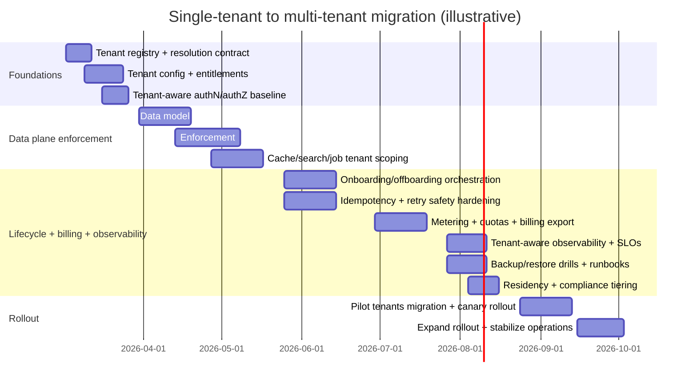
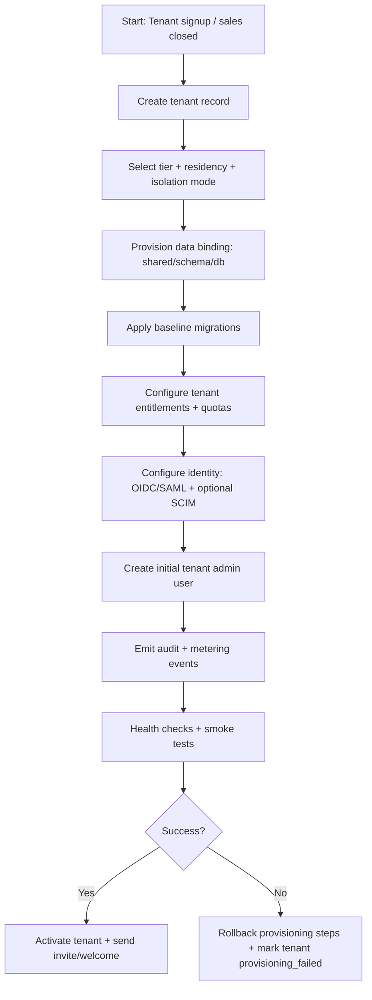

# Adapting Single-Tenant Software to Multi-Tenancy

## Executive summary

Adapting an existing single-tenant system into a multi-tenant SaaS is primarily an **isolation and operations** redesign: tenant context must become a **first-class dimension** that is consistently enforced across identity, authorization, data access, caches, background jobs, observability, and recovery workflows. The most common high-severity failure mode is **cross-tenant data exposure** caused by missing tenant scoping in object access paths (the same class of weakness highlighted as “Broken Object Level Authorization” by entity["organization","OWASP","security nonprofit"]). citeturn0search0turn0search1

A rigorous multi-tenant target architecture is best modeled as **control plane + data plane**, with a tenant registry/configuration service controlling identity bindings, entitlements, isolation tier, and data-location constraints, while application services (data plane) consume a strongly authenticated **tenant context** and enforce it everywhere (API, DB queries, caches, events, jobs). citeturn11search8turn12search0turn12search1

For tenancy models, three canonical database approaches dominate—**shared schema**, **separate schema**, and **separate database/instance**—but in practice most successful SaaS platforms adopt a **hybrid “bridge” strategy**, offering pooled (shared) by default while enabling tenants to “graduate” into stronger isolation tiers when required by compliance, noisy-neighbor risk, or enterprise contracts. This “bridge” approach is explicitly described in the Well-Architected SaaS Lens from entity["company","Amazon Web Services","cloud services provider"], along with silo/pool concepts and tier-based isolation. citeturn0search5turn1search0turn1search1turn1search2

Identity and authorization changes are often the highest-leverage starting point: binding each user to a tenant (“SaaS identity”) and carrying tenant context through the stack reduces latency and bottlenecks compared to “round-tripping” to a central tenant service for every request. citeturn11search8turn12search8 Authentication standards typically remain OAuth 2.0 / OpenID Connect, with enterprise SSO via OIDC or SAML and automated provisioning via SCIM (all standardized by entity["organization","IETF","internet standards body"] / entity["organization","OpenID Foundation","identity standards org"] / entity["organization","OASIS","standards consortium"]). citeturn2search2turn3search0turn2search1turn6search4

From a migration perspective, the safest path is **incremental**: introduce tenant metadata and resolution, add tenant-aware authorization, then progressively tenant-scope persistence, caches, indexing, and asynchronous workflows. For write paths and event-driven workflows, incorporate standardized idempotency semantics and idempotency keys to make retries safe and to prevent duplicate side effects. citeturn5search2turn5search4turn5search0

Finally, operational excellence in multi-tenancy depends on **per-tenant metering and observability**: you need tenant-level telemetry and usage data to manage cost, enforce quotas, detect abuse, and support consumption-based pricing; this is emphasized in SaaS guidance on tenant activity/consumption and metering/billing. citeturn12search1turn12search7turn7search0turn7search4

## Assumptions and decision levers

Because the current single-tenant system is unspecified, this report assumes a “typical” modern service with: (a) HTTP APIs plus background workers, (b) at least one primary datastore (SQL and/or NoSQL), (c) some caching/search/analytics surfaces, and (d) CI/CD-based deployments.

Key assumptions (explicitly adjustable):

1. **Tenant definition**: a tenant represents a distinct customer organization boundary, consistent with SaaS Lens definitions. citeturn11search6  
2. **Identity**: the system uses standards-based auth (OAuth/OIDC); enterprise tenants may require SAML SSO and SCIM provisioning. citeturn2search2turn3search0turn2search1turn6search4  
3. **Isolation requirements vary**: some tenants will accept pooled infra (cost-effective), while others require higher isolation; this motivates a tiered/bridge strategy. citeturn0search5turn1search1turn1search0  
4. **Retry realities**: partial failures are expected; safe retries require idempotent semantics and idempotency keys for side-effectful operations. citeturn5search2turn5search4  
5. **Compliance variability**: at least some tenants may impose data residency or cross-border transfer constraints (e.g., GDPR rules for third-country transfers). citeturn9search2turn9search6  

Effort/risk scale (used throughout, qualitative):
- **Effort**: Low (≤1–2 sprints), Medium (2–6 sprints), High (program-level, multi-quarter).
- **Risk**: Low (localized, easy rollback), Medium (service-wide blast radius), High (data exposure, billing correctness, or multi-service correctness).

A practical decision lever: choose an intended **default isolation tier** (usually pooled/shared schema) and define clear **graduation criteria** (compliance, scale, noisy-neighbor, premium tier pricing), aligning to tier-based isolation guidance. citeturn1search1turn12search7  

## Target architecture and dimension-by-dimension recommendations

A multi-tenant architecture is best described as: (1) a **tenant control plane** that owns *who the tenant is* and *what they are entitled to*, and (2) a **tenant-aware data plane** that enforces tenant context everywhere.

A control-plane + data-plane split is a direct consequence of needing one consistent mechanism for tenant onboarding and operations, including metering and tenant-aware operations. citeturn12search0turn12search1turn1search2



image_group{"layout":"carousel","aspect_ratio":"16:9","query":["SaaS multi-tenant pool silo bridge architecture diagram","control plane data plane multi-tenant architecture illustration","row level security tenant isolation diagram","multi-tenant observability per-tenant metrics traces diagram"],"num_per_query":1}

### Tenancy models

**Implementation options (SQL-oriented framing; also applicable conceptually to NoSQL):**
- **Shared schema (row-based)**: all tenants share tables; each row carries `tenant_id`; isolation enforced in app layer and/or DB policies (e.g., Row-Level Security). citeturn1search7turn1search8turn1search4  
- **Separate schema (schema/table set per tenant)**: tables are logically separated; operationally more complex; improves some restore and blast-radius properties. (Comparable to “table-per-tenant” patterns; see also cloud guidance discussing separate tables/schemas tradeoffs and table-count limits in managed databases.) citeturn11search1turn11search7  
- **Separate database/instance per tenant**: strongest isolation; highest ops automation requirement; aligned with silo/full-stack isolation concepts and tier-based offerings. citeturn1search0turn1search2turn1search1  

**Pros/cons and best-practice selection (summary table):**

| Model | Pros | Cons | Security considerations | Effort | Risk | Recommended best practice |
|---|---|---|---|---|---|---|
| Shared schema | Best cost efficiency; simplest “single migration” story; easiest to scale tenant count (if designed correctly). citeturn11search1turn11search7 | Highest “blast radius” if tenant scoping fails; noisy-neighbor risk; difficult per-tenant restore unless engineered. citeturn0search0turn12search1 | Enforce tenant scoping at multiple layers; consider DB-level RLS where available; aggressively test for BOLA-class failures. citeturn1search7turn1search8turn0search0 | Med | High | Default for most SaaS; add quotas + RLS + test harness; provide graduation path. citeturn0search5turn12search1turn1search8 |
| Separate schema | Better logical separation; easier targeted backups/restore; can reduce accidental cross-tenant joins. citeturn11search1 | Schema sprawl; migration tooling complexity; onboarding/offboarding operational overhead; possible provider limits (tables/schemas). citeturn11search1 | Still requires correct tenant routing + authZ; “wrong schema” routing becomes critical. citeturn11search8turn0search0 | High | Med–High | Use for mid-to-large tenants or where tenant-level restore is contractual; automate schema lifecycle. citeturn1search1turn12search0 |
| Separate database/instance | Strongest data/perf isolation; straightforward per-tenant restore and residency alignment. citeturn1search2turn11search7 | Highest cost; automation required for provisioning, deploy, patching; risk of drifting versions if discipline fails. citeturn1search2turn1search1 | Strong isolation is not a substitute for authZ correctness; must keep “single pane of glass” ops. citeturn1search2turn0search0 | High | Med | Reserve for premium/regulatory tiers; enforce same app version everywhere (avoid forks). citeturn1search2turn1search1 |

### Isolation levels

Isolation is multi-dimensional—**data**, **performance**, and **security**—and each dimension needs explicit, testable mechanisms.

**Data isolation**:
- Enforce tenant scoping in every read/write path; DB-layer RLS can reduce reliance on application correctness by applying row policies consistently. citeturn1search7turn1search8turn1search4  
- For search/log/analytics indexes, include tenant identifiers in documents and enforce access controls accordingly (pooled index models explicitly call out needing tenant identifiers and controls). citeturn1search6  

**Performance isolation (noisy neighbor)**:
- Apply tenant-scoped resource controls and quotas; unrestricted resource consumption is a well-known API risk that manifests as DoS or cloud cost explosion. citeturn0search3turn0search0  
- If using shared Kubernetes clusters, use namespace/network policies and resource allocation controls to prevent tenants from impacting each other; enterprise multi-tenancy guidance recommends network policies and structured tenant provisioning with RBAC. citeturn11search0turn11search3  

**Security isolation**:
- Treat tenant context as a security boundary; ensure it’s derived from trusted evidence (validated tokens, canonical host mapping) and cannot be overridden by arbitrary headers from untrusted clients.
- Prevent “context spoofing” and “confused deputy” by binding tenant context to identity, consistent with SaaS identity guidance. citeturn11search8turn2search2  

**Effort: Medium. Risk: High. Best practice:** implement *defense-in-depth* isolation: tenant-aware authZ + tenant-scoped data access + tenant-scoped caches + quotas + continuous isolation testing, because any single missed enforcement point can become a cross-tenant leak. citeturn0search0turn0search3turn11search8  

### Authentication and authorization changes

**Implementation options:**
- **Tenant-aware identity (“SaaS identity”)**: bind user identities to a tenant and propagate tenant context through services without a per-request tenant service lookup (reduces bottlenecks). citeturn11search8turn12search8  
- **SSO (OIDC/SAML)**: use OpenID Connect ID Tokens and/or SAML assertions for enterprise SSO; OIDC defines required ID token claims (`iss`, `sub`, `aud`), and JWTs are standardized for compact claim transport. citeturn3search0turn4search0turn4search1  
- **Enterprise provisioning (SCIM)**: standardize tenant user/group provisioning to reduce operational friction and improve deprovisioning correctness. citeturn2search1  
- **RBAC vs ABAC**:
  - RBAC: roles scoped to tenant (and possibly tenant-project/workspace).
  - ABAC/policy: evaluate attributes (tenant, org unit, data classification, region, etc.); for high-scale policy management, standards like XACML exist (often used in regulated contexts). citeturn6search2  

**Security considerations:**
- Broken authentication and authorization errors remain top API risks; object-level authorization must check both *tenant* and *object ownership/permissions*. citeturn0search0turn0search1turn0search3  
- OAuth security best practices evolve; follow current best-current-practice guidance for protocol hardening. citeturn6search8turn2search2  

**Effort: High. Risk: High. Best practice:** start the migration here: define a canonical tenant context model, include it in tokens/claims (or in an internal context derived from validated tokens), and make authorization *tenant + object aware* everywhere. citeturn11search8turn0search0turn2search2  

### Data partitioning and migration strategies

**Implementation options:**
- **Shared schema migration**: add `tenant_id` columns, backfill, then enforce constraints (indexes, foreign keys, policies). DB RLS policies can be used to enforce tenant filters at query time. citeturn1search7turn1search8  
- **Re-keying identifiers**: ensure all identifiers are either globally unique or tenant-namespaced; avoid collisions introduced by merging previously isolated tenants.  
- **Schema mapping flexibility**: for tenant-specific extensions/custom fields, research in multi-tenant database schema mapping shows the tradeoff space between flexible schema evolution and performance (e.g., universal/pivot-style techniques vs more structured chunking techniques). citeturn10search1turn10search0  
- **NoSQL partitioning**: use tenant ID as a primary partition key component to guarantee physical co-location and prevent cross-tenant scans; analogous cloud guidance warns that poor key design can produce resource contention (“noisy neighbor”). citeturn11search1turn11search7  

**Security considerations:**
- The migration itself is a risk window: dual-write/dual-read phases can create divergent data; require careful reconciliation and audit trails.
- Writes must remain safe under retries; HTTP defines idempotent methods, while side-effectful POSTs often require explicit Idempotency-Key usage to prevent duplicate object creation. citeturn5search2turn5search4turn5search0  

**Effort: High. Risk: High. Best practice:** use an “expand–migrate–contract” strategy (add new structures, backfill, shift reads/writes, then remove legacy) with strict idempotency and continuous verification of tenant scoping and counts. citeturn5search2turn10search1turn1search8  

### Configuration and customization per tenant

**Implementation options:**
- Tenant configuration service and/or configuration tables keyed by `tenant_id` (features, quotas, integration settings, UI/branding).
- Feature flags and generalized customization constructs rather than code forks; SaaS operations guidance cautions that tenant-specific versions create long-term technical debt and reduce agility. citeturn12search7turn1search2  

**Security considerations:**
- Misconfiguration is a major API risk category; config must be validated, versioned, and access-controlled. citeturn0search0turn0search3  

**Effort: Medium. Risk: Medium. Best practice:** “configuration, not customization-by-fork”: implement tenant-scoped feature flags and validated config schemas, and keep *one deployed product version* across tenants, even when offering dedicated tiers. citeturn12search7turn1search2turn1search1  

### Onboarding and offboarding workflows

**Implementation options:**
- Orchestrated tenant onboarding is a first-class SaaS requirement; guidance emphasizes frictionless onboarding and multi-step provisioning orchestration. citeturn12search0turn12search4  
- Offboarding includes: access revocation, SCIM deprovisioning, export, deletion/retention holds, key destruction/rotation, and capacity reclamation.

**Security considerations:**
- Offboarding mistakes can leave “orphaned access” or residual data; treat deprovisioning as a security control, not only a product workflow.  
- Tenant provisioning must create least-privilege bindings and should emit tenant-aware telemetry for support/audit. citeturn12search4turn12search1  

**Effort: Medium–High. Risk: Medium. Best practice:** fully automate onboarding/offboarding with deterministic, idempotent steps and auditable lifecycle state transitions. citeturn12search0turn5search4turn12search4  

### Billing and usage metering

**Implementation options:**
- Track “tenant activity and consumption” and feed usage into billing, enabling consumption-based pricing where needed. citeturn12search1  
- If integrating with marketplaces, follow their usage reporting practices (e.g., report usage close to time of occurrence; handle entitlement cancellation properly). citeturn12search3turn12search2  

**Security considerations:**
- Usage tampering: ensure metering events are generated server-side, signed/immutable where appropriate, and reconciled.
- Abuse of “sensitive business flows” and “unrestricted resource consumption” affects billing correctness and cost. citeturn0search0turn0search3  

**Effort: Medium. Risk: High (revenue correctness). Best practice:** meter at the tenant boundary with append-only usage events, reconcile with system-of-record logs, and link quotas/rate limits to billing tiers. citeturn12search1turn0search3turn1search1  

### Monitoring and observability per tenant

**Implementation options:**
- Adopt OpenTelemetry traces/metrics/logs and tenant labels; OTLP defines standardized telemetry delivery mechanisms. citeturn7search0turn7search1  
- Use W3C Trace Context (`traceparent`, `tracestate`) for distributed tracing across services. citeturn7search4  
- Propagate tenant identifiers as *non-sensitive* context; OpenTelemetry baggage supports cross-service propagation but is visible in headers and has no built-in integrity checks, so treat it as untrusted input unless validated. citeturn7search3turn7search2  

**Security considerations:**
- Never propagate secrets/PII as tenant “baggage”; keep tenant IDs opaque and minimize header exposure. citeturn7search3  

**Effort: Medium. Risk: Medium. Best practice:** enforce a standard tenant labeling convention (`tenant.id`, `tenant.tier`, `region`, etc.) and ensure telemetry is queryable by tenant while still supporting aggregated SLO views; standardization reduces operational blind spots. citeturn7search0turn7search4turn8search0  

### Backup, restore, and disaster recovery per tenant

**Implementation options:**
- Shared schema: per-tenant restore requires either (a) logical export/import by tenant filter or (b) a restore-to-staging + selective replay approach—complex but feasible.
- Separate schema / separate database: naturally supports tenant-targeted restore and clearer RPO/RTO contracts.

**Security considerations and standards guidance:**
- Disaster recovery and contingency planning should be structured and tested; authoritative guidance emphasizes contingency planning processes and alignment with lifecycle/operations. citeturn9search7turn9search8  
- Recovery processes are part of the tenant trust boundary; tests must demonstrate that restores do not cross-contaminate tenants.

**Effort: Medium–High. Risk: High (data loss + isolation breach during restore). Best practice:** define per-tier RPO/RTO, automate restore drills, and—if per-tenant restore is a contractual requirement—prefer schema-per-tenant or database-per-tenant for affected tiers. citeturn9search7turn1search1turn1search0  

### Compliance and data residency

**Implementation options:**
- Tag tenant data with residency constraints; route storage/processing to regionally appropriate infrastructure; keep configuration enforcing these constraints in the control plane.  
- For international transfers, GDPR principles require conditions and safeguards; cloud providers often offer region selection, but the SaaS must enforce tenant placement and processing boundaries. citeturn9search2turn9search6  
- For cloud PII processing, privacy-focused standards (e.g., ISO/IEC 27018) provide control guidance (high-level, as standards text is paywalled). citeturn9search1turn9search5  

**Security considerations:**
- Residency violations are frequently “silent failures” unless monitored; require auditable evidence of where data is stored/processed.  
- Use strong encryption and key lifecycle management practices; standards bodies maintain AES and key management guidance. citeturn6search0turn6search1  

**Effort: High. Risk: High (regulatory). Best practice:** treat residency as a routing constraint (control plane) plus enforcement mechanisms (data plane) with audit-ready evidence, and offer higher-isolation tiers where required. citeturn1search1turn9search2turn1search2  

### Testing strategies

**Implementation options:**
- **Tenant isolation test harness**: every API that accepts object IDs must be tested for cross-tenant access, aligning with BOLA-focused risk guidance. citeturn0search0turn0search1  
- **Property-level and function-level authorization tests**: ensure responses don’t leak disallowed fields and admin actions can’t be escalated; OWASP highlights property-level issues and function-level authorization failures. citeturn0search0turn0search1  
- **Performance/noisy-neighbor tests**: simulate “heavy tenant” workloads and verify quotas/rate limits; unrestricted consumption is an explicit API risk. citeturn0search3turn11search0  
- **Chaos and failure injection** (especially for onboarding, billing, and event consumers) to validate idempotency and resilience. citeturn5search2turn5search4  

**Effort: Medium. Risk: High (undetected isolation bugs). Best practice:** make tenant isolation tests a release gate and continuously run them in CI; multi-tenancy is not “set-and-forget” because every new endpoint can reintroduce cross-tenant risk. citeturn0search0turn0search3turn12search7  

### Rollback and migration rollback plans

**Implementation options:**
- Feature-flag tenant routing: allow switching tenants between “single-tenant legacy” and “multi-tenant path” during pilots.
- Backward-compatible database migrations (“expand–migrate–contract”): keep the ability to revert app versions while DB remains forward-compatible.

**Security and correctness considerations:**
- Rollback must preserve idempotency: retry semantics and Idempotency-Key behavior should remain stable across versions to avoid duplicate side effects during deploy churn. citeturn5search4turn5search2  
- Avoid breaking token validation logic: OAuth/OIDC security guidance changes over time; adhere to best current practice to prevent regressions in insecure flows. citeturn6search8turn3search0  

**Effort: Medium. Risk: Medium–High. Best practice:** design “kill switches” and tenant-scoped rollout controls, and predefine rollback criteria (leak indicator, metering mismatch, latency regression). citeturn12search7turn12search1turn0search0  

### Operational impacts

**CI/CD, deployments, scaling:**
- Multi-tenancy increases the value of “single pane of glass” operations—especially if offering dedicated tiers. Silo/full-stack isolation can still be SaaS if all tenants run the same product version and are operated uniformly. citeturn1search2turn1search0  
- In shared compute clusters, follow multi-tenancy hardening practices (policy, RBAC, network isolation); these are explicitly recommended for shared Kubernetes environments. citeturn11search0turn11search3  
- Metering/telemetry is operational tooling: tenant-level consumption signals capacity planning and pricing alignment. citeturn12search1turn7search0  

**Effort: High. Risk: Medium. Best practice:** invest early in automation for provisioning, migrations, observability, and incident response—multi-tenancy changes the operational unit from “system overall” to “system × tenant.” citeturn12search0turn12search7turn7search0  

## Migration roadmap with milestones and timelines

The roadmap below assumes a brownfield migration where you must keep production stable. Dates are illustrative (starting shortly after the current date of 2026‑02‑26) and should be adjusted to team size and system complexity.

### Roadmap phases and milestones

| Phase | Target dates | Core deliverables | Exit criteria (go/no-go) | Typical effort | Primary risks |
|---|---|---|---|---|---|
| Foundations: tenant model + control plane skeleton | 2026-03-02 → 2026-03-27 | Tenant registry, tenant resolution (host/subdomain), entitlements + config service, baseline authN/authZ model | Tenant context resolved deterministically; authorization is tenant-aware at edge; audit logging begins | High | Wrong tenant resolution; inconsistent identity binding citeturn11search8turn12search0 |
| Data plane tenancy enforcement | 2026-03-30 → 2026-05-22 | `tenant_id` introduced broadly; tenant-scoped data access patterns; optional DB RLS policies; tenant-scoped caches/indexes | Isolation tests pass; no cross-tenant access in staging; performance regression bounded | High | Cross-tenant leaks (BOLA), noisy neighbor, partial migration divergence citeturn0search0turn1search8turn0search3 |
| Tenant lifecycle automation | 2026-05-25 → 2026-06-26 | Automated onboarding/offboarding orchestration; SCIM optional; integration provisioning; idempotent workflows | New tenant provisioned end-to-end in ≤N minutes; deprovisioning verified | Med–High | Orphaned resources, inconsistent config, duplicate provisioning citeturn12search0turn12search4turn5search4 |
| Metering, quotas, billing integration | 2026-06-29 → 2026-07-24 | Tenant activity/consumption metrics; quotas and rate limits; billing export/integration | Metering matches logs; rate limits demonstrate cost protection | Medium | Revenue leakage, abuse of costly flows citeturn12search1turn0search3 |
| Observability + DR + compliance tiering | 2026-07-27 → 2026-08-21 | Tenant labels in telemetry; per-tenant SLO dashboards; DR runbooks; residency constraints wiring | Restore drills pass; tenant-aware tracing works end-to-end | Medium | Restore cross-contamination; lack of evidence for compliance citeturn9search7turn7search4turn9search2 |
| Pilot migration + staged rollout | 2026-08-24 → 2026-10-02 | Migrate initial tenants; canary + progressive rollout; finalize operational playbooks | Zero critical incidents over pilot window; rollback proven | High | Latent isolation bugs; rollback complexity; tenant support load citeturn0search0turn12search7 |

### Gantt-style timeline (Mermaid)



## Reference designs: schemas, API changes, onboarding workflow

### Sample tenancy metadata tables (SQL)

These tables illustrate a minimal control-plane schema that supports (a) tenant registry, (b) identity bindings, (c) isolation tiering/placement, and (d) entitlements/metering—aligning with SaaS Lens emphasis on onboarding, identity binding, and tenant consumption visibility. citeturn11search8turn12search0turn12search1

**`tenants`**

| Column | Type | Notes |
|---|---|---|
| tenant_id | UUID | Primary key |
| tenant_slug | TEXT | Used in subdomain/URL routing (unique) |
| display_name | TEXT | Human name |
| status | TEXT | `provisioning`, `active`, `suspended`, `deprovisioning`, `deleted` |
| tier | TEXT | `pooled`, `premium_schema`, `dedicated_db`, etc. (tier-based isolation) citeturn1search1 |
| residency_region | TEXT | E.g., `eu-west`, `us-central`, `il` (policy-driven routing) citeturn9search2 |
| created_at | TIMESTAMP |  |
| deleted_at | TIMESTAMP | Nullable (soft delete) |

**`tenant_data_bindings`** (supports bridge/hybrid deployments)

| Column | Type | Notes |
|---|---|---|
| tenant_id | UUID | FK to tenants |
| isolation_mode | TEXT | `shared_schema`, `separate_schema`, `separate_database` |
| db_cluster_id | TEXT | Logical cluster identifier |
| db_name | TEXT | For database-per-tenant |
| schema_name | TEXT | For schema-per-tenant |
| effective_from | TIMESTAMP | Allows controlled migrations |

Bridge/hybrid isolation is an explicit recommended pattern where some components are pooled and others are siloed. citeturn0search5turn1search1turn1search2

**`tenant_identity_providers`** (SSO bindings)

| Column | Type | Notes |
|---|---|---|
| tenant_id | UUID | FK |
| provider_type | TEXT | `oidc`, `saml`, `password`, etc. citeturn3search0turn6search4 |
| issuer | TEXT | OIDC `iss` or SAML entity ID citeturn3search0turn6search4 |
| client_id | TEXT | OIDC client id |
| metadata_url | TEXT | For SAML metadata |
| scim_enabled | BOOLEAN | Whether SCIM provisioning is enabled citeturn2search1 |
| config_json | JSONB | Provider-specific settings |

**`tenant_entitlements`** (feature flags / limits)

| Column | Type | Notes |
|---|---|---|
| tenant_id | UUID | FK |
| feature_key | TEXT | e.g., `advanced_exports` |
| enabled | BOOLEAN | Feature-toggle driven customization citeturn12search7 |
| quota_key | TEXT | e.g., `api_rpm`, `storage_gb` |
| quota_value | BIGINT | Quantitative quota |

### Sample application table patterns (SQL)

**Shared schema example (recommended default for many SaaS):**

| Column | Type | Notes |
|---|---|---|
| tenant_id | UUID | Required; indexed; used in all queries |
| object_id | UUID | Unique within tenant or globally unique |
| … | … | Domain fields |
| created_at | TIMESTAMP |  |

**Row-Level Security option (PostgreSQL-style):** Row security policies define rules for which rows can be selected/modified; policies are enabled per table and enforce `USING` and `WITH CHECK` expressions. citeturn1search7turn1search8turn1search4

```sql
-- Example (PostgreSQL): enable RLS and enforce tenant scoping
ALTER TABLE orders ENABLE ROW LEVEL SECURITY;

CREATE POLICY tenant_isolation ON orders
  USING (tenant_id = current_setting('app.tenant_id')::uuid)
  WITH CHECK (tenant_id = current_setting('app.tenant_id')::uuid);
```

### Sample NoSQL patterns

**Document store (MongoDB-like)**
- Every document includes `tenantId`.
- All secondary indexes include `tenantId` as the first component (e.g., `{ tenantId: 1, createdAt: -1 }`) to prevent cross-tenant scans.

**Key-value / wide-column (DynamoDB/Bigtable-like)**
- Partition key includes tenant: `PK = TENANT#{tenantId}`, sort keys group entity types and IDs.
- This aligns with cloud guidance noting that key design impacts contention/noisy-neighbor behavior. citeturn11search1turn11search7

### Sample API changes (endpoints + payloads)

Multi-tenancy primarily changes **how tenant context is resolved and enforced**. A best-practice pattern is: resolve tenant from a canonical routing mechanism (e.g., subdomain), validate token, then enforce tenant scoping. Tenant binding to identity is emphasized in SaaS identity guidance. citeturn11search8turn12search8

**Tenant management (control plane)**

```http
POST /v1/tenants
Content-Type: application/json

{
  "tenantSlug": "acme",
  "displayName": "Acme Corp",
  "tier": "pooled",
  "residencyRegion": "eu-west"
}
```

```http
POST /v1/tenants/{tenantId}/identity-providers
Content-Type: application/json

{
  "providerType": "oidc",
  "issuer": "https://login.example-idp.com",
  "clientId": "abc123",
  "scimEnabled": true
}
```

**Tenant-aware product APIs (data plane)**

Option A (host/subdomain routing — preferred for many B2B SaaS):
```http
GET /v1/projects
Host: acme.example.com
Authorization: Bearer <access_token>
```

Option B (explicit tenant header — only if strongly controlled; do not trust from untrusted clients):
```http
GET /v1/projects
X-Tenant-ID: <uuid>
Authorization: Bearer <access_token>
```

**Token / claim considerations**
- OIDC defines required ID Token claims and validation expectations. citeturn3search0  
- JWT standardizes compact transport of claims. citeturn4search0  
- For enterprise/multi-tenant IdPs, there is emerging work describing tenant-related claims (implementation-dependent). citeturn2search0turn2search5  

### Sample tenant onboarding workflow (Mermaid flowchart)

Tenant onboarding is explicitly called out as a multi-step provisioning process that can be tenant-initiated or provider-managed. citeturn12search0turn12search4



## Testing, rollback, and operational playbook

A multi-tenant system’s safety is determined by its **weakest un-scoped path**: one missed tenant filter in a query, cache key, async consumer, or admin endpoint can become a cross-tenant incident. This is consistent with OWASP’s emphasis that object-level authorization checks must occur at every function accessing data by user-controlled IDs, and that missing resource limits can turn into DoS/cost incidents. citeturn0search0turn0search3

### Tenant isolation test suite (minimum viable gates)

1. **Cross-tenant negative tests for every endpoint** that accepts an object ID: create object in tenant A, attempt access from tenant B, expect 404/403. citeturn0search0turn0search1  
2. **Cache bleed tests**: verify tenant is part of cache key; confirm eviction and warmup are tenant-scoped. (A pooled model requires explicit tenant identifiers in shared indexes/caches.) citeturn1search6turn12search1  
3. **Async consumer scoping tests**: ensure every event includes tenant context and consumers enforce it; CloudEvents required attributes (`id`, `source`, `specversion`, `type`) provide a standardized envelope to build polymorphic routing and dedupe around. citeturn8search4turn8search2  
4. **Performance isolation tests** with heavy tenant load: validate quotas and rate limits; unrestricted resource consumption is a known API risk. citeturn0search3turn11search0  

### Retry-safety and idempotency standards alignment

- HTTP defines idempotent methods and why automatic retries are safe for them. citeturn5search2turn5search3  
- For non-idempotent operations (typical POST creates), an Idempotency-Key header is being standardized; newer drafts specify uniqueness requirements and server responsibilities. citeturn5search4turn5search0  

Best practice: make onboarding steps, billing events, and external side effects (emails, provisioning calls) idempotent, and persist idempotency records with a bounded retention policy.

### Observability guardrails

- Use W3C trace propagation for interoperability across toolchains. citeturn7search4  
- Use OpenTelemetry signals and OTLP exports for consistent telemetry delivery. citeturn7search0turn7search2  
- Treat baggage as potentially visible/untrusted and avoid propagating sensitive data via headers. citeturn7search3  

### Backup/DR and compliance evidence

Adopt DR runbooks and testing aligned with contingency planning guidance (planning process, testing, maintenance). citeturn9search7turn9search8 For tenants with residency constraints and cross-border transfer limitations (GDPR), store auditable placement metadata and demonstrate enforcement. citeturn9search2turn9search6 Use encryption and key lifecycle management practices informed by standards bodies; AES is standardized and key phases are described in key management guidance. citeturn6search0turn6search1