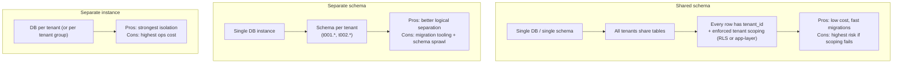
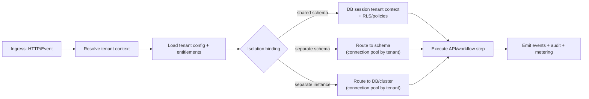
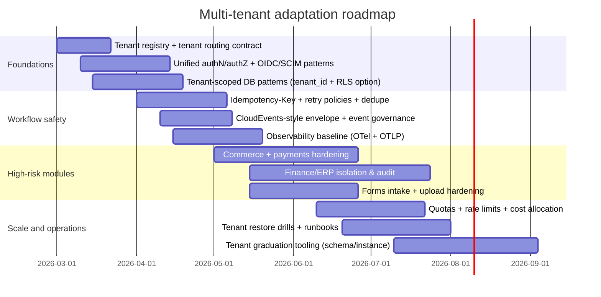

# Adapting the provided research modules to a multi-tenant environment

> ### ⚠️ IMPLEMENTATION UPDATE (2026-04-14)
>
> This report was written as a design-phase analysis of multi-tenant adaptation strategies.
> The live codebase implements multi-tenancy as described in MT_FOUNDATION_STANDARD_P26.md.
>
> **Key implementation facts:**
> - Multi-tenancy is kernel-level, not bolt-on — `server/src/kernel/multi-tenant/` (26 files)
> - Tenant isolation via AsyncLocalStorage (nestjs-cls ClsService) — DNA-5 pattern
> - Hybrid/bridge isolation model implemented: pooled by default, graduated isolation available
> - FLOW-15 (saas-multi-tenancy) provides 4 services: T605-T608
> - FLOW-30 (tenant-lifecycle-manager) handles tenant provisioning/deprovisioning
> - All cross-tenant data exposure mitigations are in place (ScopeEnforcer, tenant-prefixed IDs)
> - Quota enforcement via QuotaEnforcer (per-tenant AI token budgets)
> - Idempotency keys are tenant-scoped (DNA-7)
>
> **See also:** `MT_FOUNDATION_STANDARD_P26.md` for the 7 structural defects that were fixed.

## Executive summary

This report adapts the **18 uploaded research/design files** (covering blog/CMS, commerce, social, ERP/finance, DevOps/CI-CD, forms/automation, visual editor, arbitration/governance, and two multi-tenant engine design reports) into a coherent **multi-tenant target architecture** and then provides **file-specific implications and concrete design changes** across the full set of dimensions you requested (tenancy models, data isolation, identity, config, quotas, observability, compliance, encryption/key mgmt, migrations, testing, CI/CD, cost allocation, and runbooks). citeturn1search1turn1search3turn2search5turn2search6

A key constraint: **only 18 files are present in the workspace**. Your prompt references *28* files; therefore, this report includes (a) full analysis for the 18 available files and (b) **10 structured placeholders** using the same template and assumptions. The placeholders can be converted into full analyses immediately once those files are available.

The recommended program-level direction is a **hybrid/bridge isolation strategy**: run most tenants in pooled/shared infrastructure (for cost and operational agility) while offering “graduation” to **separate schema** or **separate instance** for tenants who require stronger isolation (SLA/noisy-neighbor, regulatory/compliance, data residency, or customer-managed keys). This is aligned with SaaS guidance from entity["company","Amazon Web Services","cloud services provider"] on pool/silo/bridge models and entity["company","Microsoft Azure","cloud platform"] on tenancy-model continua and tradeoffs. citeturn1search0turn1search1turn1search3turn2search5

Across the portfolio, the most common multi-tenancy failure modes are:

- **Cross-tenant data exposure** due to missing object-level authorization and/or missing tenant scoping in queries, caches, indexes, and event consumers. citeturn0search4turn14search6turn15search1  
- **Noisy-neighbor and cost blowups** from unrestricted resource consumption (uploads, rebuild jobs, analytics scans, fan-out workflows) without quotas and rate limits. citeturn12search0turn12search1turn15search5  
- **Inconsistent workflow side effects under retries** (double charge, double publish, duplicate provisioning) without idempotency keys, transactional outbox, and clear retry semantics. citeturn5search2turn6search0turn5search0  

## Scope, inputs, and explicit assumptions

### What was analyzed

The following 18 uploaded markdown files were available in the workspace (by filename):

- 09 Blog modules  
- 10 Shops / commerce modules  
- 11 Social network modules  
- 12 ERP systems  
- 13 Finance  
- 14 Data warehouse process  
- 15 Build MVPs  
- 16 Giant shop platforms  
- 17 Freelancer platforms  
- 18 DevOps platforms (flow creation/execution)  
- 19 CI/CD and DevOps flow  
- 20 Sponsored content and Graph API  
- 21 Forms and flows  
- 22 Visual editor  
- 23 Visual editor extended (visual flow composition)  
- 25 Business flow arbiter  
- 28 Multi-tenant report 1  
- 28 Multi-tenant report 2

### Assumptions to make the analysis actionable

Because these files appear to be architecture/requirements research docs (not code repos), several implementation details are unspecified. For rigor, this report assumes:

- A **single SaaS platform** hosting multiple customer tenants, with one or more “projects/modules” enabled per tenant.
- Workloads include both **request/response APIs** and **event-driven workflows** (queues, webhooks, schedulers).
- The relational datastore can support either:
  - shared-schema partitioning (tenant_id per row), potentially with database-enforced policies (e.g., RLS), or  
  - schema-per-tenant, or  
  - separate database/instance, depending on tenant tier and requirements. citeturn0search2turn0search3turn2search5turn2search0
- Auth is standards-aligned: **OAuth 2.0** for authorization, **OpenID Connect** for authentication, potentially **SCIM** for enterprise provisioning. citeturn11search3turn11search1turn13search1
- HTTP write endpoints and workflow-triggering APIs will be made retry-safe via **idempotency keys** and explicit idempotency policies; “idempotent method” semantics follow RFC definitions. citeturn5search2turn6search0turn5search0

## Multi-tenant reference architecture and tenancy model decision framework

### A portfolio-level reference architecture

Multi-tenancy works best as **control plane + data plane**:

- **Tenant Control Plane**: tenant registry, tenant identity mapping, entitlements, tenant-config (feature flags, quotas, provider bindings), tenant isolation binding (shared schema vs schema vs instance), audit logs, and billing/metering.
- **Tenant Data Plane**: request routing, workflow execution, event ingestion, task workers, storage access, and observability—always with enforced tenant context.

This separation supports selective sharing (pooled components) while allowing specific services to be dedicated (siloed) when needed. citeturn1search2turn1search0turn2search5turn2search6

### Tenancy model options and how to choose

The three database-level tenancy models you asked to compare—**shared schema**, **separate schema**, **separate instance**—map closely to widely described pool/bridge/silo strategies:

- Pooled/shared models improve agility and cost efficiency but increase noisy-neighbor and blast-radius risks and require stronger guardrails. citeturn1search1turn1search2turn2search5  
- Silo/dedicated models improve isolation and compliance alignment but increase operational overhead and require strong automation. citeturn1search3turn2search0turn2search2  
- Bridge/hybrid approaches explicitly mix both, often by tenant tier. citeturn1search0turn1search5turn1search4  

### Mermaid diagrams for tenancy models

### Key technical guardrails required regardless of model

- **Authorization is always tenant-aware and object-aware**: object-level authorization checks must run for every endpoint that accepts object identifiers; this is a top API risk class. citeturn0search4turn14search6  
- **Resource quotas and rate limits** are tenant-scoped: Kubernetes explicitly frames quotas as a way to minimize noisy-neighbor effects when tenants map to namespaces, and OWASP highlights unrestricted resource consumption as a major API risk. citeturn12search0turn12search1turn15search5  
- **Event/workflow safety**: all side-effectful steps (payments, provisioning, publish jobs) need idempotency and safe retries; the Idempotency-Key header is in IETF standardization and defines key requirements like uniqueness and non-reuse. citeturn5search2turn5search0  
- **Observability** must carry tenant labels consistently: OpenTelemetry defines signals (traces/metrics/logs/baggage) and OTLP defines transport and payload expectations for telemetry delivery. citeturn4search0turn4search3turn12search2  
- **Context propagation** is standardized: W3C Trace Context defines trace headers; OpenTelemetry baggage can carry tenant routing metadata, but must be bounded (don’t propagate secrets/PII). citeturn3search4turn12search3turn12search2turn12search5  
- **Crypto and key management must be lifecycle-driven**: NIST FIPS 197 defines AES, and NIST SP 800-57 provides key-management guidance and best practices. citeturn7search0turn8search8  
- **PCI-sensitive flows** should minimize scope using tokenization and hardened webhook handling; PCI SSC provides tokenization guidance, and payment-webhook endpoints must verify signatures (e.g., Stripe’s documented signature verification pattern). citeturn9search35turn11search0  

image_group{"layout":"carousel","aspect_ratio":"16:9","query":["SaaS multi-tenant pool silo bridge diagram","Kubernetes multi-tenancy namespaces resource quota diagram","PostgreSQL row level security policy diagram","multi-tenant data isolation shared schema separate schema separate database illustration"],"num_per_query":1}

## File-by-file multi-tenancy impact and adaptation plan

To keep this section rigorous and usable across 28 artifacts, each file entry follows the same structure:

- Purpose, architecture, data flows, trust boundaries, assumptions  
- Multi-tenancy implications across your dimensions (grouped, but comprehensive)  
- Concrete design changes (API, DB schema, deployment)  
- Security controls & threat mitigations specific to this module  
- Effort & priority (low/medium/high) + phased adoption  
- Validation & testing checklist

### Uploaded file analyses

**File: 09 — Blog/CMS module research**  
Purpose & architecture: A blog/CMS feature set for authoring, publishing/scheduling, rendering, media handling, SEO artifacts, and likely indexing/search. Typical split: public read path (visitor) vs admin authoring path, with publish jobs and cache invalidation.  
Data flows & trust boundaries: visitor → CDN/API; admin/editor → management APIs; publish pipeline → build/index/cache; media uploads → object storage/CDN. Assumes multi-site corresponds to tenant or tenant-project.  
Multi-tenancy implications:  
- Tenancy model: **shared schema** is usually sufficient; optionally separate schema for high-volume publishers because indexing/publish jobs become noisy-neighbor risks. citeturn1search1turn2search5  
- Isolation: tenant_id on posts/templates/assets/routes; tenant-scoped cache keys and search filters to prevent leakage.  
- AuthZ: strict object-level checks on post/template IDs (BOLA risk) and property-level exposure controls. citeturn0search4turn14search7  
- Quotas/perf: per-tenant publish-job concurrency, rebuild throttles, media upload limits (OWASP resource consumption). citeturn15search5turn12search1  
- Compliance/residency: per-tenant retention policies for drafts/media; encryption-at-rest with per-tenant KEK optional for enterprise. citeturn8search8turn7search0  
Concrete changes:  
- DB: add `tenant_id`, enforce tenant scoping via DB policy where feasible (e.g., RLS). citeturn0search2turn0search3  
- APIs: make tenant resolution explicit (subdomain/host → tenant) and include tenant in all cache/index keys.  
- Deployment: multi-tenant build/publish worker pool with per-tenant concurrency limits; optional dedicated workers for high tiers. citeturn2search4turn12search0  
Security controls: CSRF protection on admin actions; output encoding/sanitization to prevent stored XSS in content; strict file upload controls for media. citeturn14search0turn14search1  
Effort/priority: **Effort: medium. Priority: medium.**  
Phased adoption: (1) tenant scoping + authZ hardening; (2) tenant-aware caches/indexes + quotas; (3) optional tenant graduation to separate schema/workers.  
Validation checklist: tenant isolation tests (cross-tenant IDs), cache-key tests, publish replay/idempotency tests, XSS regression tests, upload allowlist tests. citeturn0search4turn14search1  

**File: 10 — CMS + Commerce module research**  
Purpose & architecture: storefront + admin/backoffice, catalog, checkout/order lifecycle, payments, fulfillment, and event-driven updates.  
Trust boundaries: public buyers, merchant admins, payment provider webhooks, third-party shipping/tax integrations, internal event bus.  
Multi-tenancy implications:  
- Tenancy model: **separate schema** as baseline (orders/inventory are high write volume and sensitive); offer **separate instance** for PCI-heavy/enterprise tenants. citeturn2search0turn1search5turn1search3  
- Data isolation: strict scoping for orders, carts, prices, inventory; careful around shared “marketplace” objects if cross-tenant catalogs exist.  
- AuthN/AuthZ: OIDC/OAuth; per-tenant merchant roles; object-level checks on order IDs and payment intents. citeturn11search1turn11search3turn0search4  
- Payments: webhook verification + idempotency; tokenization patterns to reduce PCI exposure; per-tenant key/secret separation. citeturn11search0turn9search35turn9search31  
- Backup/restore: tenant-specific restore is often a contractual requirement for commerce; schema-per-tenant simplifies targeted restore. citeturn1search3turn2search2  
Concrete changes:  
- DB: tenant-scoped ledgers/order tables; enforce scoping; partition hot tables by tenant_id where using shared constructs.  
- API: Idempotency-Key on “create order”, “capture payment”, “refund”, “create shipment”. citeturn5search2turn6search0  
- Deployment: dedicated payment-webhook ingestion component per tenant tier (or per tenant group) to reduce blast radius. citeturn2search7turn1search1  
Security controls: anti-fraud/rate limits, least-privileged access to payment data, inventory of API hosts/versions (OWASP improper inventory). citeturn15search0turn15search5  
Effort/priority: **Effort: high. Priority: high.**  
Phased adoption: (1) tenant & object authZ + idempotency; (2) tenant-aware payment/security architecture and SaaS metering; (3) enterprise tiers: separate instance, CMK, residency. citeturn1search5turn8search8  
Validation checklist: replay webhooks safely, double-charge prevention, cross-tenant order access tests, restore drill per tenant, throughput/noisy-neighbor tests. citeturn11search0turn5search2turn12search0  

**File: 11 — Social network module research**  
Purpose & architecture: social graph primitives (profiles, posts, comments, reactions), feeds, moderation, notifications, and likely real-time components.  
Trust boundaries: end users, external sharing endpoints, notifications/email/SMS providers, content storage.  
Multi-tenancy implications:  
- Tenancy model: **separate schema** is the safest baseline because graph queries and feed generation can accidentally leak across tenants if scoping is incomplete. citeturn2search5turn0search4  
- Isolation: tenant_id must be present on every edge/node; feed caches must be tenant-scoped.  
- Performance: feed fan-out and search-index updates can create noisy-neighbor effects; apply quotas and backpressure. citeturn12search0turn15search5  
- Compliance: retention controls for user-generated content; deletion workflows and auditability. citeturn8search3turn15search0  
Concrete changes:  
- DB: enforce tenant scoping at persistence layer; avoid “global user_id” without tenant namespace (identity mapping).  
- APIs: require tenant context on all read/write endpoints; property filtering to avoid excessive exposure. citeturn14search7  
- Deployment: tenant-aware indexing and fan-out workers; optional tenant sharding for large communities. citeturn2search3turn12search1  
Security controls: robust BOLA testing (post/comment IDs), abuse/rate limits (posting, messaging), file upload hardening for media. citeturn0search4turn15search2turn14search1  
Effort/priority: **Effort: high. Priority: medium-to-high.**  
Phased adoption: (1) tenant-aware identity model + authZ; (2) tenant-scoped feeds/caches/indexes + quotas; (3) optionally isolate large tenants.  
Validation checklist: cross-tenant content access tests, cache bleed tests, rate-limit tests, deletion correctness tests. citeturn0search4turn15search5  

**File: 12 — ERP systems module research**  
Purpose & architecture: ERP-style value streams (record-to-report, procure-to-pay, order-to-cash), approvals, audit trails, integrations.  
Trust boundaries: enterprise SSO, integration connectors to external ERP/CRM, reporting/exports, admin operators.  
Multi-tenancy implications:  
- Tenancy model: **separate instance** for strict enterprise/compliance customers; otherwise **separate schema** with strong governance. citeturn1search3turn2search0turn2search5  
- Isolation: strong boundaries for master data, workflows, and audit logs.  
- Identity mapping: enterprise IdP + SCIM provisioning is common for ERP-like tenants. citeturn13search1turn11search1  
- Backup/restore: tenant-level restore and legal holds often required. citeturn2search0turn2search6  
Concrete changes:  
- DB schema: explicit tenant in all entities; append-only audit/events; consider schema-per-tenant to simplify differential migrations.  
- APIs: stricter versioning and inventory management to control exposure. citeturn15search0turn6search10  
- Deployment: per-tenant connector credentials and outbound rate limits.  
Security controls: least privilege, separation of duties (admin vs operator), comprehensive auditability, and secure configs (OWASP misconfiguration). citeturn15search1turn15search0  
Effort/priority: **Effort: high. Priority: high (for enterprise product lines).**  
Phased adoption: (1) tenant scoping + identity provisioning; (2) tenant-specific workflows, auditing, backup semantics; (3) enterprise: separate instance + CMK/residency. citeturn8search8turn2search0  
Validation checklist: tenant restore drills, audit log completeness, cross-tenant integration isolation tests, permission matrix tests. citeturn0search4turn2search0  

**File: 13 — Finance module research**  
Purpose & architecture: ERP-grade finance flows (ledger, invoices, reconciliation, controls), high integrity and audit requirements.  
Trust boundaries: payments, bank integrations, internal finance ops, external auditors.  
Multi-tenancy implications:  
- Tenancy model: **separate instance** is strongly preferred for regulated finance tenants; minimum is separate schema with strict key mgmt. citeturn1search3turn8search8turn7search0  
- Encryption/key mgmt: per-tenant key hierarchies; rigorous lifecycle processes. citeturn8search8turn7search0  
- Idempotency: financial mutations must be replay-safe; use Idempotency-Key and immutable ledgers. citeturn5search2turn6search0  
Concrete changes:  
- DB: append-only ledger tables; enforce tenant isolation and tamper-evident audit logs.  
- APIs: idempotent writes; explicit idempotency retention policies. citeturn5search0turn5search2  
- Deployment: separate worker pools for finance postings; canary rollouts by tenant to reduce blast radius. citeturn1search1turn2search4  
Security controls: strict RBAC/SoD, monitoring for anomalous postings, integrity checks, secure transport (TLS). citeturn13search3turn3search0  
Effort/priority: **Effort: high. Priority: high.**  
Phased adoption: (1) tenant-isolated ledger + idempotency; (2) audit/controls + key management; (3) enterprise: separate instance/residency.  
Validation checklist: double-posting prevention, reconciliation repeatability, restore drill, access control testing. citeturn5search2turn0search4  

**File: 14 — Data warehouse process (ClickUp–Zoho)**  
Purpose & architecture: pipeline from operational systems into an analytics-ready warehouse (ETL/ELT, staging, transformations, reporting).  
Trust boundaries: SaaS source APIs, warehouse storage, BI/report consumption, secrets for connectors.  
Multi-tenancy implications:  
- Tenancy model: typically **separate schema** or dataset-per-tenant to simplify access control; shared schema requires robust row-level enforcement and careful “cross-tenant aggregation” restrictions. citeturn2search0turn2search3turn0search2  
- Data isolation: every fact/dimension must be tenant-scoped; tenant-aware encryption optional.  
- Observability/billing: per-tenant ETL costs are important for chargeback; pooled setups must explicitly meter workload. citeturn1search1turn2search7turn4search0  
Concrete changes:  
- Pipeline: tenant-aware connector configs; per-tenant job scheduling and throttles; per-tenant secret references.  
- Storage: tenant-specific schemas/tables or partitions; access policies mapped to tenant roles. citeturn2search0turn11search3  
Security controls: API credential isolation; inventory of integration endpoints (OWASP inventory risk); encrypted transport and at-rest. citeturn15search0turn7search0  
Effort/priority: **Effort: medium. Priority: medium.**  
Phased adoption: (1) tenant scoping + separate schemas; (2) per-tenant metering and observability; (3) enterprise: isolated warehousing and residency.  
Validation checklist: tenant filter correctness tests, ETL job isolation tests, access control to BI outputs. citeturn0search4turn2search0  

**File: 15 — Build MVPs (Lovable/Base44-style)**  
Purpose & architecture: rapid MVP generation/execution; likely includes code generation, deploy automation, templates, and possibly running tenant-provided code.  
Trust boundaries: untrusted/partially trusted tenant inputs, build systems, deployment targets, connector secrets.  
Multi-tenancy implications:  
- Tenancy model: **separate instance** (or at least dedicated compute isolation) is recommended when tenants can influence runtime code/build steps, due to cross-tenant escalation risk. citeturn2search4turn12search0turn15search1  
- Resource isolation: strict quotas (build minutes, storage, egress) and rate limits; noisy-neighbor otherwise becomes severe. citeturn12search1turn15search5  
Concrete changes:  
- Deployment: sandbox builds per tenant (dedicated worker or namespace); per-tenant secrets store references only.  
- APIs: enforce idempotency on “create project”, “deploy version”, “rollback”. citeturn5search2turn6search0  
Security controls: strong supply-chain controls, isolation of build artifacts, strict inventory of endpoints and environments. citeturn15search0turn15search1  
Effort/priority: **Effort: high. Priority: medium.**  
Phased adoption: (1) isolate build/deploy plane; (2) add quotas/metering; (3) enterprise isolation and audits.  
Validation checklist: sandbox escape tests, per-tenant secret access tests, quota enforcement tests, rollback safety tests. citeturn12search0turn15search2  

**File: 16 — Giant shop marketplace platforms**  
Purpose & architecture: large marketplace (multi-seller, catalog, payments, disputes, logistics), high concurrency and complex workflows.  
Trust boundaries: buyers/sellers/admins, payment providers, external logistics/tax, partner APIs.  
Multi-tenancy implications:  
- Tenancy model: **separate schema** baseline; **separate instance** for premium enterprise/regulated tenants; also consider “tenant tiering” as described in SaaS guidance. citeturn1search5turn1search3turn2search5  
- Identity mapping: multiple principals per tenant (seller organizations), so RBAC/ABAC must incorporate both tenant and org. citeturn11search3turn14search7  
- Quotas/perf: per-tenant marketplace actions, indexing, search; anti-abuse controls. citeturn15search2turn12search1  
Concrete changes:  
- DB: tenant partitioning + seller/org partitioning; strong transaction semantics for money-moving steps.  
- Workflow: idempotent payment/escrow actions; signature-verified webhooks. citeturn11search0turn5search2turn9search35  
Security controls: fraud detection hooks, object-level auth on orders/disputes, secure file uploads for seller assets. citeturn0search4turn14search1  
Effort/priority: **Effort: high. Priority: high.**  
Phased adoption: (1) tenant partitioning + payment safety; (2) operational maturity (monitoring, runbooks, restore); (3) enterprise isolation tiers.  
Validation checklist: payment replay tests, cross-tenant access tests, noisy-neighbor load tests, restore drills. citeturn5search2turn12search0turn2search0  

**File: 17 — Freelancer marketplace flow**  
Purpose & architecture: job posting → proposals → contract → milestones/escrow → disputes → compliance gating, with state machines and orchestration.  
Trust boundaries: platform users, compliance/KYC vendors, payment providers, dispute reviewers/admins.  
Multi-tenancy implications:  
- Tenancy model: **separate schema** baseline; **separate instance** for enterprise tenants with stricter compliance and worker-classification requirements. citeturn1search3turn1search5turn2search5  
- Data isolation: contracts, evidence artifacts, dispute evidence must be tenant-scoped and tightly permissioned.  
- Idempotency: escrow funding/release/refund must be safe under retries. citeturn5search2turn6search0  
Concrete changes:  
- DB: tenant-scoped immutable ledger for escrow actions; per-tenant KYC config.  
- APIs: Idempotency-Key on all payment actions; strong audit events. citeturn5search0turn5search2  
Security controls: webhook signature verification; file upload hardening for evidence and deliverables. citeturn11search0turn14search1  
Effort/priority: **Effort: high. Priority: high.**  
Phased adoption: (1) tenant scoping + workflow idempotency; (2) compliance and audit; (3) isolated tiers.  
Validation checklist: double-release prevention, dispute hold correctness, access control on evidence, restore drills. citeturn0search4turn5search2  

**File: 18 — DevOps platforms flow creation/execution (core workflow engine)**  
Purpose & architecture: JSON flow definitions, orchestration runtime, step dispatch, retries, approvals (“hard stops”), state persistence, observability.  
Trust boundaries: flow authors/admins, runtime workers, external connectors, secrets store.  
Multi-tenancy implications:  
- Tenancy model: **shared schema** for control plane (definitions, versions, permissions); execution state can be shared with strict tenant scoping or sharded by tenant. citeturn1search1turn2search5turn0search2  
- Mandatory tenant context propagation across HTTP+events; standardized trace propagation. citeturn3search4turn12search2turn12search3  
- Event envelope: use CloudEvents-like required fields; Azure explicitly lists required attributes (`id`, `source`, `specversion`, `type`) for CloudEvents compliance. citeturn4search5  
- Quotas: tenant-scoped concurrency, step limits, timeouts; Kubernetes quotas illustrate how to prevent one tenant overwhelming shared control plane/resources. citeturn12search0turn12search1  
Concrete changes:  
- APIs: per-tenant RBAC on flow authoring and publish actions; OpenAPI 3.1 can describe APIs and includes a top-level `webhooks` field option. citeturn6search9turn6search10  
- Runtime: idempotent step execution + Idempotency-Key support for side effects; Problem Details error envelopes for consistent errors. citeturn5search2turn6search8  
Security controls: treat flow specs as potentially dangerous “programmable automation”; enforce allowlists of connectors/actions; inventory and retire APIs/versions. citeturn15search0turn15search1  
Effort/priority: **Effort: high. Priority: high.**  
Phased adoption: (1) tenant control plane + isolation; (2) tenant quotas/observability; (3) tenant graduation & dedicated runners.  
Validation checklist: cross-tenant execution isolation, replay/idempotency tests, connector secret isolation tests, abuse/limit tests. citeturn5search2turn15search2turn12search0  

**File: 19 — CI/CD and DevOps flow**  
Purpose & architecture: environment factory (local/ephemeral/cloud), config/secrets governance, validation gates, backups/restore drills with auditability.  
Trust boundaries: source control webhooks, CI systems, cloud APIs, secrets managers, infra provisioners.  
Multi-tenancy implications:  
- Tenancy model: **shared schema** for control plane objects (components, envs, runs); compute isolation varies by tenant tier (shared clusters vs dedicated). citeturn2search4turn12search0turn2search5  
- Quotas: namespace-per-tenant (or per tenant+env) with ResourceQuota/LimitRange style controls to minimize noisy neighbors. citeturn12search1turn12search0  
- Idempotency: provisioning steps must be safe to retry; use idempotency keys + deterministic state machines. citeturn5search2turn6search0  
Concrete changes:  
- Add tenant-scoped “environment” resource binding; enforce per-tenant concurrency budgets and TTLs.  
- Observability: OTLP pipeline for all runs; consistent tenant labels on traces/metrics/logs. citeturn4search3turn4search0  
Security controls: secrets never in logs; strict API inventory/retirement; secure configs. citeturn15search0turn15search1  
Effort/priority: **Effort: high. Priority: high.**  
Phased adoption: (1) tenant-aware env factory; (2) quotas, metering, audit; (3) dedicated clusters for sensitive tenants.  
Validation checklist: resource quota enforcement, retry safety of IaC steps, secrets redaction checks, DR drill per tenant. citeturn12search1turn5search2  

**File: 20 — Sponsored content and graph API flow**  
Purpose & architecture: gateway + planner/orchestrator + permissions + event/webhooks; latency-sensitive request flows.  
Trust boundaries: public API clients, partner integrations, internal graph/planner, ad measurement pipelines.  
Multi-tenancy implications:  
- Tenancy model: **shared schema** (high-scale) with robust tenant scoping and rate limiting; large partners may require partially dedicated resources. citeturn1search1turn2search5  
- Security: BOLA and business-flow abuse controls are critical for ad decisioning surfaces. citeturn0search4turn15search5  
- Observability: tenant-aware tracing across orchestrator calls; W3C trace headers and OTel correlation. citeturn3search4turn4search0  
Concrete changes:  
- API: strict quotas/rate-limits per tenant; consistent Problem Details errors; explicit inclusion of tenant in all cache keys. citeturn6search8turn15search2  
- Eventing: CloudEvents envelope + dedupe; careful propagation boundaries for baggage. citeturn4search5turn12search3turn12search5  
Security controls: inventory management across versions, secure defaults, and abuse detection. citeturn15search0turn15search1  
Effort/priority: **Effort: medium-to-high. Priority: high.**  
Phased adoption: (1) tenant scoping + quotas; (2) observability + abuse controls; (3) optional partner isolation tiers.  
Validation checklist: latency SLO regression, cache bleed tests, rate-limit tests, cross-tenant graph authorization tests. citeturn0search4turn15search2  

**File: 21 — Forms and flows (forms-driven automation)**  
Purpose & architecture: forms authoring/runtime/submission pipeline + asynchronous automation recipes (triggers/conditions/actions), with run history.  
Trust boundaries: public form submitters, admin form designers, integrations/connectors, file uploads.  
Multi-tenancy implications:  
- Tenancy model: **shared schema** is typical; entries must be tenant-scoped; high-volume tenants may need separate schema for performance. citeturn1search1turn2search5  
- Resource controls: upload limits are mandatory; OWASP guidance emphasizes allowlisting, content-type validation, renaming, size limits. citeturn14search1turn15search2  
- CSRF: admin authoring endpoints need CSRF mitigations (synchronizer token). citeturn14search0  
- Workflow safety: idempotency for submission and action execution; use Idempotency-Key. citeturn5search2turn5search0  
Concrete changes:  
- DB: tenant_id on forms, versions, entries, runs; optionally enforce via DB policy. citeturn0search2turn0search3  
- Object storage: per-tenant prefixes/buckets; strict download authorization.  
- Events: CloudEvents-like envelope and tenant tagging for triggers. citeturn4search5  
Security controls: upload hardening; anti-abuse on anonymous forms; strict connector secret isolation. citeturn14search1turn15search2  
Effort/priority: **Effort: medium. Priority: high** (public-facing intake surfaces amplify risk).  
Phased adoption: (1) tenant scoping + upload and authZ hardening; (2) recipe/run isolation + quotas; (3) enterprise retention/residency. citeturn8search3turn2search6  
Validation checklist: CSRF tests, upload bypass tests, cross-tenant entry access, replay of automations, rate-limit tests. citeturn14search0turn14search1turn0search4  

**File: 22 — Visual editor (site builder/blog builder)**  
Purpose & architecture: page/component trees, templates/widgets bound to CMS data, publishing workflows, rebuild jobs on token/theme changes.  
Trust boundaries: designer/admin UI, publishing/build pipeline, asset processing, CDN.  
Multi-tenancy implications:  
- Tenancy model: **shared schema** for templates/pages; heavy tenants may graduate to separate schema or dedicated build workers due to rebuild load. citeturn1search1turn2search4  
- Isolation: ensure template IDs, routes, assets are tenant-scoped; rebuild jobs must isolate tenant workspaces.  
- Resource controls: rebuild triggers can cause cost blowups; enforce per-tenant concurrency and quotas. citeturn15search2turn12search0  
Concrete changes:  
- APIs: optimistic concurrency and idempotent publish jobs; structured errors. citeturn6search8turn6search0  
- Observability: tenant-aware job metrics via OTel/OTLP. citeturn4search3turn4search0  
Security controls: prevent template injection, restrict dangerous components/actions, ensure API inventory hygiene. citeturn15search0turn15search1  
Effort/priority: **Effort: medium. Priority: medium.**  
Phased adoption: (1) tenant scoping; (2) quotas and metering for publish/rebuild; (3) optional dedicated build plane.  
Validation checklist: cross-tenant template access tests, rebuild isolation tests, CDN cache partitioning tests. citeturn0search4turn12search0  

**File: 23 — Visual editor extended (visual flow composition)**  
Purpose & architecture: transforms flow engine into visual composition engine for graphs of nodes/edges (pages/containers/elements), with triggers/guards and state machines.  
Trust boundaries: editor UI → flow persistence → runtime workers; external connectors for data binding.  
Multi-tenancy implications:  
- Tenancy model: **shared schema** with strict row scoping; graph traversal queries must never cross-tenant. citeturn2search5turn0search4  
- Performance: graph expansions and renders are noisy-neighbor candidates; enforce quotas per tenant and per flow. citeturn12search0turn15search2  
Concrete changes:  
- Data model: tenant_id on flow definitions/nodes; enforce scoping at query layer.  
- Runtime: per-tenant worker pools or per-tenant concurrency limits for layout/render steps.  
Security controls: protect against malicious bindings and untrusted content; restrict external calls; inventory and retirement of endpoints. citeturn15search0turn15search1  
Effort/priority: **Effort: high. Priority: medium.**  
Phased adoption: (1) tenant scoping and authZ; (2) quotas + observability; (3) enterprise isolation (dedicated render plane).  
Validation checklist: graph query isolation tests, abuse tests for expensive graphs, authorization coverage tests. citeturn0search4turn15search2  

**File: 25 — Business flow arbiter (cross-flow impact analysis gate)**  
Purpose & architecture: governance gate that analyzes proposed changes against existing flows/docs/schemas, halts on breaking impact, requires human decision.  
Trust boundaries: flow authors vs approvers, analysis engine, context retrieval, audit logs.  
Multi-tenancy implications:  
- Tenancy model: **shared schema** is acceptable because this is control-plane governance; but all dependency graphs and retrieval indexes must be tenant-scoped. citeturn15search0turn1search1  
- Risk: cross-tenant context retrieval is catastrophic; isolate vector indexes per tenant or apply strict tenant filters.  
Concrete changes:  
- Data: store per-tenant dependency graph; every “impact report” references tenant and flow version.  
- APIs: approval actions require stronger authZ than authoring; audit everything. citeturn15search1turn15search0  
Security controls: treat the arbiter as a “sensitive business flow” surface; rate limit and require explicit approvals; strong inventory management. citeturn15search5turn15search0  
Effort/priority: **Effort: medium. Priority: medium.**  
Phased adoption: (1) tenant-aware dependency graph; (2) enforce governance gates; (3) enterprise evidence retention.  
Validation checklist: ensure change in tenant A never references tenant B flows; approval and audit correctness tests. citeturn0search4turn15search0  

**File: 28 report 1 — Multi-tenant engine for projects/flows/identity/payments**  
Purpose & architecture: a conceptual multi-tenant architecture with control plane/data plane separation, tenant-specific identity and payment provider bindings, and isolation options.  
Multi-tenancy implications (meta): this document is foundational; the main adaptation step is converting it into an **implementation spec** with schemas, APIs, and operational runbooks. It aligns with pool/silo/bridge guidance. citeturn1search2turn1search0turn2search5  
Concrete changes to enact: implement tenant config schemas, binding resolver, per-tenant metering, and explicit graduation workflows.  
Security controls: standards-aligned OAuth/OIDC/SCIM, trace propagation boundaries, per-tenant key mgmt. citeturn11search3turn11search1turn13search1turn12search5turn8search8  
Effort/priority: **Effort: high. Priority: high.**  
Phased adoption: (1) tenant registry + config; (2) enforcement and observability; (3) graduation tooling and compliance tiering. citeturn1search5turn2search6  
Validation checklist: config validation, misbinding tests (tenant routed to wrong DB), auditability checks. citeturn15search1turn15search0  

**File: 28 report 2 — Multitenant flow engine with identity/access/payments**  
Purpose & architecture: complements the prior report with more emphasis on enforcement topology, propagation standards, and reliability patterns.  
Multi-tenancy implications (meta): treat as a baseline for implementing tenant-aware flow execution: idempotency keys, trace context, event envelopes, and per-tenant quotas. citeturn5search2turn3search4turn4search5turn12search0  
Concrete changes to enact: formalize event schemas (CloudEvents-like), adopt OTLP/collector model, and enforce tenant scoping in every consumer. citeturn4search3turn4search5turn4search0  
Security controls: OAuth best current practice, secure transport, strict secret isolation. citeturn3search0turn13search3turn15search1  
Effort/priority: **Effort: high. Priority: high.**  
Phased adoption: (1) shared control plane; (2) tenant-aware execution; (3) enterprise isolation tiers. citeturn2search5turn1search5  
Validation checklist: replay/duplication tests, tenant-aware tracing validation, quota enforcement tests. citeturn5search2turn12search1  

### Placeholder analyses for the ten missing files

Because the remaining 10 files were not present, each placeholder below is a **drop-in slot**. Once the missing files exist, replace assumptions with extracted details and keep the multi-tenant adaptation structure.

**Missing file A (not provided)**  
Assumed type: application module. Recommended baseline: shared schema with tenant_id + object-level authZ. Top risks: cross-tenant access, cache bleed, unrestricted resource consumption. citeturn0search4turn15search5turn1search1  

**Missing file B (not provided)**  
Assumed type: data pipeline/ETL. Recommended baseline: separate schema/dataset per tenant. Top risks: tenant filter errors, secret leakage, per-tenant cost attribution gaps. citeturn2search0turn15search0turn4search0  

**Missing file C (not provided)**  
Assumed type: ML/model service. Recommended baseline: shared schema + strict quota + tenant-aware model routing. Top risks: data residency violations, prompt/data leakage, noisy-neighbor GPU starvation. citeturn2search6turn12search0turn1search1  

**Missing file D (not provided)**  
Assumed type: infra-as-code module. Recommended baseline: dedicated namespaces with quotas; optional dedicated clusters for “sensitive” tenants. Top risks: secrets misconfiguration, environment drift, cross-tenant network exposure. citeturn12search0turn15search1turn15search0  

**Missing file E (not provided)**  
Assumed type: integration hub. Recommended baseline: per-tenant connector instances and rate limits. Top risks: improper inventory management, third-party data flow blindspots, credential reuse. citeturn15search0turn11search3turn15search5  

**Missing file F (not provided)**  
Assumed type: analytics/BI surface. Recommended baseline: separate datasets or strict row-level policies. Top risks: cross-tenant reporting leakage, improper role mapping, audit gaps. citeturn0search2turn0search4turn2search0  

**Missing file G (not provided)**  
Assumed type: user-facing public API. Recommended baseline: shared schema + strict authorization + throttles. Top risks: BOLA, security misconfiguration, abuse of sensitive business flows. citeturn14search6turn15search1turn15search5  

**Missing file H (not provided)**  
Assumed type: payments-adjacent. Recommended baseline: separate schema and hardened webhook pipeline. Top risks: webhook spoofing, double-charge under retries, PCI scope creep. citeturn11search0turn5search2turn9search35  

**Missing file I (not provided)**  
Assumed type: content/media module. Recommended baseline: shared schema + secure upload pipeline. Top risks: unrestricted uploads, malware, cross-tenant object storage exposure. citeturn14search1turn15search2turn15search5  

**Missing file J (not provided)**  
Assumed type: admin console. Recommended baseline: shared schema + CSRF protection + strict RBAC. Top risks: CSRF, privilege escalation via property-level authZ failure, misconfiguration. citeturn14search0turn14search7turn15search1  

## Cross-file comparison and phased roadmap

### Comparison table across twenty-eight files

Effort and priority use the required scale (low/medium/high). “Top 3 risks” are the most likely, highest-impact risks for multi-tenancy adoption.

| File | Tenancy model recommendation | Top 3 risks | Effort | Priority |
|---|---|---|---|---|
| 09 Blog/CMS | Shared schema | Cache/index bleed; BOLA; publish-job noisy neighbor | Medium | Medium |
| 10 Commerce | Separate schema | Payment replay/double charge; PCI scope creep; cross-tenant order access | High | High |
| 11 Social | Separate schema | Cross-tenant feed leakage; abusive fan-out; misconfigured privacy | High | High |
| 12 ERP | Separate instance | Cross-tenant master data; audit gaps; residency/compliance mismatch | High | High |
| 13 Finance | Separate instance | Ledger integrity; key mgmt failures; replay/double posting | High | High |
| 14 Warehouse | Separate schema | Tenant filter errors; secret leakage; cost attribution gaps | Medium | Medium |
| 15 MVP builder | Separate instance | Sandbox escape; secret exfil; quota/cost blowups | High | Medium |
| 16 Giant marketplace | Separate schema | Fraud/payment risks; BOLA; noisy neighbor in indexing/workflows | High | High |
| 17 Freelancer marketplace | Separate schema | Escrow double-release; evidence leakage; webhook spoofing | High | High |
| 18 Flow engine core | Shared schema | Tenant-context loss; unsafe retries; connector overreach | High | High |
| 19 CI/CD DevOps flow | Shared schema | Secrets leakage; noisy neighbor in env provisioning; unsafe retries | High | High |
| 20 Sponsored/Graph API | Shared schema | Abuse/resource consumption; cache bleed; authorization gaps | Medium | High |
| 21 Forms/Automation | Shared schema | Upload abuse; CSRF/admin takeover; cross-tenant entry exposure | Medium | High |
| 22 Visual editor | Shared schema | Rebuild cost blowups; cross-tenant template/asset access; misconfig | Medium | Medium |
| 23 Visual composition | Shared schema | Graph isolation failures; expensive graph abuse; connector misuse | High | Medium |
| 25 Flow arbiter | Shared schema | Cross-tenant retrieval; override abuse; governance bypass | Medium | Medium |
| 28 Tenant engine design 1 | Hybrid/bridge (program baseline) | Misbinding tenants; weak key mgmt; weak enforcement topology | High | High |
| 28 Tenant engine design 2 | Hybrid/bridge (program baseline) | Retry side effects; weak propagation boundaries; quota gaps | High | High |
| Missing A | TBD | TBD | TBD | TBD |
| Missing B | TBD | TBD | TBD | TBD |
| Missing C | TBD | TBD | TBD | TBD |
| Missing D | TBD | TBD | TBD | TBD |
| Missing E | TBD | TBD | TBD | TBD |
| Missing F | TBD | TBD | TBD | TBD |
| Missing G | TBD | TBD | TBD | TBD |
| Missing H | TBD | TBD | TBD | TBD |
| Missing I | TBD | TBD | TBD | TBD |
| Missing J | TBD | TBD | TBD | TBD |

### Program roadmap and sequencing logic

A reliable multi-tenant transformation should stabilize the platform in this order:

1. **Tenant identity + routing correctness first** (prevent cross-tenant access): standardize tenant resolution, object-level authorization, and tenant-scoped DB access patterns. citeturn0search4turn2search5turn1search1  
2. **Retry safety and event/workflow correctness second**: idempotency keys, stable state machines, consistent event envelopes, and safe consumer dedupe. citeturn5search2turn4search5turn6search0  
3. **Operational controls third**: per-tenant quotas, observability labels, cost allocation, and runbooks. citeturn12search0turn4search0turn1search1  
4. **Enterprise tiering last**: tenant graduation to separate schema/instance, CMK, residency, and contractual restore workflows. citeturn1search5turn1search3turn8search8  

### Mermaid Gantt timeline

## Baseline security controls, threat mitigations, and operational runbooks

### Security control baseline to apply to all modules

- **Object-level authorization everywhere** (BOLA): every endpoint that receives an object ID must check access for the user and tenant. citeturn0search4turn14search6  
- **Property-level authorization and response shaping**: avoid over-exposing object properties and prevent mass assignment. citeturn14search7  
- **Resource-consumption controls**: per-tenant rate limiting, payload size caps, file upload caps, expensive-query caps; OWASP explicitly links resource consumption attacks to DoS or cost spikes. citeturn15search5turn15search2  
- **Secure defaults and config hardening**: treat misconfiguration as a primary attacker path. citeturn15search1  
- **API inventory and retirement**: maintain endpoint/version inventory and remove deprecated versions to reduce attack surface. citeturn15search0  
- **Idempotent retries and write safety**: align to HTTP idempotency semantics and standardized idempotency keys for non-idempotent writes. citeturn6search0turn5search2  
- **Trace and baggage boundary discipline**: propagate trace context; only propagate low-sensitivity tenant routing keys; never propagate secrets/PII in baggage; sanitize incoming context from untrusted sources. citeturn3search4turn12search3turn12search5  
- **Encryption and key management with lifecycle**: AES per NIST; key lifecycle guidance per NIST SP 800-57. citeturn7search0turn8search8  

### Module-specific controls you should treat as “non-negotiable”

- **Forms and content modules (09, 21, 22)**: enforce OWASP file upload controls (allowlist extensions, validate file type, rename, size limits, authorization). citeturn14search1  
- **Admin/authoring surfaces (09, 21, 22, 25)**: enforce CSRF tokens for state-changing operations. citeturn14search0  
- **Payments modules (10, 16, 17, 13)**: webhook signature verification, tokenization guidance, and step idempotency for all money-moving actions. citeturn11search0turn9search35turn5search2  
- **Workflow engine modules (18, 19, 20)**: enforce per-tenant quotas and concurrency ceilings to limit noisy-neighbor and protect shared control planes. citeturn12search1turn12search0  

### Operational runbooks to add early

- **Cross-tenant exposure incident runbook**: immediate containment steps (disable affected endpoints, block affected tenants, invalidate caches), audit log preservation, and notification workflow. “Improper inventory management” guidance strongly implies the need to understand where each API host/version runs and what data it touches. citeturn15search0  
- **Noisy-neighbor runbook**: triage per-tenant quota breaches, throttle rebuilds/uploads, isolate tenant to dedicated resources if required. citeturn12search0turn1search1  
- **Idempotency/retry anomaly runbook**: detect duplicate processing symptoms, inspect idempotency stores, reprocess via safe replay, and reconcile ledgers. citeturn5search2turn5search0  
- **Tenant restore runbook**: documented RPO/RTO assumptions, tenant-scoped restore procedures (schema or instance), and a recurring restore drill schedule. citeturn2search0turn2search6